# Kalshi Feature Bible

> **Purpose:** End-to-end, screenshot-driven competitor teardown of Kalshi. This document captures what Kalshi has today, how each flow works, what we like/dislike, implementation hypotheses, bugs, and implications for Opinion Kings.

**Last Updated:** 2024-12-19

**Status:** In Progress

---

## Table of Contents

- [Onboarding + KYC](#onboarding--kyc)
- [Funding & Withdrawals](#funding--withdrawals)
- [Discovery](#discovery)
- [Market Page](#market-page)
- [Trading](#trading)
- [Portfolio](#portfolio)
- [Notifications](#notifications)
- [Social Layer](#social-layer)
- [Support & Settlement](#support--settlement)
- [Integrity & Safety](#integrity--safety)
- [Settings](#settings)
- [Growth Loops](#growth-loops)
- [Surprising Details](#surprising-details)

---

## Documentation Template

For each feature, use this structure:

### [Feature Name]

**Feature category:** (Onboarding / Discovery / Market Page / Trading / Portfolio / Social / Settlement / Support / Compliance / Notifications / Payments / Etc.)

**Screenshots:**  
- (ID + filename + short caption)

**User goal:**  
- What the user is trying to accomplish

**Kalshi flow (steps):**
1.
2.
3.

**Observed behavior:**
- What actually happens
- Microcopy / UI cues
- Defaults / guardrails

**What I like:**
- Bullet list

**What I don't like / confusion:**
- Bullet list

**Edge cases / bugs:**
- Bullet list + link to BUG_LOG entry (if applicable)

**Builder hypothesis (why they did it):**
- Bullet list (compliance, retention, liquidity, safety, growth)

**Opinion Kings implications:**
- Copy:
- Avoid:
- Beat:
- Implementation notes:
- Metrics:

---

## Onboarding + KYC

### Sign Up Modal

**Feature category:** Onboarding

**Screenshots:**  
- 011: `011-onboarding-signup-modal.png` - Sign up modal with Google, Apple, and email options

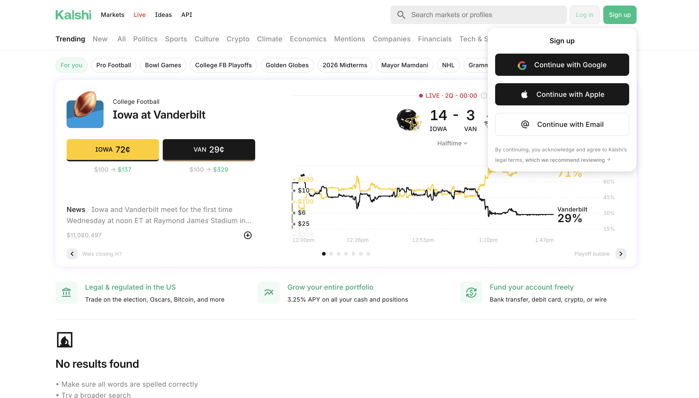

**User goal:**  
- Create a new Kalshi account quickly
- Choose preferred authentication method
- Understand legal terms before proceeding

**Kalshi flow (steps):**
1. User clicks "Sign up" button in header (green button, top right)
2. Modal overlay appears on right side of screen
3. User sees three sign-up options:
   - "Continue with Google" (with Google logo)
   - "Continue with Apple" (with Apple logo)
   - "Continue with Email" (with email icon)
4. User clicks preferred option
5. Legal disclaimer shown: "By continuing, you acknowledge and agree to Kalshi's legal terms, which we recommend reviewing →"

**Observed behavior:**
- Modal appears as overlay, positioned on right side (not centered)
- Three authentication options presented as large buttons
- Google option: White background, Google 'G' logo, black text
- Apple option: Black background, Apple logo, white text
- Email option: "@ Continue with Email" with email icon
- Legal disclaimer at bottom with link to terms
- Modal does not block entire screen - user can still see market content behind it
- No close button visible (user likely clicks outside or presses ESC)

**What I like:**
- Multiple authentication options reduce friction
- Social login (Google/Apple) is faster than email
- Legal disclaimer is present but not intrusive
- Modal doesn't block entire view - maintains context
- Clear visual hierarchy with distinct button styles

**What I don't like / confusion:**
- Modal positioned on right side instead of centered - feels unusual
- No visible close button (X) - unclear how to dismiss
- Legal disclaimer link ("→") suggests terms are important but placement at bottom might be missed
- No indication of what happens after clicking (will it redirect? show more fields?)
- Email option uses "@" symbol which is redundant with "Email" text

**Edge cases / bugs:**
- None observed in this screenshot

**Builder hypothesis (why they did it):**
- **Right-side positioning:** Keeps market content visible to maintain engagement/context
- **Social login first:** Reduces friction and increases conversion (no password to remember)
- **Legal disclaimer:** Compliance requirement for financial platform
- **Minimal fields:** Get user started quickly, collect more info later (progressive disclosure)
- **Multiple options:** Accommodates different user preferences and device capabilities

**Opinion Kings implications:**
- **Copy:**
  - Multiple authentication options (Google, Apple, Email)
  - Social login for speed
  - Legal disclaimer with link
  - Minimal initial fields
- **Avoid:**
  - Right-side modal positioning (centered is more standard)
  - Missing close button
  - Redundant "@" symbol in email option
- **Beat:**
  - Center modal for better focus
  - Add visible close button (X)
  - Show what happens next (e.g., "We'll send you a verification email")
  - Better legal disclaimer placement or make it more prominent if required
  - Consider phone number as additional option
- **Implementation notes:**
  - Modal component with overlay backdrop
  - OAuth integration for Google/Apple
  - Email verification flow after email signup
  - Terms of service and privacy policy pages
  - Session management after authentication
  - Progressive disclosure: collect KYC info after initial signup
- **Metrics:**
  - Sign up modal open rate
  - Authentication method distribution (Google vs Apple vs Email)
  - Sign up completion rate by method
  - Time to complete signup
  - Drop-off rate at legal disclaimer

### Email Sign-Up with Validation

**Feature category:** Onboarding

**Screenshots:**  
- 013: `013-onboarding-email-validation.png` - Email input screen with real-time validation error

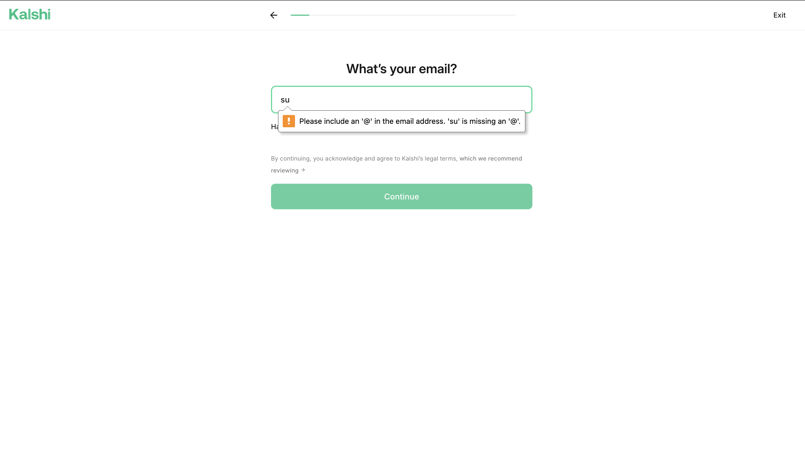

**User goal:**  
- Enter email address to continue sign-up process
- Understand if email format is valid before proceeding

**Kalshi flow (steps):**
1. User clicks "Continue with Email" from sign-up modal (011)
2. Navigates to dedicated email input page (`kalshi.com/sign-up/email`)
3. Sees question: "What's your email?"
4. Types email address in input field
5. Real-time validation occurs as user types
6. If invalid format detected, error message appears immediately
7. User must fix email format before "Continue" button becomes functional
8. Legal disclaimer shown at bottom with link to terms

**Observed behavior:**
- **Page Layout:**
  - Full-page view (not modal overlay)
  - Kalshi logo in top left
  - Progress indicator (back arrow + horizontal line) in header
  - "Exit" button in top right
  - Centered content with large, bold question: "What's your email?"
- **Input Field:**
  - Large input field with light green border
  - User has typed "su" (incomplete email)
  - Field appears focused/active
- **Real-Time Validation:**
  - Orange warning box appears immediately below input
  - Warning icon (triangle with exclamation mark)
  - Error message: "Please include an '@' in the email address. 'su' is missing an '@'."
  - Validation triggers as user types (not on blur/submit)
- **Legal Disclaimer:**
  - Grey text below input: "By continuing, you acknowledge and agree to Kalshi's legal terms, which we recommend reviewing →"
  - Arrow (→) indicates clickable link to terms
- **Continue Button:**
  - Large green button with rounded corners at bottom
  - Text: "Continue"
  - Button appears enabled (though email is invalid - may be disabled on actual submit)

**What I like:**
- Real-time validation provides immediate feedback
- Clear, specific error message explains exactly what's wrong
- Visual warning (orange box) is attention-grabbing but not alarming
- Clean, focused design - single task per screen
- Progress indicator shows user where they are in flow
- Exit button provides escape hatch
- Large input field is easy to use

**What I don't like / confusion:**
- Error message could be more helpful (e.g., "Email must include '@' and a domain like 'example.com'")
- Orange warning box might be too prominent for minor validation (could use subtle red or grey)
- "Continue" button appears enabled even with invalid email - unclear if it's actually clickable
- No indication of what happens after clicking Continue (verification email? password screen?)
- Progress indicator is minimal (just a line) - doesn't show total steps
- Legal disclaimer at bottom might be missed (should be more prominent or required checkbox)

**Edge cases / bugs:**
- None observed in this screenshot, but validation logic needs testing for:
  - Edge cases: "test@", "@domain.com", "test@domain", "test..test@domain.com"
  - International domains, special characters
  - Very long email addresses

**Builder hypothesis (why they did it):**
- **Real-time validation:** Prevents user frustration by catching errors early
- **Full-page view:** More focused than modal, reduces distractions
- **Progress indicator:** Shows user they're in a multi-step flow
- **Exit button:** Allows user to abandon flow easily (reduces friction paradoxically)
- **Single question per screen:** Reduces cognitive load, increases completion rate
- **Orange warning:** Less harsh than red, but still attention-grabbing
- **Legal disclaimer placement:** Required for compliance, but kept subtle to not block flow

**Opinion Kings implications:**
- **Copy:**
  - Real-time email validation
  - Clear, specific error messages
  - Full-page dedicated input screens for critical fields
  - Progress indicator for multi-step flows
  - Exit/back navigation options
- **Avoid:**
  - Orange warning color (use subtle red or grey for validation)
  - Unclear button state (disable Continue if email invalid)
  - Minimal progress indicator (show step X of Y)
- **Beat:**
  - More helpful error messages with examples
  - Show what happens next (e.g., "We'll send a verification code to this email")
  - Better progress indicator showing total steps
  - Make legal disclaimer more prominent or require checkbox
  - Add email format hint/placeholder (e.g., "you@example.com")
  - Consider inline validation with checkmark for valid format
- **Implementation notes:**
  - Email validation regex: check for '@', valid domain format, no spaces
  - Real-time validation on input change (debounced for performance)
  - Disable submit button until valid email format
  - Email verification flow after submission (magic link or OTP)
  - Track validation errors to identify common mistakes
  - A/B test error message copy for clarity
- **Metrics:**
  - Email validation error rate
  - Time to enter valid email
  - Drop-off rate at email input screen
  - Most common validation errors
  - Continue button click rate (valid vs invalid email)

### Legal Terms Modal

**Feature category:** Onboarding / Compliance

**Screenshots:**  
- 014: `014-onboarding-legal-terms-modal.png` - ⚠️ **ISSUE: Currently shows duplicate of 013 (email validation). Missing: Legal terms popup showing all agreements and policies**

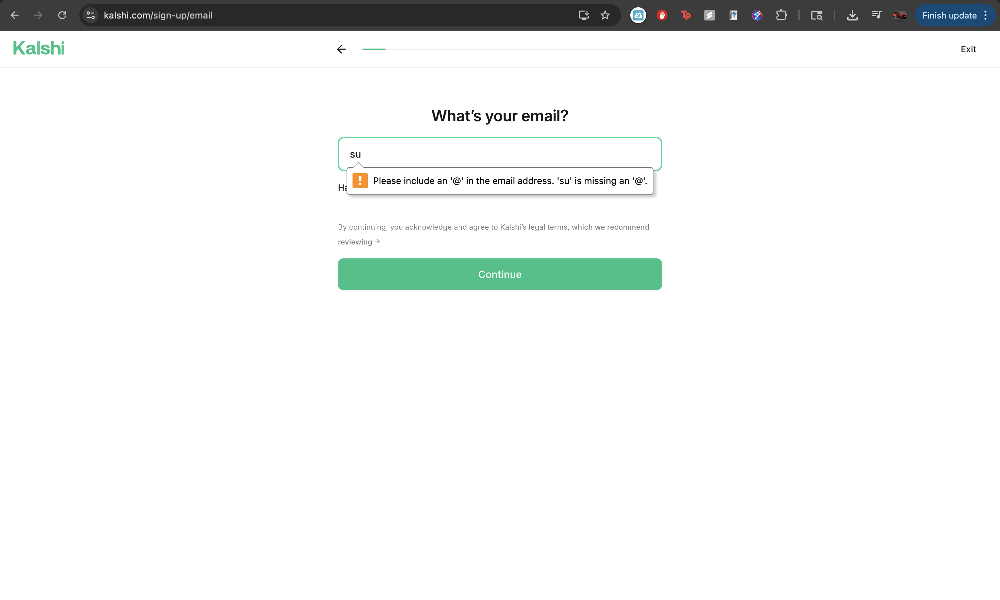

**User goal:**  
- Review legal terms and agreements before signing up
- Understand what they're agreeing to
- Access specific legal documents

**Kalshi flow (steps):**
1. User clicks "reviewing →" link in legal disclaimer (from sign-up modal, login modal, or email input screen)
2. Modal overlay appears on right side of screen
3. Modal shows list of legal documents
4. User can click on individual documents to read them
5. User can scroll to see all documents
6. User can close modal (likely via X button or clicking outside)

**Observed behavior:**
- **Modal Appearance:**
  - White rounded rectangle positioned on right side
  - Soft shadow suggests it floats above content
  - Occupies right half of screen
  - Partially obscures background content (market chart visible behind)
- **Legal Disclaimer Text:**
  - Same text as in sign-up/login modals: "By continuing, you acknowledge and agree to Kalshi's legal terms, which we recommend reviewing →"
  - Arrow (→) is clickable and opens this modal
- **List of Legal Documents:**
  - Displayed as clickable list items (dark grey text on white)
  - Documents listed:
    - Member Agreement
    - Rulebook
    - Kalshi Klear Rulebook
    - Privacy Policy
    - Trading Prohibition
    - Kalshi Klear Participant Agreement
  - Each appears to be a separate link
- **Scroll Indicator:**
  - Thin grey scrollbar on right edge indicates more content below
  - Suggests there may be additional documents or content
- **Navigation:**
  - Grey circular button with right arrow (">") visible on far right
  - Likely a close/navigation button
- **Background Content:**
  - Market chart partially visible behind modal (black line on grid)
  - Maintains context while reviewing terms

**What I like:**
- **Easy access from sign-up/login flows:** Legal terms link (→) is prominently accessible from multiple points in onboarding - excellent UX for compliance and transparency
- Easy access to all legal documents in one place
- Clear list format makes it easy to find specific documents
- Modal doesn't block entire screen - maintains context
- Scrollable list suggests comprehensive legal coverage
- Organized by document type (agreements, policies, rulebooks)
- Right-side positioning consistent with other modals
- **No friction to review terms:** User can access terms without leaving sign-up flow, reducing abandonment

**What I don't like / confusion:**
- Modal positioned on right side (unusual, most legal modals are centered)
- No clear close button visible (X button) - only arrow button which is ambiguous
- List doesn't show document length or reading time
- No indication of which documents are required vs optional
- No summary or key points - users must read full documents
- Background content visible might be distracting
- Scrollbar suggests more content but unclear how much

**Edge cases / bugs:**
- None observed, but potential issues:
  - What happens if user clicks document link? Opens in new tab? Inline? Replaces modal?
  - What if documents are very long? No pagination visible
  - Accessibility: keyboard navigation, screen reader support?

**Builder hypothesis (why they did it):**
- **Right-side positioning:** Consistent with sign-up/login modals, maintains design language
- **Comprehensive list:** Shows all legal documents upfront builds trust and transparency
- **Easy access:** Makes it easy to review terms without leaving flow
- **Compliance:** Required for financial platform to make terms accessible
- **Transparency:** Showing all documents (including Trading Prohibition) demonstrates honesty
- **Non-blocking:** Right-side modal allows user to see they're still in sign-up flow
- **Scrollable:** Accommodates growing list of legal documents as platform evolves

**Opinion Kings implications:**
- **Copy:**
  - **Easy access to terms from sign-up/login flows** - This is excellent UX and should be replicated
  - Comprehensive list of all legal documents
  - Accessible from multiple points in onboarding (sign-up modal, email screen, etc.)
  - Organized by document type
- **Avoid:**
  - Right-side positioning (center for better focus on legal content)
  - Ambiguous close button
  - No document summaries or key points
- **Beat:**
  - Center modal for better focus on legal content
  - Clear close button (X) in top right
  - Show document length/reading time for each
  - Add summaries or key points for each document
  - Indicate which documents are required reading vs optional
  - Add "I've read and agree" checkboxes for critical documents
  - Consider accordion format for better organization
  - Add search functionality if many documents
- **Implementation notes:**
  - Modal component with overlay backdrop
  - Document links should open in new tab or expandable sections
  - Track which documents users actually click on
  - Consider requiring acknowledgment of critical documents (Member Agreement, Privacy Policy)
  - Store user's agreement timestamp for compliance
  - Version control for legal documents (show last updated date)
  - PDF generation for document downloads
- **Metrics:**
  - Legal terms modal open rate
  - Document click-through rate (which documents are most viewed)
  - Time spent reviewing terms
  - Drop-off rate after viewing terms
  - Agreement acknowledgment rate

### Password Creation with Real-Time Validation

**Feature category:** Onboarding

**Screenshots:**  
- 015: `015-onboarding-password-creation.png` - Password creation screen with real-time requirement validation

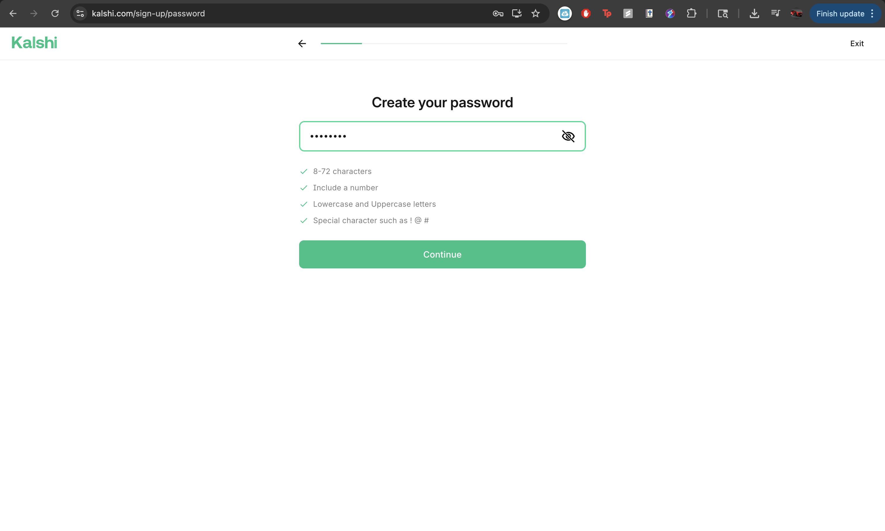

**User goal:**  
- Create a secure password for account
- Understand password requirements
- See which requirements are met in real-time

**Kalshi flow (steps):**
1. User completes email input screen (013) with valid email
2. Navigates to password creation page (`kalshi.com/sign-up/password`)
3. Sees page title: "Create your password"
4. Types password in input field
5. Real-time validation checks password against requirements as user types
6. Green checkmarks appear next to each requirement as it's satisfied
7. Password visibility toggle (eye icon) allows showing/hiding password
8. "Continue" button enables when all requirements are met
9. User clicks Continue to proceed to next step

**Observed behavior:**
- **Page Layout:**
  - Full-page view (not modal)
  - Kalshi logo in top left
  - Back arrow (←) with progress indicator (green segment on grey line)
  - "Exit" link in top right
  - Centered content with large title: "Create your password"
- **Password Input:**
  - Large input field with light green border (indicates active/valid state)
  - Password is masked (shows dots: `........`)
  - Eye icon with diagonal line on right side (toggle to show/hide password)
- **Real-Time Validation:**
  - Four password requirements listed below input:
    - "8-72 characters" ✓ (green checkmark)
    - "Include a number" ✓ (green checkmark)
    - "Lowercase and Uppercase letters" ✓ (green checkmark)
    - "Special character such as ! @ #" ✓ (green checkmark)
  - All requirements show green checkmarks (password meets all criteria)
  - Validation updates in real-time as user types
- **Continue Button:**
  - Large green button at bottom
  - Text: "Continue"
  - Button is enabled (all requirements met)
- **Progress Indicator:**
  - Short green segment on longer grey line
  - Shows user is in multi-step sign-up process

**What I like:**
- **Real-time validation with visual feedback:** Green checkmarks appear as each requirement is satisfied - excellent UX
- **Clear requirement list:** All criteria visible upfront, no guessing
- **Password visibility toggle:** Eye icon allows user to verify what they typed
- **Visual progress:** Progress indicator shows where user is in flow
- **Clean, focused design:** Single task per screen reduces cognitive load
- **Immediate feedback:** No need to submit to see if password is valid
- **All requirements visible:** User can see what's needed before typing

**What I don't like / confusion:**
- No indication of password strength beyond meeting requirements (could add strength meter)
- Special character examples (! @ #) are helpful but limited - could show more examples
- No indication of what happens after clicking Continue
- Progress indicator doesn't show total steps (e.g., "Step 2 of 4")
- Exit button might be too easy to click accidentally

**Edge cases / bugs:**
- None observed, but should test:
  - Very long passwords (72 character limit)
  - Edge cases: all numbers, all special chars, etc.
  - Copy/paste behavior
  - Password visibility toggle accessibility

**Builder hypothesis (why they did it):**
- **Real-time validation:** Reduces frustration by showing progress immediately
- **Visual checkmarks:** Positive reinforcement encourages completion
- **Clear requirements:** Reduces support tickets and password reset requests
- **Password visibility toggle:** Helps users avoid typos (common cause of login issues)
- **Full-page view:** More focused than modal, reduces distractions
- **Progress indicator:** Shows user they're in a multi-step flow, sets expectations
- **All requirements visible:** Transparency builds trust, no hidden rules

**Opinion Kings implications:**
- **Copy:**
  - Real-time validation with visual checkmarks (excellent UX pattern)
  - Clear requirement list visible upfront
  - Password visibility toggle
  - Progress indicator for multi-step flows
  - Full-page dedicated screens for critical inputs
- **Avoid:**
  - Nothing major - this is a well-executed pattern
- **Beat:**
  - Add password strength meter (beyond just meeting requirements)
  - Show total steps in progress indicator (e.g., "Step 2 of 4")
  - Add more special character examples or show all allowed characters
  - Consider password suggestions/hints for better security
  - Add "What makes a strong password?" help link
  - Show estimated time remaining in sign-up flow
  - Consider password strength visualization (weak/medium/strong)
- **Implementation notes:**
  - Real-time validation on input change (debounced for performance)
  - Regex patterns for each requirement:
    - Length: 8-72 characters
    - Number: `/\d/`
    - Lowercase: `/[a-z]/`
    - Uppercase: `/[A-Z]/`
    - Special char: `/[!@#$%^&*(),.?":{}|<>]/` (or defined set)
  - Disable Continue button until all requirements met
  - Password visibility toggle (toggle input type between password/text)
  - Store password securely (hashed, never plaintext)
  - Track password creation success rate
  - A/B test requirement strictness vs user drop-off
- **Metrics:**
  - Password creation completion rate
  - Time to create valid password
  - Most common requirement failures
  - Password visibility toggle usage
  - Drop-off rate at password screen
  - Password reset rate (indicates if requirements are too strict/lenient)

### Duplicate Account Detection

**Feature category:** Onboarding / Edge Case Handling

**Screenshots:**  
- 016: `016-onboarding-duplicate-account.png` - Duplicate account detection page

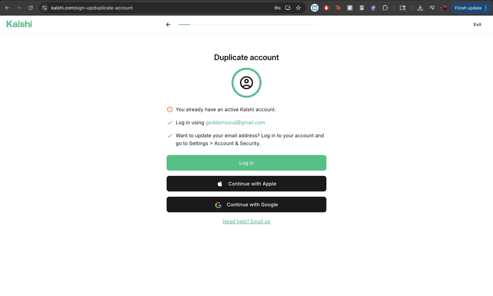

**User goal:**  
- Understand why sign-up failed (email already registered)
- Access existing account or update email address
- Continue with account creation if email was entered incorrectly

**Kalshi flow (steps):**
1. User attempts to sign up with email address (via email sign-up or social login)
2. System detects email is already associated with an active account
3. User is redirected to duplicate account page (`kalshi.com/sign-up/duplicate-account`)
4. Page displays warning message and existing account email
5. User can:
   - Click "Log in" to access existing account
   - Click "Continue with Apple" (if original account was created with Apple)
   - Click "Continue with Google" (if original account was created with Google)
   - Click "Need help? Email us" for support
6. **OAuth Flow (Google/Apple):**
   - User clicks "Continue with Google" (or Apple)
   - **First-time authorization:**
     - Redirects to OAuth provider's authorization page (Google: `accounts.google.com`, Apple: `appleid.apple.com`)
     - User sees provider's login page (see 018 for Apple example)
     - User authenticates and grants permission
     - Provider redirects to OAuth callback: `kalshi.com/oauth/google/callback` (or `/oauth/apple/callback`)
   - **Subsequent authorization (hypothesized):**
     - If user has already authorized Kalshi, OAuth provider may auto-complete
     - Direct redirect to callback without showing provider login page
     - Faster, seamless experience
   - System validates OAuth token and matches to existing account
   - User is immediately logged in and redirected to discovery/market page
   - No additional steps required - seamless login
7. If user wants to update email, they're directed to log in first, then go to Settings > Account & Security

**Observed behavior:**
- **Page Layout:**
  - Full-page view (not modal)
  - Kalshi logo in top left
  - "Exit" link in top right
  - URL: `kalshi.com/sign-up/duplicate-account` (dedicated route for this edge case)
  - Centered content with large title: "Duplicate account"
- **Visual Elements:**
  - Large circular icon with green border containing person silhouette (user/account icon)
  - Orange exclamation mark icon preceding warning message
- **Warning Message:**
  - "You already have an active Kalshi account." (orange warning style)
  - Clear, direct communication of the issue
- **Account Information:**
  - Green checkmark + "Log in using **geddamsuraj@gmail.com**"
  - Email address is highlighted in green and bold
  - Shows the exact email associated with existing account
- **Guidance for Email Update:**
  - Green checkmark + "Want to update your email address? Log in to your account and go to Settings > Account & Security."
  - Provides clear path for users who want to use different email
- **Action Buttons (vertically stacked):**
  - Primary green button: "Log in" (most prominent)
  - Black button with Apple logo: "Continue with Apple"
  - Black button with Google 'G' logo: "Continue with Google"
  - All three authentication methods available
- **Support Link:**
  - Blue hyperlink at bottom: "Need help? Email us"
  - Provides escape hatch for confused users

**What I like:**
- **Clear error communication:** User immediately understands what happened
- **Shows existing account email:** Transparent about which account exists
- **Multiple authentication options:** Allows user to log in via any method (email, Google, Apple)
- **Helpful guidance:** Explains how to update email if needed
- **Support link:** Provides help option for edge cases
- **Dedicated URL route:** `kalshi.com/sign-up/duplicate-account` makes this a first-class flow, not just an error
- **Visual hierarchy:** Warning icon, account icon, and clear action buttons
- **No dead end:** User always has a path forward (log in, social login, or support)

**What I don't like / confusion:**
- Doesn't indicate which method was used to create original account (Google, Apple, or email)
- "Continue with Apple/Google" buttons might be confusing - do they log in or create new account?
- No option to "Try different email" without logging in first
- Support link is small and at bottom - might be missed
- No explanation of why duplicate detection happened (did they forget they signed up? typo?)
- Could show account creation date or last login to help user remember

**Edge cases / bugs:**
- **Cross-method duplicate detection:** Handles case where user signed up with Google, then tries email sign-up (or vice versa) - this is well handled
- **Case sensitivity:** Email matching should be case-insensitive (likely handled server-side)
- **Inactive accounts:** Message says "active account" - what happens with inactive/deleted accounts?
- **Email verification status:** What if original account email wasn't verified?
- **Multiple accounts with same email:** How does system handle this edge case?

**Builder hypothesis (why they did it):**
- **Prevent duplicate accounts:** Reduces account fragmentation and support issues
- **Security:** Prevents account hijacking or confusion
- **User experience:** Helps users who forgot they already have an account
- **Compliance:** May be required for financial platforms to prevent duplicate KYC
- **Data integrity:** Ensures one account per email for proper analytics
- **Cross-method detection:** Handles OAuth + email sign-up scenarios elegantly
- **Dedicated route:** Makes this a recoverable flow, not just an error state
- **Multiple login options:** Accommodates users who don't remember how they signed up

**Opinion Kings implications:**
- **Copy:**
  - Dedicated duplicate account page (not just error message)
  - Clear communication of existing account email
  - Multiple authentication options (email, Google, Apple)
  - Support link for edge cases
  - Guidance on how to update email
- **Avoid:**
  - Ambiguous "Continue with Apple/Google" buttons (should say "Log in with...")
  - No way to try different email without logging in
- **Beat:**
  - Show which method was used to create original account (e.g., "You signed up with Google")
  - Add "Try different email" button that goes back to email input
  - Show account creation date or last login to help user remember
  - Add "Forgot which email you used?" link with email lookup
  - Make support link more prominent
  - Consider "Merge accounts" option if user has multiple accounts
  - Add explanation of why this happened (e.g., "You may have signed up before")
  - Show account status (verified, unverified, etc.)
- **Implementation notes:**
  - Email normalization (lowercase, trim whitespace) before duplicate check
  - Check for existing accounts across all authentication methods (email, Google OAuth, Apple OAuth)
  - Store authentication method used for each account
  - Track duplicate account detection events for analytics
  - Consider rate limiting to prevent abuse
  - Handle edge cases: inactive accounts, unverified emails, deleted accounts
  - URL route: `/sign-up/duplicate-account` (dedicated route, not just error state)
  - Redirect to this page when duplicate detected (don't just show error)
  - Store original sign-up attempt data to pre-fill login if user proceeds
  - **OAuth callback flow:**
    - **First-time:** User sees provider's OAuth page (Apple: `appleid.apple.com/auth/authorize`, Google: `accounts.google.com/o/oauth2/v2/auth`)
    - OAuth callback URL: `/oauth/google/callback` or `/oauth/apple/callback`
    - Validate OAuth token and exchange for user info
    - Match OAuth email to existing account
    - Create session and JWT token
    - Redirect to discovery/market page (logged-in state)
    - No intermediate screens - direct login after OAuth
    - **Subsequent logins:** OAuth providers cache authorization - should auto-complete without showing provider page (needs verification)
- **Metrics:**
  - Duplicate account detection rate
  - Which authentication method was used for original account
  - User action after duplicate detection (log in, social login, support, abandon)
  - Support ticket rate for duplicate account issues
  - Time to resolution (how quickly users log in after seeing this page)
  - Drop-off rate at duplicate account page
  - Cross-method duplicate rate (e.g., Google sign-up then email sign-up)

### Apple OAuth Flow (First-Time Authorization)

**Feature category:** Onboarding / OAuth

**Screenshots:**  
- 018: `018-onboarding-apple-oauth.png` - ⚠️ **ISSUE: Currently shows logged-in discovery page (should be 017). Missing: Apple ID authentication page for first-time OAuth**

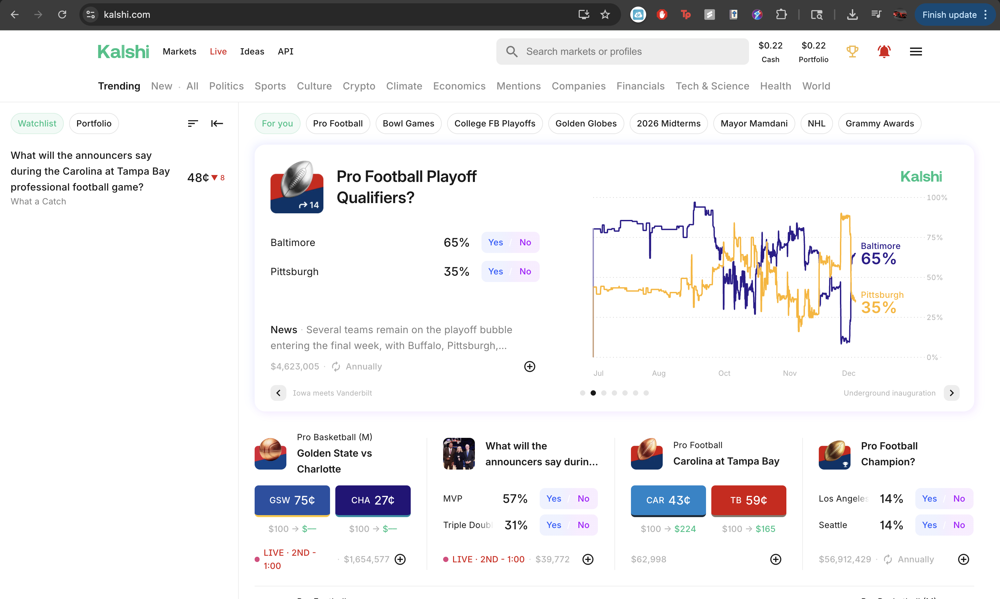

**User goal:**  
- Authenticate with Apple ID to sign up or log in to Kalshi
- Grant permission for Kalshi to use Apple account information
- Complete OAuth flow to access Kalshi account

**Kalshi flow (steps):**
1. User clicks "Continue with Apple" from sign-up modal (011), login modal (012), or duplicate account page (016)
2. Kalshi redirects to Apple's OAuth authorization endpoint
3. **First-time authorization:**
   - User sees Apple ID login page (`appleid.apple.com/auth/authorize`)
   - URL contains: `client_id=com.kalshi&redirect_uri=https%3A%2F%2Fkalshi.com%2Fa...`
   - User enters email/phone or uses Passkey
   - User grants permission to Kalshi
   - Apple redirects back to Kalshi callback: `kalshi.com/oauth/apple/callback`
   - Kalshi validates token, creates/updates account, creates session
   - User redirected to discovery page (logged in)
4. **Subsequent authorization (hypothesized):**
   - If user has already authorized Kalshi with Apple
   - OAuth flow should auto-complete (no Apple ID page shown)
   - Direct redirect to callback and then discovery page
   - Faster, seamless experience

**Observed behavior:**
- **Apple ID Authorization Page:**
  - URL: `appleid.apple.com/auth/authorize?client_id=com.kalshi&redirect_uri=https%3A%2F%2Fkalshi.com%2Fa...`
  - Official Apple domain (secure, trusted)
  - Browser shows lock icon (HTTPS)
- **Page Header:**
  - Apple logo (black) centered near top
  - "Apple Account" title in large, bold font
  - "Sign in" text in smaller font to the right
- **Application Context:**
  - Green square with rounded corners containing "Kalshi" text
  - Indicates third-party app requesting authentication
  - Instruction: "Use your Apple Account to sign in to Kalshi."
- **Input Field:**
  - Label: "Email or Phone Number"
  - Pre-filled with: "geddamsuraj@gmail.com" (from user's Apple ID)
  - White input field with gray border
- **Privacy Information:**
  - Icon: Two stylized blue figures (people icon)
  - Text: "In setting up Sign in with Apple, information about your interactions with Apple and this device may be used by Apple to help prevent fraud. See how your data is managed..."
  - "See how your data is managed..." is a clickable blue link
- **Action Buttons:**
  - Primary blue button: "Continue" (centered)
  - Secondary black button: "Sign in with Passkey" (with key icon)
  - Text below Passkey button: "Requires a device with iOS 17 or later."
- **Footer:**
  - Copyright: "Copyright © 2025 Apple Inc. All rights reserved."
  - "Privacy Policy" link (likely clickable)

**What I like:**
- **Official Apple domain:** Uses `appleid.apple.com` - trusted, secure
- **Clear application context:** Shows "Kalshi" prominently so user knows which app they're authorizing
- **Pre-filled email:** Apple pre-fills email from user's Apple ID (reduces typing)
- **Privacy transparency:** Explains how data is used, with link to learn more
- **Multiple authentication options:** Email/phone or Passkey (modern, secure)
- **Clean, familiar design:** Apple's standard OAuth page design users recognize

**What I don't like / confusion:**
- **First-time flow is slower:** Requires full Apple ID page interaction (expected for first time)
- **No indication of subsequent auto-login:** User doesn't know if next time will be faster
- **Privacy text is long:** Might be skipped by users, but necessary for compliance
- **Passkey requirement unclear:** "Requires iOS 17 or later" - what if user doesn't have compatible device?

**Edge cases / bugs:**
- **OAuth callback failure:** What happens if Apple callback fails?
- **User denies permission:** What's the fallback flow?
- **Email mismatch:** What if Apple email doesn't match Kalshi account email?
- **Subsequent authorization:** Need to verify if auto-reroute actually works (user hypothesis)
- **Google OAuth:** Should be similar flow - need to verify

**Builder hypothesis (why they did it):**
- **First-time authorization:** Required by OAuth spec - user must explicitly grant permission
- **Apple's OAuth page:** Uses Apple's standard flow for security and trust
- **Pre-filled email:** Reduces friction while maintaining security
- **Privacy disclosure:** Required by Apple and compliance regulations
- **Subsequent auto-login:** OAuth providers typically cache authorization, allowing faster subsequent logins
- **Redirect URI pattern:** `kalshi.com/oauth/apple/callback` follows standard OAuth callback convention

**Opinion Kings implications:**
- **Copy:**
  - Use official OAuth provider pages (Apple/Google) for first-time authorization
  - Clear application context (show "Opinion Kings" on OAuth page)
  - Pre-filled email when possible
  - Privacy transparency with links
  - Standard OAuth callback URL pattern: `/oauth/{provider}/callback`
- **Avoid:**
  - Nothing major - this is standard OAuth flow
- **Beat:**
  - **Verify and optimize subsequent logins:** Ensure OAuth providers cache authorization for faster subsequent logins
  - Add loading state during OAuth redirect (show "Connecting to Apple..." or similar)
  - Better error handling for OAuth failures
  - Show user what happens after authorization (e.g., "You'll be redirected back to Opinion Kings")
  - Consider OAuth state parameter for security
  - Test both first-time and subsequent authorization flows
- **Implementation notes:**
  - **OAuth flow:**
    - Redirect to: `appleid.apple.com/auth/authorize?client_id={CLIENT_ID}&redirect_uri={CALLBACK_URL}&response_type=code&scope=email name`
    - Store OAuth state parameter for CSRF protection
    - Handle callback: `/oauth/apple/callback?code={AUTH_CODE}&state={STATE}`
    - Exchange authorization code for access token
    - Fetch user info from Apple (email, name)
    - Match to existing account or create new account
    - Create session and JWT token
    - Redirect to discovery page
  - **Subsequent authorization optimization:**
    - OAuth providers (Apple/Google) cache user authorization
    - If user has already authorized, provider may auto-complete
    - Check for existing OAuth session before redirecting
    - Use `prompt=select_account` parameter to force account selection if needed
    - Use `prompt=none` for silent authentication (if supported)
  - **Google OAuth (similar flow):**
    - Redirect to: `accounts.google.com/o/oauth2/v2/auth?client_id={CLIENT_ID}&redirect_uri={CALLBACK_URL}`
    - Callback: `/oauth/google/callback`
    - Similar token exchange and user info flow
  - **Error handling:**
    - Handle user denial of permission
    - Handle OAuth callback errors
    - Handle token exchange failures
    - Redirect to error page or show inline error
  - **Security:**
    - Validate OAuth state parameter
    - Verify redirect URI matches registered callback
    - Store OAuth tokens securely (encrypted)
    - Implement token refresh flow
- **Metrics:**
  - OAuth initiation rate (Apple vs Google vs Email)
  - First-time OAuth completion rate
  - Subsequent OAuth completion rate (should be higher if auto-login works)
  - OAuth callback success rate
  - Time from OAuth click to logged-in state
  - OAuth error rate
  - User denial rate (users who deny permission)

### Log In Modal

**Feature category:** Onboarding

**Screenshots:**  
- 012: `012-onboarding-login-modal.png` - Log in modal with Google, Apple, and email options

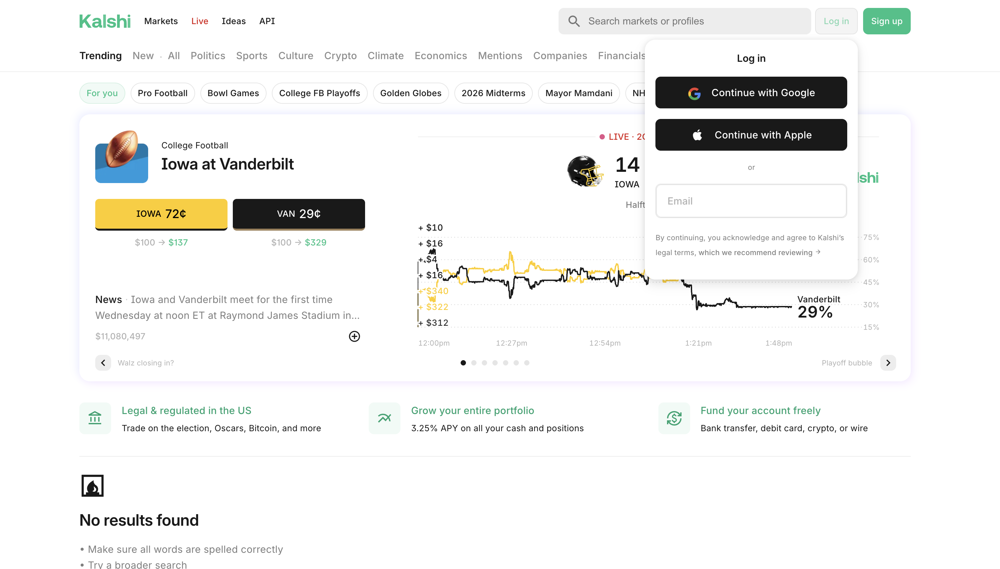

**User goal:**  
- Access existing Kalshi account
- Choose preferred authentication method
- Quickly return to browsing markets

**Kalshi flow (steps):**
1. User clicks "Log in" button in header (white button, top right)
2. Modal overlay appears, centered on screen
3. User sees two social login options:
   - "Continue with Google" (white background, Google 'G' logo, black text)
   - "Continue with Apple" (black background, Apple logo, white text)
4. Horizontal divider with "or" text
5. Email input field below divider
6. Legal disclaimer: "By continuing, you acknowledge and agree to Kalshi's legal terms, which we recommend reviewing →"

**Observed behavior:**
- Modal is centered (unlike sign up modal which is right-aligned)
- Two social login buttons at top
- "or" divider separates social from email login
- Email input field (no password field visible - likely passwordless or next step)
- Legal disclaimer at bottom with link to terms
- Modal blocks significant portion of market page behind it
- No visible close button or "Forgot password?" link

**What I like:**
- Centered modal is more standard and focused
- Social login options are prominent and fast
- Clean separation between social and email login
- Consistent with sign up modal design language
- Legal disclaimer present

**What I don't like / confusion:**
- No password field visible - unclear if this is passwordless email login or if password comes next
- No "Forgot password?" link
- No "Don't have an account? Sign up" link to switch flows
- Legal disclaimer might be missed at bottom
- No indication of what happens after entering email
- Modal blocks more content than sign up modal (inconsistent UX)

**Edge cases / bugs:**
- None observed in this screenshot

**Builder hypothesis (why they did it):**
- **Passwordless email:** May use magic link/OTP instead of password (more secure, less friction)
- **Social login first:** Most users likely use social login, so prioritize those options
- **Centered modal:** Login is more focused action than signup, so center it
- **No sign up link:** Keep flows separate to avoid confusion
- **Legal disclaimer:** Required for compliance, but keep it subtle

**Opinion Kings implications:**
- **Copy:**
  - Social login options (Google, Apple)
  - Centered modal for login
  - Email input for passwordless/magic link flow
  - Legal disclaimer
- **Avoid:**
  - Inconsistent modal positioning (sign up right, login center)
  - Missing password field without clear indication of passwordless flow
  - No way to switch between login and sign up
  - No "Forgot password?" option
- **Beat:**
  - Consistent modal positioning (both centered)
  - Clear indication if passwordless ("We'll email you a link") or show password field
  - Add "Forgot password?" link
  - Add "Don't have an account? Sign up" link
  - Better visual feedback for next steps
- **Implementation notes:**
  - OAuth flow for Google/Apple
  - Magic link/OTP system for email login (if passwordless)
  - Or traditional email/password with hashing
  - Session management and JWT tokens
  - "Remember me" checkbox option
  - Rate limiting on login attempts
- **Metrics:**
  - Login modal open rate
  - Authentication method distribution
  - Login success rate
  - Time to complete login
  - Failed login attempts
  - "Forgot password" usage rate

---

## Funding & Withdrawals

### Your Activity Page (Transaction History)

**Feature category:** Account / Transactions / History

**Screenshots:**  
- 101: `101-account-activity-page.png` - Your activity page showing transaction history with filters

**User goal:**  
- View transaction history
- Filter transactions by type (Deposit, Withdrawal, Order, Trade, Settlement, Reward)
- Download transaction data
- Track account activity over time

**Kalshi flow (steps):**
1. User clicks "Your activity" in hamburger menu or right sidebar
2. Page routes to Your activity page
3. **URL routing:** `kalshi.com/account/activity`
4. **Page displays:**
   - Left section: Activity feed with filters
   - Right sidebar: Account navigation menu
5. **Activity filters:**
   - User clicks filter button (All, Deposit, Withdrawal, Order, Trade, Settlement, Reward)
   - Activity feed filters to show only selected type
6. **Activity feed:**
   - Shows chronological list of transactions
   - Each entry shows: Type, Date, Details, Market information
7. **Download:**
   - User clicks download icon next to title
   - Downloads transaction data (CSV/PDF presumably)

**Observed behavior:**
- **URL Structure:**
  - `kalshi.com/account/activity`
  - Part of account section (`/account/`)
- **Page layout:**
  - Left section: Activity feed with filters
  - Right sidebar: Account navigation menu
- **Page header:**
  - **Title:** "Your activity" with download icon (down arrow in tray)
  - Download icon allows exporting transaction data
- **Activity filters:**
  - **Buttons:** "All" (selected - highlighted in black), "Deposit", "Withdrawal", "Order", "Trade", "Settlement", "Reward"
  - **Selection:** Single selection (button highlight)
  - **Purpose:** Filter transactions by type
- **Activity feed sections:**
  - **Recent Activity:**
    - "Settlement settled to No" on December 30
    - "Settlement settled to No" on December 29 (details: "yes Kyle Pitts Sr., yes Blake Corum")
    - "Settlement settled to No" on December 29 (details: "yes Atlanta, yes Los Angeles R")
    - "Settlement settled to No" on December 29 (details: "Los Angeles R at Atlanta Winner?")
    - "Order Filled" on December 29 at 11:00 PM (market: "Professional Football Game, Los Angeles R, LA at ATL (Dec 29)")
    - "Trade completed" on December 29 at 11:00 PM (market: "Professional Football Game, Los Angeles R, LA at ATL (Dec 29)")
  - **Past Activity:**
    - "Settlement settled to No" on December 29 (details: "yes Shai Gilgeous-Alexander: 25+, yes LaMelo Ball: 20+, yes Anthony Edwards: 25+")
    - "Settlement settled to No" on December 29 (extensive combo details)
    - "Order Filled" on December 29 at 10:40 PM
    - "Trade completed" on December 29 at 10:40 PM
    - "Order Filled" on December 29 at 10:11 PM (details: "yes Atlanta, yes Los Angeles R")
    - "Trade completed" on December 29 at 10:11 PM (details: "yes Atlanta, yes Los Angeles R")
    - More entries (partially visible)
- **Transaction details:**
  - **Settlement:** Shows market outcome ("settled to No"), includes prediction details
  - **Order Filled:** Shows time, market name, market details
  - **Trade completed:** Shows time, market name, market details
  - **Combo bets:** Shows all conditions in settlement details
- **Chronological organization:**
  - Most recent first (reverse chronological)
  - Grouped by date (Recent Activity, Past Activity)
- **Right sidebar navigation:**
  - "Invite a friend" (house icon)
  - "Account & security" (person icon)
  - "Your activity" (line graph icon, highlighted - current page)
  - "Transfers" (dollar sign icon)
  - "Documents" (document icon)
  - "Settings" (gear icon)

**What I like:**
- **Comprehensive history:** Shows all transaction types
- **Filtering:** Easy to filter by transaction type
- **Download option:** Can export transaction data
- **Detailed information:** Shows market details, times, outcomes
- **Chronological organization:** Easy to see recent vs past activity
- **Combo bet details:** Shows all conditions in settlement

**What I don't like / confusion:**
- **No search:** Can't search within activity history
- **No date range filter:** Can't filter by date range
- **No amount display:** Doesn't show transaction amounts (only types)
- **No pagination:** Appears to be infinite scroll (may be slow with many transactions)
- **No export format choice:** Can't choose CSV vs PDF
- **No transaction details:** Can't click to see full transaction details

**Edge cases / bugs:**
- What if user has thousands of transactions? Performance issues?
- What if transaction fails? Is it shown in history?
- What if user wants to see only profitable trades?
- What if user wants to see transactions for specific market?

**Builder hypothesis (why they did it):**
- **Transparency:** Users can see all account activity
- **Compliance:** Transaction history for tax/regulatory purposes
- **User trust:** Full visibility builds trust
- **Debugging:** Helps users understand account activity
- **Record keeping:** Download option for record keeping

**Opinion Kings implications:**
- **Copy:**
  - Transaction history with filters
  - Download/export functionality
  - Chronological organization
  - Detailed transaction information
- **Avoid:**
  - No search functionality
  - No date range filter
  - No transaction amounts
- **Beat:**
  - **Search:** Add search within activity history
  - **Date range filter:** Allow filtering by date range
  - **Transaction amounts:** Show dollar amounts for each transaction
  - **Transaction details:** Click to see full transaction details
  - **Export formats:** Allow choosing CSV, PDF, Excel
  - **Transaction categories:** Better categorization (profits, losses, fees)
  - **Market filter:** Filter by specific market
  - **Profit/loss filter:** Filter by profitable vs losing trades
  - **Pagination:** Add pagination for better performance
  - **Transaction summary:** Show summary stats (total deposits, withdrawals, profits, losses)
- **Implementation notes:**
  - **Activity feed:**
    - Fetch transactions from API
    - Display in chronological order (newest first)
    - Group by date (Recent Activity, Past Activity)
    - Show transaction type, date, time, details
  - **Filters:**
    - Filter buttons (All, Deposit, Withdrawal, Order, Trade, Settlement, Reward)
    - Update feed when filter changes
    - Store selected filter in state
  - **Download:**
    - Download icon triggers export
    - Generate CSV/PDF with transaction data
    - Include all transactions or filtered transactions
  - **Transaction types:**
    - Settlement (market outcomes)
    - Order Filled (order execution)
    - Trade completed (trade confirmation)
    - Deposit (funding)
    - Withdrawal (withdrawing funds)
    - Reward (incentives, bonuses)
  - **State management:**
    - Store transaction list
    - Store selected filter
    - Update when new transactions occur
  - **Performance:**
    - Pagination or infinite scroll
    - Lazy load transactions
    - Cache transaction data
- **Metrics:**
  - Activity page view rate
  - Filter usage (which filters are used most?)
  - Download rate (how often users export data?)
  - Transaction count per user
  - Time spent on activity page
  - Search usage (if implemented)

### Transfers Page (Banking & Deposits)

**Feature category:** Account / Funding / Banking

**Screenshots:**  
- 102: `102-account-transfers-page.png` - Transfers page showing deposit/withdrawal options, linked accounts, and transaction history

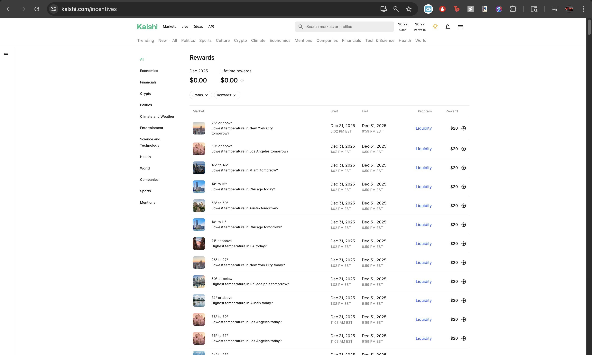

**User goal:**  
- Deposit funds to account
- Withdraw funds from account
- Manage linked bank accounts
- View transfer history
- Understand cash holding and interest information

**Kalshi flow (steps):**
1. User clicks "Transfers" in hamburger menu or right sidebar
2. Page routes to Transfers page
3. **URL routing:** `kalshi.com/account/banking`
4. **Page displays:**
   - Left section: Transfer options, linked accounts, activity
   - Right sidebar: Account navigation menu
5. **Deposit:**
   - User clicks "Deposit to Kalshi" button
   - Opens deposit options (same as Cash deposit options page)
6. **Withdraw:**
   - User clicks "Withdraw from Kalshi" button
   - Opens withdrawal flow
7. **Linked accounts:**
   - User can view linked accounts
   - User can add new account ("+ Add another account")
   - User can unlink account (X icon)
8. **Activity:**
   - User can view transfer history

**Observed behavior:**
- **URL Structure:**
  - `kalshi.com/account/banking`
  - Part of account section (`/account/`)
- **Page layout:**
  - Left section: Transfer options and information
  - Right sidebar: Account navigation menu
- **Page header:**
  - **Title:** "Transfers"
  - **Account balances:** "Portfolio $0.22" and "Cash $0.22"
- **Information section:**
  - **Two key features highlighted with green checkmarks:**
    1. "Your cash is held and accessible in a federally regulated clearinghouse." (with info icon)
    2. "Earn variable interest (3.25% APY) on your cash and positions." (with info icon)
  - **Purpose:** Builds trust and highlights benefits
- **Action buttons:**
  - **"Deposit to Kalshi"** (large green button with down-arrow icon)
    - Primary action, prominent placement
    - Routes to deposit options (same as Cash deposit options)
  - **"Withdraw from Kalshi"** (smaller grey button with up-arrow icon)
    - Secondary action
    - Routes to withdrawal flow
- **Linked accounts section:**
  - **Title:** "Linked accounts"
  - **Account listed:**
    - "Adv SafeBalance Banking - 8482 (.... 8482)"
    - Bank icon on left
    - X icon on right (unlink account)
  - **Add account button:** "+ Add another account" (with plus icon)
  - **Purpose:** Shows connected bank accounts for transfers
- **Activity section:**
  - **Title:** "Activity"
  - **Transaction list:**
    - "Deposit from Debit card" - "+$98.00" - "Completed on Dec 28, 2025" - "Completed" status (with info icon)
    - "Deposit from Debit card" - "+$49.00" - "Completed on Dec 28, 2025" - "Completed" status (with info icon)
  - **Transaction details:**
    - Shows deposit method ("Debit card")
    - Shows amount (positive for deposits)
    - Shows completion date
    - Shows status ("Completed")
    - Info icon for additional details
- **Right sidebar navigation:**
  - "Invite a friend" (house icon)
  - "Account & security" (person icon)
  - "Your activity" (line graph icon)
  - "Transfers" (circular arrows icon, highlighted - current page)
  - "Documents" (document icon)
  - "Settings" (gear icon)

**What I like:**
- **Clear actions:** Large deposit button, clear withdrawal option
- **Trust indicators:** Clearinghouse and interest information
- **Linked accounts:** Easy to see connected accounts
- **Transaction history:** Shows recent transfers
- **Status indicators:** Clear completion status

**What I don't like / confusion:**
- **Bug - Deposit method labeling:**
  - **User feedback:** "You need to link bank but I have been making deposits via Apple Pay and it says via debit"
  - Transactions show "Deposit from Debit card" even when using Apple Pay
  - **Issue:** Incorrect labeling of deposit method
  - **Impact:** Confusing for users, inaccurate transaction history
- **No withdrawal history:** Only shows deposits in activity
- **No pending status:** Doesn't show pending transfers
- **No transfer limits:** Doesn't show daily/weekly limits
- **No transfer fees:** Doesn't show fees for transfers

**Edge cases / bugs:**
- **B-004: Deposit method incorrectly labeled as "Debit card" when using Apple Pay**
  - User makes deposit via Apple Pay
  - Transaction history shows "Deposit from Debit card"
  - Should show "Deposit from Apple Pay" or similar
  - **User feedback:** "You need to link bank but I have been making deposits via Apple Pay and it says via debit"
- What if user has multiple linked accounts? Can they choose which to use?
- What if transfer fails? Is it shown in activity?
- What if user wants to see withdrawal history?

**Builder hypothesis (why they did it):**
- **Trust building:** Clearinghouse and interest information builds trust
- **Easy deposits:** Large deposit button encourages funding
- **Account management:** Linked accounts for easy transfers
- **Transaction visibility:** Activity section shows transfer history
- **Compliance:** Transaction history for regulatory purposes

**Opinion Kings implications:**
- **Copy:**
  - Deposit/withdrawal buttons
  - Trust indicators (clearinghouse, interest)
  - Linked accounts management
  - Transfer activity history
- **Avoid:**
  - Incorrect deposit method labeling (Apple Pay bug)
  - No withdrawal history
  - No pending status
- **Beat:**
  - **Fix deposit method labeling:** Correctly identify Apple Pay vs Debit card
    - Show "Deposit from Apple Pay" when using Apple Pay
    - Show "Deposit from Debit card" when using debit card
    - Accurately label all payment methods
  - **Withdrawal history:** Show withdrawal transactions in activity
  - **Pending status:** Show pending transfers with estimated completion time
  - **Transfer limits:** Display daily/weekly/monthly limits
  - **Transfer fees:** Show fees for each transfer method
  - **Transfer scheduling:** Allow scheduling future transfers
  - **Transfer notifications:** Notify users when transfers complete
  - **Multiple accounts:** Allow choosing which account to use for transfers
  - **Transfer details:** Click to see full transfer details
  - **Export transfers:** Download transfer history
- **Implementation notes:**
  - **Deposit flow:**
    - "Deposit to Kalshi" button opens deposit options
    - User selects payment method (Apple Pay, Debit card, etc.)
    - Process deposit
    - **CRITICAL:** Correctly identify payment method
    - Show accurate method in transaction history
  - **Withdrawal flow:**
    - "Withdraw from Kalshi" button opens withdrawal flow
    - User selects linked account
    - Enter withdrawal amount
    - Process withdrawal
    - Show in activity history
  - **Linked accounts:**
    - Fetch linked accounts from API
    - Display with bank name, last 4 digits
    - X icon to unlink account
    - "+ Add another account" to link new account
  - **Activity:**
    - Fetch transfer history from API
    - Show deposits and withdrawals
    - Display method, amount, date, status
    - **CRITICAL:** Correctly label payment method (Apple Pay vs Debit card)
  - **State management:**
    - Store linked accounts
    - Store transfer history
    - Update when transfers complete
  - **Payment method detection:**
    - **CRITICAL FIX:** Correctly detect Apple Pay vs Debit card
    - Store payment method in transaction record
    - Display accurate method in activity
- **Metrics:**
  - Transfers page view rate
  - Deposit button click rate
  - Withdrawal button click rate
  - Linked account count
  - Transfer completion rate
  - Payment method usage (Apple Pay vs Debit card)
  - Transfer amount distribution
  - Transfer frequency

### Cash Deposit Options

**Feature category:** Account / Funding / Payments

**Screenshots:**  
- 095: `095-account-cash-deposit-options.png` - Cash deposit options page showing payment methods (Google Pay, Debit card, Bank transfer, Crypto, Wire transfer)
- 108: `108-account-deposit-confirmation-auto-signature.png` - Deposit confirmation screen with auto-generated signature and "Start trading" button

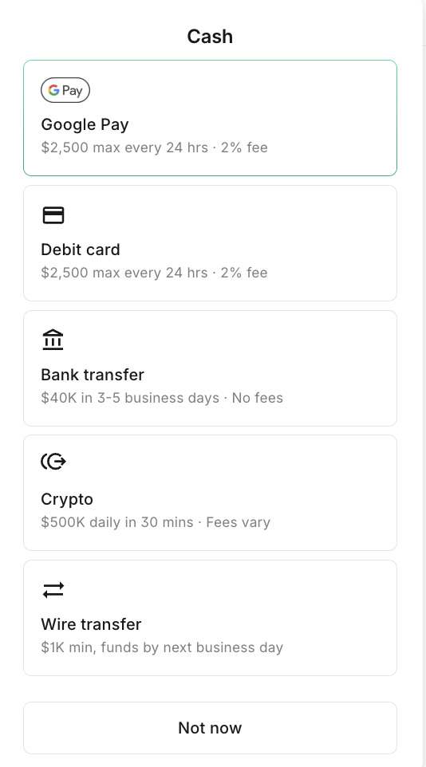

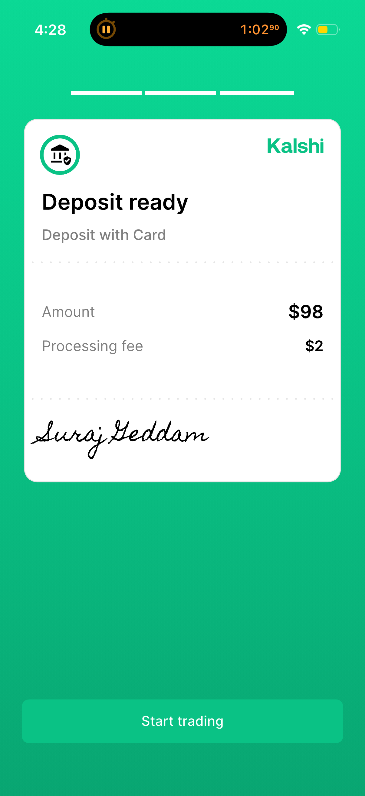

**User goal:**  
- Add cash to account
- Choose deposit method
- Understand deposit limits, fees, and processing times
- Deposit funds quickly and easily

**Kalshi flow (steps):**
1. User clicks "Cash" in top navigation bar (next to account balance)
2. Page routes to Cash deposit options page
3. **URL routing:** Likely `kalshi.com/cash` or `kalshi.com/deposit`
4. **Page displays:**
   - Header: "Cash" title (centered, bold black text)
   - List of payment methods (card-like entries)
   - "Not now" button at bottom
5. **Payment methods displayed:**
   - **Google Pay** (highlighted with green border)
   - **Debit card**
   - **Bank transfer**
   - **Crypto**
   - **Wire transfer**
6. Each payment method shows:
   - Icon (left side)
   - Payment method name (bold black text)
   - Details: limits, fees, processing times (smaller gray text)
7. User clicks on desired payment method
8. User proceeds with deposit flow for selected method
9. **After deposit completes:**
   - Deposit confirmation screen appears
   - Shows "Deposit ready" status
   - Displays deposit method ("Deposit with Card")
   - Shows amount and processing fee
   - **Auto-generated signature** appears (user's name, e.g., "Suraj Geddam")
   - **No manual signing required** - signature is automatically generated
   - "Start trading" button appears at bottom
10. User can click "Start trading" to begin trading immediately
11. User can click "Not now" to cancel/dismiss (if on deposit options page)

**Observed behavior:**
- **Page layout:**
  - Clean, minimalist design with white background
  - "Cash" title centered at top (bold black text)
  - Payment methods displayed as card-like entries (light gray rounded rectangles)
  - "Not now" button at bottom (centered, bold black text on light gray background)
- **Payment methods (from top to bottom):**
  1. **Google Pay (Highlighted):**
     - **Icon:** White "G Pay" logo within green oval (top left of card)
     - **Title:** "Google Pay" (bold black text)
     - **Details:** "$2,500 max every 24 hrs · 2% fee" (smaller gray text)
     - **Visual cue:** Green border outline (suggesting recommended/default option)
  2. **Debit card:**
     - **Icon:** Outline of rectangular card with horizontal line (debit/credit card icon)
     - **Title:** "Debit card" (bold black text)
     - **Details:** "$2,500 max every 24 hrs · 2% fee" (smaller gray text)
  3. **Bank transfer:**
     - **Icon:** Outline of bank building with triangular roof and three vertical columns
     - **Title:** "Bank transfer" (bold black text)
     - **Details:** "$40K in 3-5 business days · No fees" (smaller gray text)
  4. **Crypto:**
     - **Icon:** Circular arrow with small dot in center (exchange/transfer symbol)
     - **Title:** "Crypto" (bold black text)
     - **Details:** "$500K daily in 30 mins · Fees vary" (smaller gray text)
  5. **Wire transfer:**
     - **Icon:** Two horizontal arrows stacked vertically, pointing in opposite directions
     - **Title:** "Wire transfer" (bold black text)
     - **Details:** "$1K min, funds by next business day" (smaller gray text)
- **Payment method details:**
  - **Google Pay:** $2,500 max every 24 hrs, 2% fee
  - **Debit card:** $2,500 max every 24 hrs, 2% fee
  - **Bank transfer:** $40K limit, 3-5 business days, No fees
  - **Crypto:** $500K daily limit, 30 mins processing, Fees vary
  - **Wire transfer:** $1K minimum, Next business day, No fee details shown
- **Visual design:**
  - Consistent card design for all payment methods
  - Icons on left, text on right
  - Google Pay highlighted with green border (recommended option)
  - Clean, scannable layout
- **Missing payment method:**
  - **Apple Pay is NOT available** (only Google Pay)
  - **User feedback:** "Apple Pay is huge as I know as a user its annoying to do debit card I prefer Apple Pay and its easier to get money instantly"
  - **Business impact:** Missing Apple Pay is a significant gap for iOS users
- **Deposit confirmation screen:**
  - **Appears after deposit completes**
  - **Layout:**
    - Green background
    - White rounded card in center
    - Green circular icon (bank/financial building with dollar sign) in top-left
    - "Kalshi" brand name (green text) in top-right
  - **Content:**
    - **Status:** "Deposit ready" (large bold black text)
    - **Method:** "Deposit with Card" (smaller light gray text)
    - **Transaction details:**
      - "Amount" (light gray) - "$98" (bold black)
      - "Processing fee" (light gray) - "$2" (bold black)
    - **Auto-generated signature:** User's name in handwritten script style (e.g., "Suraj Geddam")
      - **No manual signing required** - signature is automatically generated
      - **User feedback:** "Auto signature agreement that I didn't have to sign so easy to use"
      - **Friction reduction:** Eliminates need for manual signature input
  - **Action button:**
    - "Start trading" button (green, darker than background, white text)
    - Centered at bottom
    - Allows immediate trading after deposit
  - **Purpose:** Confirms deposit completion and provides quick path to trading

**What I like:**
- **Clear presentation:** Payment methods clearly displayed with icons and details
- **Consistent design:** All payment methods use same card layout
- **Detailed information:** Shows limits, fees, and processing times upfront
- **Multiple options:** 5 different payment methods for flexibility
- **Visual highlighting:** Google Pay highlighted as recommended option
- **Quick dismissal:** "Not now" button for easy exit
- **Auto-signature confirmation:**
  - **Frictionless experience:** No manual signing required
  - **User feedback:** "Auto signature agreement that I didn't have to sign so easy to use"
  - **Quick completion:** Deposit ready immediately after confirmation
  - **Clear next step:** "Start trading" button provides immediate path to trading
  - **Professional appearance:** Auto-generated signature looks legitimate

**What I don't like / confusion:**
- **Missing Apple Pay:** Only Google Pay available, no Apple Pay option
  - **User feedback:** "Apple Pay is huge... I prefer Apple Pay and its easier to get money instantly"
  - **Business impact:** Significant gap for iOS users (large portion of user base)
  - **User experience:** Forces iOS users to use debit card (more annoying, slower)
- **No fee details for Wire transfer:** Shows "$1K min, funds by next business day" but no fee information
- **No instant options highlighted:** Google Pay and Debit card both have 2% fee, but no truly instant option highlighted
- **No comparison view:** Can't easily compare all options side-by-side
- **No recommended option explanation:** Why is Google Pay highlighted? (no explanation)

**Edge cases / bugs:**
- What if user is on iOS? They can't use Google Pay, must use debit card
- What if user wants to deposit more than $2,500? Must use Bank transfer or Crypto
- What if user wants instant deposit with no fee? No option available
- What if payment method fails? What's the error handling?
- What if user clicks "Not now"? Does it remember preference?

**Builder hypothesis (why they did it):**
- **Standard payment methods:** Google Pay, Debit card, Bank transfer, Crypto, Wire transfer are standard for fintech platforms
- **Google Pay highlighting:** May be most popular or recommended for Android users
- **Fee structure:** 2% fee for instant methods (Google Pay, Debit card) is standard for payment processing
- **High limits:** Crypto ($500K daily) and Bank transfer ($40K) for larger deposits
- **Processing times:** Range from instant (Google Pay, Debit card) to 3-5 days (Bank transfer)
- **Business requirement:** Multiple payment methods are standard for fintech platforms
- **Missing Apple Pay:** May be oversight or technical limitation (though Apple Pay is widely supported)

**Opinion Kings implications:**
- **Copy:**
  - Multiple payment methods (Google Pay, Debit card, Bank transfer, Crypto, Wire transfer)
  - Clear display of limits, fees, and processing times
  - Card-like layout for payment methods
  - "Not now" button for dismissal
  - Visual highlighting of recommended option
- **Avoid:**
  - Missing Apple Pay (critical gap for iOS users)
  - Unclear fee structure (Wire transfer)
  - No explanation for recommended option
- **Beat:**
  - **Apple Pay support:** CRITICAL - Add Apple Pay as payment method
    - **User feedback:** "Apple Pay is huge... I prefer Apple Pay and its easier to get money instantly"
    - **Business impact:** Significant competitive advantage for iOS users
    - **User experience:** Faster, easier deposits for iOS users
    - **Market coverage:** iOS users are large portion of user base
  - **Instant deposit options:** Highlight truly instant options (Apple Pay, Google Pay)
  - **Fee transparency:** Show all fees clearly (including Wire transfer)
  - **Comparison view:** Allow users to compare all options side-by-side
  - **Recommended option explanation:** Explain why an option is recommended
  - **Fee-free options:** Highlight fee-free options (Bank transfer, Wire transfer)
  - **Processing time clarity:** Show processing times more prominently
  - **Deposit limits:** Show daily/weekly/monthly limits more clearly
  - **Payment method filtering:** Allow filtering by criteria (instant, fee-free, high limit, etc.)
  - **Saved payment methods:** Remember user's preferred payment method
  - **Deposit history:** Show recent deposits and methods used
  - **Auto-signature confirmation:** Copy the frictionless auto-signature flow
    - Auto-generate signature from user's name
    - No manual signing required
    - Clear confirmation screen with transaction details
    - Immediate "Start trading" action
- **Implementation notes:**
  - **Payment methods:**
    - **Apple Pay:** CRITICAL - Integrate Apple Pay SDK
      - iOS support (native)
      - Web support (Apple Pay JS)
      - Instant processing
      - Similar limits/fees to Google Pay
    - **Google Pay:** Keep existing integration
    - **Debit card:** Keep existing integration
    - **Bank transfer:** Keep existing integration
    - **Crypto:** Keep existing integration
    - **Wire transfer:** Keep existing integration
  - **Payment method display:**
    - Card-like layout for each method
    - Icon on left, text on right
    - Show: limits, fees, processing times
    - Highlight recommended option (with explanation)
  - **Payment processing:**
    - Integrate with payment processors (Stripe, Plaid, etc.)
    - Handle payment failures gracefully
    - Show processing status
    - Send confirmation emails
  - **Deposit confirmation:**
    - Show confirmation screen after deposit completes
    - Display transaction details (amount, fee, method)
    - **Auto-generate signature** from user's name
      - Use handwritten script font/style
      - No manual input required
      - Legally acceptable for agreements
    - Show "Start trading" button for immediate action
    - Green background with white card (mobile-friendly design)
  - **State management:**
    - Store selected payment method
    - Remember user preference
    - Track deposit history
  - **Error handling:**
    - Show clear error messages
    - Provide retry options
    - Support contact information
- **Metrics:**
  - Payment method selection rate (which methods are used most?)
  - Deposit success rate (by payment method)
  - Average deposit amount (by payment method)
  - Deposit frequency (by payment method)
  - Payment method abandonment rate (users who click but don't complete)
  - Time to complete deposit (by payment method)
  - User preference (do users stick with one method or switch?)
  - iOS vs Android deposit rates (to measure Apple Pay impact)

## Funding & Withdrawals

_Add feature writeups here as screenshots are added..._

---

## Discovery

### Homepage (Logged In - Trending)

**Feature category:** Discovery

**Screenshots:**  
- 019: `019-discovery-homepage-trending.png` - Logged-in homepage showing trending markets
- 057: `057-discovery-trending-for-you-carousel.png` - "For you" tab showing auto-rotating carousel with back/forward arrows
- 058: `058-discovery-trending-pro-football-no-carousel.png` - "Pro Football" tab showing standard layout without carousel

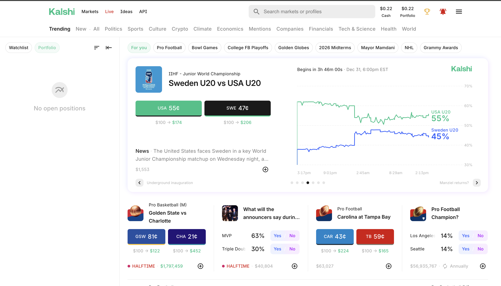

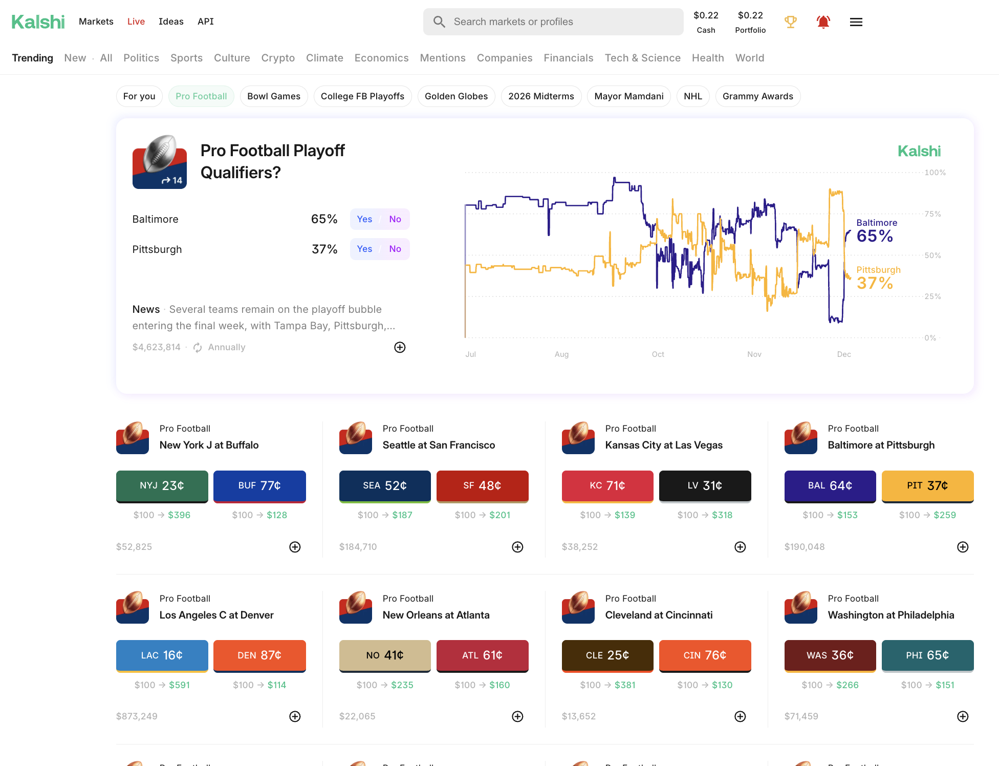

**User goal:**  
- View trending markets after logging in
- Discover popular markets across categories
- Access watchlist and portfolio
- Navigate to specific markets

**Kalshi flow (steps):**
1. User logs in (via OAuth or email)
2. Homepage automatically routes to "Trending" view
3. **URL Routing:**
   - **"For you" tab (default):** `kalshi.com` or `kalshi.com/trending` (base URL)
   - **Category filters:** Use query parameters (e.g., `kalshi.com/?live=football` for "Pro Football")
   - **Other categories:** Similar pattern with different query parameters
4. "Trending" category is highlighted in navigation
4. Page displays:
   - Account balance in header ($0.22 Cash, $0.22 Portfolio)
   - Market categories and filters
   - Featured market (e.g., "IIHF - Junior World Championship Sweden U20 vs USA U20")
   - Watchlist sidebar (populated as user adds markets)
   - Portfolio sidebar (populated as user has positions)
   - Multiple market cards below featured market
5. User can click on any market to go to detailed market page
6. User can click on watchlist/portfolio items to navigate to those specific markets
7. **Infinite scroll auto-reload:**
   - As user scrolls down, more market cards appear
   - When scroll bar reaches temporary bottom, markets automatically reload
   - New markets pop up/appear automatically
   - No manual "Load more" button needed
   - Seamless continuous loading

**Observed behavior:**
- **Header:**
  - Kalshi logo, navigation (Markets, Live, Ideas, API)
  - **"Markets" link:** Routes to "All" category page (`kalshi.com/category/all`)
  - **"Live" link:** Routes to Live events calendar page (`kalshi.com/calendar`)
  - **"Ideas" link:** Routes to Ideas feed page (`kalshi.com/ideas/feed`) - main social platform
  - Search bar
  - Account info: "$0.22 Cash", "$0.22 Portfolio"
  - Trophy icon, bell icon, hamburger menu
- **Category Navigation:**
  - Primary: "Trending" (highlighted), "New," "All," "Politics," "Sports," "Culture," "Crypto," "Climate," "Economics," "Mentions," "Companies," "Financials," "Tech & Science," "Health," "World"
  - Secondary: "For you" (highlighted), "Pro Football," "Bowl Games," "College FB Playoffs," "Golden Globes," "2026 Midterms," "Mayor Mamdani," "NHL," "Grammy Awards"
  - **URL Routing Patterns:**
    - **"For you" (default):** `kalshi.com` or `kalshi.com/trending` (base URL, no query params)
    - **"Pro Football":** `kalshi.com/?live=football` (query parameter `?live=football`)
    - **Other categories:** Similar query parameter pattern (e.g., `?live=basketball`, `?live=politics`, etc.)
    - URL updates when clicking category filters
    - Browser back/forward buttons work with category navigation
  - **"For you" tab (unique features):**
    - Auto-rotating carousel at top (like Netflix carousel)
    - Rotates through 7 markets automatically over time
    - Back/forward arrow navigation buttons
    - Market names shown on arrows (user knows what's next/previous)
    - Live markets shown first
    - No clear ordering for rest (no sort/search/filter options)
    - Market widgets at bottom (smaller market cards)
    - User can see market info without clicking into it
    - Extensive page with many markets
  - **Other category tabs (e.g., "Pro Football"):**
    - Standard layout (no carousel)
    - No back/forward arrows
    - Featured market at top (static, doesn't rotate)
    - Grid of market cards below
    - Same infinite scroll behavior
- **Left Sidebar:**
  - "Watchlist" and "Portfolio" tabs
  - Watchlist shows: "What will the announcers say during the Carolina at Tampa Bay professional football game?" with "What a Catch" mention, price "47¢" with down arrow "8"
  - Portfolio tab shows "No open positions" when empty
  - **Clicking watchlist/portfolio items:** Navigates to detailed market page for that specific prediction
- **Featured Market:**
  - "IIHF - Junior World Championship Sweden U20 vs USA U20"
  - Event timing: "Begins in 3h 46m 00s Dec 31, 6:00pm EST"
  - Options: "USA 55¢" ($100 → $174), "SWE 47¢" ($100 → $206)
  - News snippet with volume "$1,553"
  - Price chart showing probability trends
  - Navigation: "Manziel returns?" link
- **Other Market Cards:**
  - "Pro Basketball (M) Golden State vs Charlotte": GSW 81¢, CHA 21¢, "HALFTIME"
  - "What will the announcers say durin...": MVP 63%, Triple Doub 30%, "HALFTIME"
  - "Pro Football Carolina at Tampa Bay": CAR 43¢, TB 59¢
  - "Pro Football Champion?": Los Angeles 14%, Seattle 14%

**What I like:**
- **Automatic routing to Trending:** Homepage defaults to trending markets (most engaging content)
- **Watchlist/Portfolio sidebar:** Easy access to saved markets and positions
- **Clickable watchlist items:** Direct navigation to market pages from sidebar
- **Featured market prominence:** Large card draws attention to high-liquidity markets
- **Multiple market cards:** Shows variety and activity
- **Real-time data:** Live scores, probabilities, timing updates
- **Clear category navigation:** Multiple ways to discover markets
- **Infinite scroll:** Seamless auto-reload as user scrolls - no manual "Load more" button needed
- **Automatic loading:** Markets pop up automatically when reaching bottom - smooth UX
- **"For you" carousel:**
  - Auto-rotating carousel (Netflix-style) - engaging and dynamic
  - Back/forward arrows with market names - user knows what's next/previous
  - Shows market info without clicking - great visibility
  - Live markets prioritized - shows most relevant first
  - Manual navigation option - user can control rotation

**What I don't like / confusion:**
- "Trending" vs "For you" - unclear difference when both are highlighted
- Watchlist item truncation: "What will the announcers say durin..." - long names get cut off
- No clear indication of what makes a market "trending" (volume? velocity? engagement?)
- Portfolio empty state could be more helpful (suggest adding funds or exploring markets)
- **"For you" tab limitations:**
  - No sort/search/filter options within "For you" tab
  - No clear ordering logic for markets (after live ones)
  - Can't determine how markets are ordered
  - Must use top search bar for search (not within "For you" tab)
  - Limited control over what markets are shown

**Edge cases / bugs:**
- None observed (only log bugs when explicitly identified)

**Builder hypothesis (why they did it):**
- **Default to Trending:** Shows most active/engaging markets first (increases engagement)
- **Watchlist/Portfolio sidebar:** Personalization increases retention and makes it easy to return to markets
- **Clickable sidebar items:** Reduces friction to access saved markets
- **Featured market:** Highlights high-liquidity markets (better trading experience)
- **Multiple market cards:** Shows platform activity and variety
- **Real-time updates:** Creates urgency and engagement
- **"For you" carousel:**
  - Auto-rotation keeps content fresh and engaging
  - Netflix-style carousel increases time on page
  - Shows multiple markets without scrolling (better discovery)
  - Live markets first - prioritizes active/relevant content
  - Market names on arrows - reduces friction, shows what's coming
  - Personalization ("For you") increases relevance and engagement

**Opinion Kings implications:**
- **Copy:**
  - Default homepage to trending view
  - Watchlist/Portfolio sidebar with clickable items
  - Featured market card for high-liquidity markets
  - Multiple market cards showing variety
  - Real-time data updates
- **Avoid:**
  - Unclear distinction between "Trending" and "For you"
  - Truncated market names in sidebar
- **Beat:**
  - Clear definition of "trending" (show volume, velocity, or engagement metrics)
  - Better empty states (Portfolio: suggest funding, Watchlist: suggest markets to add)
  - Better truncation handling (tooltip on hover, or expandable)
  - Show why markets are trending (badge or indicator)
  - Add "Recently viewed" section
  - **"For you" tab improvements:**
    - Add sort/search/filter options within "For you" tab
    - Show clear ordering logic (e.g., "Sorted by: Relevance" or "Personalized for you")
    - Add filter options (Live, Upcoming, Closed, etc.)
    - Add sort options (Volume, Price, Time, Relevance)
    - Allow users to customize "For you" algorithm
    - Show why markets are recommended (e.g., "Because you traded similar markets")
- **Implementation notes:**
  - **Homepage routing:**
    - Route `/` to `/trending` when logged in (or keep as `/` with "For you" as default)
    - **URL structure:**
      - Base URL: `kalshi.com` or `kalshi.com/trending` (for "For you" tab)
      - Category filters: Use query parameters (e.g., `?live=football` for "Pro Football")
      - Update URL when category filter changes
      - Support browser back/forward navigation
      - Parse query parameters on page load to show correct category
    - Calculate trending algorithm (volume, velocity, engagement, recency)
    - Cache trending markets for performance
  - **Watchlist/Portfolio:**
    - Store user's watchlist markets in database
    - Store user's open positions in portfolio
    - Real-time price updates for sidebar items
    - Click handler: navigate to `/markets/{market-id}`
  - **Featured market:**
    - Select based on liquidity, volume, or trending score
    - Update featured market periodically
  - **Market cards:**
    - Fetch multiple markets based on category/filter
    - **Infinite scroll implementation:**
      - Detect when user scrolls near bottom (e.g., 80% of viewport)
      - Automatically fetch next batch of markets
      - Append new markets to existing list
      - Update scroll position to maintain user's place
      - Show loading indicator (optional) during fetch
      - Handle edge case: no more markets to load
    - Real-time price updates via WebSocket
  - **"For you" tab carousel:**
    - **Carousel component:**
      - Auto-rotation timer (e.g., rotate every 5-10 seconds)
      - 7 markets in rotation
      - Back/forward arrow buttons
      - Market names displayed on arrows (next/previous market)
      - Pause auto-rotation on hover/interaction
      - Resume auto-rotation after inactivity
    - **Market selection:**
      - Prioritize live markets first
      - Personalization algorithm for remaining markets
      - Fetch 7 markets for carousel
      - Update carousel periodically (e.g., every 5 minutes)
    - **Market widgets:**
      - Smaller market cards below carousel
      - Grid layout
      - Infinite scroll for widgets
      - Show market preview info (price, volume, status)
    - **Navigation:**
      - Click arrow to navigate to next/previous market
      - Click market card to go to full market page
      - Show market name on arrow buttons
      - Update arrows when carousel rotates
  - **Other category tabs (e.g., "Pro Football"):**
    - Standard layout (no carousel)
    - Featured market at top (static)
    - Grid of market cards below
    - Same infinite scroll as "For you" widgets
    - Filter by category (e.g., "Pro Football" shows only Pro Football markets)
    - **URL routing:**
      - Update URL with query parameter when category selected (e.g., `?live=football`)
      - Parse query parameter on page load to show correct category
      - Support deep linking (users can share category URLs)
      - Browser back/forward buttons navigate between categories
- **Metrics:**
  - Homepage view rate
  - Trending market click-through rate
  - Watchlist usage rate
  - Portfolio usage rate
  - Click-through rate from sidebar to market pages
  - Featured market engagement
  - Time spent on homepage
  - Market card click-through rate

### New Markets with Unique/Repeating Tabs

**Feature category:** Discovery

**Screenshots:**  
- 061: `061-discovery-new-unique-markets.png` - "New" markets section showing "Unique markets" tab (default)
- 062: `062-discovery-new-repeating-markets.png` - "New" markets section showing "Repeating markets" tab

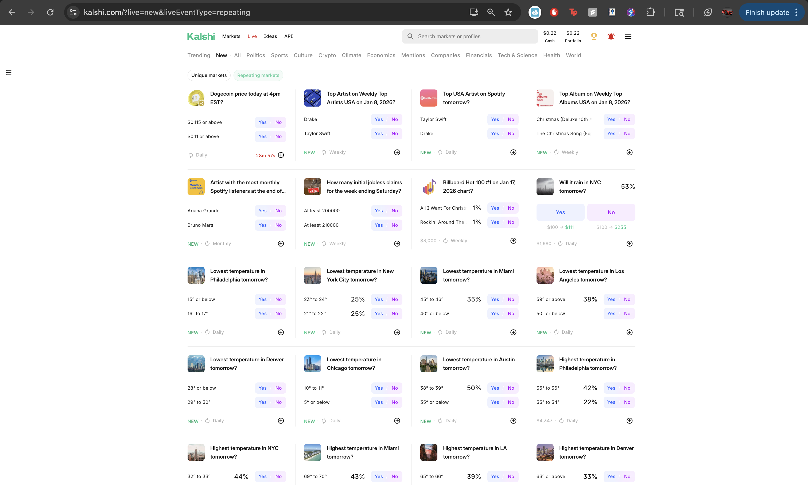

**User goal:**  
- Discover newly added markets
- Filter between unique (one-time) and repeating (daily/weekly/monthly) markets
- Find fresh trading opportunities
- Understand market types and frequencies

**Kalshi flow (steps):**
1. User is on homepage (Trending view)
2. User clicks "New" in primary category navigation
3. Page routes to "New" markets view
4. **URL routing:**
   - Default: `kalshi.com/?live=new&liveEventType=unique` (Unique markets tab)
   - When clicking "Repeating markets": `kalshi.com/?live=new&liveEventType=repeating`
5. **Unique Markets Tab (Default):**
   - Shows one-time events and unique predictions
   - Markets labeled with "NEW" badge
   - Examples: Movie releases, product launches, election outcomes, award winners
6. **Repeating Markets Tab:**
   - User clicks "Repeating markets" tab
   - Shows recurring markets (daily, weekly, monthly)
   - Markets show frequency labels: "Daily", "Weekly", "Monthly"
   - Examples: Weather forecasts, Spotify charts, temperature readings, jobless claims
7. Both tabs show grid of market cards with infinite scroll

**Observed behavior:**
- **Category Navigation:**
  - "New" is highlighted in primary navigation
  - Other categories still accessible (Trending, All, Politics, Sports, etc.)
- **Tab Navigation:**
  - Two tabs below category navigation: "Unique markets" and "Repeating markets"
  - "Unique markets" is default/selected when first clicking "New"
  - Tabs are clickable and switch view
  - Selected tab is highlighted
- **URL Structure:**
  - Base: `kalshi.com/?live=new`
  - Unique markets: `?live=new&liveEventType=unique`
  - Repeating markets: `?live=new&liveEventType=repeating`
  - URL updates when switching tabs
- **Unique Markets Examples:**
  - "Avengers: Doomsday Trailer" - When will trailer be released?
  - "xAI Grok 4.2 Release" - When will Grok 4.2 be released?
  - "Apple iPhone 18 Release" - When will iPhone 18 be released?
  - "Jordan Peele Marvel Film" - Will Jordan Peele direct a Marvel film?
  - "House Seats Democrats" - How many House seats will Democrats hold?
  - Markets show "NEW" label
  - Dollar amounts shown (e.g., "$1,313", "$3,863")
- **Repeating Markets Examples:**
  - "Dogecoin price today at 4pm EST?" - Daily
  - "Top Artist on Weekly Top Artists USA" - Weekly
  - "Will it rain in NYC tomorrow?" - Daily
  - "Lowest temperature in [City] tomorrow?" - Daily (multiple cities)
  - "Highest temperature in [City] tomorrow?" - Daily (multiple cities)
  - "How many initial jobless claims?" - Weekly
  - Markets show frequency labels: "Daily", "Weekly", "Monthly"
  - Countdown timers for some markets (e.g., "28m 57s")
  - Dollar amounts shown (e.g., "$3,000 Weekly", "$1,680 Daily")
- **Market Cards:**
  - Grid layout (4 columns visible)
  - Each card shows:
    - Market icon/image
    - Market question/title
    - Prediction options with percentages
    - "Yes" and "No" buttons
    - Dollar amounts or "NEW" label
    - Frequency label (for repeating markets)
    - Plus icon (add to watchlist)
  - Infinite scroll loads more markets
- **Market Types:**
  - **Unique markets:** One-time events, specific outcomes, single occurrences
  - **Repeating markets:** Recurring events, periodic data, regular updates

**What I like:**
- **Clear categorization:** Unique vs Repeating helps users understand market types
- **Default to Unique:** Most users probably want to see unique events first
- **Frequency labels:** Clear indication of how often repeating markets occur
- **"NEW" badges:** Easy to identify newly added markets
- **URL routing:** Deep linking support for both tabs
- **Grid layout:** Easy to scan multiple markets
- **Infinite scroll:** Seamless loading of more markets

**What I don't like / confusion:**
- **No sort/filter within tabs:** Can't sort by date, volume, or category within Unique/Repeating
- **No search within "New":** Must use top search bar
- **Unclear ordering:** How are markets ordered within each tab? (date added? volume? random?)
- **"NEW" label inconsistency:** Some markets have "NEW", others don't - unclear criteria
- **No time filter:** Can't filter "New" by time period (today, this week, this month)
- **Tab switching:** URL changes but no clear visual feedback of what changed

**Edge cases / bugs:**
- What if a market is both unique and repeating? (e.g., "Will it rain on New Year's Day 2026?")
- What if user bookmarks "New" page - which tab does it default to?
- What if no new markets exist? Does it show empty state or old markets?
- What defines "new"? Time-based (last 24 hours?) or just recently added?

**Builder hypothesis (why they did it):**
- **Market type distinction:** Unique vs Repeating serves different user needs
- **Discovery:** "New" helps users find fresh trading opportunities
- **User segmentation:** Some users prefer unique events, others prefer recurring markets
- **Liquidity:** Repeating markets may have more consistent liquidity
- **Engagement:** "New" markets create urgency and excitement
- **Organization:** Separating unique/repeating makes it easier to find specific market types
- **Default to Unique:** Unique markets are probably more engaging/interesting for most users

**Opinion Kings implications:**
- **Copy:**
  - "New" markets section with Unique/Repeating tabs
  - Default to Unique markets tab
  - URL routing with query parameters
  - Frequency labels for repeating markets
  - "NEW" badges for newly added markets
  - Grid layout with infinite scroll
- **Avoid:**
  - No sort/filter within tabs
  - Unclear ordering logic
  - No time-based filtering
- **Beat:**
  - **Sort options:** Add sort within tabs (by date, volume, price change, closing soon)
  - **Filter options:** Add filters (by category, date range, volume threshold)
  - **Time-based filtering:** Add "New today", "New this week", "New this month" options
  - **Search within "New":** Add search bar specific to "New" markets
  - **Clear ordering:** Show how markets are ordered (e.g., "Sorted by: Most recent")
  - **"NEW" criteria:** Show what makes a market "NEW" (e.g., "Added in last 24 hours")
  - **Tab persistence:** Remember user's tab preference (Unique vs Repeating)
  - **Market type indicators:** Add visual indicators for market types (icon, color)
  - **Quick filters:** Add quick filter buttons (e.g., "Today", "This week", "High volume")
  - **Empty states:** Show helpful empty states if no new markets
  - **Market preview:** Show more info on hover (volume, closing time, etc.)
- **Implementation notes:**
  - **URL routing:**
    - Base URL: `kalshi.com/?live=new`
    - Query parameters: `liveEventType=unique` or `liveEventType=repeating`
    - Update URL when tab changes
    - Parse query parameters on page load
    - Support browser back/forward navigation
  - **Tab component:**
    - Two tabs: "Unique markets" and "Repeating markets"
    - Default to "Unique markets"
    - Store selected tab in state
    - Update URL when tab changes
    - Highlight selected tab
  - **Market filtering:**
    - **Unique markets:** Filter markets where `isRepeating = false` or `frequency = null`
    - **Repeating markets:** Filter markets where `isRepeating = true` or `frequency != null`
    - Sort by date added (newest first) or other criteria
  - **Market data:**
    - Fetch markets with `isNew = true` or `dateAdded > threshold`
    - Include market metadata (frequency, type, date added)
    - Real-time updates for new markets
  - **Grid layout:**
    - Responsive grid (4 columns on desktop, fewer on mobile)
    - Market card component
    - Infinite scroll implementation
    - Loading states
  - **"NEW" badge:**
    - Show badge if `dateAdded > threshold` (e.g., last 7 days)
    - Or if `isNew = true` flag
    - Update badge visibility based on criteria
  - **Frequency labels:**
    - Display frequency for repeating markets: "Daily", "Weekly", "Monthly"
    - Store frequency in market data
    - Display in market card footer
- **Metrics:**
  - "New" markets click-through rate
  - Unique vs Repeating tab usage (which is more popular?)
  - Tab switching frequency
  - Market card click-through rate from "New" section
  - Time spent in "New" markets section
  - "NEW" badge impact (does it increase clicks?)
  - New market discovery rate (how many new markets do users find?)
  - Conversion rate from "New" to trades
  - Repeating market engagement (do users trade repeating markets more?)

### All Category with Advanced Filtering and Sorting

**Feature category:** Discovery / Filtering / Sorting

**Screenshots:**  
- 063: `063-discovery-all-category-page.png` - "All" category page showing all markets with filter/sort controls
- 064: `064-discovery-all-trending-sort-dropdown.png` - "Trending" sort dropdown with options (Trending, Volatile, New, Closing soon, Volume, Liquidity, 50-50, Reverse sort toggle)
- 065: `065-discovery-all-frequency-dropdown.png` - "Frequency" dropdown with options (All, Hourly, Daily, Weekly, Monthly, Annually)
- 066: `066-discovery-all-open-markets-dropdown.png` - "Open markets" dropdown with market status options (All markets, Open markets, Closed markets)
- 067: `067-discovery-all-filter-button-dropdown.png` - Filter button dropdown with toggle options (Contract price, List view, Exclude sports)

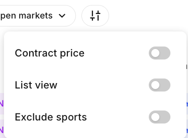

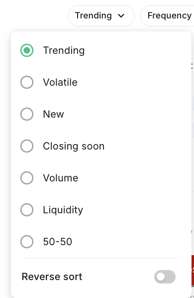

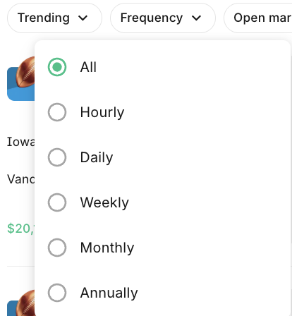

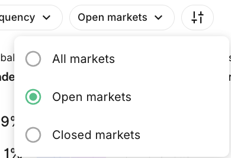

**User goal:**  
- View all markets across all categories
- Filter markets by various criteria (frequency, status, etc.)
- Sort markets by different attributes (trending, volume, liquidity, etc.)
- Customize view preferences (list view, exclude sports, etc.)
- Find specific markets using advanced filters

**Kalshi flow (steps):**
1. User clicks "All" in primary category navigation OR clicks "Markets" in top navigation bar
2. **"Markets" navigation link:** Clicking "Markets" in top navigation (next to Kalshi logo) routes to "All" category page
3. Page routes to "All" category view
4. **URL routing:** `kalshi.com/category/all`
5. Page displays all markets with filter/sort controls at top
5. **Filter/Sort Controls:**
   - **Trending dropdown:** Sort by Trending, Volatile, New, Closing soon, Volume, Liquidity, 50-50
   - **Frequency dropdown:** Filter by All, Hourly, Daily, Weekly, Monthly, Annually
   - **Open markets dropdown:** Filter by All markets, Open markets, Closed markets
   - **Filter button:** Toggle options (Contract price, List view, Exclude sports)
6. User selects filters/sorts from dropdowns
7. Markets update based on selected filters/sorts
8. Grid of market cards displays filtered/sorted results
9. Infinite scroll loads more markets

**Observed behavior:**
- **Top Navigation:**
  - "Markets" link in top navigation bar routes to "All" category page (`kalshi.com/category/all`)
  - "Markets" is a primary navigation link (alongside Live, Ideas, API)
  - Clicking "Markets" is equivalent to clicking "All" in category navigation
- **Category Navigation:**
  - "All" is highlighted in primary navigation
  - Other categories still accessible
- **URL Structure:**
  - `kalshi.com/category/all` (different from query parameter pattern used in other categories)
- **Filter/Sort Controls (Top Right):**
  - **Trending dropdown:**
    - Options: Trending (selected), Volatile, New, Closing soon, Volume, Liquidity, 50-50
    - Radio button selection interface
    - Selected option shows green filled circle
    - **Reverse sort toggle:** At bottom of dropdown
    - Toggle switch (off by default, grey when off)
    - Allows reversing sort order
  - **Frequency dropdown:**
    - Options: All (selected), Hourly, Daily, Weekly, Monthly, Annually
    - Radio button selection interface
    - Selected option shows green filled circle
    - Filters markets by their frequency/recurrence pattern
  - **Open markets dropdown:**
    - Options: All markets, Open markets (selected), Closed markets
    - Radio button selection interface
    - Selected option shows green filled circle
    - Filters by market status (open vs closed)
  - **Filter button (icon):**
    - Two vertical lines with horizontal bars (filter icon)
    - Opens dropdown with toggle switches
    - **Toggle options:**
      - **Contract price:** Toggle on/off (off by default)
      - **List view:** Toggle on/off (off by default)
      - **Exclude sports:** Toggle on/off (off by default)
    - Each toggle has switch (grey when off, green when on)
- **Market Display:**
  - Grid layout (3 columns visible)
  - Each market card shows:
    - Market icon/image
    - Market title/question
    - Prediction options with prices/percentages
    - "Yes" and "No" buttons
    - Total volume
    - Live status (if applicable)
    - Time remaining (if applicable)
  - Infinite scroll loads more markets
- **Market Examples:**
  - College Football markets
  - Pro Basketball markets
  - AI/Technology markets
  - Politics markets
  - Weather markets
  - International sports markets
  - Financial markets (Fed decisions)

**What I like:**
- **Comprehensive filtering:** Multiple filter dimensions (frequency, status, sort)
- **Flexible sorting:** Many sort options (trending, volume, liquidity, etc.)
- **Reverse sort:** Ability to reverse sort order
- **View customization:** Toggle options for display preferences
- **Clear UI:** Dropdowns are well-organized and easy to use
- **Multiple filter combinations:** Can combine filters (e.g., Daily + Open markets + Trending)
- **Exclude sports option:** Useful for users who don't want sports markets

**What I don't like / confusion:**
- **No filter persistence:** Filters don't persist when navigating away and back
- **No filter indicators:** When filters are active, no clear visual indicator (unless dropdown is open)
- **No filter reset:** No easy way to reset all filters at once
- **Toggle states unclear:** When toggles are off, not clear what the default behavior is
- **No search within "All":** Must use top search bar
- **No filter count:** Doesn't show how many markets match current filters
- **URL doesn't reflect filters:** Filters not in URL (can't bookmark filtered view)
- **No filter history:** Can't see recently used filter combinations

**Edge cases / bugs:**
- What if no markets match all selected filters? Does it show empty state?
- What if user selects conflicting filters? (e.g., "Closed markets" + "Closing soon" sort)
- What if filters are applied but user doesn't realize? (no visual indicator)
- What if user wants to save filter preferences?

**Builder hypothesis (why they did it):**
- **Power users:** Advanced filtering appeals to experienced traders
- **Market discovery:** Helps users find specific types of markets
- **User preferences:** Exclude sports, list view, etc. cater to different user needs
- **Liquidity focus:** Volume and liquidity sorts help users find active markets
- **Market organization:** Frequency filter helps organize recurring vs one-time markets
- **Status filtering:** Open vs closed helps users find tradeable markets
- **Flexibility:** Multiple filter dimensions accommodate different use cases
- **50-50 sort:** Helps users find balanced markets (equal probabilities)

**Opinion Kings implications:**
- **Copy:**
  - Comprehensive filtering system (frequency, status, sort)
  - Multiple sort options (trending, volume, liquidity, etc.)
  - Reverse sort toggle
  - View customization toggles (list view, exclude sports, etc.)
  - Dropdown interface for filters
  - Radio button selection for sort/filter options
- **Avoid:**
  - No filter persistence
  - No visual indicators when filters are active
  - No filter reset option
  - URL doesn't reflect filters
- **Beat:**
  - **Filter persistence:** Remember user's filter preferences
  - **Visual indicators:** Show active filters as badges/pills when dropdowns are closed
  - **Filter reset:** Add "Clear all filters" button
  - **URL filters:** Include filters in URL for bookmarking/sharing
  - **Filter count:** Show "X markets match your filters"
  - **Filter presets:** Save common filter combinations
  - **Filter history:** Show recently used filter combinations
  - **Search within "All":** Add search bar specific to "All" category
  - **Filter suggestions:** Suggest filters based on user behavior
  - **Multi-select filters:** Allow selecting multiple frequencies or categories
  - **Filter validation:** Prevent conflicting filter combinations
  - **Empty state:** Show helpful message when no markets match filters
  - **Filter animation:** Smooth transitions when filters change
  - **Filter tooltips:** Explain what each filter/sort option does
- **Implementation notes:**
  - **URL routing:**
    - Base URL: `kalshi.com/category/all`
    - Consider adding query parameters for filters: `?frequency=daily&status=open&sort=volume`
    - Parse query parameters on page load
    - Update URL when filters change
    - Support browser back/forward navigation
  - **Filter state management:**
    - Store filter state (frequency, status, sort, toggles)
    - Update markets when filters change
    - Persist filters in local storage or user preferences
    - Show active filter indicators
  - **Sort options:**
    - **Trending:** Algorithm-based (volume, velocity, engagement)
    - **Volatile:** Sort by price volatility/change
    - **New:** Sort by date added (newest first)
    - **Closing soon:** Sort by market close time (soonest first)
    - **Volume:** Sort by total volume (highest first)
    - **Liquidity:** Sort by liquidity/orderbook depth
    - **50-50:** Sort by how close probabilities are to 50/50
    - **Reverse sort:** Toggle to reverse any sort order
  - **Frequency filter:**
    - Filter markets by frequency: Hourly, Daily, Weekly, Monthly, Annually
    - "All" shows markets of all frequencies
    - Store frequency in market metadata
  - **Status filter:**
    - Filter by market status: Open, Closed, All
    - Check market `isOpen` or `closeTime` field
    - Real-time updates for market status
  - **Toggle options:**
    - **Contract price:** Show/hide contract prices in market cards
    - **List view:** Switch between grid and list view
    - **Exclude sports:** Filter out sports-related markets
    - Store toggle states in state/local storage
  - **Market filtering logic:**
    - Apply all active filters simultaneously
    - Filter markets: `markets.filter(m => matchesFilters(m, filters))`
    - Sort filtered markets: `filteredMarkets.sort(sortFunction)`
    - Apply reverse sort if toggle is on
  - **Performance:**
    - Optimize filtering for large market lists
    - Consider virtual scrolling for many markets
    - Cache filtered results
    - Debounce filter changes if needed
  - **UI components:**
    - Dropdown components for each filter
    - Radio button selection interface
    - Toggle switches for view options
    - Filter button with icon
    - Active filter indicators (badges/pills)
- **Metrics:**
  - Filter usage rate (which filters are used most?)
  - Sort option usage (which sorts are most popular?)
  - Toggle usage (how many users use list view, exclude sports, etc.?)
  - Filter combination patterns (common filter combinations)
  - Time spent with filters applied
  - Market discovery rate (do filters help users find markets?)
  - Conversion rate from filtered view to trades
  - Filter persistence rate (do users return to same filters?)
  - Reverse sort usage rate
  - Filter reset rate (how often users clear filters?)

### Politics Category with Sub-Categories

**Feature category:** Discovery / Category Navigation

**Screenshots:**  
- 068: `068-discovery-politics-all-subcategory.png` - Politics category showing "All" sub-category with scrollable sub-category navigation
- 069: `069-discovery-politics-trump-agenda-subcategory.png` - Politics category showing "Trump Agenda" sub-category with filtered markets

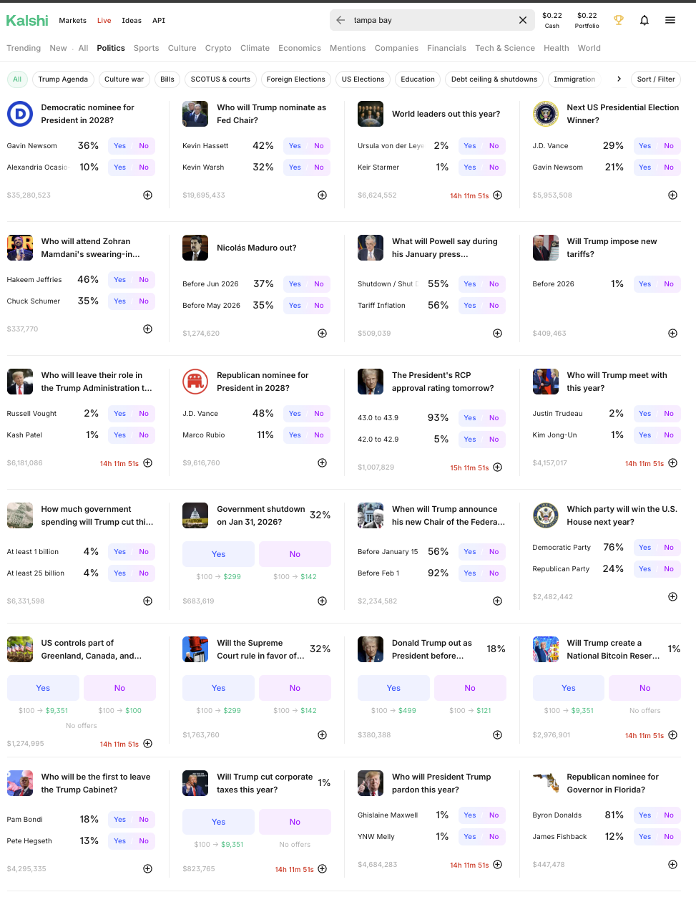

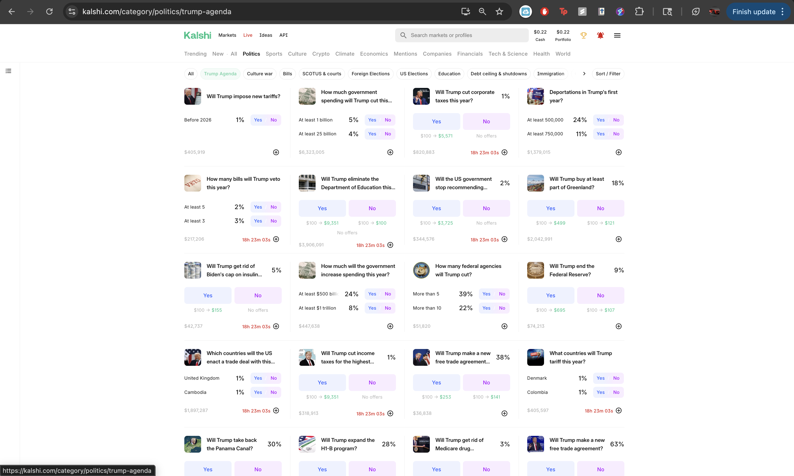

**User goal:**  
- Browse politics markets
- Filter politics markets by specific topics (Trump Agenda, Culture war, Bills, etc.)
- Navigate between politics sub-categories
- Find specific political prediction markets

**Kalshi flow (steps):**
1. User clicks "Politics" in primary category navigation
2. Page routes to Politics category view
3. **URL routing:**
   - Default "All" sub-category: `kalshi.com/category/politics` or `kalshi.com/category/politics/all`
   - Sub-categories: `kalshi.com/category/politics/trump-agenda`, `kalshi.com/category/politics/culture-war`, etc.
4. **Sub-Category Navigation:**
   - Secondary navigation bar shows sub-categories below primary navigation
   - Sub-categories: "All" (default), "Trump Agenda", "Culture war", "Bills", "SCOTUS & courts", "Foreign Elections", "US Elections", "Education", "Debt ceiling & shutdowns", "Immigration"
   - **Scrollable navigation:** Since there are many sub-categories, navigation is scrollable
   - Right arrow icon (">") allows navigating to next sub-categories
   - "Sort / Filter" option at end of sub-category navigation
5. User clicks on a sub-category (e.g., "Trump Agenda")
6. URL updates to `/category/politics/trump-agenda`
7. Markets filter to show only that sub-category's markets
8. Selected sub-category is highlighted
9. Grid of market cards displays filtered results
10. Infinite scroll loads more markets

**Observed behavior:**
- **Category Navigation:**
  - "Politics" is highlighted in primary navigation
  - Other categories still accessible
- **Sub-Category Navigation:**
  - Secondary navigation bar below primary navigation
  - Sub-categories displayed horizontally
  - "All" is default/selected when first clicking "Politics"
  - Selected sub-category is highlighted (e.g., "Trump Agenda" highlighted in light blue)
  - **Scrollable navigation:**
    - Right arrow icon (">") appears when there are more sub-categories
    - Clicking arrow scrolls to show next sub-categories
    - Navigation is horizontally scrollable
    - Allows access to all sub-categories even if many exist
  - "Sort / Filter" option at end of navigation
- **URL Structure:**
  - Base: `kalshi.com/category/politics` or `kalshi.com/category/politics/all`
  - Sub-categories: `kalshi.com/category/politics/[subcategory-slug]`
  - Examples:
    - `kalshi.com/category/politics/trump-agenda`
    - `kalshi.com/category/politics/culture-war`
    - `kalshi.com/category/politics/bills`
  - URL updates when clicking sub-categories
  - Different from query parameter pattern used in other categories (e.g., `?live=football`)
- **Sub-Categories:**
  - **All:** Shows all politics markets (default)
  - **Trump Agenda:** Markets related to Trump's policy agenda and actions
  - **Culture war:** Markets related to cultural/political conflicts
  - **Bills:** Markets related to legislation and bills
  - **SCOTUS & courts:** Markets related to Supreme Court and court decisions
  - **Foreign Elections:** Markets related to elections outside US
  - **US Elections:** Markets related to US elections
  - **Education:** Markets related to education policy
  - **Debt ceiling & shutdowns:** Markets related to government funding and shutdowns
  - **Immigration:** Markets related to immigration policy
- **Market Display:**
  - Grid layout (4 columns visible)
  - Each market card shows:
    - Market icon/image (often political figures, buildings, symbols)
    - Market title/question
    - Prediction options with percentages/prices
    - "Yes" and "No" buttons
    - Total volume
    - Time remaining (if applicable)
    - Plus icon (add to watchlist)
  - Infinite scroll loads more markets
- **Market Examples (Politics - All):**
  - "Who will Trump nominate as Fed Chair?"
  - "World leaders out this year?"
  - "Democratic nominee for President in 2028?"
  - "Next US Presidential Election Winner?"
  - "Government shutdown on Jan 31, 2026?"
- **Market Examples (Politics - Trump Agenda):**
  - "Will Trump impose new tariffs?"
  - "How much government spending will Trump cut this year?"
  - "Will Trump cut corporate taxes this year?"
  - "Deportations in Trump's first year?"
  - "Will Trump eliminate the Department of Education this year?"
  - "Will Trump buy at least part of Greenland?"
  - "Will Trump end the Federal Reserve?"

**What I like:**
- **Sub-category organization:** Helps users find specific types of politics markets
- **Clear URL structure:** Path-based URLs are more semantic than query parameters
- **Scrollable navigation:** Handles many sub-categories gracefully
- **Visual highlighting:** Selected sub-category is clearly indicated
- **Deep linking:** Can bookmark/share specific sub-category URLs
- **Comprehensive coverage:** Many sub-categories cover different political topics

**What I don't like / confusion:**
- **Inconsistent URL patterns:** Politics uses path-based URLs (`/category/politics/trump-agenda`) while other categories use query parameters (`?live=football`)
- **No left arrow:** Only right arrow visible - can't scroll back easily
- **No sub-category count:** Doesn't show how many markets in each sub-category
- **No search within sub-category:** Must use top search bar
- **Scrollable navigation:** May not be obvious that navigation is scrollable
- **"Sort / Filter" placement:** At end of navigation may be missed

**Edge cases / bugs:**
- What if user bookmarks a sub-category URL and sub-category is renamed/removed?
- What if no markets exist in a sub-category? Does it show empty state?
- What if user scrolls navigation but doesn't realize there are more sub-categories?
- What if sub-category name is very long? Does it truncate?

**Builder hypothesis (why they did it):**
- **Topic organization:** Politics has many distinct topics, so sub-categories help organize
- **User segmentation:** Different users interested in different political topics
- **SEO:** Path-based URLs are better for SEO than query parameters
- **Scalability:** Sub-categories allow adding more topics without cluttering main navigation
- **Deep linking:** Path-based URLs are more shareable and bookmarkable
- **Content organization:** Politics has enough content to warrant sub-categories
- **Different from other categories:** Politics may have more distinct sub-topics than Sports (which uses query params)

**Opinion Kings implications:**
- **Copy:**
  - Sub-category navigation for categories with many topics
  - Path-based URL routing for sub-categories (`/category/[category]/[subcategory]`)
  - Scrollable sub-category navigation with arrow
  - Visual highlighting of selected sub-category
  - "All" as default sub-category
- **Avoid:**
  - Inconsistent URL patterns (path-based vs query params)
  - Only right arrow (no left arrow for scrolling back)
  - No sub-category count
- **Beat:**
  - **Consistent URL patterns:** Use same pattern (path-based or query params) across all categories
  - **Bidirectional scrolling:** Add left arrow to scroll back through sub-categories
  - **Sub-category counts:** Show market count for each sub-category (e.g., "Trump Agenda (24)")
  - **Search within sub-category:** Add search bar specific to sub-category
  - **Sub-category preview:** Show preview of markets on hover
  - **Breadcrumb navigation:** Show breadcrumb (Politics > Trump Agenda)
  - **Sub-category descriptions:** Add brief descriptions for each sub-category
  - **Recently viewed sub-categories:** Show recently viewed sub-categories
  - **Sub-category icons:** Add icons for each sub-category for visual recognition
  - **Keyboard navigation:** Allow arrow keys to navigate sub-categories
  - **Sub-category analytics:** Track which sub-categories are most popular
- **Implementation notes:**
  - **URL routing:**
    - Base URL: `kalshi.com/category/politics` or `kalshi.com/category/politics/all`
    - Sub-category URLs: `kalshi.com/category/politics/[subcategory-slug]`
    - Use slug-based routing (e.g., "trump-agenda" instead of "Trump Agenda")
    - Parse sub-category from URL on page load
    - Support browser back/forward navigation
    - Handle 404 if sub-category doesn't exist
  - **Sub-category navigation:**
    - Horizontal scrollable container
    - Right arrow button to scroll forward
    - Left arrow button to scroll back (if implemented)
    - Show arrows only when content is scrollable
    - Smooth scrolling animation
    - Highlight selected sub-category
    - Store sub-categories in array/state
  - **Sub-categories:**
    - Define sub-categories for each category that needs them
    - Store sub-category metadata (name, slug, description, icon)
    - Filter markets by sub-category
    - Count markets per sub-category
  - **Market filtering:**
    - Filter markets by sub-category: `markets.filter(m => m.subCategory === selectedSubCategory)`
    - "All" shows all markets in category
    - Update markets when sub-category changes
  - **State management:**
    - Store selected sub-category in state
    - Update URL when sub-category changes
    - Parse sub-category from URL on page load
    - Handle default "All" sub-category
  - **Performance:**
    - Lazy load markets for sub-category
    - Cache sub-category markets
    - Optimize filtering for large market lists
  - **UI components:**
    - Scrollable navigation container
    - Arrow buttons (left/right)
    - Sub-category buttons/pills
    - Highlight selected sub-category
    - Show sub-category count (if implemented)
- **Metrics:**
  - Sub-category click-through rate (which sub-categories are most popular?)
  - Sub-category navigation usage (how often users navigate between sub-categories?)
  - Time spent in each sub-category
  - Market discovery rate (do sub-categories help users find markets?)
  - Conversion rate from sub-category to trades
  - Scroll navigation usage (how often users use arrow to scroll?)
  - Sub-category bookmark rate (how often users bookmark sub-category URLs?)
  - Sub-category bounce rate (do users leave quickly from certain sub-categories?)

### Sports Category with Sportsbook-Style Interface

**Feature category:** Discovery / Sports / Trading Interface

**Screenshots:**  
- 070: `070-discovery-sports-all-sports.png` - Sports category showing sportsbook-style interface with left sidebar, live markets, and trading panel

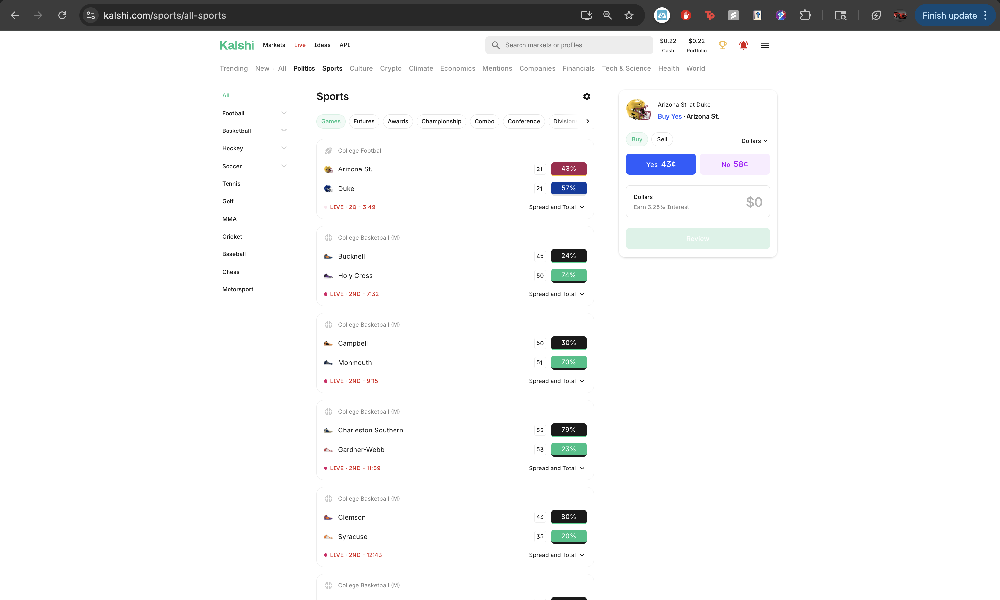

**User goal:**  
- Browse sports markets in familiar sportsbook format
- View live sports games with scores and odds
- Trade on sports outcomes using established sports betting conventions
- Navigate sports by type (Football, Basketball, etc.) and market type (Games, Futures, Awards, etc.)

**Kalshi flow (steps):**
1. User clicks "Sports" in primary category navigation
2. Page routes to Sports category view
3. **URL routing:** `kalshi.com/sports/all-sports` (different URL pattern from other categories)
4. Page displays sportsbook-style interface:
   - **Left sidebar:** Sports categories (Football, Basketball, Hockey, Soccer, Tennis, Golf, MMA, Cricket, Baseball, Chess, Motorsport)
   - **Main content:** Live sports markets with scores, percentages, and live status
   - **Right panel:** Trading interface for selected market
5. **Trading panel behavior:**
   - **Always defaults to first market on page** (e.g., "Arizona St. at Duke")
   - Shows trading interface for that market
   - User can click other markets to change trading panel
6. **Sub-navigation:** "Games" (highlighted), "Futures", "Awards", "Championship", "Combo", "Conference", "Division"
7. **Combo trading restrictions:**
   - **Combo bets are ONLY available for professional sports**
   - **Professional level only:** NBA (professional basketball) and NFL (professional football)
   - **Cross-sport combinations:** Can combine multiple sports together (e.g., basketball and football)
   - **Not available for:** Other sports categories, non-sports markets, amateur/college sports
   - **Regulatory/data basis:** Combos exist because of how regulations and data work for professional sports
   - **One-off trading is default:** Everything else is one-off trading (single market trades)
8. User can navigate by sport type (left sidebar) or market type (sub-navigation)
9. Markets update in real-time with live scores and odds

**Observed behavior:**
- **URL Structure:**
  - `kalshi.com/sports/all-sports` (different from `/category/sports` pattern)
  - Uses `/sports/` path instead of `/category/sports/`
  - Indicates Sports is treated as separate section with different structure
- **Layout:**
  - **Left Sidebar:**
    - Heading: "All"
    - List of sports with dropdown arrows:
      - Football
      - Basketball
      - Hockey
      - Soccer
      - Tennis
      - Golf
      - MMA
      - Cricket
      - Baseball
      - Chess
      - Motorsport
    - Each sport is expandable/collapsible
  - **Main Content Area:**
    - "Sports" heading
    - **Sub-navigation:** "Games" (highlighted), "Futures", "Awards", "Championship", "Combo", "Conference", "Division"
    - Right arrow (">") indicating more options
    - Grid/list of live sports markets
  - **Right Trading Panel:**
    - **Default behavior:** Always shows first market on page
    - Market title (e.g., "Arizona St. at Duke")
    - "Buy Yes [Team]" heading with team icon
    - Buy/Sell buttons
    - "Dollars" dropdown
    - Price buttons: "Yes 43¢" (blue, highlighted), "No 58¢" (purple)
    - Dollar input field: "$0"
    - "Earn 3.25% Interest" text
    - "Review" button (light green, disabled)
- **Market Display:**
  - **College Football example:**
    - "College Football" label with football icon
    - Teams: "Arizona St." (sun devil icon) vs "Duke" (blue devil icon)
    - Live scores: "21 - 21"
    - Percentages: Arizona St. 43% (red bar), Duke 57% (blue bar)
    - Live status: "LIVE - 2Q - 3:49" (2nd Quarter, 3:49 remaining)
    - "Spread and Total" dropdown
  - **College Basketball examples:**
    - "College Basketball (M)" label with basketball icon
    - Teams with scores and percentages
    - Live status: "2ND - 7:32", "2ND - 9:15", etc.
    - "Spread and Total" dropdown
- **Market Types (Sub-navigation):**
  - **Games:** Individual game outcomes (default/highlighted)
  - **Futures:** Season-long or future outcomes
  - **Awards:** Award winners
  - **Championship:** Championship outcomes
  - **Combo:** Combination bets
    - **Restrictions:** ONLY available for professional sports (NBA and NFL)
    - **Cross-sport combinations:** Can combine multiple sports together (e.g., basketball and football)
    - **Professional level only:** NBA (professional basketball) and NFL (professional football)
    - **Not available for:** Other sports categories, non-sports markets, amateur/college sports
    - **Regulatory/data basis:** Combos exist because of how regulations and data work for professional sports
    - **One-off trading is default:** Everything else is one-off trading (single market trades)
  - **Conference:** Conference-specific outcomes
  - **Division:** Division-specific outcomes
- **Key Differences from Other Categories:**
  - **Different URL pattern:** `/sports/` instead of `/category/sports/`
  - **Sportsbook-style layout:** Left sidebar + main content + right trading panel
  - **Live scores and game status:** Shows current scores and game progress
  - **Spread and Total options:** Traditional sportsbook features
  - **Team-based display:** Shows team names, icons, and matchups
  - **Real-time updates:** Live scores and odds update during games
  - **Trading panel defaults:** Always shows first market (different from other categories)

**What I like:**
- **Familiar sportsbook interface:** Users familiar with sports betting will recognize the layout
- **Live game data:** Real-time scores and game status
- **Clear team display:** Team names, icons, and matchups are clear
- **Organized by sport:** Left sidebar makes it easy to filter by sport type
- **Market type navigation:** Games, Futures, Awards, etc. help organize markets
- **Trading panel integration:** Trading interface always visible on right
- **Default market selection:** Trading panel defaults to first market (no empty state)

**What I don't like / confusion:**
- **Inconsistent URL patterns:** Sports uses `/sports/` while other categories use `/category/[category]/`
- **Trading panel always shows first market:** May not be the market user wants to trade
- **No clear way to clear trading panel:** Can't easily deselect market
- **Left sidebar may be hidden:** If sidebar is collapsed, sports navigation may be less obvious
- **No search within Sports:** Must use top search bar
- **Spread and Total dropdown:** Not clear what options are available without clicking

**Edge cases / bugs:**
- What if no markets exist? Does trading panel show empty state?
- What if first market closes while page is open? Does trading panel update?
- What if user wants to trade a market not visible on page? How do they find it?
- What if sidebar is collapsed? Can users still navigate sports?

**Builder hypothesis (why they did it):**
- **Established conventions:** Sports betting has well-established rules and UI patterns
- **Regulatory compliance:** Sports betting regulations are different from prediction markets
- **User familiarity:** Sports bettors expect sportsbook-style interface
- **Different market structure:** Sports markets (spreads, totals, moneylines) are different from prediction markets
- **Live data integration:** Sports requires real-time score and game status updates
- **Separate section:** Sports is treated as separate section due to different rules/regulations
- **Trading panel default:** Always showing first market ensures trading interface is never empty
- **Team-based display:** Sports markets are inherently team/matchup-based
- **Combo restrictions (NBA/NFL only):**
  - **Regulatory basis:** Professional sports (NBA/NFL) have established regulatory frameworks that support combo bets
  - **Data availability:** Professional sports have reliable, standardized data sources that enable cross-sport combinations
  - **Market structure:** Professional sports markets are structured to support multi-leg bets
  - **User demand:** Sports bettors expect combo/parlay functionality for professional sports
  - **Risk management:** Limiting combos to professional sports reduces complexity and regulatory risk

**Opinion Kings implications:**
- **Copy:**
  - Sportsbook-style interface for sports markets
  - Left sidebar for sport type navigation
  - Sub-navigation for market types (Games, Futures, Awards, etc.)
  - Live scores and game status display
  - Team-based market display with icons
  - Right trading panel that defaults to first market
  - "Spread and Total" options for sports markets
- **Avoid:**
  - Inconsistent URL patterns (use consistent pattern across all categories)
  - Trading panel always showing first market (may not be user's intent)
  - No way to clear/deselect trading panel
- **Beat:**
  - **Consistent URL patterns:** Use same URL pattern (`/category/sports/` or `/sports/`) across all categories
  - **Trading panel control:** Allow users to clear/deselect trading panel
  - **Market selection:** Let users choose which market trading panel shows (not just first)
  - **Combo functionality:**
    - **Consider broader availability:** Evaluate if combos should be available for more categories or sports
    - **Clear combo restrictions:** Make it clear which markets support combos and why
    - **Combo builder:** Add dedicated combo builder interface for NBA/NFL
    - **Combo preview:** Show odds and payout before creating combo
    - **Combo management:** Allow users to save and manage combo bets
  - **Search within Sports:** Add search bar specific to Sports section
  - **Sidebar persistence:** Remember sidebar state (expanded/collapsed)
  - **Market preview:** Show market preview on hover before selecting
  - **Quick filters:** Add quick filter buttons (Live games, Upcoming, Today's games)
  - **Favorite teams:** Allow users to favorite teams and filter by favorites
  - **Game notifications:** Notify users when their watched games start/update
  - **Spread/Total preview:** Show spread and total options without clicking dropdown
  - **Market comparison:** Allow comparing multiple markets side-by-side
- **Implementation notes:**
  - **URL routing:**
    - Base URL: `kalshi.com/sports/all-sports`
    - Consider using consistent pattern: `/category/sports/` or keep `/sports/` for all sports
    - Support sub-routes: `/sports/football/`, `/sports/basketball/`, etc.
    - Support market type routes: `/sports/all-sports/games`, `/sports/all-sports/futures`, etc.
  - **Layout structure:**
    - Three-column layout: Left sidebar, Main content, Right trading panel
    - Left sidebar: Collapsible/expandable sports list
    - Main content: Market list/grid
    - Right panel: Trading interface (fixed or sticky)
  - **Trading panel:**
    - **Default behavior:** Always show first market on page
    - Store selected market in state
    - Update trading panel when market is clicked
    - Allow clearing/deselecting market (if implemented)
    - Show empty state if no markets (if implemented)
  - **Sports navigation:**
    - Left sidebar with expandable sports list
    - Filter markets by selected sport
    - Store expanded/collapsed state
    - Support keyboard navigation
  - **Market type navigation:**
    - Sub-navigation: Games, Futures, Awards, Championship, Combo, Conference, Division
    - Filter markets by type
    - Highlight selected type
    - Scrollable if many types
  - **Live data integration:**
    - Real-time score updates via WebSocket or polling
    - Game status updates (quarter, time remaining)
    - Odds/percentage updates
    - Market status updates (open/closed)
  - **Market display:**
    - Team names with icons
    - Live scores
    - Percentages with visual bars
    - Live status indicators
    - "Spread and Total" dropdown
    - Click handler to update trading panel
  - **Spread and Total:**
    - Dropdown with spread and total options
    - Different from standard Yes/No markets
    - Traditional sportsbook features
    - Store spread/total selections
  - **State management:**
    - Store selected sport (left sidebar)
    - Store selected market type (sub-navigation)
    - Store selected market (for trading panel)
    - Store sidebar expanded/collapsed state
    - Update markets when filters change
  - **Performance:**
    - Optimize for many live markets
    - Real-time updates for scores/odds
    - Lazy load markets as user scrolls
    - Cache market data
- **Metrics:**
  - Sports category click-through rate
  - Sport type navigation usage (which sports are most popular?)
  - Market type usage (Games vs Futures vs Awards, etc.)
  - Trading panel interaction rate (how often users trade from panel?)
  - First market default impact (do users trade the default market?)
  - Market selection rate (how often users click markets to change trading panel?)
  - Live game engagement (do users trade more during live games?)
  - Spread and Total usage rate
  - Sidebar navigation usage (do users use left sidebar?)
  - Time spent in Sports section
  - Conversion rate from Sports to trades

### Category Page Types and Patterns Analysis

**Feature category:** Discovery / Category Architecture / Navigation Patterns

**Screenshots:**  
- 071: `071-discovery-culture-category.png` - Culture category with sub-categories
- 072: `072-discovery-crypto-category.png` - Crypto category with sub-categories
- 073: `073-discovery-climate-category.png` - Climate category with sub-categories
- 074: `074-discovery-economics-category.png` - Economics category with sub-categories
- 075: `075-discovery-mentions-category.png` - Mentions category with filter dropdowns
- 076: `076-discovery-companies-category.png` - Companies category with sub-categories
- 077: `077-discovery-financials-category.png` - Financials category with sub-categories
- 078: `078-discovery-tech-science-category.png` - Tech & Science category with sub-categories
- 079: `079-discovery-health-category.png` - Health category with sub-categories
- 080: `080-discovery-world-category.png` - World category with sub-categories

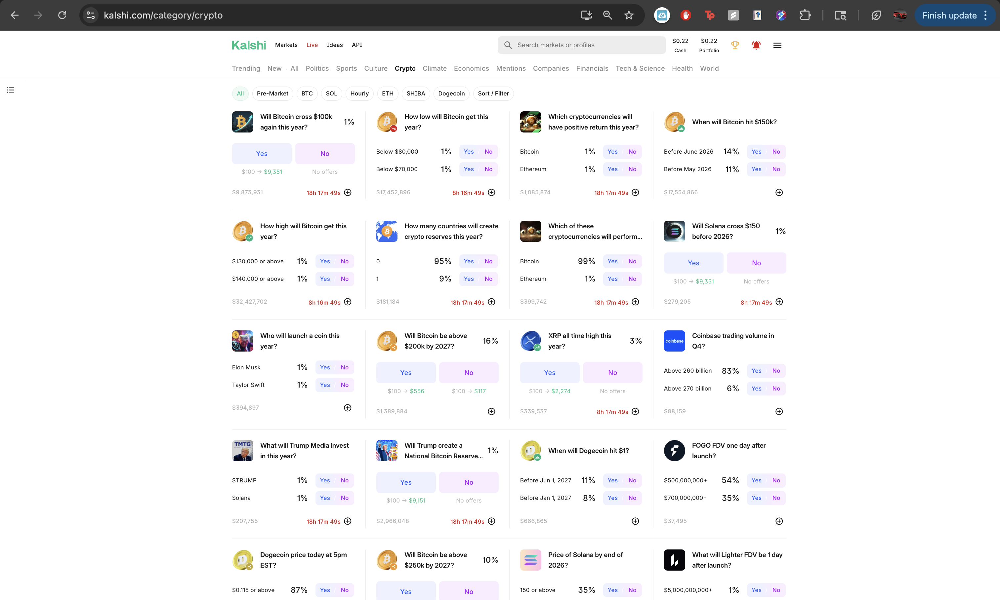

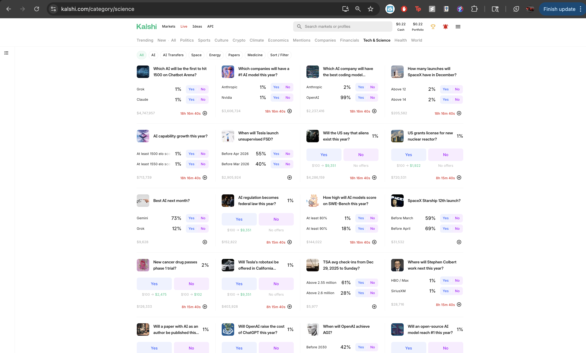

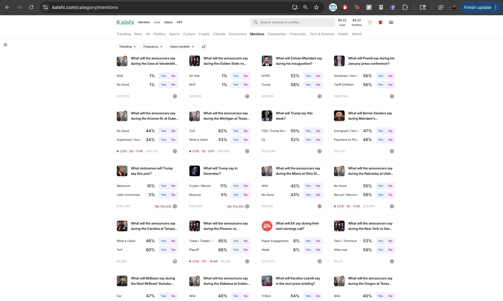

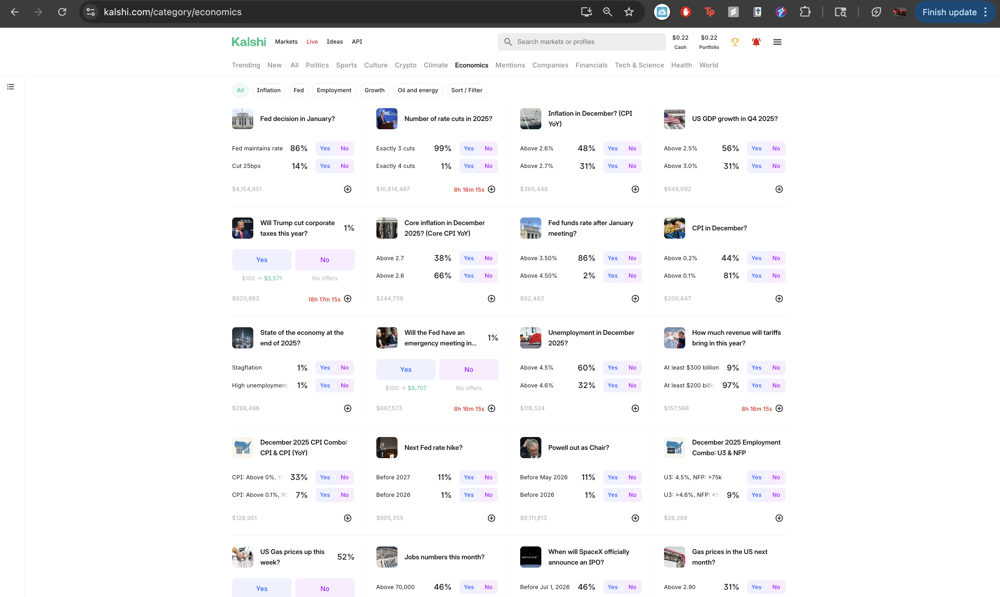

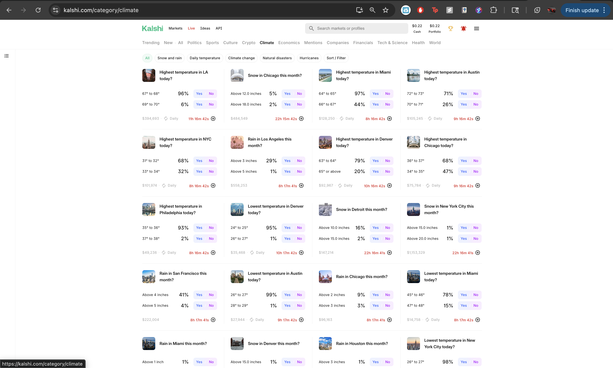

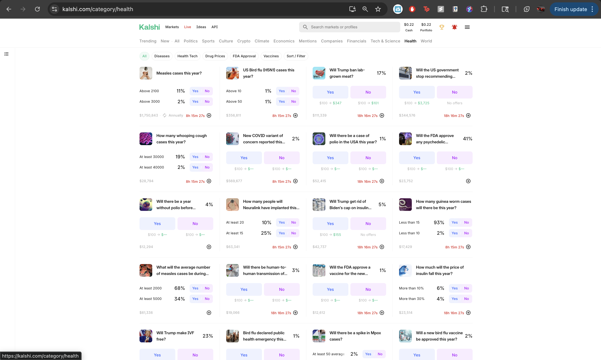

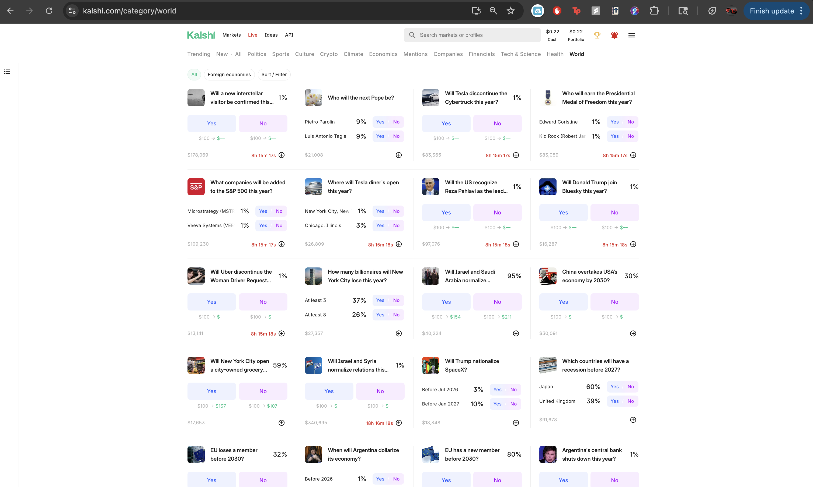

**User goal:**  
- Understand different category page types and navigation patterns
- Navigate between categories with different structures
- Filter markets within categories using appropriate controls

**Category Page Type Classification:**

Kalshi uses **three distinct category page types** based on content structure and user needs:

---

## **Type 1: Sub-Category Navigation (Path-Based URLs)**

**Pattern:** Categories with many distinct sub-topics use horizontal sub-category navigation with path-based URLs.

**Categories using this pattern:**
- **Politics:** `/category/politics/[subcategory]` (All, Trump Agenda, Culture war, Bills, SCOTUS & courts, Foreign Elections, US Elections, Education, Debt ceiling & shutdowns, Immigration)
- **Culture:** `/category/culture/[subcategory]` (All, Awards, Music, Movies, Music charts, Oscars, Television, Video games, Rotten Tomatoes, StockX, Live Music)
- **Crypto:** `/category/crypto/[subcategory]` (All, Pre-Market, BTC, SOL, Hourly, ETH, SHIBA, Dogecoin)
- **Climate:** `/category/climate/[subcategory]` (All, Snow and rain, Daily temperature, Climate change, Natural disasters, Hurricanes)
- **Economics:** `/category/economics/[subcategory]` (All, Inflation, Fed, Employment, Growth, Oil and energy)
- **Companies:** `/category/companies/[subcategory]` (All, CEOs, KPIs, Elon Musk, Earnings Mention, Product launches, Layoffs)
- **Financials:** `/category/financials/[subcategory]` (All, S&P, Nasdaq, Daily, EUR/USD, Treasuries, USD/JPY, WTI)
- **Tech & Science:** `/category/science/[subcategory]` (All, AI, AI Transfers, Space, Energy, Papers, Medicine)
- **Health:** `/category/health/[subcategory]` (All, Diseases, Health Tech, Drug Prices, FDA Approval, Vaccines)
- **World:** `/category/world/[subcategory]` (All, Foreign economies)

**Common characteristics:**
- **URL pattern:** `/category/[category]/[subcategory-slug]`
- **Sub-category navigation:** Horizontal scrollable navigation bar below primary navigation
- **"All" default:** "All" sub-category is always first and default
- **Scrollable navigation:** Right arrow (">") when many sub-categories exist
- **"Sort / Filter" option:** Always at end of sub-category navigation
- **Path-based routing:** Uses URL paths, not query parameters
- **Visual highlighting:** Selected sub-category is highlighted
- **Grid layout:** Markets displayed in grid (typically 4 columns)
- **Infinite scroll:** Markets load automatically as user scrolls

**Sub-category examples by category:**
- **Culture:** Awards, Music, Movies, Music charts, Oscars, Television, Video games, Rotten Tomatoes, StockX, Live Music
- **Crypto:** Pre-Market, BTC, SOL, Hourly, ETH, SHIBA, Dogecoin (cryptocurrency-specific)
- **Climate:** Snow and rain, Daily temperature, Climate change, Natural disasters, Hurricanes (weather/climate-specific)
- **Economics:** Inflation, Fed, Employment, Growth, Oil and energy (economic indicators)
- **Companies:** CEOs, KPIs, Elon Musk, Earnings Mention, Product launches, Layoffs (company-specific topics)
- **Financials:** S&P, Nasdaq, Daily, EUR/USD, Treasuries, USD/JPY, WTI (financial instruments)
- **Tech & Science:** AI, AI Transfers, Space, Energy, Papers, Medicine (technology/science topics)
- **Health:** Diseases, Health Tech, Drug Prices, FDA Approval, Vaccines (health-specific topics)
- **World:** Foreign economies (minimal sub-categories)

**Variations:**
- **Number of sub-categories:** Varies significantly (World has 2, Culture has 11+)
- **Sub-category types:** Some are topic-based (Awards, Music), some are instrument-based (BTC, SOL), some are data-type-based (Daily, Hourly)
- **Scrollability:** Categories with many sub-categories (Culture, Politics) are scrollable, others may not need scrolling

---

## **Type 2: Filter Dropdowns (Query Parameters)**

**Pattern:** Categories use filter dropdowns similar to "All" category, with query parameters or no sub-categories.

**Categories using this pattern:**
- **Mentions:** Uses filter dropdowns (Trending, Frequency, Open markets) - similar to "All" category
- **All:** Uses comprehensive filter dropdowns (Trending sort, Frequency, Open markets, Filter button toggles)

**Common characteristics:**
- **Filter dropdowns:** Multiple dropdown filters (Trending, Frequency, Open markets)
- **No sub-categories:** No horizontal sub-category navigation
- **Query parameters or path:** May use query parameters or path-based URLs
- **Grid layout:** Markets displayed in grid
- **Infinite scroll:** Markets load automatically
- **"Sort / Filter" option:** Available for additional filtering

**Mentions category specifics:**
- Filter dropdowns: "Trending", "Frequency", "Open markets"
- Markets are mentions-based (what will be said during events, earnings calls, etc.)
- No sub-category navigation needed (all mentions are similar type)

---

## **Type 3: Sportsbook-Style Interface**

**Pattern:** Sports category uses completely different interface optimized for sports betting conventions.

**Categories using this pattern:**
- **Sports:** `/sports/all-sports` (different URL pattern entirely)

**Common characteristics:**
- **Different URL pattern:** `/sports/` instead of `/category/sports/`
- **Left sidebar:** Sports type navigation (Football, Basketball, Hockey, etc.)
- **Sub-navigation:** Market types (Games, Futures, Awards, Championship, Combo, Conference, Division)
- **Right trading panel:** Always shows first market on page
- **Live scores:** Real-time game scores and status
- **Team-based display:** Shows team names, icons, matchups
- **Spread and Total:** Traditional sportsbook features
- **Sportsbook conventions:** Follows established sports betting UI patterns

---

## **Common Ground Across All Category Types:**

1. **Top navigation:** 
   - "Markets" link routes to "All" category page (`kalshi.com/category/all`)
   - "Live" link routes to Live events calendar page (`kalshi.com/calendar`)
2. **Primary navigation:** All categories accessible from primary category navigation bar
3. **Grid layout:** Markets displayed in grid format (typically 4 columns)
4. **Infinite scroll:** All categories support infinite scroll for loading more markets
5. **Market cards:** Consistent market card structure (icon, question, options, Yes/No buttons, volume, time)
6. **Search bar:** Top search bar available on all category pages
7. **Account info:** Cash and Portfolio displayed in header
8. **"Sort / Filter" option:** Available on most/all category pages
9. **URL routing:** All categories support deep linking (can bookmark/share URLs)

---

## **Key Differences Between Category Types:**

| Feature | Type 1: Sub-Categories | Type 2: Filter Dropdowns | Type 3: Sportsbook |
|---------|------------------------|---------------------------|-------------------|
| **URL Pattern** | `/category/[category]/[subcategory]` | `/category/[category]` or query params | `/sports/[subcategory]` |
| **Navigation** | Horizontal sub-category bar | Filter dropdowns | Left sidebar + sub-navigation |
| **Sub-categories** | Yes (scrollable) | No | Yes (market types) |
| **Filters** | "Sort / Filter" option | Multiple dropdowns | Market type navigation |
| **Layout** | Grid only | Grid only | Left sidebar + Grid + Right panel |
| **Trading Panel** | No (standard market page) | No (standard market page) | Yes (always shows first market) |
| **Live Data** | Standard | Standard | Live scores, game status |
| **Special Features** | None | None | Spread/Total, team display |

---

## **Category-Specific Observations:**

### **Culture:**
- **Sub-categories:** 11+ sub-categories (most diverse)
- **Focus:** Awards (Oscars, Grammys), entertainment (Music, Movies, Television, Video games), platforms (Rotten Tomatoes, StockX, Netflix)
- **Market types:** Award nominations/winners, chart positions, review scores

### **Crypto:**
- **Sub-categories:** Cryptocurrency-specific (BTC, SOL, ETH, SHIBA, Dogecoin)
- **Special:** "Pre-Market" and "Hourly" sub-categories (time-based)
- **Focus:** Cryptocurrency prices, launches, regulations

### **Climate:**
- **Sub-categories:** Weather/climate-specific (Snow and rain, Daily temperature, Climate change, Natural disasters, Hurricanes)
- **Focus:** Weather forecasts, climate events, natural disasters

### **Economics:**
- **Sub-categories:** Economic indicators (Inflation, Fed, Employment, Growth, Oil and energy)
- **Focus:** Economic data, Fed decisions, employment, inflation

### **Companies:**
- **Sub-categories:** Company-specific topics (CEOs, KPIs, Elon Musk, Earnings Mention, Product launches, Layoffs)
- **Focus:** Company leadership, earnings, product launches, layoffs

### **Financials:**
- **Sub-categories:** Financial instruments (S&P, Nasdaq, Daily, EUR/USD, Treasuries, USD/JPY, WTI)
- **Focus:** Stock indices, currencies, commodities, daily/weekly markets

### **Tech & Science:**
- **Sub-categories:** Technology/science topics (AI, AI Transfers, Space, Energy, Papers, Medicine)
- **Focus:** AI developments, space launches, scientific papers, medical advances

### **Health:**
- **Sub-categories:** Health-specific topics (Diseases, Health Tech, Drug Prices, FDA Approval, Vaccines)
- **Focus:** Disease tracking, drug approvals, health technology, vaccines

### **World:**
- **Sub-categories:** Minimal (All, Foreign economies)
- **Focus:** International events, global economics, world leaders

### **Mentions:**
- **No sub-categories:** Uses filter dropdowns instead
- **Focus:** What will be said during events, earnings calls, press conferences
- **Special:** All markets are "mentions" type (what will X say?)

---

## **URL Routing Patterns Summary:**

1. **Sub-category pattern (Type 1):** `/category/[category]/[subcategory-slug]`
   - Examples: `/category/politics/trump-agenda`, `/category/culture/awards`, `/category/crypto/btc`

2. **Filter pattern (Type 2):** `/category/[category]` with query parameters or filters
   - Examples: `/category/mentions`, `/category/all` with `?live=new&liveEventType=unique`

3. **Sports pattern (Type 3):** `/sports/[subcategory]`
   - Examples: `/sports/all-sports`, `/sports/football/games`

---

## **What I like:**
- **Consistent grid layout:** All categories use same market card structure
- **Sub-category organization:** Helps users find specific topics within broad categories
- **Flexible patterns:** Different patterns for different content types (makes sense)
- **Deep linking:** All categories support bookmarkable URLs
- **Infinite scroll:** Consistent loading behavior across all categories

**What I don't like / confusion:**
- **Inconsistent URL patterns:** Three different URL patterns (path-based sub-categories, query params, `/sports/`)
- **Inconsistent navigation:** Some use sub-categories, some use filters, Sports uses sidebar
- **No clear pattern:** Hard to predict which category uses which pattern
- **Sub-category count varies:** Some have 2 sub-categories (World), some have 11+ (Culture)
- **Scrollable navigation unclear:** May not be obvious that sub-categories are scrollable
- **"Sort / Filter" placement:** Always at end, may be missed

**Edge cases / bugs:**
- What if a category needs both sub-categories AND filters? (e.g., Politics with filters)
- What if sub-category is renamed? Do old URLs break?
- What if user bookmarks sub-category URL and sub-category is removed?
- What if no markets exist in sub-category? Empty state?

**Builder hypothesis (why they did it):**
- **Content-driven design:** Different patterns based on content structure
- **User mental models:** Sports users expect sportsbook interface, others expect category navigation
- **Scalability:** Sub-categories allow adding topics without cluttering main navigation
- **SEO:** Path-based URLs are better for SEO than query parameters
- **Regulatory compliance:** Sports may need different structure due to regulations
- **Content volume:** Categories with many distinct topics get sub-categories
- **Content similarity:** Categories with similar content (Mentions) use filters instead

**Opinion Kings implications:**
- **Copy:**
  - Sub-category navigation for categories with many distinct topics
  - Filter dropdowns for categories with similar content types
  - Sportsbook-style interface for sports (if applicable)
  - Path-based URLs for sub-categories
  - Grid layout with infinite scroll
  - "Sort / Filter" option on all categories
- **Avoid:**
  - Inconsistent URL patterns (use one pattern consistently)
  - Inconsistent navigation (use same navigation pattern across similar categories)
  - Unclear scrollable navigation
- **Beat:**
  - **Consistent URL patterns:** Use same URL pattern (`/category/[category]/[subcategory]`) for all categories with sub-categories
  - **Consistent navigation:** Use same navigation pattern for similar category types
  - **Sub-category counts:** Show market count for each sub-category
  - **Bidirectional scrolling:** Add left arrow to scroll back through sub-categories
  - **Filter + sub-categories:** Allow categories to have both sub-categories AND filters
  - **Category type indicators:** Show visual indicator of category type
  - **Breadcrumb navigation:** Show breadcrumb (Category > Sub-category)
  - **Sub-category descriptions:** Add brief descriptions for each sub-category
  - **Category templates:** Create reusable templates for each category type
  - **Smart defaults:** Auto-detect which pattern to use based on content structure
- **Implementation notes:**
  - **Category type detection:**
    - Determine category type based on content structure
    - Categories with many distinct topics → Sub-categories
    - Categories with similar content → Filters
    - Sports → Sportsbook interface
  - **URL routing:**
    - **Type 1 (Sub-categories):** `/category/[category]/[subcategory-slug]`
    - **Type 2 (Filters):** `/category/[category]` with query params or filters
    - **Type 3 (Sports):** `/sports/[subcategory]` or `/category/sports/[subcategory]` (choose one)
    - Use consistent pattern across all categories
  - **Navigation components:**
    - **Sub-category navigation:** Reusable component for Type 1 categories
    - **Filter dropdowns:** Reusable component for Type 2 categories
    - **Sports sidebar:** Special component for Type 3
  - **Sub-category management:**
    - Store sub-categories in database or config
    - Support adding/removing sub-categories
    - Handle sub-category renames (redirect old URLs)
    - Show sub-category counts
  - **State management:**
    - Store selected sub-category/filter in state
    - Update URL when selection changes
    - Parse URL on page load
    - Support browser back/forward
  - **Performance:**
    - Lazy load markets for sub-category
    - Cache sub-category markets
    - Optimize filtering for large lists
- **Metrics:**
  - Category type usage (which types are most popular?)
  - Sub-category click-through rates (which sub-categories are most used?)
  - Filter usage rates (which filters are most used?)
  - URL pattern effectiveness (do path-based URLs perform better?)
  - Navigation pattern effectiveness (which navigation is most intuitive?)
  - Category discovery rate (do sub-categories help users find markets?)
  - Conversion rate by category type (which type leads to more trades?)
  - Sub-category bounce rate (do users leave quickly from certain sub-categories?)
  - Filter combination patterns (common filter combinations)
  - Category switching frequency (how often users switch between categories?)

### Live Events Calendar Page

**Feature category:** Discovery / Live Events / Calendar

**Screenshots:**  
- 081: `081-discovery-live-calendar-page.png` - Live events calendar page showing live events with left sidebar, main content, and right trading panel

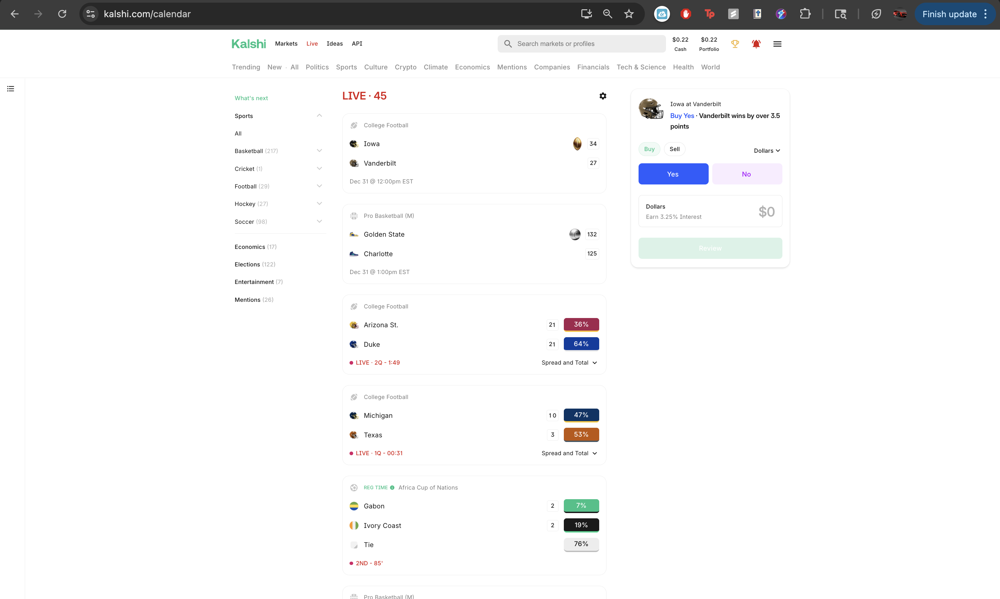

**User goal:**  
- View live events happening now
- Browse upcoming events by category
- Trade on live markets while events are in progress
- See real-time scores and game status
- Filter live events by category (Sports, Economics, Elections, etc.)

**Kalshi flow (steps):**
1. User clicks "Live" in top navigation bar
2. Page routes to Live events calendar page
3. **URL routing:** `kalshi.com/calendar`
4. Page displays:
   - **Left sidebar:** "What's next" with event categories and counts
   - **Main content:** Live events list with "LIVE • 45" heading (45 live events)
   - **Right sidebar:** Trading interface for selected market
5. **Left Sidebar Navigation:**
   - User can filter by category: "All", "Sports" (highlighted), "Basketball (217)", "Cricket (1)", "Football (29)", "Hockey (27)", "Soccer (98)", "Economics (17)", "Elections (122)", "Entertainment (7)", "Mentions (26)"
   - Numbers in parentheses show event count per category
   - Selected category is highlighted (e.g., "Sports" in green)
6. **Main Content:**
   - Shows "LIVE • 45" heading with gear icon (settings)
   - Lists live events with:
     - Event name and teams/participants
     - Current scores
     - Live status (e.g., "LIVE • 2Q - 1:49", "LIVE • 1Q - 00:31", "2ND - 85'")
     - Probabilities/percentages
     - Date/time (e.g., "Dec 31 @ 12:00pm EST")
     - "Spread and Total" dropdown for sports events
7. **Right Trading Panel:**
   - Always shows trading interface for a market (e.g., "Iowa at Vanderbilt")
   - Shows specific proposition (e.g., "Buy Yes · Vanderbilt wins by over 3.5 points")
   - Buy/Sell buttons
   - Yes/No price buttons
   - Dollar input field
   - "Review" button
8. User can click on events to update trading panel
9. Events update in real-time with live scores and status

**Observed behavior:**
- **URL Structure:**
  - `kalshi.com/calendar` (different from category pages)
  - Uses `/calendar` path, not `/category/live` or similar
- **Top Navigation:**
  - "Live" is highlighted in top navigation (when on this page)
  - Other navigation links still accessible (Markets, Ideas, API)
- **Category Navigation:**
  - Secondary navigation bar shows: "Trending", "New", "All", "Politics", "Sports" (highlighted), "Culture", "Crypto", "Climate", "Economics", "Mentions", "Companies", "Financials", "Tech & Science", "Health", "World"
  - "Sports" is highlighted (matches left sidebar selection)
- **Left Sidebar ("What's next"):**
  - Heading: "What's next"
  - List of event categories with counts:
    - "All"
    - "Sports" (highlighted in green, active)
    - "Basketball (217)" - 217 events
    - "Cricket (1)" - 1 event
    - "Football (29)" - 29 events
    - "Hockey (27)" - 27 events
    - "Soccer (98)" - 98 events
    - "Economics (17)" - 17 events
    - "Elections (122)" - 122 events
    - "Entertainment (7)" - 7 events
    - "Mentions (26)" - 26 events
  - Selected category highlighted
  - Counts show number of events in each category
- **Main Content Area:**
  - **Heading:** "LIVE • 45" (45 live events) with gear icon (settings)
  - **Event cards** showing:
    - Event name (e.g., "College Football (Iowa vs. Vanderbilt)")
    - Team names and current scores (e.g., "Iowa 34", "Vanderbilt 27")
    - Date/time (e.g., "Dec 31 @ 12:00pm EST")
    - Live status for sports:
      - "LIVE • 2Q - 1:49" (2nd Quarter, 1:49 remaining)
      - "LIVE • 1Q - 00:31" (1st Quarter, 31 seconds remaining)
      - "2ND - 85'" (2nd half, 85 minutes)
    - Probabilities/percentages (e.g., "Arizona St. 36%", "Duke 64%")
    - "Spread and Total" dropdown for sports events
  - **Event examples:**
    - College Football games (Iowa vs. Vanderbilt, Arizona St. vs. Duke, Michigan vs. Texas)
    - Pro Basketball games (Golden State vs. Charlotte)
    - International soccer (Africa Cup of Nations: Gabon vs. Ivory Coast)
- **Right Trading Panel:**
  - Shows trading interface for selected market
  - Example: "Iowa at Vanderbilt"
  - Proposition: "Buy Yes · Vanderbilt wins by over 3.5 points"
  - Buy/Sell buttons
  - Yes/No price buttons (Yes highlighted in blue, No in purple)
  - Dollar input: "$0"
  - "Earn 3.25% Interest" text
  - "Review" button (light green, disabled)
  - Similar to Sports category trading panel (always shows a market)

**What I like:**
- **Dedicated live page:** Centralized place to see all live events
- **Category filtering:** Left sidebar makes it easy to filter by event type
- **Event counts:** Shows how many events in each category (helpful for discovery)
- **Real-time updates:** Live scores and game status keep information current
- **Trading panel:** Always-visible trading interface for quick trades
- **Clear organization:** Events organized by category and time
- **Live indicator:** "LIVE • 45" clearly shows how many live events

**What I don't like / confusion:**
- **URL naming:** `/calendar` doesn't clearly indicate it's for "Live" events
- **Trading panel default:** Always shows first market (may not be what user wants)
- **No date navigation:** Can't navigate to different dates (despite "calendar" name)
- **No search within Live:** Must use top search bar
- **Category navigation duplication:** Both left sidebar and top category navigation (may be confusing)
- **Settings icon unclear:** Gear icon next to "LIVE • 45" - what does it do?
- **No time filter:** Can't filter by time (now, today, this week)

**Edge cases / bugs:**
- What if no live events exist? Does it show empty state?
- What if event ends while viewing? Does it update or remove from list?
- What if user wants to see upcoming (not live) events?
- What if trading panel market closes while viewing?

**Builder hypothesis (why they did it):**
- **Live events focus:** Dedicated page for events happening now (high engagement)
- **Real-time trading:** Users want to trade while events are live
- **Category organization:** Left sidebar helps users find specific types of live events
- **Event counts:** Shows platform activity and helps users discover events
- **Trading panel:** Always-visible trading interface enables quick trades during live events
- **URL naming:** `/calendar` may have been chosen for future date navigation features
- **Separate from categories:** Live events are different from browsing all markets

**Opinion Kings implications:**
- **Copy:**
  - Dedicated Live events page with `/calendar` URL
  - Left sidebar with category filtering and event counts
  - Main content showing live events with scores and status
  - Right trading panel that always shows a market
  - Real-time score and status updates
  - "LIVE • X" heading showing count of live events
- **Avoid:**
  - URL naming that doesn't match function (`/calendar` for live events)
  - Trading panel always showing first market
  - No date navigation despite "calendar" name
- **Beat:**
  - **Clearer URL:** Use `/live` or `/live-events` instead of `/calendar`
  - **Date navigation:** Add calendar view to navigate to different dates
  - **Time filters:** Add filters for "Now", "Today", "This week", "Upcoming"
  - **Trading panel control:** Allow users to clear/deselect trading panel
  - **Event preview:** Show event preview on hover before selecting
  - **Search within Live:** Add search bar specific to Live events
  - **Event notifications:** Notify users when events they're watching go live
  - **Favorite events:** Allow users to favorite events and see when they go live
  - **Live event count badge:** Show count of live events in "Live" navigation link
  - **Settings menu:** Make gear icon functionality clear (what settings are available?)
  - **Upcoming events:** Show upcoming events (not just live) with countdown timers
  - **Event categories expansion:** Show more categories or allow expanding/collapsing
- **Implementation notes:**
  - **URL routing:**
    - Route `/live` or `/calendar` to Live events page
    - Consider using `/live` for clarity (more intuitive than `/calendar`)
    - Support category filtering: `/live?category=sports` or `/live/sports`
  - **Left sidebar:**
    - "What's next" heading
    - Category list with counts
    - Store category counts (update in real-time)
    - Highlight selected category
    - Filter events by selected category
  - **Event data:**
    - Fetch live events (events currently in progress)
    - Include event metadata: name, teams, scores, status, time, category
    - Real-time updates for scores and status
    - Calculate event counts per category
  - **Main content:**
    - "LIVE • X" heading with live event count
    - Gear icon for settings (implement settings menu)
    - Event cards with live data
    - Real-time score updates
    - Live status indicators
    - Date/time display
    - "Spread and Total" dropdown for sports
  - **Trading panel:**
    - Always show first market (or selected market)
    - Update when user clicks different event
    - Show market proposition
    - Buy/Sell interface
    - Yes/No price buttons
    - Dollar input
    - Review button
  - **Real-time updates:**
    - WebSocket or polling for live scores
    - Update event status (quarter, time remaining)
    - Update event counts
    - Update trading panel if market closes
  - **State management:**
    - Store selected category (left sidebar)
    - Store selected event (for trading panel)
    - Store live event count
    - Update when events go live/end
  - **Performance:**
    - Optimize for many live events
    - Real-time updates for scores/status
    - Efficient filtering by category
    - Cache event data
- **Metrics:**
  - Live page view rate
  - Category filter usage (which categories are most viewed?)
  - Live event click-through rate
  - Trading panel interaction rate (how often users trade from Live page?)
  - Time spent on Live page
  - Live event count impact (does showing count increase engagement?)
  - Real-time update effectiveness (do users notice score updates?)
  - Settings menu usage (if implemented)
  - Event category discovery rate (do users discover new event types?)
  - Conversion rate from Live page to trades

---

### Landing Page (Logged Out State)

**Feature category:** Discovery

**Screenshots:**  
- 010: `010-discovery-landing-page.png` - Main landing page showing live market, navigation, and promotional sections

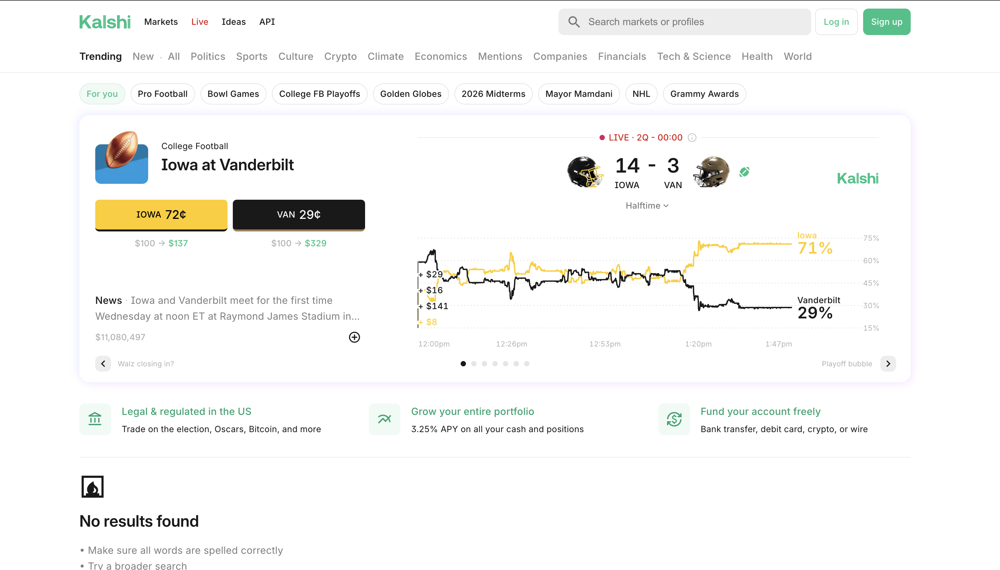

**User goal:**  
- Discover markets and understand what Kalshi offers before signing up
- View live market activity and pricing
- Navigate to different market categories

**Kalshi flow (steps):**
1. User visits kalshi.com while logged out
2. Sees main navigation bar with Markets, Live, Ideas, API links
3. Views trending categories and market filters
4. Sees featured live market (e.g., College Football: Iowa at Vanderbilt)
5. Can click "Sign up" or "Log in" buttons in header
6. Views promotional sections about regulation, portfolio growth, and funding

**Observed behavior:**
- **Header Navigation:**
  - Kalshi logo (green) on left
  - Primary nav: "Markets," "Live" (highlighted), "Ideas," "API"
  - Search bar: "Search markets or profiles"
  - Auth buttons: "Log in" (white) and "Sign up" (green) on right
- **Secondary Navigation:**
  - Category filters: "Trending" (highlighted), "New," "All," "Politics," "Sports," "Culture," "Crypto," "Climate," "Economics," "Mentions," "Companies," "Financials," "Tech & Science," "Health," "World"
  - Market-specific tags: "For you," "Pro Football," "Bowl Games," "College FB Playoffs," "Golden Globes," "2026 Midterms," "Mayor Mamdani," "NHL," "Grammy Awards"
- **Featured Market Card:**
  - Shows live event: "College Football - Iowa at Vanderbilt"
  - Live status indicator: "LIVE - 2Q - 00:00" / "Halftime"
  - Current score: "14 - 3" (Iowa leading)
  - Two trading buttons: "IOWA 72¢" ($100 → $137 return) and "VAN 29¢" ($100 → $329 return)
  - News snippet about the event
  - Market volume: "$11,080,497"
  - Navigation: "< Walz closing in?" and "Playoff bubble >"
- **Live Market Chart:**
  - Price chart showing probability movements over time (12:00pm to 1:47pm)
  - Yellow line for Iowa (71% probability), black line for Vanderbilt (29% probability)
  - Dual Y-axis: dollar values on left, percentages on right
  - Current probabilities highlighted: "Iowa 71%" and "Vanderbilt 29%"
- **Promotional Sections:**
  - "Legal & regulated in the US" - "Trade on the election, Oscars, Bitcoin, and more."
  - "Grow your entire portfolio" - "3.25% APY on all your cash and positions."
  - "Fund your account freely" - "Bank transfer, debit card, crypto, or wire."
- **Additional Market Cards (Below Promotional Sections):**
  - "Pro Football: Carolina at Tampa Bay" - CAR 43¢ ($100 → $230) vs TB 59¢ ($100 → $168)
  - "Pro Basketball (M): Golden State vs Charlotte" - GSW 73¢ ($100 → $136) vs CHA 28¢ ($100 → $354)
  - "What will the announcers say during the Detroit at Chicag..." - Two sub-markets: "What a Catch 50% Yes/No" and "Tush Push 42% Yes/No"
  - "Pro Football Champion?" - "Los Angeles R 14% Yes/No" and "Seattle 14% Yes/No"
  - Market cards show consistent format: team names, prices in cents, potential returns
- **Market Navigation:**
  - Horizontal scrollable navigation with left/right arrows
  - Dots indicate multiple markets available
  - Navigation text: "< Walz closing in?" and "Playoff bubble >"
- **Search Section:**
  - "No results found" section appears at bottom (intentional design - shows search state)

**What I like:**
- Clean, modern design with clear hierarchy
- Live market data prominently displayed creates urgency and engagement
- Multiple navigation layers (categories + specific market tags) help discovery
- Promotional sections address key trust/regulatory concerns upfront
- Real-time score and probability updates show platform is active
- Potential returns displayed clearly ($100 → $137/$329) helps users understand value proposition
- Chart visualization makes probability movements easy to understand

**What I don't like / confusion:**
- "No results found" section at bottom may be confusing for users who haven't searched yet
- Chart Y-axis labels appear jumbled (+$68, +$30, +$2, +$5, +$50, +$16, +$5, +$3,504) - unclear what these represent (possibly trade sizes or price changes, but inconsistent formatting)
- Navigation between markets ("< Walz closing in?") is subtle and might be missed
- "For you" tag highlighted but user isn't logged in - what does "For you" mean for anonymous users?
- Market volume ($11,525,561) is impressive but no context (is this high? low? for this market only? time period?)
- Additional market cards at bottom show variety but no clear organization (sports mixed with prop bets)

**Edge cases / bugs:**
- None observed

**Builder hypothesis (why they did it):**
- **Show live activity immediately:** Featured live market proves platform is active and real-time
- **Reduce friction to signup:** Prominent "Sign up" button and social login options lower barrier
- **Address trust concerns:** "Legal & regulated" section addresses regulatory concerns upfront
- **Show value proposition:** 3.25% APY and multiple funding options highlight platform benefits
- **Create urgency:** Live scores and changing probabilities create FOMO
- **Multiple discovery paths:** Category filters + market tags allow different user mental models
- **Social proof:** High market volume ($11M) signals liquidity and trust

**Opinion Kings implications:**
- **Copy:**
  - Prominent live market on landing page
  - Multiple navigation layers (categories + tags)
  - Promotional trust-building sections
  - Clear potential returns display
  - Real-time data visualization
- **Avoid:**
  - "No results found" bug on landing page
  - Confusing chart axis labels
  - "For you" tag when user isn't logged in
- **Beat:**
  - Better context for market volume (show percentile, compare to similar markets)
  - Clearer chart labeling and tooltips
  - More prominent market navigation
  - Personalized "For you" only when logged in, or rename to "Trending" for anonymous users
- **Implementation notes:**
  - Landing page should be server-rendered or pre-rendered for SEO
  - Real-time updates via WebSocket for live markets
  - Chart library (likely Chart.js, D3, or Recharts) needs careful axis configuration
  - Market data aggregation for volume display
  - Search component should be conditionally rendered (not show "no results" on initial load)
- **Metrics:**
  - Landing page bounce rate
  - Sign up conversion rate from landing page
  - Time to first market view
  - Category filter usage
  - Market card click-through rate
  - Search usage rate

---

## Market Page

### Detailed Market Page with Trading Interface

**Feature category:** Market Page / Trading

**Screenshots:**  
- 021: `021-market-page-detailed-trading.png` - Detailed market page with trading interface for specific prediction
- 022: `022-market-page-more-markets-expanded.png` - Expanded "More markets" list showing all predictions
- 023: `023-market-page-prediction-selected.png` - Trading interface updated after selecting a prediction
- 024: `024-market-page-rules-display.png` - Rules section displaying rules for selected prediction
- 025: `025-market-page-prediction-switch-1.png` - Prediction switch state 1 showing synchronized update when switching predictions
- 026: `026-market-page-prediction-switch-2.png` - Prediction switch state 2 showing synchronized update when switching predictions
- 027: `027-market-page-rules-dropdown-selection.png` - Rules dropdown selection showing UX inconsistency (updates trading but not chart/list)
- 043: `043-market-page-multi-market-graph-1.png` - Multi-market graph showing 2 markets (What a Catch, No Good)
- 044: `044-market-page-market-selection.png` - Market selection interface for adding markets to graph
- 045: `045-market-page-multi-market-graph-2.png` - Multi-market graph showing 3 markets (Superbowl, What a Catch, No Good)
- 046: `046-market-page-graph-settings-menu.png` - Graph settings menu with toggles and options

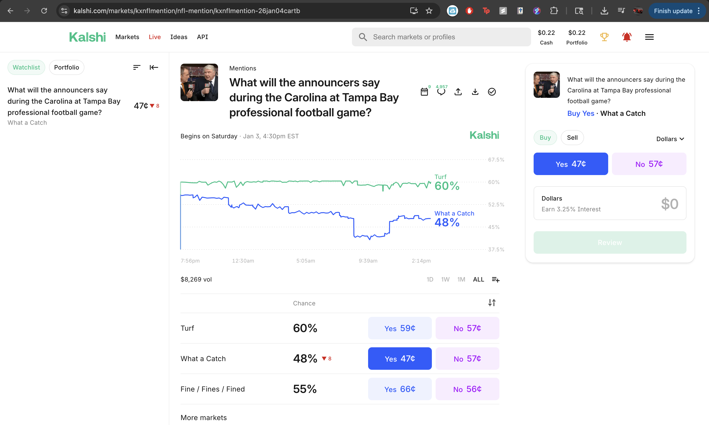
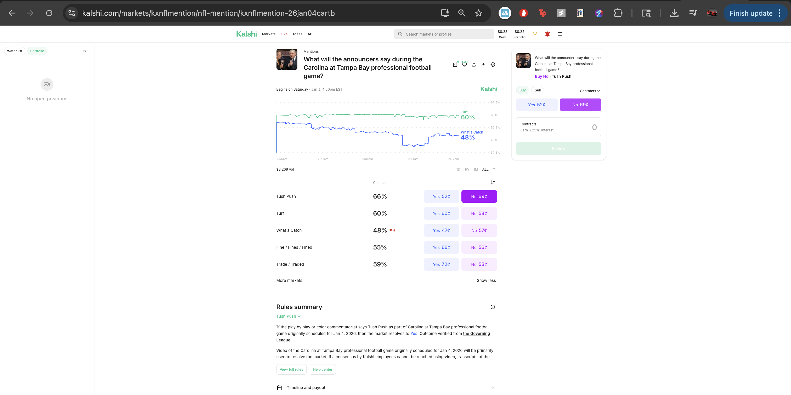
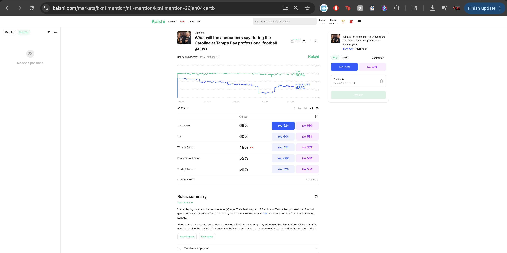
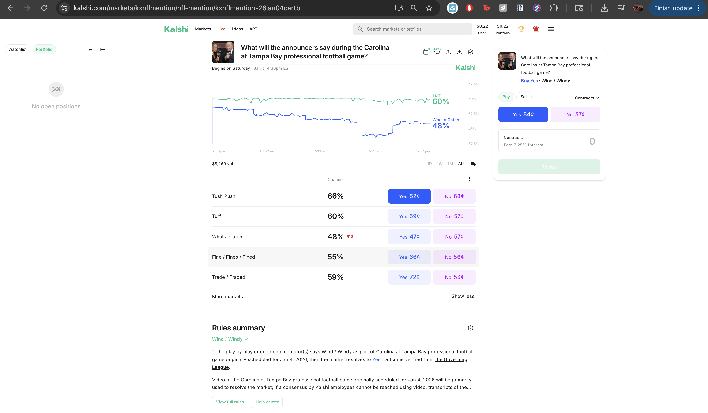
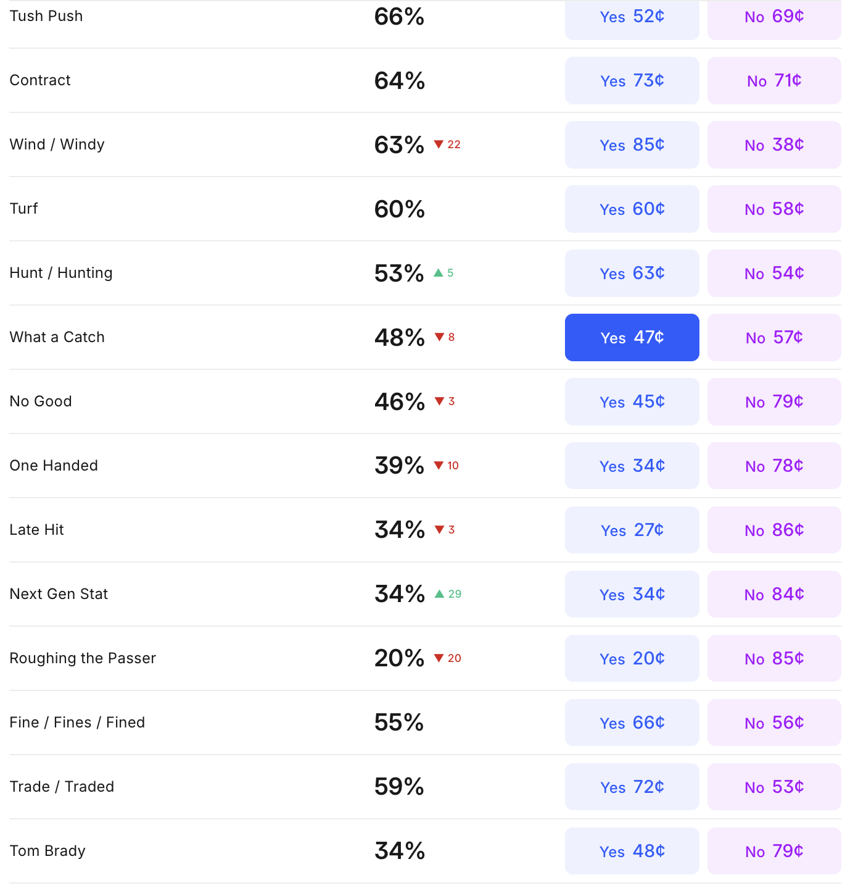
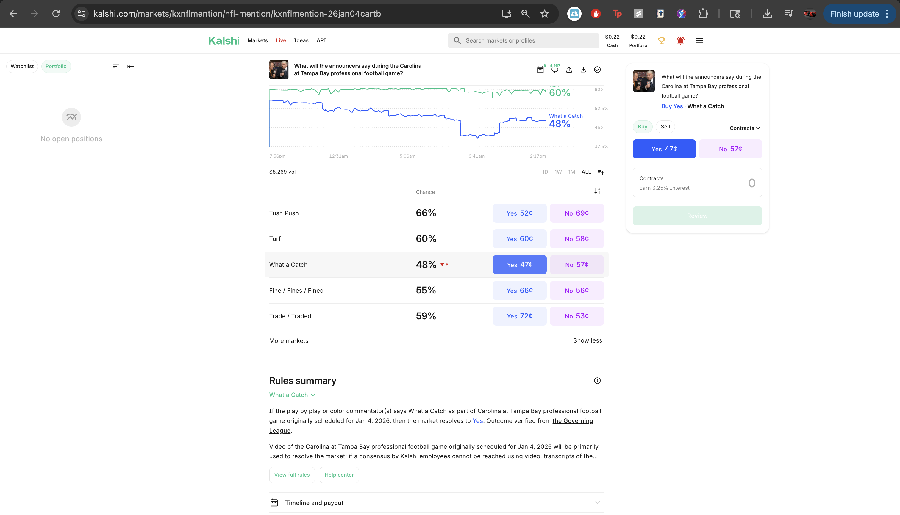
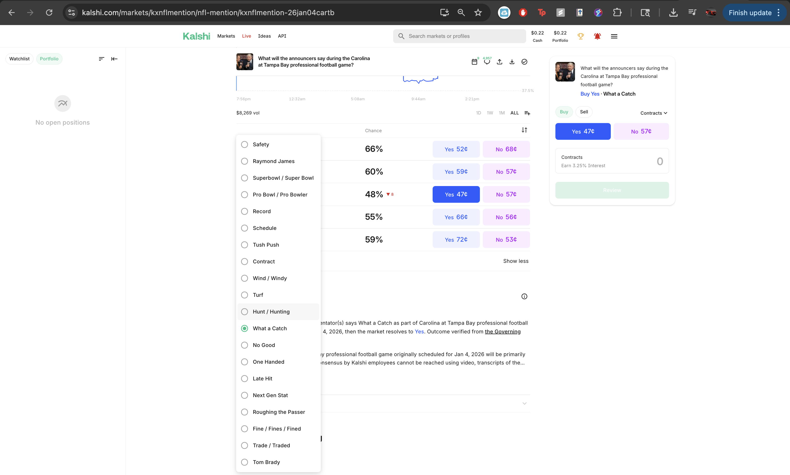
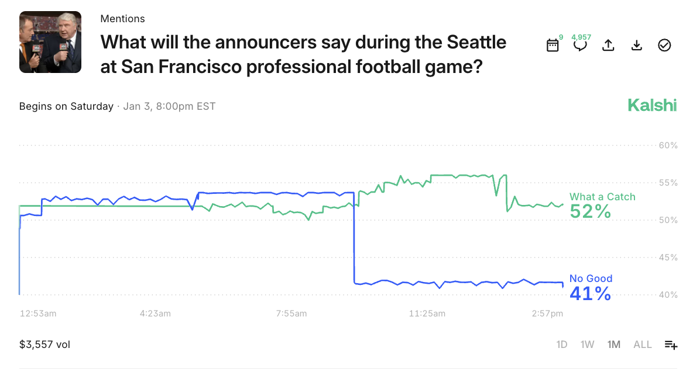
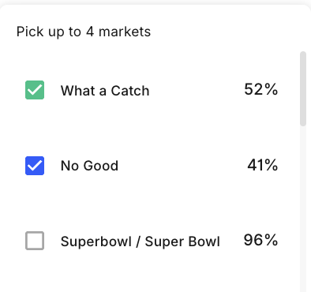
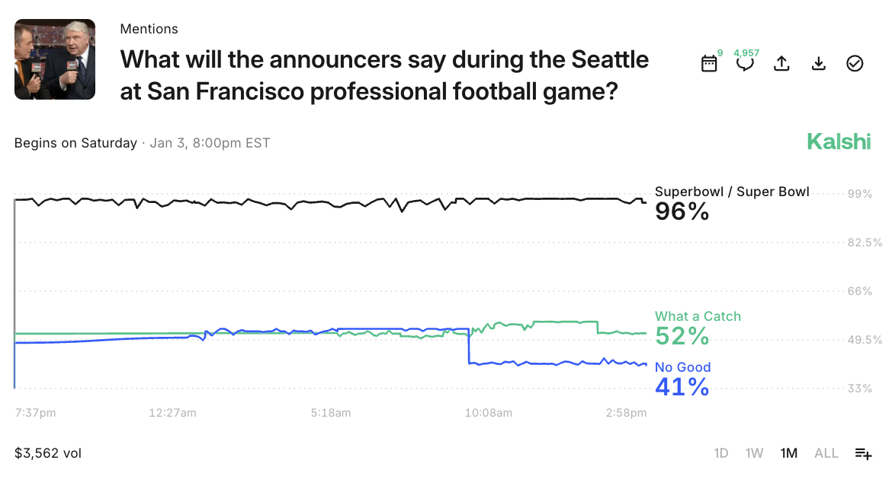

**User goal:**  
- View detailed information about a specific market
- Understand current probabilities and price history
- Place buy/sell orders on market contracts
- Manage positions in this market

**Kalshi flow (steps):**
1. User navigates to market page (from homepage, watchlist, portfolio, or direct link)
2. URL pattern: `kalshi.com/markets/kxnflmention/nfl-mention/kxnflmention-26jan04cartb`
3. **Market Page Header Actions:**
   - After calendar and chat icons, user sees additional action buttons:
     - **Copy link:** Copies market page URL to clipboard
     - **Download price history:** Downloads price history data
     - **Add/remove from watchlist:** Small icon button to toggle watchlist status
   - All actions accessible via small icon buttons in header
4. Page displays:
   - Market title and event details
   - Price chart with historical data
   - Initial market options (typically 4-5 visible)
   - Trading interface (Buy/Sell) on right sidebar
4. **"More markets" feature:**
   - User sees "More markets" link at bottom of prediction list
   - Clicking expands to show all predictions for this event (15+ predictions)
   - Link changes to "Show less" when expanded
5. **Orderbook Popup (Alternative to Yes/No buttons):**
   - User clicks on the prediction word itself (e.g., "No Good", "What a Catch") - NOT the Yes/No buttons
   - Orderbook popup appears
   - Popup shows three tabs: "Trade Yes", "Trade No", "Graph"
   - **Trade Yes tab:** Shows orderbook for Yes contracts (Asks and Bids)
   - **Trade No tab:** Shows orderbook for No contracts (Asks and Bids)
   - **Graph tab:** Shows price history graph with time range selector
   - User can switch between tabs to view different data
6. **Selecting a prediction:**
   - User clicks "Yes" or "No" button on any prediction (e.g., "What a Catch", "Tush Push", "Turf")
   - **Both trading interface AND rules update simultaneously:**
     - **Right sidebar trading interface updates immediately:**
       - Shows "Buy Yes • [Prediction Name]" or "Buy No • [Prediction Name]"
       - Price buttons update to show Yes/No prices for that specific prediction
       - Contract input field updates
     - **Rules section updates immediately:**
       - Rules dropdown shows selected prediction name
       - Rules text updates to show resolution criteria for that specific prediction
       - "View full rules" and "Help center" links remain available
6. **Switching between predictions (two methods):**
   - **Method 1: Clicking Yes/No buttons in main list:**
     - User clicks any prediction's Yes/No button in the main list
     - **All components update:**
       - Trading interface updates (prices, contract name)
       - Rules section updates (rules text, dropdown)
       - Chart updates (if applicable - shows lines for selected prediction)
       - Selected state updates (button highlighted in main list)
     - Example: Click "Tush Push" Yes → Trading shows "Buy Yes • Tush Push" with prices 52¢/69¢, Rules show Tush Push rules, Tush Push button highlighted
   - **Method 2: Using rules dropdown:**
     - User clicks rules dropdown (green hyperlink/button in rules section)
     - Dropdown shows list of all predictions
     - User selects a different prediction from dropdown
     - **Partial updates (UX inconsistency):**
       - Trading interface updates (prices, contract name) ✓
       - Rules section updates (rules text) ✓
       - **Chart does NOT update** ✗ (still shows previous prediction's lines)
       - **Selected state in main list does NOT update** ✗ (previous prediction's button still highlighted)
     - Example: Select "Wind / Windy" from rules dropdown → Trading shows "Buy Yes • Wind / Windy" with prices 84¢/37¢, Rules show Wind/Windy rules, BUT chart and main list selection don't update
7. **Multi-Market Graph Selection:**
   - User can add up to 4 markets to the graph for comparison
   - Market selection interface appears (small scrollable tab)
   - User selects markets from list (checkboxes with percentages)
   - Examples: "What a Catch" (52%), "No Good" (41%), "Superbowl / Super Bowl" (96%)
   - **4 market limit:** Maximum of 4 markets can be selected
   - **Auto-update:** Graph automatically updates when adding a market
   - Graph shows multiple lines (different colors) for each selected market
   - Each line labeled with market name and current percentage
8. **Graph Time Range Selection:**
   - User can switch between time ranges: "1D" (1 day), "1W" (1 week), "1M" (1 month), "ALL" (all time)
   - Time range selector at bottom right of graph
   - Graph updates to show data for selected time range
9. **Graph Settings Menu:**
   - User clicks two opposite-facing arrows icon (sort/filter icon)
   - Settings menu overlay appears
   - **Price notification:** Bell icon - set price alerts
   - **No resting orders here:** Clock icon - shows when no active orders
   - **Forecast graph:** Toggle switch (on/off) - shows forecast graph
   - **Editorial section:** Toggle switch (on/off) - shows editorial content
   - **Sell buttons:** Toggle switch (on/off) - "Shown when you have positions"
   - **Request additional strikes:** Link to request more market options
   - **Request to settle markets:** Link to request market settlement
10. **Buy/Sell Tab Selection:**
    - User chooses "Buy" or "Sell" tab
    - Interface changes based on selected tab
    - **Buy tab:** Shows "Buy Yes/No", defaults to "Buy in contracts"
    - **Sell tab:** Shows "Sell Yes/No", shows "Your position", offers "Sell in contracts" or "Limit order"
11. **Contracts Dropdown Selection:**
    - User clicks "Contracts" dropdown
    - **Buy tab shows:** "Buy in dollars", "Buy in contracts" (default), "Limit order"
    - **Sell tab shows:** "Sell in contracts", "Limit order"
    - User selects desired option
    - Interface updates based on selection
12. User enters contract amount (or dollar amount based on selection)
13. User clicks "Review" to proceed to order confirmation

**Observed behavior:**
- **URL Pattern:**
  - `kalshi.com/markets/{category}/{subcategory}/{market-id}`
  - Example: `/markets/kxnflmention/nfl-mention/kxnflmention-26jan04cartb`
  - SEO-friendly structure
- **Market Header:**
  - Title: "Mentions: What will the announcers say during the Carolina at Tampa Bay professional football game?"
  - Event timing: "Begins on Saturday Jan 3, 4:30pm EST"
  - **Header Actions (after calendar and chat icons):**
    - **Copy link:** Small icon button to copy market page URL to clipboard
    - **Download price history:** Small icon button to download price history data
    - **Add/remove from watchlist:** Small icon button to toggle watchlist status
    - All actions accessible via small icon buttons
    - Quick access without navigating away from page
- **Left Sidebar (Watchlist/Portfolio):**
  - "Watchlist" tab selected
  - Shows this market: "What will the announcers say during the Carolina at Tampa Bay professional football game?"
  - Highlights current contract: "What a Catch" with price "47¢" and down arrow "8"
  - **Clicking sidebar item navigates to this market page**
- **Price Chart:**
  - Line graph showing probability over time
  - **Single market view:** Initially shows selected prediction's line
  - **Multi-market view:** Can display up to 4 markets simultaneously
  - Each market has different colored line:
    - Green line: "What a Catch" (52%)
    - Blue line: "No Good" (41%)
    - Black line: "Superbowl / Super Bowl" (96%)
  - Lines labeled with market name and current percentage
  - Y-axis: Percentage values (varies by time range)
  - X-axis: Time points (varies by selected time range)
  - Volume: "$3,557 vol" or "$3,562 vol" (updates with time range)
  - **Time range selector:** "1D" (1 day), "1W" (1 week), "1M" (1 month), "ALL" (all time)
  - Filter icon next to time range selector
- **Multi-Market Selection:**
  - Interface: "Pick up to 4 markets"
  - Small scrollable tab/popup for market selection
  - Each market shows:
    - Checkbox (green/blue/grey square)
    - Market name
    - Current percentage (e.g., "52%", "41%", "96%")
  - Selected markets have checked checkboxes
  - Unselected markets have unchecked checkboxes
  - Scrollbar visible if more markets available
  - **4 market limit:** Maximum of 4 markets can be selected
  - **Auto-update:** Graph automatically adds/removes lines when markets are selected/deselected
- **Graph Settings Menu:**
  - Accessible via two opposite-facing arrows icon (sort/filter icon)
  - Overlay menu appears on right side
  - **Price notification:** Bell icon with "Price notification" text
  - **No resting orders:** Clock icon with "No resting orders here" (grey text)
  - **Forecast graph:** Toggle switch (green when on) - "Forecast graph"
  - **Editorial section:** Toggle switch (green when on) - "Editorial section"
  - **Sell buttons:** Toggle switch (green when on) - "Sell buttons" with note "Shown when you have positions"
  - **Request additional strikes:** Clickable link "Request additional strikes"
  - **Request to settle markets:** Clickable link "Request to settle markets"
- **Market Options (Chance Section):**
  - **Initial display:** Shows 4-5 predictions initially
  - **"More markets" link:** At bottom of list, expands to show all predictions
  - **Expanded list shows 15+ predictions:**
    - Tush Push: 66% chance, Yes 52¢, No 69¢
    - Contract: 64% chance, Yes 73¢, No 71¢
    - Wind / Windy: 63% chance (red down arrow "22"), Yes 85¢, No 38¢
    - Turf: 60% chance, Yes 60¢, No 58¢
    - Hunt / Hunting: 53% chance (green up arrow "+5"), Yes 63¢, No 54¢
    - What a Catch: 48% chance (red down arrow "-8"), Yes 47¢, No 57¢ (highlighted when selected)
    - No Good: 46% chance (red down arrow "-3"), Yes 45¢, No 79¢
    - One Handed: 39% chance (red down arrow "-10"), Yes 34¢, No 78¢
    - Late Hit: 34% chance (red down arrow "-3"), Yes 27¢, No 86¢
    - Next Gen Stat: 34% chance (green up arrow "+29"), Yes 34¢, No 84¢
    - Roughing the Passer: 20% chance (red down arrow "-20"), Yes 20¢, No 85¢
    - Fine / Fines / Fined: 55% chance, Yes 66¢, No 56¢
    - Trade / Traded: 59% chance, Yes 72¢, No 53¢
    - Tom Brady: 34% chance, Yes 48¢, No 79¢
  - **Trend indicators:** Green up arrows with "+X" for increases, red down arrows with "-X" for decreases
  - **Selected state:** Clicked prediction shows highlighted button (dark blue background, white text)
  - **"Show less" link:** Appears when expanded, collapses list back to initial view
- **Dynamic Trading Interface Updates (Synchronized with Rules):**
  - **When any prediction is clicked (Yes or No):**
    - Right sidebar trading interface updates immediately (no page reload)
    - Shows "Buy Yes • [Prediction Name]" or "Buy No • [Prediction Name]"
    - Price buttons update: "Yes [price]¢" and "No [price]¢" for selected prediction
    - Contract input field updates
    - **Examples:**
      - Click "Tush Push" Yes → Trading shows "Buy Yes • Tush Push" with Yes 52¢, No 69¢
      - Click "What a Catch" Yes → Trading shows "Buy Yes • What a Catch" with Yes 47¢, No 57¢
      - Click "Tush Push" No → Trading shows "Buy No • Tush Push" with Yes 52¢, No 69¢ (No button highlighted)
      - Click "Turf" Yes → Trading shows "Buy Yes • Turf" with Yes 60¢, No 58¢
  - **Switching between predictions:** Clicking any other prediction immediately updates trading interface
- **Dynamic Rules Display:**
  - **Rules dropdown (green hyperlink/button):**
    - Clickable dropdown in rules section allows selecting different predictions
    - Shows list of all predictions for the event
    - User can select any prediction from dropdown
  - **Rules section updates when prediction is selected:**
    - Rules dropdown shows selected prediction name (e.g., "What a Catch", "Tush Push", "Turf", "Wind / Windy")
    - Rules text updates immediately to show resolution criteria for that specific prediction
    - **Examples:**
      - "What a Catch" selected → Rules show: "If the play by play or color commentator(s) says What a Catch as part of Carolina at Tampa Bay professional football game originally scheduled for Jan 4, 2026, then the market resolves to Yes. Outcome verified from the Governing League."
      - "Tush Push" selected → Rules show: "If the play by play or color commentator(s) says Tush Push as part of Carolina at Tampa Bay professional football game originally scheduled for Jan 4, 2026, then the market resolves to Yes. Outcome verified from the Governing League."
      - "Wind / Windy" selected → Rules show: "If the play by play or color commentator(s) says Wind / Windy as part of Carolina at Tampa Bay professional football game originally scheduled for Jan 4, 2026, then the market resolves to Yes. Outcome verified from the Governing League."
  - **Resolution method:** Consistent across all predictions: "Video of the Carolina at Tampa Bay professional football game originally scheduled for Jan 4, 2026 will be primarily used to resolve the market; if a consensus by Kalshi employees cannot be reached using video, transcripts of the..."
  - **Links:** "View full rules" and "Help center" available for each prediction
  - **Timeline and payout:** Collapsed section at bottom
  - **UX Inconsistency:** When selecting from rules dropdown, trading interface and rules update, but chart and main list selection do NOT update (inconsistent state)
- **Trading Interface (Right Sidebar):**
  - Market summary: "What will the announcers say during the Carolina at Tampa Bay professional football game?"
  - Selected contract: "Buy Yes • What a Catch" or "Sell Yes • What a Catch" (changes based on tab)
  - **Buy/Sell Tabs:**
    - "Buy" tab (selected: light green background, white text)
    - "Sell" tab (unselected: white background, dark text)
    - Clicking tabs switches interface
  - **Contracts Dropdown:**
    - **Buy tab options:**
      - "Buy in dollars" ($ icon) - Market order in dollars
      - "Buy in contracts" (# icon) - Market order in contracts (DEFAULT)
      - "Limit order" (Y icon) - Limit order
    - **Sell tab options:**
      - "Sell in contracts" (# icon) - Market order in contracts
      - "Limit order" (Y icon) - Limit order
    - Defaults to contracts for Buy tab
  - **Sell Tab Specific:**
    - "Your position" section showing "None" or position details
  - Price buttons:
    - Large blue button: "Yes [price]¢"
    - Large purple button: "No [price]¢"
  - Contracts input: Shows "0" initially
  - Account balance: "Dollars $0" with "Earn 3.25% Interest" below
  - Green "Review" button at bottom (inactive until input provided)

**What I like:**
- **"More markets" expandable list:** Allows viewing all predictions without overwhelming initial view
- **Synchronized dynamic updates:** Both trading interface AND rules update simultaneously when selecting prediction - excellent UX
- **Real-time switching:** Can click between different predictions and both trading interface and rules update immediately - no page reload
- **Dynamic trading interface:** Updates immediately when selecting prediction - excellent UX
- **Dynamic rules display:** Rules update to show criteria for selected prediction - very helpful
- **Consistent behavior:** Same event, multiple predictions - all accessible from one page
- **Multiple predictions per event:** Allows trading on multiple aspects of same event
- **Trend indicators:** Visual arrows show price movements (up/down with values)
- **Selected state highlighting:** Clear visual feedback when prediction is selected
- **Comprehensive market information:** Title, timing, chart, options all visible
- **Interactive chart:** Time range selection (1D, 1W, 1M, ALL) for different views
- **Multi-market graph:** Can compare up to 4 markets simultaneously on same graph
- **Auto-update graph:** Graph automatically updates when adding/removing markets
- **Graph settings menu:** Customizable graph display with toggles (forecast, editorial, sell buttons)
- **Price notifications:** Ability to set price alerts via settings menu
- **Buy/Sell tabs:** Clear separation of trading actions
- **Price buttons:** Large, clear buttons for Yes/No prices
- **Account balance visible:** Shows available funds for trading
- **Sidebar navigation:** Watchlist/Portfolio accessible from market page
- **Clickable sidebar items:** Direct navigation to markets from watchlist/portfolio

**What I don't like / confusion:**
- **UX Inconsistency - Rules dropdown behavior:**
  - Selecting prediction from rules dropdown updates trading interface and rules
  - BUT does NOT update chart (still shows previous prediction's lines)
  - AND does NOT update selected state in main list (previous button still highlighted)
  - Creates inconsistent state where trading interface shows one prediction, but chart/list show another
  - Confusing for users - which prediction is actually selected?
- **Account balance $0:** User can't actually trade, but interface doesn't prevent or warn
- **No order size input visible:** Dropdown says "Dollars" or "Contracts" but input field shows "0" - unclear how to enter amount
- **"Review" button:** Unclear what happens after clicking (order confirmation? preview?)
- **Many predictions:** 15+ predictions can be overwhelming, but "More markets" helps
- **Chart time range:** "1D" or "ALL" selected but unclear what time period chart shows
- **Rules dropdown:** Could be more prominent - easy to miss that rules exist
- **No visual connection:** Chart doesn't highlight which prediction's line corresponds to selected prediction
- **Market selection UX:**
  - Small scrollable tab for market selection is cramped
  - Requires scrolling within small tab to see all markets
  - Not ideal UX - could be larger or better designed
  - Hard to see all available markets at once
- **4 market limit:**
  - Limit of 4 markets may be restrictive for some use cases
  - No explanation of why limit exists
  - Could be confusing if user wants to compare more markets

**Edge cases / bugs:**
- **B-001:** Rules dropdown selection doesn't update chart and main list selection state (see BUG_LOG B-001)
  - When selecting prediction from rules dropdown (green hyperlink), trading interface and rules update
  - BUT chart does NOT update (still shows previous prediction's lines)
  - AND main list selection state does NOT update (previous prediction's button still highlighted)
  - Creates inconsistent state: trading interface shows one prediction, but chart/list show another
  - This is different from clicking Yes/No buttons, which updates everything
  - User confusion: which prediction is actually selected?

**Builder hypothesis (why they did it):**
- **"More markets" expandable list:** Progressive disclosure - shows key predictions first, allows expansion for power users
- **Synchronized updates (when clicking buttons):** Trading interface and rules update together - ensures user always sees matching information for selected prediction
- **Rules dropdown as alternative:** Provides another way to select prediction, but implementation incomplete (doesn't update all components)
- **Real-time switching:** No page reload when switching predictions - faster, smoother UX, reduces friction
- **Dynamic trading interface:** Immediate feedback when selecting prediction - reduces cognitive load, makes it clear what you're trading
- **Dynamic rules display:** Contextual rules for selected prediction - users see relevant rules without searching, builds trust
- **Single page for multiple predictions:** Keeps all predictions for same event together - easier to compare and switch between them
- **Multiple predictions per event:** Increases trading opportunities and liquidity within single event
- **Trend indicators:** Shows price momentum - helps users make informed decisions
- **Selected state highlighting:** Visual feedback confirms user's selection
- **Detailed market page:** Provides all information needed to make trading decision
- **Trading interface on same page:** Reduces friction, no need to navigate away
- **Chart with time ranges:** Helps users understand market sentiment over time
- **Sidebar navigation:** Maintains context, easy to switch between markets
- **Account balance display:** Transparent about available funds
- **Clickable sidebar:** Reduces friction to navigate between saved markets

**Opinion Kings implications:**
- **Copy:**
  - **"More markets" expandable list** - Progressive disclosure pattern (excellent UX)
  - **Synchronized dynamic updates (Yes/No buttons)** - Trading interface AND rules update simultaneously when clicking prediction buttons (excellent UX)
  - **Real-time prediction switching** - Click any prediction Yes/No button, both trading and rules update immediately, no page reload (excellent UX)
  - **Dynamic trading interface updates** - Immediate feedback when selecting prediction (excellent UX)
  - **Dynamic rules display** - Contextual rules for selected prediction (excellent UX)
  - **Rules dropdown as selection method** - Alternative way to select predictions (good idea, but needs fixing)
  - Multiple predictions per event
  - Trend indicators (up/down arrows with values)
  - Selected state highlighting
  - Detailed market page with comprehensive information
  - Trading interface on same page (no navigation away)
  - Interactive chart with time range selection
  - Clear contract selection and pricing
  - Buy/Sell tab separation
  - Account balance visible
  - Clickable watchlist/portfolio items
- **Avoid:**
  - **UX inconsistency with rules dropdown** - Selecting from dropdown doesn't update chart/list (creates confusing state)
  - Allowing trading when balance is $0 (should show warning or disable)
  - Unclear order flow (what happens after "Review"?)
- **Beat:**
  - **Fix UX inconsistency:** When selecting from rules dropdown, update ALL components (trading interface, rules, chart, AND main list selection state)
  - Ensure single source of truth for selected prediction - all UI elements should reflect same state
  - Show order size input field clearly (make it obvious how to enter amount)
  - Preview order before submission (show cost, potential return, fees)
  - Warn if balance insufficient
  - Add "Fund account" button if balance is $0
  - Show order history for this market
  - Make rules section more prominent (not just dropdown)
  - Highlight chart line for selected prediction
  - Add search/filter for predictions when list is long (15+)
  - Show prediction count (e.g., "Showing 5 of 15 predictions")
  - Better chart tooltips and data points
  - Add keyboard shortcuts for quick prediction selection
  - **Better market selection UX:**
    - Larger selection interface (not small scrollable tab)
    - Better visual design for market selection
    - Show all markets without scrolling if possible
    - Search/filter for markets if list is long
    - Better visual hierarchy and spacing
  - **Flexible market limit:**
    - Consider allowing more than 4 markets (or make limit configurable)
    - Or explain why 4 market limit exists
    - Allow users to save market combinations
    - Show why limit exists (performance, clarity, etc.)
- **Implementation notes:**
  - **URL routing:**
    - Pattern: `/markets/{category}/{subcategory}/{market-id}`
    - SEO-friendly slugs
    - Handle market not found errors
  - **Market data:**
    - Fetch market details, options, probabilities
    - Real-time price updates via WebSocket
    - Historical chart data (time series)
    - Volume calculations
  - **Trading interface:**
    - **Synchronized dynamic updates:** React to prediction selection, update prices AND rules simultaneously
    - **Real-time switching:** Handle clicks on any prediction Yes/No button, update both trading interface and rules section
    - Contract selection (which phrase/outcome)
    - Buy/Sell toggle
    - Order size input (dollars or contracts)
    - Price display (current Yes/No prices for selected prediction)
    - Order preview before submission
    - Validation (balance check, minimum order size)
    - **State management:** Store selected prediction in React state, update both components when state changes
  - **"More markets" feature:**
    - Initially show 4-5 predictions
    - Expandable list to show all predictions (15+)
    - Toggle between "More markets" and "Show less"
    - Lazy load or paginate if list is very long
  - **Dynamic rules (should be synchronized with all components):**
    - Store rules for each prediction in database
    - **Single source of truth:** Use shared React state for selected prediction
    - **When prediction selected via Yes/No button:** Update trading interface, rules, chart, AND main list selection state
    - **When prediction selected via rules dropdown:** Update ALL components (currently only updates trading and rules - fix this)
    - Rules dropdown shows selected prediction name
    - Rules text updates via React state (shared state with trading interface) or API call
    - **Ensure consistency:** All UI elements (trading interface, rules, chart, main list) should always reflect same selected prediction
    - **State management:** Use React Context or Redux to ensure single source of truth
  - **Chart:**
    - Time range selection (1D, 1W, 1M, ALL)
    - **Multi-market support:** Display up to 4 markets simultaneously
    - Multiple lines for different markets/contracts
    - Each line with different color and label
    - Interactive tooltips
    - Volume overlay
    - **Auto-update:** Graph automatically updates when markets are added/removed
    - **Time range switching:** Update graph data when time range changes
    - **Line colors:** Consistent colors for same markets across views
  - **Market selection interface:**
    - "Pick up to 4 markets" interface
    - Checkbox list with market names and percentages
    - Scrollable if many markets available
    - **4 market limit:** Enforce maximum of 4 selected markets
    - **Auto-update graph:** Update graph when markets selected/deselected
    - Store selected markets in state
  - **Graph settings menu:**
    - Two opposite-facing arrows icon (sort/filter icon)
    - Overlay menu component
    - **Toggles:**
      - Forecast graph (on/off)
      - Editorial section (on/off)
      - Sell buttons (on/off, conditional on positions)
    - **Actions:**
      - Price notification (bell icon)
      - Request additional strikes (link)
      - Request to settle markets (link)
    - **State management:** Store toggle states
    - **Conditional display:** Show "No resting orders" when no orders
  - **Sidebar:**
    - Watchlist/Portfolio tabs
    - Highlight current market if in watchlist
    - Clickable items navigate to other markets
- **Metrics:**
  - Market page view rate
  - Time spent on market page
  - Chart interaction rate (time range changes)
  - Contract selection rate (which contracts users choose)
  - "More markets" expansion rate
  - Prediction selection rate (how often users switch between predictions)
  - Prediction switching rate (how many different predictions users try before placing order)
  - Rules dropdown usage rate (how often users select from dropdown vs clicking buttons)
  - UX inconsistency impact (does rules dropdown inconsistency cause confusion/abandonment?)
  - Rules section view rate
  - Synchronized update effectiveness (does simultaneous trading/rules update help conversion?)
  - Time spent comparing predictions before selecting
  - Buy vs Sell ratio
  - Order placement rate (view to order conversion)
  - Review button click rate
  - Order completion rate (Review → Submit)
  - Click-through rate from sidebar to market pages
  - Time spent comparing predictions before selecting

### Timeline and Payout Section

**Feature category:** Market Page / Settlement / Compliance

**Screenshots:**  
- 038: `038-market-page-timeline-payout.png` - Timeline and payout section showing market lifecycle and payout schedule

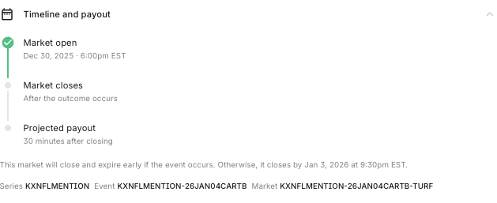

**User goal:**  
- Understand when a market opens and closes
- Know when to expect payouts
- Understand market lifecycle and settlement process
- See market identifiers for reference

**Kalshi flow (steps):**
1. User is on a market page
2. User sees "Timeline and payout" section (with calendar icon)
3. User clicks on "Timeline and payout" to expand/collapse
4. Section expands on the same page (no navigation)
5. User sees:
   - Market open date/time
   - Market closes condition
   - Projected payout timing
   - Early closure disclaimer
   - Market identifiers

**Observed behavior:**
- **Section Header:**
  - Title: "Timeline and payout" with calendar icon
  - Expandable/collapsible on same page
- **Timeline Visualization:**
  - Vertical timeline with connected stages
  - **Market Open:**
    - Green checkmark icon
    - Date and time: "Dec 30, 2025 · 6:00pm EST"
    - Green vertical line connecting to next stage
  - **Market Closes:**
    - Grey circular dot
    - Condition: "After the outcome occurs"
    - Grey vertical line connecting to next stage
  - **Projected Payout:**
    - Grey circular dot
    - Timing: "30 minutes after closing"
- **Early Closure Disclaimer:**
  - Important note: "This market will close and expire early if the event occurs. Otherwise, it closes by Jan 3, 2026 at 9:30pm EST."
  - Clarifies two closure scenarios:
    - Early closure if event occurs
    - Hard deadline if event doesn't occur
- **Market Identifiers:**
  - Series: "Series KXNFLMENTION"
  - Event: "Event KXNFLMENTION-26JAN04CARTB"
  - Market: "Market KXNFLMENTION-26JAN04CARTB-WHAT"
  - Technical identifiers for reference

**What I like:**
- **Clear timeline visualization:** Visual representation makes lifecycle easy to understand
- **Transparent payout timing:** "30 minutes after closing" sets clear expectations
- **Early closure handling:** Clear explanation of both closure scenarios
- **Expandable on same page:** No navigation needed, keeps user in context
- **Market identifiers:** Technical details available for reference
- **Visual hierarchy:** Green for open, grey for future stages

**What I don't like / confusion:**
- **"After the outcome occurs" is vague:** Could be clearer about what triggers closure
- **No countdown timer:** Doesn't show time remaining until closure
- **Payout timing could be more specific:** "30 minutes" is good, but could show exact time if known
- **Early closure vs deadline:** Could be clearer about which scenario is more likely

**Edge cases / bugs:**
- None observed (only log bugs when explicitly identified)
- What if event occurs exactly at deadline? Which takes precedence?
- What if payout processing takes longer than 30 minutes?

**Builder hypothesis (why they did it):**
- **Transparency:** Clear communication builds trust and reduces support queries
- **Expectation management:** Users know when to expect payouts
- **Compliance:** Required disclosure of market lifecycle and settlement
- **User education:** Helps users understand how markets work
- **Expandable design:** Keeps page clean while providing detailed info on demand
- **Technical identifiers:** Useful for support, debugging, or API access

**Opinion Kings implications:**
- **Copy:**
  - Timeline visualization with stages
  - Expandable/collapsible section on same page
  - Clear payout timing communication
  - Early closure disclaimer
  - Market identifiers for reference
- **Avoid:**
  - Vague closure conditions
  - No countdown or time remaining
- **Beat:**
  - **Countdown timer:** Show time remaining until closure
  - **More specific payout timing:** Show exact payout time if calculable
  - **Closure probability:** Indicate likelihood of early closure vs deadline
  - **Real-time updates:** Update timeline as market progresses
  - **Payout status tracking:** Show payout status (pending, processing, paid)
  - **Clearer closure triggers:** Explain exactly what "outcome occurs" means
  - **Visual indicators:** Add icons or colors for different closure scenarios
  - **Mobile optimization:** Ensure timeline is readable on mobile
- **Implementation notes:**
  - **Timeline component:**
    - Vertical timeline with connected stages
    - Icons for each stage (checkmark, dot, etc.)
    - Color coding (green for open, grey for future)
    - Responsive design for mobile
  - **Expandable section:**
    - Collapsible component (accordion pattern)
    - Expand/collapse on same page (no navigation)
    - Smooth animation for expand/collapse
    - Remember user preference (expanded/collapsed state)
  - **Market lifecycle data:**
    - Store market open date/time
    - Store closure conditions (event-based or deadline)
    - Calculate projected payout time (30 minutes after closure)
    - Handle early closure scenarios
  - **Payout timing:**
    - Calculate payout time based on closure time
    - Update in real-time as market progresses
    - Show exact time if calculable
    - Handle edge cases (exact deadline, processing delays)
  - **Market identifiers:**
    - Series ID
    - Event ID
    - Market ID
    - Display for reference/support
  - **Early closure logic:**
    - Monitor for event occurrence
    - Compare to deadline
    - Close market when event occurs or deadline reached
    - Update timeline accordingly
- **Metrics:**
  - Timeline section view rate
  - Expand/collapse interaction rate
  - Payout timing accuracy (actual vs projected)
  - Early closure rate vs deadline closure rate
  - User confusion rate (support queries about payout timing)
  - Time spent viewing timeline section
  - Market identifier usage (copy/paste rate)

### People are also buying Recommendations

**Feature category:** Market Page / Discovery / Recommendations

**Screenshots:**  
- 039: `039-market-page-people-also-buying.png` - "People are also buying" section showing top 3 recommended markets

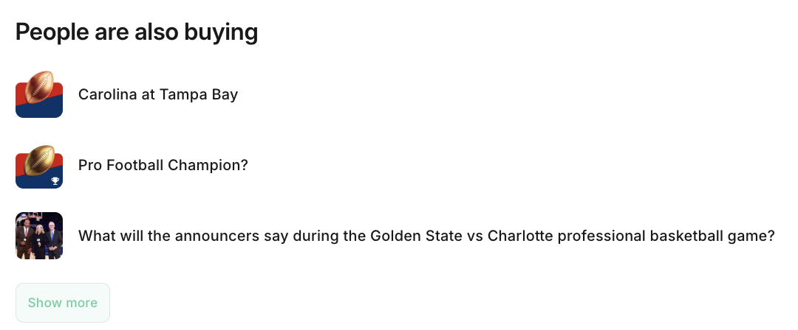

**User goal:**  
- Discover related markets that other users are trading
- Find markets similar to current market
- Explore additional trading opportunities
- See what's popular among other traders

**Kalshi flow (steps):**
1. User is on a market page
2. User scrolls down to see "People are also buying" section
3. Section shows top 3 recommended markets initially
4. Each market shows:
   - Icon/image representing the market
   - Market name/description
5. User clicks "Show more" button
6. Section expands to show top 10 recommended markets
7. "Show more" button changes to "Show less"
8. User clicks "Show less" to collapse back to top 3

**Observed behavior:**
- **Section Header:**
  - Title: "People are also buying" (bold, black text)
- **Initial Display:**
  - Shows top 3 recommended markets
  - Each market item includes:
    - Icon/image (e.g., football icon, announcers image)
    - Market name/description text
  - Examples observed:
    - "Carolina at Tampa Bay" (football icon with shield)
    - "Pro Football Champion?" (football icon with trophy)
    - "What will the announcers say during the Golden State vs Charlotte professional basketball game?" (announcers image)
- **Progressive Disclosure:**
  - "Show more" button (light green background, light green text)
  - Expands to show top 10 markets
  - "Show more" changes to "Show less"
  - "Show less" collapses back to top 3
- **Market Selection:**
  - **Not restricted to mentions markets:** Shows any market type people are buying
  - **Related to current market:** Usually shows markets in same category (e.g., sports/NFL)
  - **Algorithm-based:** Appears to use trading activity and market similarity
  - Markets are clickable and navigate to that market's page

**What I like:**
- **Progressive disclosure:** Top 3 initially, expand to top 10 - good UX pattern
- **Related markets:** Shows markets similar to current one (e.g., NFL markets when on NFL page)
- **Not restricted:** Shows any market type, not just mentions - good discovery
- **Clear call-to-action:** "Show more"/"Show less" buttons are clear
- **Visual variety:** Different icons for different market types
- **Based on activity:** "People are also buying" suggests real trading activity

**What I don't like / confusion:**
- **Algorithm unclear:** Not transparent how recommendations are calculated
- **No explanation:** Doesn't explain why these markets are recommended
- **No personalization:** Appears to show same markets to all users
- **No filtering:** Can't filter by market type or category
- **Limited context:** Only shows market name, no odds or prices

**Edge cases / bugs:**
- None observed (only log bugs when explicitly identified)
- What if there are fewer than 3 markets? Does it show all available?
- What if user is on a very niche market with no related markets?

**Builder hypothesis (why they did it):**
- **Discovery:** Helps users find additional markets to trade
- **Engagement:** Increases time on platform and trading volume
- **Cross-selling:** Encourages users to explore beyond current market
- **Activity-based:** "People are also buying" creates social proof and FOMO
- **Category relevance:** Showing related markets (e.g., NFL) maintains context
- **Progressive disclosure:** Top 3 keeps page clean, top 10 provides more options
- **Not restricted:** Showing any market type increases discovery breadth
- **Algorithm:** Likely uses:
  - Trading volume/activity
  - Market category similarity
  - User behavior patterns
  - Popularity metrics

**Opinion Kings implications:**
- **Copy:**
  - "People are also buying" section
  - Progressive disclosure (top 3 → top 10)
  - "Show more"/"Show less" toggle
  - Related market recommendations
  - Not restricted to single market type
  - Activity-based recommendations
- **Avoid:**
  - Unclear algorithm
  - No explanation of recommendations
  - No personalization
- **Beat:**
  - **Transparent algorithm:** Explain why markets are recommended
  - **Personalization:** Show markets based on user's trading history
  - **More context:** Show odds, prices, or volume for recommended markets
  - **Filtering options:** Allow users to filter by market type
  - **Multiple recommendation types:**
    - "People are also buying" (activity-based)
    - "Similar markets" (category-based)
    - "Trending now" (popularity-based)
    - "For you" (personalized)
  - **Market preview:** Show quick preview (odds, prices) on hover
  - **Better visual hierarchy:** Highlight top recommendations
  - **A/B testing:** Test different recommendation algorithms
  - **Analytics:** Track which recommendations lead to trades
- **Implementation notes:**
  - **Recommendation algorithm:**
    - **Activity-based:** Markets with high trading volume
    - **Category similarity:** Markets in same category (e.g., NFL, NBA)
    - **User behavior:** Markets users who viewed current market also viewed
    - **Popularity:** Trending markets
    - **Recency:** Recently active markets
    - **Hybrid approach:** Combine multiple signals
  - **Progressive disclosure:**
    - Initially show top 3 markets
    - "Show more" expands to top 10
    - "Show less" collapses back to top 3
    - Smooth expand/collapse animation
    - Remember user preference (expanded/collapsed state)
  - **Market display:**
    - Icon/image for each market
    - Market name/description
    - Clickable to navigate to market page
    - Optional: Show odds, prices, volume on hover
  - **Data sources:**
    - Real-time trading activity
    - Market category data
    - User behavior data
    - Market metadata
  - **Performance:**
    - Cache recommendations for performance
    - Update recommendations periodically
    - Lazy load market details
  - **Personalization (future):**
    - User's trading history
    - User's watchlist
    - User's category preferences
    - Collaborative filtering
- **Metrics:**
  - Section view rate
  - "Show more" click rate
  - Recommendation click-through rate
  - Market page views from recommendations
  - Trading conversion rate (recommendation → trade)
  - Top 3 vs top 10 engagement
  - Recommendation accuracy (do users actually trade recommended markets?)
  - Time spent viewing recommendations
  - Category relevance (are recommendations actually related?)
  - User satisfaction with recommendations

### Calendar Popup and Event-Based Routing for Mentions Markets

**Feature category:** Market Page / Discovery / Navigation

**Screenshots:**  
- 028: `028-market-page-calendar-popup-1.png` - Calendar popup showing Open tab with NFL games list
- 029: `029-market-page-calendar-popup-2.png` - Calendar popup showing different set of games
- 030: `030-market-page-determined-history.png` - Determined/history market accessed through calendar (Los Angeles R at Atlanta)
- 031: `031-market-page-calendar-open-market.png` - Open market accessed through calendar (Seattle at San Francisco)

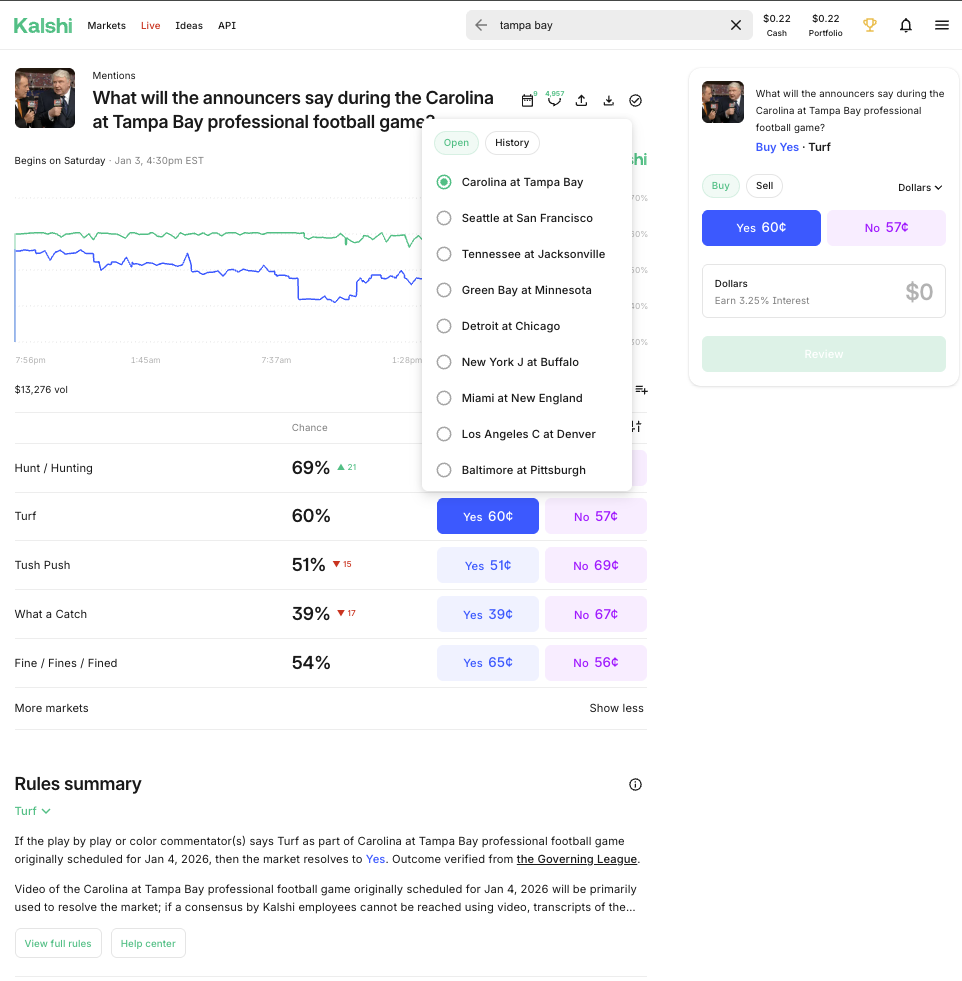

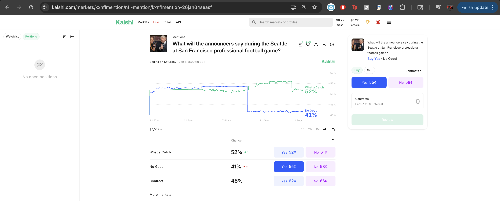

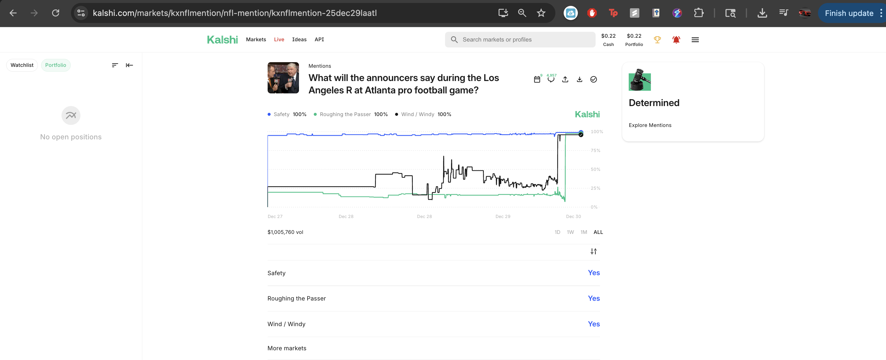

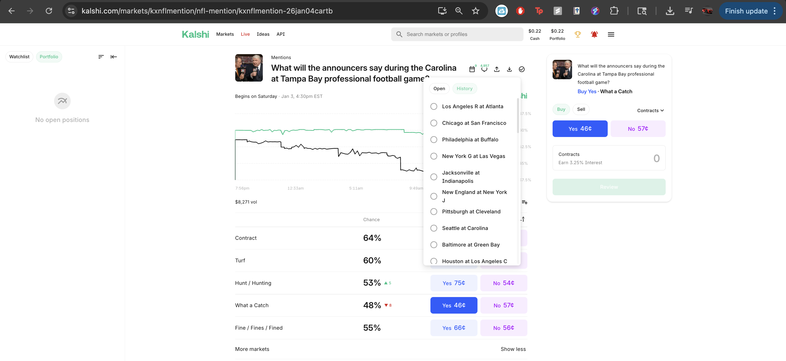

**User goal:**  
- Navigate between different events/games for the same market type (e.g., "Mentions" markets)
- Access both open (future) and determined (past) markets for specific events
- View trading history for markets user has previously viewed or traded
- Quickly switch between related markets for different events

**Kalshi flow (steps):**
1. User is on a mentions market page (e.g., "What will the announcers say during the Carolina at Tampa Bay professional football game?")
2. User clicks on calendar icon or event selector (appears to be accessible from the market page)
3. Calendar popup/dropdown appears with two tabs: "Open" and "History"
4. **Open Tab:**
   - Shows list of upcoming/future events for the same market type
   - Each event listed with radio button for selection
   - Examples: "Carolina at Tampa Bay" (selected), "Seattle at San Francisco", "Tennessee at Jacksonville", "Green Bay at Minnesota", "New York J at Buffalo", "Miami at New England", "Los Angeles C at Denver", "Detroit at Chicago", "Baltimore at Pittsburgh"
   - User selects an event from the list
   - System routes to that event's mentions market page (if open)
5. **History Tab:**
   - Shows list of past events that user has viewed or traded
   - Each event listed with radio button for selection
   - Examples: "Los Angeles R at Atlanta", "Seattle at San Francisco", etc.
   - User selects an event from history
   - System routes to that event's mentions market page (shows "Determined" status if market has closed)
6. **Market Page States:**
   - **Open Market:** Shows active trading interface, current probabilities, live chart, Yes/No buttons
   - **Determined Market:** Shows "Determined" badge with gavel icon, final outcomes (e.g., "Safety Yes", "Roughing the Passer Yes", "Wind / Windy Yes"), historical chart, "Explore Mentions" link

**Observed behavior:**
- **Calendar Button:**
  - Green button indicators showing counts:
    - Number of open markets for mentions (e.g., "15 open")
    - Number of messages/markets in history (e.g., "8 history")
  - These counts reflect all mentions markets (both open orders and from history)
  - Visual indicators help users understand activity level at a glance
- **Calendar Popup:**
  - Overlay/dropdown positioned over main content area
  - Two tabs: "Open" (default) and "History"
  - List of events/games with radio buttons
  - Currently selected event highlighted with green circle
  - Scrollable list if many events
  - All mentions markets for sports events are grouped together (e.g., all NFL games' mentions markets accessible from one calendar)
- **Open Tab:**
  - Shows future/upcoming events
  - Events listed by game matchup (e.g., "Carolina at Tampa Bay")
  - Radio button selection interface
  - Clicking an event routes to that event's mentions market page
- **History Tab:**
  - Shows past events that user has viewed or traded
  - Same radio button interface
  - Clicking an event routes to that event's mentions market page (determined state)
- **Routing Behavior:**
  - URL changes to reflect new event (e.g., `/markets/kxnflmention/nfl-mention/kxnflmention-26jan04cartb` → `/markets/kxnflmention/nfl-mention/kxnflmention-26jan04seasf`)
  - Page updates to show new event's market data
  - Chart, predictions, and trading interface all update for new event
- **Determined Market State:**
  - "Determined" badge prominently displayed with gavel icon
  - Final outcomes shown (e.g., "Safety Yes", "Roughing the Passer Yes", "Wind / Windy Yes")
  - Historical chart shows full timeline (e.g., Dec 27 to Dec 30)
  - All outcomes show "Yes" (indicating they occurred)
  - "Explore Mentions" link available
  - No trading interface (market is closed)
- **Open Market State:**
  - Active trading interface with Buy/Sell options
  - Current probabilities and prices displayed
  - Live chart showing recent price movements
  - Yes/No buttons for trading
  - Multiple predictions listed (e.g., "What a Catch", "No Good", "Contract")

**What I like:**
- **Excellent routing system:** Self-explanatory and intuitive way to navigate between related markets
- **Event grouping:** All mentions markets for sports events grouped together - makes sense organizationally
- **Open vs History separation:** Clear distinction between future and past markets
- **History tracking:** Shows markets user has viewed/traded - helpful for returning to previous markets
- **Seamless navigation:** Clicking an event immediately routes to that market page
- **Determined state clarity:** "Determined" badge makes it clear when a market is closed
- **Visual consistency:** Same market page layout for both open and determined markets (just different state)
- **Calendar popup design:** Clean, organized, easy to scan list of events

**What I don't like / confusion:**
- **Calendar icon location:** Not clear from screenshots where the calendar icon/button is located (might be in rules section or header)
- **History scope:** Unclear if "History" shows all viewed markets or only traded markets
- **No date/time indicators:** Event list doesn't show when events occur (might be helpful for "Open" tab)
- **No search/filter:** If there are many events, scrolling through list might be tedious
- **No favorites:** Can't mark specific events as favorites for quick access
- **Determined market navigation:** "Explore Mentions" link unclear - does it go back to calendar or to other mentions markets?

**Edge cases / bugs:**
- None observed (only log bugs when explicitly identified)
- What if user hasn't viewed/traded any markets yet? Does History tab show empty state?
- What if an event in "Open" tab becomes determined while user is viewing? Does it move to History tab?
- What if there are no open events? Does Open tab show empty state?

**Builder hypothesis (why they did it):**
- **Event grouping:** Mentions markets are naturally organized by event (game), so grouping makes sense
- **Calendar navigation:** Provides intuitive way to switch between related markets without going back to discovery
- **History tracking:** Increases engagement by making it easy to return to previously viewed markets
- **Open vs History:** Separates actionable markets (open) from reference markets (determined)
- **Self-explanatory routing:** Users can easily understand how to navigate between events
- **Retention:** History feature encourages users to return to markets they've engaged with
- **Liquidity:** Makes it easy to find and trade on multiple related markets (increases trading volume)

**Opinion Kings implications:**
- **Copy:**
  - Calendar/event selector for navigating between related markets
  - Open vs History tabs for separating future and past markets
  - History tracking of viewed/traded markets
  - Event-based grouping for similar market types
  - Seamless routing between related markets
  - Determined state with clear "Determined" badge
- **Avoid:**
  - Unclear calendar icon location
  - No date/time indicators for events
  - No search/filter for long event lists
- **Beat:**
  - Clear calendar icon/button location (maybe in header or rules section)
  - Add date/time indicators for events in Open tab
  - Add search/filter for event list
  - Add favorites/bookmarks for specific events
  - Show event status (upcoming, live, ended) in list
  - Add "Recently viewed" section separate from "History"
  - Better empty states for History tab (if no viewed markets)
  - Add keyboard shortcuts for quick navigation
  - Show event count (e.g., "15 open events", "8 in history")
  - Add "View all events" link if list is truncated
- **Implementation notes:**
  - **Calendar button:**
    - Green button indicators showing counts:
      - Number of open markets (e.g., "15 open")
      - Number of history markets (e.g., "8 history")
    - Counts reflect all mentions markets (open orders and history)
    - Visual indicators help users understand activity level
  - **Calendar popup:**
    - Trigger: Click on calendar icon/button (location TBD)
    - Overlay/dropdown component with tabs
    - Fetch events for current market type (e.g., all NFL mentions markets)
    - Separate into "Open" (future events) and "History" (viewed/traded events)
    - Radio button selection interface
    - Click handler: route to selected event's market page
    - Display count indicators on calendar button
  - **Event data:**
    - Store events in database with: event ID, name, date/time, status (open/determined)
    - Group events by market type (e.g., "NFL Mentions", "NBA Mentions")
    - Track user's viewed/traded events in user history table
  - **History tracking:**
    - Log when user views a market page
    - Log when user places a trade
    - Store in user_history table: user_id, market_id, event_id, viewed_at, traded_at
    - Query history for "History" tab
  - **Routing:**
    - URL pattern: `/markets/{category}/{subcategory}/{event-id}`
    - Update URL when event selected from calendar
    - Fetch market data for selected event
    - Update all UI components (chart, predictions, trading interface)
  - **Market states:**
    - **Open:** Show trading interface, live prices, active chart
    - **Determined:** Show "Determined" badge, final outcomes, historical chart, no trading interface
    - Check market status on page load
    - Update UI based on status
  - **Event list:**
    - Sort Open events by date (upcoming first)
    - Sort History events by most recently viewed/traded
    - Paginate or lazy load if many events
    - Add search/filter if list is long
- **Metrics:**
  - Calendar popup open rate
  - Open vs History tab usage
  - Event selection rate (how often users switch between events)
  - History tab usage rate
  - Time spent viewing determined markets
  - Return rate to previously viewed markets
  - Event navigation efficiency (time to find desired event)
  - Calendar popup to market page conversion rate
  - Average number of events viewed per session
  - History tab engagement rate

### Logged-In Discovery Page (Post-OAuth)

**Feature category:** Market Page / Discovery / Post-Authentication

**Screenshots:**  
- 017: `017-market-page-logged-in-discovery.png` - Discovery page after successful Google OAuth login

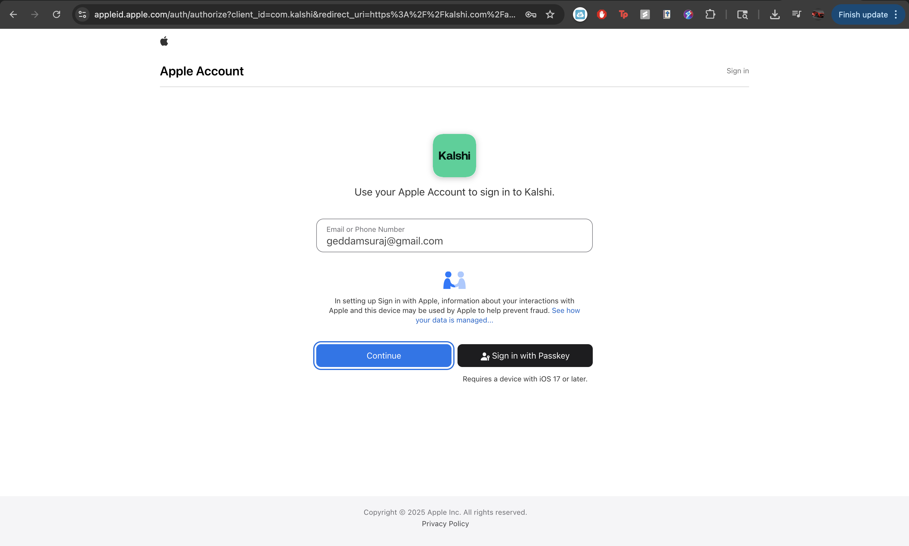

**User goal:**  
- View markets after successful login
- Discover trending markets and categories
- Access watchlist and portfolio
- View account balance and status
- Navigate to specific markets

**Kalshi flow (steps):**
1. User completes OAuth flow from duplicate account page (016)
2. OAuth callback: `kalshi.com/oauth/google/callback` (or `/oauth/apple/callback`)
3. System validates OAuth token and matches to existing account
4. User is immediately logged in (no intermediate screens)
5. Redirected to discovery/market page (logged-in state)
6. Page displays:
   - User account info in header (Cash $0.22, Portfolio $0.22)
   - Market categories and filters
   - Featured market: "Pro Football Playoff Qualifiers?"
   - Watchlist sidebar
   - Related market cards below

**Observed behavior:**
- **Header (Logged-In State):**
  - Kalshi logo (green) on left
  - Navigation: "Markets," "Live," "Ideas," "API"
  - Search bar: "Search markets or profiles"
  - **Account info displayed:**
    - "$0.22 Cash" (green text)
    - "$0.22 Portfolio" (green text)
    - Trophy icon (likely leaderboard/achievements)
    - Bell icon (notifications)
    - Hamburger menu icon
- **Market Categories:**
  - Primary filters: "Trending," "New," "All," "Politics," "Sports" (highlighted), "Culture," "Crypto," "Climate," "Economics," "Mentions," "Companies," "Financials," "Tech & Science," "Health," "World"
  - Secondary filters: "For you," "Pro Football" (highlighted), "Bowl Games," "College FB Playoffs," "Golden Globes," "2026 Midterms," "Mayor Mamdani," "NHL," "Grammy Awards"
- **Left Sidebar:**
  - "Watchlist" tab (highlighted) and "Portfolio" tab
  - Watchlist shows: "What will the announcers say during the Carolina at Tampa Bay professional football game?"
  - Market shows "48¢" with red down arrow and "8" (price change indicator)
- **Featured Market Card: "Pro Football Playoff Qualifiers?"**
  - Silver football icon with blue/red shield badge containing "14" (unclear meaning - days left? teams?)
  - Two options:
    - "Baltimore": 65% with "Yes" and "No" buttons
    - "Pittsburgh": 35% with "Yes" and "No" buttons
  - News snippet: "Several teams remain on the playoff bubble entering the final week, with Buffalo, Pittsburgh,..."
  - Volume: "$4,623,005 Annually"
  - Price chart: Line graph showing probabilities over time (July to December)
    - Blue line for Baltimore (65%)
    - Yellow line for Pittsburgh (35%)
    - Y-axis: 0% to 100%
    - "Kalshi" watermark on chart
  - Related market navigation: "Iowa meets Vanderbilt" text appears below chart (shows related/upcoming markets)
- **Other Market Cards (Bottom):**
  - "Pro Basketball (M) Golden State vs Charlotte": GSW 75¢, CHA 27¢
  - "What will the announcers say durin...": MVP 57% Yes/No, Triple Doub 31% Yes/No
  - "Pro Football Carolina at Tampa Bay": CAR 43¢, TB 59¢
  - "Pro Football Champion?": Los Angeles 14% Yes/No, Seattle 14% Yes/No

**What I like:**
- **Seamless OAuth flow:** Direct redirect to logged-in state after OAuth callback - no intermediate screens
- **Account info prominently displayed:** Cash and portfolio balance visible in header
- **Watchlist sidebar:** Easy access to saved markets
- **Clear market presentation:** Probabilities, charts, and news all visible
- **Multiple discovery paths:** Categories, filters, and related markets
- **Real-time data:** Prices and probabilities appear current
- **Visual hierarchy:** Featured market is prominent, related markets below

**What I don't like / confusion:**
- **"14" badge on football icon:** Unclear what this represents (days left? number of teams? market ID?)
- **"Iowa meets Vanderbilt" text:** Appears below main market but relationship to current market is unclear
- **Account balance very low:** $0.22 suggests new account or test account - might confuse users
- **Watchlist market truncated:** Long market names get cut off ("What will the announcers say durin...")
- **No clear indication of logged-in state:** Aside from account balance, no obvious "Welcome back" or user name
- **Related markets not clearly organized:** Mix of sports and prop bets without clear categorization

**Edge cases / bugs:**
- None observed (only log bugs when explicitly identified)
- What if OAuth email doesn't match any account?
- Account balance display: What if balance is $0.00? Negative? Very large?

**Builder hypothesis (why they did it):**
- **Seamless OAuth:** Direct redirect after callback reduces friction and feels fast
- **Account info in header:** Always visible balance encourages trading and engagement
- **Watchlist sidebar:** Personalization increases retention
- **Featured market:** Highlights high-liquidity or trending markets
- **Multiple discovery paths:** Accommodates different user mental models
- **Real-time data:** Shows platform is active and current
- **Chart visualization:** Builds trust through transparency

**Opinion Kings implications:**
- **Copy:**
  - Seamless OAuth callback flow (direct redirect, no intermediate screens)
  - Account balance in header (always visible)
  - Watchlist sidebar for personalization
  - Featured market with probabilities and chart
  - Multiple discovery paths (categories, filters, related markets)
- **Avoid:**
  - Unclear badges/icons (like "14" on football)
  - Content bleed bugs (like "Iowa meets Vanderbilt")
  - Truncated market names in watchlist
- **Beat:**
  - Clear tooltips for badges/icons (what does "14" mean?)
  - Better error handling for OAuth failures
  - Welcome message or user name display after login
  - Better organization of related markets
  - Show account status (verified, KYC status, etc.)
  - Add "Recently viewed" section
  - Better truncation handling for long market names
- **Implementation notes:**
  - **OAuth callback handler:**
    - Route: `/oauth/google/callback` and `/oauth/apple/callback`
    - Validate OAuth token with provider
    - Exchange token for user info (email, name, etc.)
    - Match email to existing account
    - Create session and JWT token
    - Redirect to discovery page (no intermediate screens)
  - **Account balance display:**
    - Real-time balance from backend
    - Format: "$X.XX Cash", "$X.XX Portfolio"
    - Update via WebSocket or polling
  - **Watchlist:**
    - User-specific saved markets
    - Real-time price updates
    - Truncation for long names
  - **Market data:**
    - Real-time probabilities and prices
    - Historical chart data (time series)
    - News snippets from external API
    - Volume calculations
  - **Bug prevention:**
    - Proper component isolation to prevent content bleed
    - Clear data boundaries between market components
- **Metrics:**
  - OAuth callback success rate
  - Time from OAuth callback to logged-in state
  - Account balance visibility impact on trading
  - Watchlist usage rate
  - Featured market click-through rate
  - Related markets discovery rate
  - Time spent on discovery page
  - Market page view-to-trade conversion rate

---

## Trading

### Combo Creation Flow (Mobile)

**Feature category:** Trading / Combo Bets / Mobile

**Screenshots:**  
- 109: `109-trading-combo-creation-mobile.png` - Combo creation interface on mobile showing prediction cards with Yes/No selections
- 110: `110-trading-combo-confirmation-mobile.png` - Combo confirmation screen showing 9 predictions, payout, and cost
- 111: `111-trading-combo-expired-error.png` - "Expired" error modal with "Take me back" button
- 112: `112-trading-combo-price-changed-error.png` - "The price changed" error modal when odds change during order placement

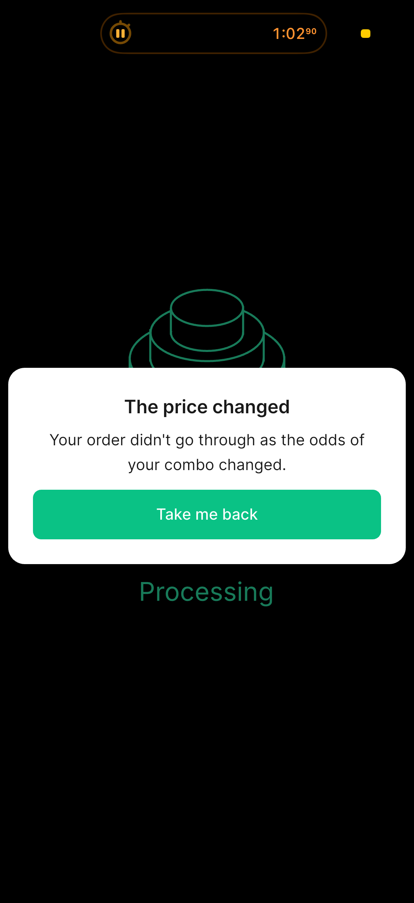

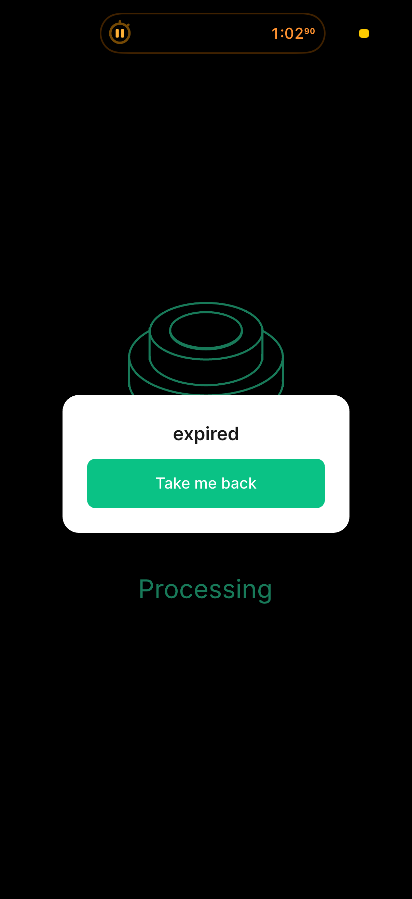

**User goal:**  
- Create combo bets combining multiple predictions
- Select Yes/No for each prediction in combo
- Review combo before placing trade
- Complete combo trade transaction

**Kalshi flow (steps):**
1. User navigates to Sports category and selects "Combo" sub-navigation
2. User starts creating combo bet
3. **Combo creation interface displays:**
   - Header: "Combo" title with X icon (close button)
   - Event time: "Today @ 8:15PM EST"
   - Multiple prediction cards (scrollable list)
4. **For each prediction card:**
   - User sees prediction prompt (e.g., "Over 47.5 points scored")
   - Number is highlighted in green (e.g., "47.5")
   - Yes/No buttons (light purple for selected, darker purple for unselected)
   - Percentage displayed on right (e.g., "37%", "40%", "41%")
   - "Alternate total" dropdown below (gray text with chevron)
5. User selects Yes/No for each prediction
6. User can scroll to see more predictions
7. **Team/Event section:**
   - Shows team/event information (e.g., red football helmet icon, "Tampa Bay")
   - "@" symbol indicating opponent/location
8. **Bottom action bar:**
   - "Trade $10" with green double arrow ">>" and "$94" (potential payout)
   - "Review combo" with "6 predictions" (summary)
   - "Continue" button (green, prominent)
9. User clicks "Continue" to proceed to review
10. **If user clicks X (close button):**
    - Combo creation screen closes
    - **BUG:** Previous picks are NOT saved/preloaded
    - **User feedback:** "If I X out of combos and go back in my previous picks that I didn't place aren't preloaded"
    - User must start over if they return
11. **After clicking Continue:**
    - Review/confirmation screen appears
    - Shows "9 predictions pay $1,204.00"
    - Shows "Cost: $36.00"
    - Lists all predictions in combo
    - "Tell your friends" option with upward arrow
    - "Tap to continue" instruction at bottom
12. **User attempts to place combo trade:**
    - **In high-speed live markets (sports), multiple errors can occur:**
      - **"Expired" error:** Modal appears with "expired" text and "Take me back" button
        - Happens multiple times in sequence
        - User must click "Take me back" and retry
      - **"The price changed" error:** Modal appears with message "Your order didn't go through as the odds of your combo changed."
        - Happens when odds change during order placement
        - "Take me back" button to retry
      - **Multiple retry attempts:** User may need to try 4-5 times if odds keep changing
        - **User feedback:** "I have to try placing 4-5 times if the odds constantly change"
        - Frustrating experience in volatile markets
13. **If trade succeeds:** Combo is placed and user sees confirmation

**Observed behavior:**
- **Mobile interface:**
  - Light green and white color scheme
  - Card-based layout for predictions
  - Scrollable prediction list
- **Header:**
  - "Combo" title (centered)
  - X icon (left) for closing
  - Event time: "Today @ 8:15PM EST"
- **Prediction cards:**
  - **Structure:**
    - Prediction prompt (e.g., "Over 47.5 points scored")
    - Number highlighted in green (e.g., "47.5")
    - Yes/No selection buttons
      - Light purple: Selected option
      - Darker purple: Unselected option
    - Percentage on right (e.g., "37%", "40%", "41%")
    - "Alternate total" dropdown (gray text with chevron icon)
  - **Examples shown:**
    - "Over 47.5 points scored" - 37% (Yes selected)
    - "Over 48.5 points scored" - 40% (Yes selected)
    - "Over 49.5 points scored" - 41% (Yes selected)
- **Team/Event section:**
  - Red American football helmet icon
  - "Tampa Bay" team name
  - "@" symbol (likely indicating opponent)
- **Bottom action bar:**
  - **Left side:**
    - "Trade $10" (trade amount)
    - Green double arrow ">>"
    - "$94" (potential payout/value)
    - "Review combo" with right-pointing chevron
    - "6 predictions" (summary count)
  - **Right side:**
    - "Continue" button (green, prominent)
- **Confirmation screen:**
  - **Header:**
    - "9 predictions pay $1,204.00" (large, prominent)
    - "Cost: $36.00" (below header)
    - "Kalshi COMBO" watermark/logo (centered, faded)
  - **Prediction list:**
    - Organized by sport:
      - **Pro Basketball:**
        - "Atlanta vs Charlotte"
          - "Atlanta to win" (light gray dot)
      - **Pro Football:**
        - "Los Angeles R at Seattle"
          - Multiple predictions (vertical line connecting):
            - "Los Angeles R to win"
            - "Matthew Stafford: 175+ passing yards"
            - "Sam Darnold: 175+ passing yards"
            - "Puka Nacua: 6+ receptions"
            - "Jaxon Smith-Njigba: 5+ receptions"
            - "Kyren Williams: 56+ rushing yards"
            - "Zach Charbonnet: 20+ rushing yards"
            - "No · Over 47.5 points scored"
  - **Bottom:**
    - "Tell your friends" with upward arrow icon
    - "Tap to continue" instruction (centered)
- **Cross-sport combinations:**
  - Combo includes both Pro Basketball and Pro Football predictions
  - Demonstrates cross-sport capability (NBA/NFL only)
- **State management issue:**
  - **BUG:** If user closes combo creation (X button), previous picks are NOT saved
  - User must re-select all predictions if they return
  - **User feedback:** "If I X out of combos and go back in my previous picks that I didn't place aren't preloaded"
  - **Impact:** Frustrating UX - user loses work if they accidentally close or need to check something
- **Error handling in live markets:**
  - **"Expired" error modal:**
    - Dark background with white modal
    - "expired" text (centered, black)
    - "Take me back" button (green, prominent)
    - "Processing" text below modal (green)
    - Occurs multiple times in sequence
    - User must click "Take me back" and retry
  - **"The price changed" error modal:**
    - Dark background with white modal
    - Title: "The price changed" (bold black text)
    - Message: "Your order didn't go through as the odds of your combo changed." (regular black text)
    - "Take me back" button (teal-green, prominent)
    - "Processing" text below modal (teal-green)
    - Occurs when odds change during order placement
    - User must retry order
- **High-speed market issues:**
  - **Multiple retry attempts:** User may need to try 4-5 times if odds keep changing
    - **User feedback:** "I have to try placing 4-5 times if the odds constantly change"
    - Happens frequently in volatile live sports markets
    - Frustrating experience
  - **Expected but problematic:** Price movements are expected in live markets, but current error handling creates poor UX
- **Odds synchronization bugs:**
  - **B-006: Odds not updating correctly when adding to combo**
    - **User feedback:** "When I click on 2 combos the odds didn't change correctly"
    - **Example:** Defense scoring a touchdown - odds were correct on the page but when adding to combo, payout was glitched
    - **Impact:** User must double-check that payout is correct when adding predictions
    - **User behavior:** "Caused me to always double check that when I add something to my prediction combo it doesn't add the correct payout if a single prediction is glitched"
  - **B-007: Payout reverts to $10 when odds refresh**
    - **User feedback:** "When I add something and odds refresh it reverts to $10"
    - User sets custom trade amount
    - When odds refresh, trade amount resets to default $10
    - User must re-enter trade amount
- **Combo restrictions:**
  - **Kalshi rules:** Not allowed to combine certain props together
  - **User feedback:** "There are some rules with Kalshi not allowed certain props to be together based on what they allowed/don't allow"
  - Restrictions based on Kalshi's rules (not clearly communicated)
  - User may not know which props can/cannot be combined until they try

**What I like:**
- **Clear prediction cards:** Easy to see each prediction and make selections
- **Visual feedback:** Selected/unselected states are clear (light vs dark purple)
- **Percentage display:** Shows odds for each prediction
- **Summary bar:** Shows trade amount, potential payout, and prediction count
- **Cross-sport support:** Can combine NBA and NFL predictions
- **Confirmation screen:** Clear display of all predictions, payout, and cost
- **Organized by sport:** Predictions grouped by sport type

**What I don't like / confusion:**
- **State persistence bug:**
  - **User feedback:** "If I X out of combos and go back in my previous picks that I didn't place aren't preloaded"
  - Previous selections are lost when closing combo creation
  - User must start over if they return
  - **Frustrating:** Loses user's work and time
- **High-speed market errors:**
  - **Multiple expired errors:** "Expired" error happens multiple times (2-3 times) before price changed error
  - **Price changed errors:** "The price changed" error when odds change during placement
  - **Multiple retry attempts:** User must try 4-5 times if odds keep changing
  - **User feedback:** "I have to try placing 4-5 times if the odds constantly change"
  - **Expected but problematic:** Price movements are expected in live markets, but current error handling creates poor UX
  - **Frustrating:** User must repeatedly retry, losing time and potentially missing desired odds
- **Odds synchronization bugs:**
  - **Odds not updating correctly:** When adding prediction to combo, odds/payout may be incorrect
  - **Example:** Defense scoring touchdown - odds correct on page, payout glitched in combo
  - **User feedback:** "Caused me to always double check that when I add something to my prediction combo it doesn't add the correct payout if a single prediction is glitched"
  - **Payout reverts to $10:** When odds refresh, custom trade amount reverts to default $10
  - **User feedback:** "When I add something and odds refresh it reverts to $10"
- **Combo restrictions:**
  - **Unclear rules:** Not clear which props can/cannot be combined
  - **User feedback:** "There are some rules with Kalshi not allowed certain props to be together based on what they allowed/don't allow"
  - User may not know restrictions until they try to combine props
  - No clear indication of which props are restricted
- **No draft saving:** Can't save combo as draft to complete later
- **No undo:** Can't undo selections easily
- **Alternate total dropdown:** Not clear what options are available without clicking
- **No prediction limit indicator:** Doesn't show maximum number of predictions allowed

**Edge cases / bugs:**
- **B-005: Combo picks not saved when closing creation screen**
  - User creates combo with multiple predictions
  - User clicks X to close combo creation
  - User returns to combo creation
  - Previous picks are NOT preloaded
  - User must start over
  - **User feedback:** "If I X out of combos and go back in my previous picks that I didn't place aren't preloaded"
- **B-006: Odds not updating correctly when adding prediction to combo**
  - User views prediction on market page - odds are correct
  - User adds prediction to combo
  - Odds/payout in combo are incorrect (glitched)
  - **Example:** Defense scoring a touchdown - odds correct on page, payout glitched in combo
  - **User feedback:** "When I click on 2 combos the odds didn't change correctly... caused me to always double check that when I add something to my prediction combo it doesn't add the correct payout if a single prediction is glitched"
- **B-007: Payout reverts to $10 when odds refresh**
  - User sets custom trade amount (e.g., $20, $50)
  - Odds refresh/update
  - Trade amount reverts to default $10
  - User must re-enter trade amount
  - **User feedback:** "When I add something and odds refresh it reverts to $10"
- **B-008: Multiple expired/price changed errors in high-speed markets**
  - In volatile live sports markets, user encounters multiple errors
  - "Expired" error happens multiple times (2-3 times)
  - Then "The price changed" error appears
  - User must retry 4-5 times before order goes through
  - **User feedback:** "I have to try placing 4-5 times if the odds constantly change"
  - **Expected but problematic:** Price movements are expected, but error handling creates poor UX
- What if user selects maximum predictions? Is there a limit?
- What if user wants to remove a prediction? How do they do it?
- What if user wants to change a Yes/No selection? Can they toggle?
- What if user tries to combine restricted props? Is error message clear?

**Builder hypothesis (why they did it):**
- **Mobile-first design:** Card-based layout works well on mobile
- **Clear selection interface:** Yes/No buttons make selections obvious
- **Progressive disclosure:** Shows predictions one at a time, scrollable
- **Summary bar:** Keeps trade info visible while scrolling
- **Confirmation step:** Ensures user reviews before placing trade
- **State management:** May have intentionally not saved state to prevent confusion, but creates frustration

**Opinion Kings implications:**
- **Copy:**
  - Card-based prediction selection interface
  - Yes/No button selection
  - Percentage display for each prediction
  - Summary bar with trade amount and payout
  - Confirmation screen with all predictions listed
  - Cross-sport combination support (NBA/NFL)
- **Avoid:**
  - Not saving picks when closing (state persistence bug)
  - No draft saving
  - No undo functionality
- **Beat:**
  - **State persistence:** Save combo picks when user closes creation screen
    - Store selections in local storage or session state
    - Preload previous picks when user returns
    - Don't lose user's work
  - **Draft saving:** Allow users to save combo as draft
    - Save incomplete combos
    - Return to complete later
    - Multiple drafts support
  - **Undo/redo:** Allow users to undo selections
  - **Remove prediction:** Easy way to remove predictions from combo
  - **Edit selections:** Allow changing Yes/No selections easily
  - **Prediction limit indicator:** Show maximum predictions allowed
  - **Combo templates:** Save favorite combo structures
  - **Quick add:** Add predictions from recent combos
  - **Combo sharing:** Share combo structure with friends
  - **High-speed market handling (CRITICAL):**
    - **Auto-retry mechanism:** Automatically retry order if expired (with user confirmation)
    - **Odds locking:** Lock odds for short period (5-10 seconds) when user starts combo creation
    - **Better error handling:** Combine multiple errors into single message, reduce retry attempts
    - **Faster processing:** Optimize combo order processing to reduce timeout
    - **Odds tolerance:** Allow small odds changes without rejecting order
    - **Progress indicator:** Show order processing status instead of just errors
    - **Smart retry:** Automatically retry with updated odds if price changed slightly
  - **Odds synchronization fixes:**
    - **Real-time odds sync:** Ensure odds in combo match market page in real-time
    - **Odds validation:** Validate odds match before allowing trade
    - **Refresh mechanism:** Add "Refresh odds" button to update combo odds
    - **Odds discrepancy warning:** Show warning if odds have changed significantly
    - **Persist trade amount:** Don't reset trade amount when odds refresh
  - **Combo restrictions clarity:**
    - **Clear communication:** Show which props can/cannot be combined
    - **Restriction indicators:** Visual indicators for restricted props
    - **Help text:** Explain why certain props can't be combined
    - **Prevent invalid combos:** Disable or warn when trying to combine restricted props
- **Implementation notes:**
  - **Combo creation interface:**
    - Card-based layout for predictions
    - Yes/No button selection
    - Store selections in state
    - **CRITICAL:** Save state to local storage or session
    - Restore state when user returns
  - **State management:**
    - Store selected predictions (prediction ID, Yes/No selection)
    - Store in local storage or session storage
    - Restore when combo creation screen opens
    - Clear state only after successful trade
  - **Prediction cards:**
    - Display prediction prompt
    - Highlight key numbers (green)
    - Show Yes/No buttons with selection state
    - Display percentage/odds
    - Show alternate options dropdown
  - **Summary bar:**
    - Calculate total trade amount
    - Calculate potential payout
    - Count selected predictions
    - Update in real-time as selections change
  - **Confirmation screen:**
    - List all predictions organized by sport
    - Show total payout and cost
    - Show "Tell your friends" option
    - Final "Tap to continue" to place trade
  - **Cross-sport support:**
    - Allow combining NBA and NFL predictions
    - Validate that only NBA/NFL predictions are included
    - Group predictions by sport in confirmation
- **Metrics:**
  - Combo creation start rate
  - Combo completion rate (how many users complete combos they start?)
  - Combo abandonment rate (how many users close without completing?)
  - Average predictions per combo
  - Cross-sport combo rate (how many combos include multiple sports?)
  - State restoration usage (how often users return to incomplete combos?)
  - Combo trade success rate

### Orderbook Popup for Prediction Details

**Feature category:** Trading / Order Ticket / Market Data

**Screenshots:**  
- 051: `051-order-ticket-orderbook-popup.png` - Orderbook popup showing Trade Yes tab with orderbook (Asks and Bids)
- 052: `052-order-ticket-orderbook-graph-view.png` - Orderbook popup showing Graph tab with price history
- 053: `053-order-ticket-orderbook-basics-help.png` - Order book basics help popup accessed via question icon
- 054: `054-order-ticket-orderbook-settings-menu.png` - Orderbook settings menu showing view options (Traditional, Two sided, Maker only, Taker only)
- 055: `055-order-ticket-orderbook-graph-multi-prediction-bug.png` - Graph view showing multi-prediction lines and cutoff bottom navigation (BUG)

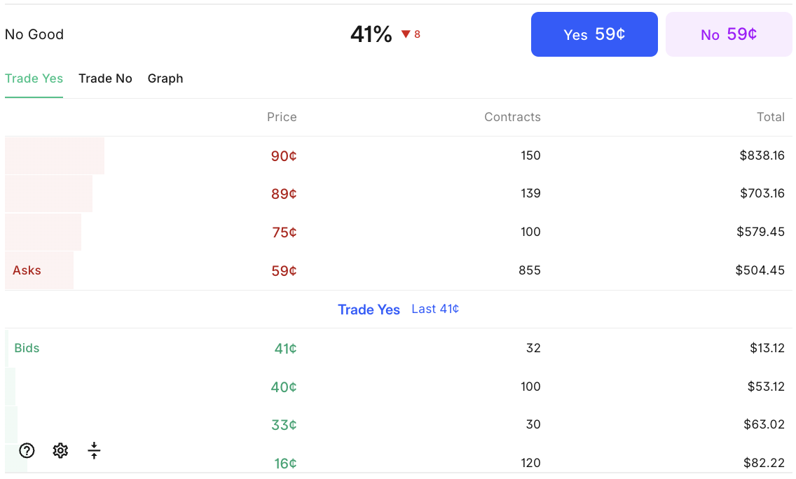

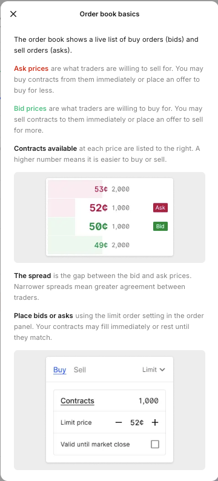

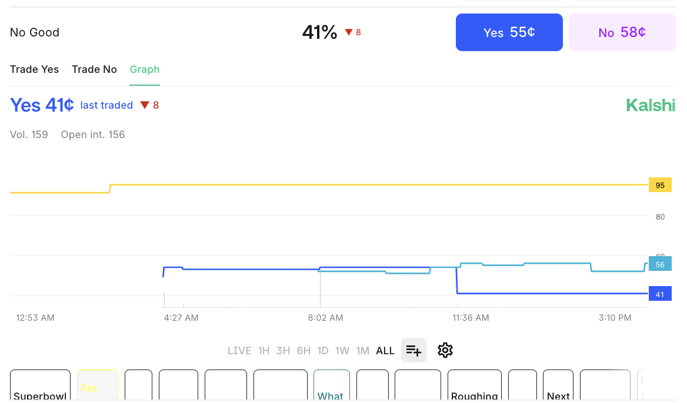

**User goal:**  
- View detailed orderbook for specific prediction
- See current market depth (asks and bids)
- Analyze price history for prediction
- Switch between Yes and No orderbooks
- Make informed trading decisions based on market depth

**Kalshi flow (steps):**
1. User is on market page with list of predictions (e.g., mentions market)
2. User clicks on the prediction word itself (e.g., "No Good", "What a Catch") - NOT the Yes/No buttons
3. Orderbook popup appears
4. Popup shows three tabs: "Trade Yes", "Trade No", "Graph"
5. **Trade Yes Tab (Default):**
   - Shows orderbook for Yes contracts
   - Displays Asks (sell orders) and Bids (buy orders)
   - Shows current price, percentage, and change
   - Yes/No price buttons at top
6. **Trade No Tab:**
   - User clicks "Trade No" tab
   - Shows orderbook for No contracts
   - Same structure as Trade Yes but for No side
7. **Graph Tab:**
   - User clicks "Graph" tab
   - Shows price history graph for the prediction
   - **Multi-prediction graph:**
     - Initially shows 3 lines (for 3 different predictions)
     - Each line has + icon indicating can add more predictions
     - User can click on other prediction words to add them to graph
     - Clicking a word adds that prediction's line to the graph
     - Similar to multi-market graph feature on main chart
   - **Time range options:** LIVE, 1H, 3H, 6H, 1D, 1W, 1M, ALL (more options than main chart)
   - **Interactive graph states:**
     - As user scrolls/hovers through graph, volume and open interest change with time
     - Different states show different volume and open interest values
     - Dynamic updates based on selected time point
   - Shows volume and open interest (updates based on time position)
   - Current price highlighted
   - **Bottom navigation (BUG):**
     - Bottom category tabs (e.g., "Superbowl", "Pro", "What", "Roughing", "Next") are cutoff
     - Display is very buggy
     - No icons visible - looks incomplete
     - Interface looks odd and unprofessional
     - See BUG_LOG B-002 for details
8. **Orderbook Help:**
   - User clicks question mark icon (?) in orderbook
   - "Order book basics" help popup appears
   - Educational content explaining:
     - What orderbook shows (buy orders/bids and sell orders/asks)
     - Ask prices (red) - what traders are willing to sell for
     - Bid prices (green) - what traders are willing to buy for
     - Contracts available at each price
     - The spread (gap between bid and ask)
     - How to place orders using limit orders
   - Visual examples and diagrams
   - X icon to close
9. **Orderbook Settings:**
   - User clicks gear icon (settings) in orderbook
   - Settings menu appears with view options:
     - **Traditional view** (selected by default) - Standard orderbook view
     - **Two sided view** - Alternative orderbook layout
     - **Maker only** - Show only maker orders
     - **Taker only** - Show only taker orders
   - Radio button selection interface
   - User selects desired view option
10. **Recenter Orderbook:**
    - User clicks sort/filter icon (two horizontal lines with arrow) in orderbook
    - Recenters orderbook view (scrolls back to current price/middle)
    - Useful when orderbook is scrolled away from current price

**Observed behavior:**
- **Trigger:** Clicking on prediction word (not Yes/No buttons) opens popup
- **Popup Header:**
  - Prediction name (e.g., "No Good")
  - Current percentage (e.g., "41%") with change indicator (red down arrow "8")
  - Yes/No price buttons (e.g., "Yes 59¢", "No 59¢")
- **Tab Navigation:**
  - "Trade Yes" tab (selected, green underline)
  - "Trade No" tab (unselected)
  - "Graph" tab (unselected)
  - Clicking tabs switches view
- **Orderbook View (Trade Yes/Trade No):**
  - **Asks Section (Upper):**
    - Label "Asks" on left (vertical)
    - Table columns: Price, Contracts, Total
    - Prices in red (e.g., 90¢, 89¢, 75¢, 59¢)
    - Contract quantities (e.g., 150, 139, 100, 855)
    - Total values in dollars (e.g., $838.16, $703.16, $579.45, $504.45)
  - **Mid-Section Separator:**
    - Horizontal line
    - "Trade Yes Last 41¢" or "Trade No Last [price]¢" in blue text
    - Shows last traded price
  - **Bids Section (Lower):**
    - Label "Bids" on left (vertical)
    - Table columns: Price, Contracts, Total
    - Prices in green (e.g., 41¢, 40¢, 33¢, 16¢)
    - Contract quantities (e.g., 32, 100, 30, 120)
    - Total values in dollars (e.g., $13.12, $53.12, $63.02, $82.22)
  - **Scrollable Orderbook:**
    - Orderbook is scrollable if there are many orders
    - Can scroll through asks and bids
    - Shows more orders than visible in viewport
  - **Bottom Icons:**
    - **Question mark icon (?):** Opens "Order book basics" help popup
    - **Gear icon (settings):** Opens orderbook view settings menu
    - **Sort/filter icon (two horizontal lines with arrow):** Recenters orderbook view (not sort/filter)
- **Graph View:**
  - **Header:**
    - Prediction name: "No Good"
    - Current percentage: "41%" with change (red down arrow "8")
    - Yes/No price buttons
  - **Price Display:**
    - "Yes 41¢" in large blue text
    - "last traded" with change indicator (red down arrow "13")
    - Market data: "Vol. 159" (Volume 159), "Open int. 156" (Open interest 156)
  - **Graph:**
    - Blue line graph showing price over time
    - Y-axis: Price points (52, 48, 44, 40)
    - X-axis: Time labels (12:54 AM, 4:27 AM, 8:01 AM, 11:34 AM, 3:08 PM)
    - Current price highlighted (blue rectangle at 41)
    - Shows price movements and trends
  - **Time Range Selector:**
    - Options: "LIVE", "1H", "3H", "6H", "1D", "1W", "1M", "ALL"
    - More options than main chart (includes LIVE, 1H, 3H, 6H)
    - "ALL" selected (highlighted)
    - Filter icon and settings icon
  - **Multi-Prediction Graph:**
    - Shows multiple prediction lines on same graph (e.g., 3 lines initially)
    - Each line has + icon indicating can add more
    - User can click on prediction words to add them to graph
    - Clicking word adds that prediction's line
    - Different colored lines for each prediction
    - Labels show prediction names and percentages
  - **Bottom Navigation (BUG - B-002):**
    - Category tabs at bottom (e.g., "Superbowl", "Pro", "What", "Roughing", "Next")
    - **Cutoff and buggy:** Tabs are cut off, display is broken
    - **No icons:** Icons not visible, looks incomplete
    - **Odd appearance:** Interface looks unprofessional
    - Functionality works (can add predictions) but UI is broken
  - **Interactive Graph States:**
    - As user scrolls/hovers through graph timeline, volume and open interest update
    - Different time points show different volume and open interest values
    - Dynamic state changes based on selected time position
    - Shows historical volume and open interest for that time point

**What I like:**
- **Detailed market depth:** Orderbook shows actual buy/sell orders with quantities
- **Separate Yes/No views:** Can see orderbook for both sides
- **Graph integration:** Can switch to graph view for price history
- **Current price display:** Shows last traded price clearly
- **Market data:** Volume and open interest provide context
- **Time range options:** Multiple timeframes for graph analysis (including LIVE, 1H, 3H, 6H)
- **Visual organization:** Asks (red) and Bids (green) color coding is intuitive
- **Interactive graph:** Volume and open interest change as you scroll through time - helpful for analysis
- **Orderbook help:** Educational content explains orderbook concepts
- **View customization:** Settings allow different orderbook views (Traditional, Two sided, Maker only, Taker only)
- **Recenter button:** Easy way to return to current price in orderbook
- **Scrollable orderbook:** Can view all orders even if many exist

**What I don't like / confusion:**
- **Trigger unclear:** Not obvious that clicking prediction word opens orderbook (vs Yes/No buttons)
- **No close button visible:** Unclear how to close popup
- **Orderbook complexity:** May be overwhelming for casual users
- **Graph time ranges different:** Graph has different time ranges (LIVE, 1H, 3H, 6H) vs main chart (1D, 1W, 1M, ALL) - inconsistent
- **No order placement:** Can't place orders directly from orderbook (have to use main trading interface)
- **Recenter icon unclear:** Sort/filter icon is actually recenter button - icon doesn't match function
- **Settings options unclear:** What's the difference between Traditional, Two sided, Maker only, Taker only views?

**Edge cases / bugs:**
- **B-002:** Orderbook graph view bottom navigation cutoff and buggy display (see BUG_LOG B-002)
  - Bottom category tabs are cutoff
  - Display is very buggy
  - No icons visible - looks incomplete
  - Interface looks odd and unprofessional
- What if there are no asks or bids? Does it show empty state?
- What if orderbook updates while viewing? Is it real-time?
- What if user clicks prediction word while orderbook is open?
- What if user adds too many predictions to graph? Does it become cluttered?

**Builder hypothesis (why they did it):**
- **Market depth transparency:** Orderbook shows real market depth, builds trust
- **Advanced trading:** Provides detailed information for sophisticated traders
- **Price discovery:** Helps users understand where prices come from
- **Separate Yes/No:** Different orderbooks for each side shows market sentiment
- **Graph integration:** Price history helps users make informed decisions
- **Click on word vs buttons:** Distinguishes between quick trade (buttons) vs detailed analysis (word click)
- **Professional trading tools:** Orderbook is standard in professional trading platforms

**Opinion Kings implications:**
- **Copy:**
  - Orderbook popup on prediction word click
  - Separate Yes/No orderbook views
  - Graph view integration
  - Asks/Bids color coding (red/green)
  - Last traded price display
  - Volume and open interest display
- **Avoid:**
  - Unclear trigger (clicking word vs buttons)
  - Different time ranges between graph views
  - No way to close popup
- **Beat:**
  - **Clear trigger indication:** Show tooltip or visual cue that prediction word is clickable
  - **Close button:** Add clear close button to popup
  - **Unified time ranges:** Use same time range options across all graph views
  - **Order placement from orderbook:** Allow clicking on orderbook prices to place orders
  - **Clearer recenter button:** Use better icon (e.g., target icon) for recenter function
  - **Settings explanations:** Add tooltips or descriptions for each view option (Traditional, Two sided, Maker only, Taker only)
  - **Graph interaction hints:** Show tooltip explaining that scrolling through time updates volume/open interest
  - **Real-time updates:** Show real-time orderbook updates
  - **Empty states:** Show helpful messages when no asks/bids
  - **Orderbook education:** Add help tooltip explaining orderbook
  - **Mobile optimization:** Ensure orderbook is usable on mobile
  - **Keyboard shortcuts:** Add keyboard shortcuts for tab switching
- **Implementation notes:**
  - **Popup trigger:**
    - Click handler on prediction word (not Yes/No buttons)
    - Open popup/modal overlay
    - Fetch orderbook data for selected prediction
  - **Tab navigation:**
    - "Trade Yes" tab - show Yes orderbook
    - "Trade No" tab - show No orderbook
    - "Graph" tab - show price history graph
    - Store selected tab in state
    - Update content based on selected tab
  - **Orderbook data:**
    - Fetch asks (sell orders) from orderbook API
    - Fetch bids (buy orders) from orderbook API
    - Sort asks by price (ascending - lowest first)
    - Sort bids by price (descending - highest first)
    - Calculate totals (price × contracts)
    - Real-time updates via WebSocket
  - **Orderbook display:**
    - Asks section (red prices) - top half
    - Last traded price separator (blue text)
    - Bids section (green prices) - bottom half
    - Columns: Price, Contracts, Total
    - Format prices in cents (e.g., "59¢")
    - Format totals in dollars (e.g., "$838.16")
    - **Scrollable:** Implement scrolling if many orders
    - **Recenter button:** Scroll back to current price/middle of orderbook
  - **Orderbook help:**
    - Question mark icon opens help popup
    - "Order book basics" educational content
    - Explain asks, bids, spread, contracts available
    - Visual examples and diagrams
    - Close button (X icon)
  - **Orderbook settings:**
    - Gear icon opens settings menu
    - View options:
      - Traditional view (default) - Standard orderbook layout
      - Two sided view - Alternative layout
      - Maker only - Show only maker orders (orders that add liquidity)
      - Taker only - Show only taker orders (orders that remove liquidity)
    - Radio button selection
    - Update orderbook display based on selection
  - **Graph view:**
    - Fetch price history for prediction
    - Display line graph with time on X-axis, price on Y-axis
    - Highlight current price
    - **Multi-prediction support:**
      - Show multiple prediction lines on same graph
      - Each line with different color and label
      - + icon on each line to add more predictions
      - Click handler on prediction words to add to graph
      - Store selected predictions in state
      - Update graph when predictions added/removed
    - **Interactive states:**
      - As user scrolls/hovers through graph, update volume and open interest
      - Fetch volume and open interest for selected time point
      - Display dynamic values based on time position
      - Show historical volume and open interest for that time
    - Time range selector (LIVE, 1H, 3H, 6H, 1D, 1W, 1M, ALL)
    - Update graph when time range changes
    - Update volume/open interest when scrolling through time
    - **Bottom navigation:**
      - Category tabs for selecting predictions
      - Ensure proper overflow handling (fix B-002 bug)
      - Proper icon loading and display
      - Test with various content lengths
  - **Popup management:**
    - Overlay/modal component
    - Close button or click outside to close
    - Prevent body scroll when open
    - Responsive design for mobile
- **Metrics:**
  - Orderbook popup open rate (how often users click prediction words)
  - Tab usage (Trade Yes vs Trade No vs Graph)
  - Time spent viewing orderbook
  - Orderbook to trade conversion rate (do users trade after viewing orderbook?)
  - Graph view usage rate
  - Time range selection patterns
  - Orderbook click-through rate (do users click on orderbook prices?)
  - User confusion rate (do users understand orderbook?)
  - Orderbook help usage rate (how often users click question icon?)
  - Settings menu usage rate (how often users change view options?)
  - Recenter button usage rate (how often users recenter orderbook?)
  - Graph interaction rate (how often users scroll through time to see different states?)
  - Time range selection patterns (which ranges are most used?)
  - Volume/open interest view rate (do users notice dynamic updates?)
  - Multi-prediction graph usage rate (how often users add multiple predictions?)
  - Bottom navigation interaction rate (if fixed)
  - Graph bug impact (does B-002 affect user experience?)

### Buy/Sell Interface with Contracts Dropdown

**Feature category:** Trading / Order Ticket

**Screenshots:**  
- 047: `047-order-ticket-buy-interface.png` - Buy interface showing Buy tab selected and contracts dropdown
- 048: `048-order-ticket-sell-interface.png` - Sell interface showing Sell tab selected and position display
- 049: `049-order-ticket-sell-contracts-dropdown.png` - Sell contracts dropdown showing "Sell in contracts" and "Limit order"
- 050: `050-order-ticket-buy-contracts-dropdown.png` - Buy contracts dropdown showing "Buy in dollars", "Buy in contracts", and "Limit order"

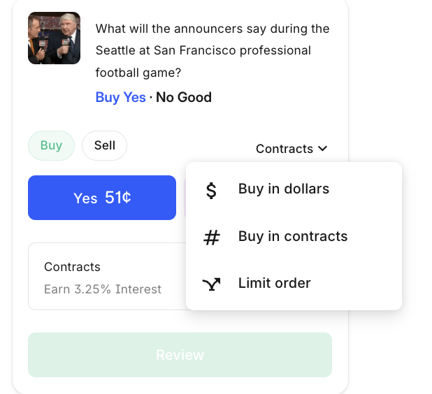

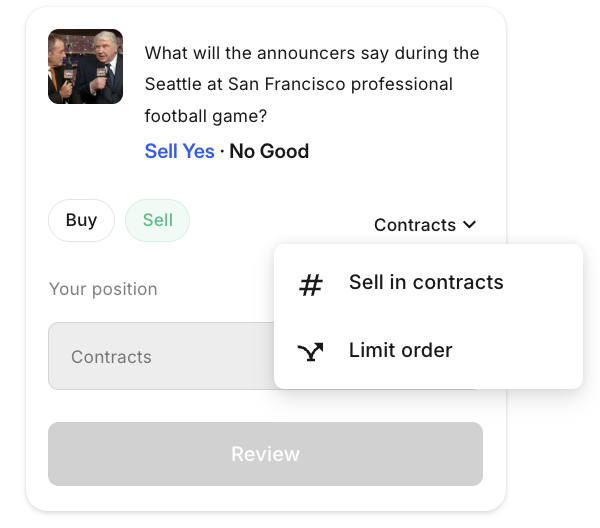

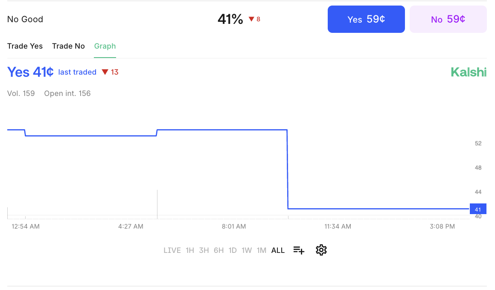

**User goal:**  
- Place buy or sell orders on market contracts
- Choose order type (market order vs limit order)
- Choose order denomination (dollars vs contracts)
- Understand current position when selling
- Review order before submission

**Kalshi flow (steps):**
1. User is on market page with trading interface on right sidebar
2. User sees "Buy" and "Sell" tabs
3. **Buy Tab (Default):**
   - "Buy" tab is selected (light green background, white text)
   - Shows "Buy Yes · [Prediction Name]" or "Buy No · [Prediction Name]"
   - Contracts dropdown shows options:
     - **"Buy in dollars"** (dollar sign icon)
     - **"Buy in contracts"** (hashtag icon) - **DEFAULT SELECTION**
     - **"Limit order"** (Y-shaped/branching icon)
   - Defaults to "Buy in contracts"
   - Price buttons: "Yes [price]¢" (blue) and "No [price]¢" (purple)
   - Contracts input field shows "0"
   - "Earn 3.25% Interest" displayed
   - "Review" button at bottom
4. **Sell Tab:**
   - User clicks "Sell" tab
   - "Sell" tab becomes selected (light green background, white text)
   - "Buy" tab becomes unselected (white background, dark text)
   - Interface changes to show:
     - "Sell Yes · [Prediction Name]" or "Sell No · [Prediction Name]"
     - "Your position" section showing "None" (if no position) or position details
     - Contracts dropdown shows different options:
       - **"Sell in contracts"** (hashtag icon)
       - **"Limit order"** (Y-shaped/branching icon)
     - No "Sell in dollars" option (only contracts or limit order)
   - Price buttons remain (Yes/No prices)
   - Contracts input field
   - "Review" button at bottom
5. **Contracts Dropdown Selection:**
   - User clicks "Contracts" dropdown
   - Dropdown opens showing available options
   - User selects desired option
   - Interface updates based on selection
   - For Buy: Can choose dollars, contracts, or limit order
   - For Sell: Can choose contracts or limit order

**Observed behavior:**
- **Buy Tab:**
  - Selected state: Light green background, white text
  - Unselected state: White background, dark text
  - Shows "Buy Yes · [Prediction Name]" or "Buy No · [Prediction Name]"
  - Contracts dropdown default: "Buy in contracts"
  - **Contracts dropdown options:**
    - "Buy in dollars" ($ icon) - Market order denominated in dollars
    - "Buy in contracts" (# icon) - Market order denominated in contracts (DEFAULT)
    - "Limit order" (Y icon) - Limit order (set price, may not execute)
  - Price buttons: Large blue "Yes [price]¢" and purple "No [price]¢"
  - Contracts input: Shows "0" initially
  - **Input validation:**
    - **Buy/Sell in contracts:**
      - Minimum: 1 contract
      - Must be whole numbers (integers only)
      - Cannot enter fractional contracts (e.g., 1.5, 2.3)
    - **Buy in dollars:**
      - Minimum: $1.00
      - Can enter fractional dollars (e.g., $1.2, $1.3, $2.5)
      - Must be >= $1.00
      - **Contract calculation:** Number of contracts purchased must be whole number
      - Example: If $1.2 buys 2.4 contracts at current price, user gets 2 contracts (rounded down to whole number)
  - Interest display: "Earn 3.25% Interest"
  - Review button: Light green, inactive until input provided and validation passes
- **Sell Tab:**
  - Selected state: Light green background, white text
  - Unselected state: White background, dark text
  - Shows "Sell Yes · [Prediction Name]" or "Sell No · [Prediction Name]"
  - **"Your position" section:**
    - Shows "None" if user has no position
    - **If user has position:** Shows how many contracts user currently has for that specific prediction
    - Position displayed here matches what shows in Portfolio/Positions tab
    - Allows user to see what they can sell before placing order
    - User can sell if they have a position (enabled when position exists)
  - **Contracts dropdown options (different from Buy):**
    - "Sell in contracts" (# icon) - Market order to sell contracts
    - "Limit order" (Y icon) - Limit order to sell (set price, may not execute)
    - **No "Sell in dollars" option** - Only contracts or limit order
  - Price buttons: Same Yes/No prices as Buy tab
  - Contracts input: Shows "0" initially
  - **Input validation (same as Buy tab):**
    - **Sell in contracts:**
      - Minimum: 1 contract
      - Must be whole numbers (integers only)
      - Cannot sell more contracts than user has in position
      - Cannot enter fractional contracts
  - Review button: Light green, inactive until input provided and validation passes
- **Tab Switching:**
  - Clicking Buy/Sell tabs immediately changes interface
  - Contracts dropdown options change based on selected tab
  - Position information appears/disappears based on tab
  - Price buttons remain same (current market prices)

**What I like:**
- **Clear tab separation:** Buy and Sell are clearly separated
- **Visual state indication:** Selected tab is clearly highlighted
- **Position display:** Shows "Your position" when selling (helpful context)
- **Multiple order types:** Options for market orders and limit orders
- **Flexible denomination:** Can buy in dollars or contracts
- **Limit order option:** Allows users to set price targets

**What I don't like / confusion:**
- **Default to contracts (marketing-driven):** Defaults to "Buy in contracts" which is more expensive for customers (better for platform revenue)
- **No "Sell in dollars":** Sell tab only offers contracts or limit order, no dollar denomination
- **Limit order risk unclear:** No clear explanation that limit orders may never execute
- **Price difference unclear:** Not clear how "Buy in dollars" vs "Buy in contracts" affects pricing
- **Review button inactive:** Button appears inactive but no clear indication of what's needed to activate
- **Validation rules unclear:** Minimums and rules not clearly displayed before user enters invalid input
- **Fractional contract rounding:** When buying in dollars, fractional contracts are rounded down - not clearly explained
- **Position sync:** Unclear if position in Sell tab updates in real-time or matches Portfolio tab

**Edge cases / bugs:**
- None observed (only log bugs when explicitly identified)
- **Position validation:** What if user has position but tries to sell more than they have? (Should be prevented by validation)
- **Fractional contracts:** What happens if dollar amount results in fractional contracts? (Rounded down to whole number)
- **Minimum validation:** What if user enters $0.99 for dollar purchase? (Should show error - minimum $1)
- **Contract validation:** What if user enters 0.5 contracts? (Should show error - must be whole number >= 1)
- What if limit order never executes? Is there a timeout?
- What if user switches tabs while entering order amount?
- **Position sync:** Position shown in Sell tab should match Portfolio/Positions tab

**Builder hypothesis (why they did it):**
- **Default to contracts (marketing strategy):** Defaulting to "Buy in contracts" is better for platform revenue - contracts are typically more expensive than dollar-denominated orders
- **Limit order for smart customers:** Limit orders allow customers to catch better prices, but risk of non-execution protects platform from unfavorable trades
- **No "Sell in dollars":** Selling is simpler - users sell contracts they own, so dollar denomination less relevant
- **Tab separation:** Clear separation between buying and selling reduces confusion
- **Position display:** Shows position when selling so users know what they can sell
- **Multiple order types:** Accommodates different user preferences and trading strategies
- **Revenue optimization:** Defaulting to contracts maximizes platform revenue while still offering alternatives

**Opinion Kings implications:**
- **Copy:**
  - Buy/Sell tab separation
  - Contracts dropdown with multiple options
  - Position display when selling
  - Limit order option
  - Visual state indication for selected tab
- **Avoid:**
  - Defaulting to more expensive option (contracts) - this is marketing-driven, not user-friendly
  - Unclear limit order risks
  - No explanation of price differences between order types
- **Beat:**
  - **Transparent pricing:** Show price difference between "Buy in dollars" vs "Buy in contracts"
  - **User-friendly default:** Default to most cost-effective option for users (or let users set preference)
  - **Limit order education:** Explain limit order risks (may not execute) and benefits (better prices)
  - **Order type comparison:** Show side-by-side comparison of order types
  - **"Sell in dollars" option:** Consider adding dollar denomination for selling
  - **Clear activation criteria:** Show what's needed to activate Review button
  - **Order preview:** Show estimated cost/return before Review
  - **Smart defaults:** Remember user's preferred order type
  - **Limit order timeout:** Show expiration time for limit orders
  - **Better validation feedback:** Show clear error messages for validation failures
  - **Contract calculation display:** Show how many contracts will be purchased for dollar amount
  - **Position sync indicator:** Show when position is being updated/synced
  - **Validation hints:** Show minimums and rules before user enters invalid input
- **Implementation notes:**
  - **Buy/Sell tabs:**
    - Tab component with selected/unselected states
    - Click handler to switch tabs
    - Update interface based on selected tab
    - Store selected tab in state
  - **Contracts dropdown:**
    - Different options for Buy vs Sell
    - **Buy options:**
      - "Buy in dollars" - Market order, dollar denomination
      - "Buy in contracts" - Market order, contract denomination (DEFAULT)
      - "Limit order" - Limit order, set price
    - **Sell options:**
      - "Sell in contracts" - Market order, contract denomination
      - "Limit order" - Limit order, set price
    - Dropdown component with icons
    - Store selected option in state
    - Update interface based on selection
  - **Position display:**
    - Check user's position for selected market/prediction
    - Display "None" if no position
    - **If position exists:** Display number of contracts user has for that specific prediction
    - Position should match what's shown in Portfolio/Positions tab
    - Update when position changes (real-time sync)
    - Enable sell functionality when position exists
  - **Order type logic:**
    - **Market order (dollars):** Execute immediately at current market price, denominated in dollars
    - **Market order (contracts):** Execute immediately at current market price, denominated in contracts
    - **Limit order:** Set price target, execute only if price reaches target (may not execute)
  - **Pricing calculation:**
    - Calculate cost for each order type
    - Show price difference between options
    - Update as market prices change
  - **Input validation:**
    - **Buy/Sell in contracts:**
      - Minimum: 1 contract
      - Must be whole number (integer)
      - Validate: `amount >= 1 && amount % 1 === 0`
      - For Sell: Also validate `amount <= userPosition`
    - **Buy in dollars:**
      - Minimum: $1.00
      - Can be fractional (e.g., $1.2, $1.3, $2.5)
      - Validate: `amount >= 1.00`
      - Calculate contracts: `contracts = Math.floor(amount / contractPrice)`
      - Contracts must be whole number (round down)
      - Example: $1.2 at $0.50/contract = 2.4 contracts → 2 contracts
    - **Balance validation:**
      - Check sufficient balance for order
      - Show error if insufficient funds
    - **Position validation (Sell):**
      - Check user has position
      - Validate sell amount <= position
      - Show error if trying to sell more than owned
  - **Review button:**
    - Validate all inputs before enabling
    - Enable/disable based on validation
    - Show preview of order before submission
    - Display calculated number of contracts (for dollar purchases)
    - Display total cost/return
- **Metrics:**
  - Buy vs Sell tab usage
  - Order type selection rate (dollars vs contracts vs limit order)
  - Default selection impact (how many users stick with default "Buy in contracts"?)
  - Limit order execution rate (how often do limit orders execute?)
  - Limit order cancellation rate (users canceling unexecuted orders)
  - Order type conversion rate (which order type leads to more completed orders?)
  - Price difference impact (revenue difference between dollars vs contracts)
  - User preference patterns (do users change from default?)
  - Review button click rate
  - Order completion rate by order type
  - Input validation error rate (how often users enter invalid amounts?)
  - Minimum validation impact (how often users try to enter < $1 or < 1 contract?)
  - Fractional contract handling (how often dollar purchases result in fractional contracts?)
  - Position validation errors (how often users try to sell more than they have?)
  - Position display accuracy (does position in Sell tab match Portfolio tab?)

---

## Portfolio

### Watchlist and Portfolio Sort Functionality

**Feature category:** Portfolio / Watchlist / User Interface

**Screenshots:**  
- 059: `059-portfolio-watchlist-sort-menu.png` - Watchlist sort menu showing sorting options
- 060: `060-portfolio-portfolio-sort-menu.png` - Portfolio sort menu showing different sorting options

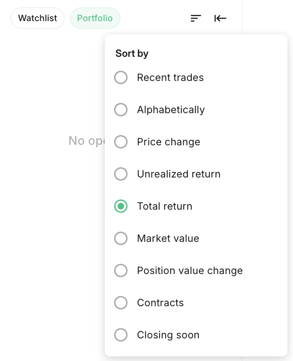

**User goal:**  
- Sort watchlist markets by different criteria
- Sort portfolio positions by different criteria
- Organize markets/positions for easier navigation
- Minimize/expand sidebar for more screen space

**Kalshi flow (steps):**
1. User is on homepage or market page with Watchlist/Portfolio sidebar visible
2. **Sort functionality:**
   - User clicks sort icon (three horizontal lines of varying lengths) in sidebar
   - "Sort by" dropdown menu appears
   - User selects sorting option (radio button selection)
   - Markets/positions reorder based on selection
3. **Minimize/Expand functionality:**
   - User clicks arrow icon (left-pointing arrow) in sidebar
   - Sidebar minimizes to left side (collapsed state)
   - User clicks three lines icon (hamburger menu) to expand sidebar again
   - Same behavior for both Watchlist and Portfolio tabs

**Observed behavior:**
- **Watchlist Sort Options:**
  - "Alphabetically" (selected by default in example)
  - "Price change"
  - "Closing soon"
  - Radio button selection interface
  - Selected option shows green filled circle
  - Unselected options show empty gray circles
- **Portfolio Sort Options:**
  - "Recent trades"
  - "Alphabetically"
  - "Price change"
  - "Unrealized return"
  - "Total return" (selected in example)
  - "Market value"
  - "Position value change"
  - "Contracts"
  - "Closing soon"
  - More options than Watchlist (9 vs 3)
  - Radio button selection interface
  - Selected option shows green filled circle
- **Sidebar Icons:**
  - Sort icon: Three horizontal lines of varying lengths (filter/sort icon)
  - Arrow icon: Left-pointing arrow (minimize/collapse)
  - Hamburger menu: Three horizontal lines (expand when minimized)
- **Minimize/Expand Behavior:**
  - Arrow icon minimizes sidebar to left
  - Sidebar collapses, showing only icons or minimal UI
  - Three lines icon appears when minimized
  - Clicking three lines expands sidebar again
  - Same functionality for both Watchlist and Portfolio tabs
  - State persists (sidebar stays minimized/expanded)

**What I like:**
- **Sort functionality:** Easy way to organize markets/positions
- **Different sort options:** Watchlist and Portfolio have appropriate options for their use cases
- **Minimize/expand:** Gives users control over screen space
- **Consistent behavior:** Same minimize/expand for both tabs
- **Visual feedback:** Clear selected state with green radio button
- **Quick access:** Sort icon easily accessible in sidebar

**What I don't like / confusion:**
- **Icon clarity:** Sort icon (three lines) vs expand icon (three lines) - same icon for different functions when minimized
- **No filter options:** Only sort, no filter (e.g., filter by category, filter by status)
- **No search in sidebar:** Can't search within watchlist/portfolio
- **Sort options limited:** Watchlist only has 3 options (could have more like Portfolio)
- **No custom sort:** Can't create custom sort orders
- **No sort indicator:** When sidebar is expanded, no clear indicator of current sort (unless dropdown is open)

**Edge cases / bugs:**
- What if user has many markets/positions? Does sort performance degrade?
- What if sort option changes while user is viewing? Does it auto-update?
- What if sidebar is minimized and user navigates to different page? Does state persist?
- What if user clicks sort icon while dropdown is open? Does it close or toggle?

**Builder hypothesis (why they did it):**
- **User organization:** Sort helps users find specific markets/positions
- **Different needs:** Watchlist and Portfolio have different use cases, so different sort options
- **Screen space:** Minimize/expand gives users control over layout
- **Consistency:** Same minimize/expand for both tabs reduces cognitive load
- **Progressive disclosure:** Sort options shown only when needed (dropdown)
- **Portfolio complexity:** More sort options for Portfolio because positions have more attributes (returns, value, contracts)

**Opinion Kings implications:**
- **Copy:**
  - Sort functionality for Watchlist and Portfolio
  - Minimize/expand sidebar functionality
  - Radio button selection interface
  - Context-appropriate sort options (different for Watchlist vs Portfolio)
  - Consistent minimize/expand behavior across tabs
- **Avoid:**
  - Same icon for different functions (sort vs expand)
  - Limited sort options (Watchlist only has 3)
  - No visual indicator of current sort when dropdown closed
- **Beat:**
  - **Filter options:** Add filter in addition to sort (e.g., filter by category, status, date)
  - **Search in sidebar:** Add search functionality within Watchlist/Portfolio
  - **More sort options for Watchlist:** Add options like "Recently added", "Volume", "Price"
  - **Sort indicator:** Show current sort option when dropdown is closed (e.g., "Sorted by: Alphabetically")
  - **Custom sort:** Allow users to create custom sort orders
  - **Multi-sort:** Allow sorting by multiple criteria (e.g., "Price change, then Alphabetically")
  - **Icon differentiation:** Use different icons for sort vs expand (or add labels)
  - **Sort persistence:** Remember user's sort preference
  - **Quick sort buttons:** Add quick sort buttons (e.g., "A-Z", "Price ↑", "Price ↓")
  - **Visual feedback:** Show animation when sorting changes
  - **Performance:** Optimize sort for large lists (virtual scrolling, pagination)
- **Implementation notes:**
  - **Sort functionality:**
    - Sort icon button in sidebar header
    - Dropdown menu component
    - Radio button selection interface
    - Store selected sort option in state
    - Apply sort to markets/positions list
    - Update list when sort changes
  - **Sort options:**
    - **Watchlist:**
      - Alphabetically (A-Z)
      - Price change (ascending/descending)
      - Closing soon (by market close time)
    - **Portfolio:**
      - Recent trades (by trade time)
      - Alphabetically (A-Z)
      - Price change (ascending/descending)
      - Unrealized return (profit/loss)
      - Total return (realized + unrealized)
      - Market value (current position value)
      - Position value change (change in value)
      - Contracts (number of contracts)
      - Closing soon (by market close time)
  - **Minimize/Expand:**
    - Arrow icon button in sidebar header
    - Toggle sidebar collapsed/expanded state
    - Store state in local storage or component state
    - Update sidebar width/visibility
    - Show hamburger menu when minimized
    - Click hamburger to expand
    - Same behavior for both Watchlist and Portfolio
  - **State management:**
    - Store sort preference per tab (Watchlist vs Portfolio)
    - Store minimize/expand state
    - Persist preferences (local storage or user settings)
    - Update UI when state changes
  - **Performance:**
    - Optimize sort algorithm for large lists
    - Consider virtual scrolling for many items
    - Debounce sort updates if needed
    - Cache sorted results
- **Metrics:**
  - Sort usage rate (how often users sort?)
  - Most popular sort options (which options are used most?)
  - Minimize/expand usage rate (how often users minimize sidebar?)
  - Sort change frequency (how often users change sort?)
  - Time saved by sorting (does sorting help users find markets faster?)
  - Sidebar visibility impact (does minimizing sidebar affect engagement?)

---

### Portfolio Position Cash Out Feature

**Feature category:** Portfolio / Trading / Position Management

**Screenshots:**  
- 113: `113-portfolio-position-cashout-popup.png` - Position popup showing cash out option with current value vs cash out value

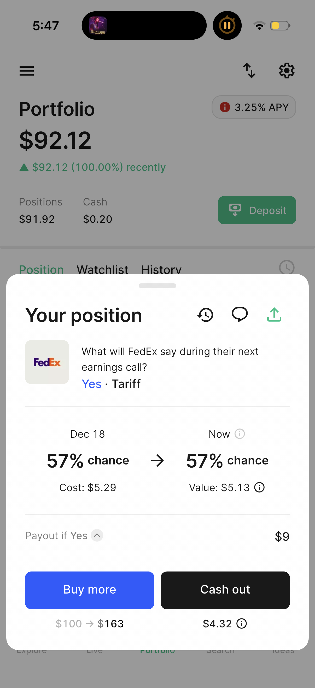

**User goal:**  
- View open position details
- Understand current value vs cash out value
- Cash out position early (before market resolution)
- Get liquidity for positions before settlement

**Kalshi flow (steps):**
1. User views Portfolio page
2. User clicks on a position in "Position" tab
3. **"Your position" popup appears:**
   - Shows market information
   - Shows position details (entry date, current value, payout)
   - Shows "Cash out" option with cash out value
4. **Cash out value display:**
   - **Important:** Cash out value is NOT the same as current value
   - Cash out value = price Kalshi or another market buyer will buy your slip at
   - May be lower than current value (e.g., current value $5.13, cash out $4.32)
5. User can click "Cash out" button to cash out position
6. User can click "Buy more" to add to position

**Observed behavior:**
- **Position popup:**
  - **Title:** "Your position"
  - **Header actions:** Clock icon (history), speech bubble icon (chat/comments), share icon (upward arrow in square)
  - **Market information:**
    - Market icon (e.g., FedEx logo)
    - Market question: "What will FedEx say during their next earnings call?"
    - Selected option: "Yes • Tariff"
  - **Position comparison:**
    - **Dec 18 (entry):** "57% chance" - "Cost: $5.29"
    - Arrow pointing to "Now"
    - **Now (current):** "57% chance" - "Value: $5.13" (with info icon)
  - **Payout information:**
    - "Payout if Yes ^" - "$9"
  - **Action buttons:**
    - **"Buy more" button (blue):** "$100 → $163" (shows potential payout if buying more)
    - **"Cash out" button (black):** "$4.32" (with info icon)
- **Cash out value:**
  - **NOT the same as current value**
  - Current value: $5.13 (what position is worth now)
  - Cash out value: $4.32 (what Kalshi/market buyer will pay)
  - **Difference:** Cash out is lower than current value (represents market maker spread/liquidity cost)
- **Cash out availability patterns (user experience):**
  - **Single trades:** Easier to get cashouts (more liquidity)
  - **Combo sports (2-3+ predictions):**
    - **Rare to get cashouts** especially when:
      - Already live (games in progress)
      - Odds change a lot
    - **Pre-game cashouts more common:**
      - User places $25 5-prediction sports combo
      - Before anything starts, might get offered cashout at ~$20
      - Cash out available before games begin
      - Less likely once games are live and odds are volatile
  - **Factors affecting cash out availability:**
    - Number of predictions (more predictions = less liquidity)
    - Market status (pre-game vs live)
    - Odds volatility (high volatility = less cash out availability)
    - Market maker willingness to buy

**What I like:**
- **Early exit option:** Can cash out before market resolution
- **Clear value display:** Shows both current value and cash out value
- **Quick access:** Cash out button easily accessible
- **Buy more option:** Can add to position if desired

**What I don't like / confusion:**
- **Value difference unclear:** Cash out value is lower than current value - why?
  - Not clearly explained why there's a difference
  - User may not understand they're getting less than current value
- **Cash out availability unpredictable:**
  - Not clear when cash out will be available
  - Combo cashouts rare, especially when live
  - User may expect cash out but it's not available
- **No cash out explanation:** Info icon exists but unclear what it shows
- **No cash out history:** Can't see past cash out offers
- **No cash out notifications:** Don't know when cash out becomes available

**Edge cases / bugs:**
- **B-009: Market closes too quickly when odds reach extremes, preventing cash out**
  - In live markets (mentions, sports), when odds move quickly to extremes (99% vs 1%), market closes before user can cash out
  - User cannot cash out for 1 cent or 99 cent value (depending on position side)
  - Particularly problematic in live events where odds change rapidly
  - See BUG_LOG B-009 for details
- What if cash out value is higher than current value? (unlikely but possible)
- What if user wants to cash out but option not available?
- What if cash out value changes while user is viewing popup?
- What if user cashes out but market resolves favorably? (regret)
- What if combo has some predictions resolved and some not? Can they cash out?
- What if market closes while user is attempting to cash out?

**Builder hypothesis (why they did it):**
- **Liquidity provision:** Cash out allows users to exit early, provides liquidity
- **Market maker spread:** Cash out value lower than current value represents market maker profit/spread
- **Risk management:** Market makers may be less willing to buy complex combos (higher risk)
- **Pre-game vs live:** Pre-game odds more stable, easier to price cash out
- **Live volatility:** Live odds change rapidly, harder to price cash out accurately
- **Combo complexity:** More predictions = more risk for market maker = less cash out availability

**Opinion Kings implications:**
- **Copy:**
  - Cash out option for positions
  - Current value vs cash out value display
  - "Buy more" and "Cash out" buttons
  - Position comparison (entry vs current)
- **Avoid:**
  - Unclear value difference
  - Unpredictable cash out availability
  - No explanation of cash out mechanics
- **Beat:**
  - **Clear cash out explanation:**
    - Explain why cash out value differs from current value
    - Show market maker spread/fee breakdown
    - Explain cash out availability factors
  - **Cash out availability indicator:**
    - Show when cash out is available/unavailable
    - Explain why cash out is not available (if applicable)
    - Show estimated cash out value even when not available
  - **Cash out notifications:**
    - Notify users when cash out becomes available
    - Notify users when cash out value changes significantly
  - **Cash out history:**
    - Show past cash out offers
    - Show cash out value over time
  - **Better combo cash out:**
    - Improve cash out availability for combos
    - Show partial cash out options (cash out some predictions)
    - Better pricing for combo cashouts
  - **Cash out calculator:**
    - Show what cash out value would be before placing trade
    - Help users understand cash out economics
  - **Cash out guarantees:**
    - Guarantee cash out availability for certain conditions
    - Lock cash out value for short period (e.g., 10 seconds)
  - **Market closure handling (CRITICAL - B-009):**
    - **Grace period:** Add grace period (30-60 seconds) after odds reach extremes before closing market
    - **Cash out priority:** Ensure cash out remains available even when odds reach extremes (99% vs 1%)
    - **Market closure delay:** Delay market closure to allow users to cash out
    - **User notification:** Notify users when odds reach extremes and market may close soon
    - **Cash out guarantee:** Guarantee cash out availability for X seconds after odds reach extremes
    - **Position protection:** Ensure users with open positions can always cash out before market closes
    - **Extreme odds handling:** Different closure logic for extreme odds vs normal market closure
    - **Live market considerations:** Special handling for live markets (mentions, sports) where events happen quickly
- **Implementation notes:**
  - **Cash out value calculation:**
    - Current value = position value based on current odds
    - Cash out value = price market maker is willing to pay
    - Difference = market maker spread/fee
    - Factors: liquidity, volatility, number of predictions, market status
  - **Cash out availability:**
    - **Single trades:** More likely available (better liquidity)
    - **Combo trades:**
      - Pre-game: More likely available (stable odds)
      - Live: Less likely available (volatile odds)
      - More predictions = less availability
    - Check market maker willingness to buy
    - Update availability in real-time
  - **Position popup:**
    - Show market information
    - Show entry details (date, cost, odds)
    - Show current details (value, odds)
    - Show payout if right
    - Show cash out value (if available)
    - "Buy more" button with potential payout
    - "Cash out" button with cash out value
  - **State management:**
    - Store position data
    - Store cash out availability
    - Store cash out value
    - Update when odds change
  - **Real-time updates:**
    - Update current value as odds change
    - Update cash out value as market conditions change
    - Update cash out availability
- **Metrics:**
  - Cash out availability rate (how often is cash out available?)
  - Cash out usage rate (how often do users cash out?)
  - Cash out value vs current value difference (average spread)
  - Combo vs single trade cash out availability
  - Pre-game vs live cash out availability
  - Cash out regret rate (do users regret cashing out early?)
  - Cash out notification click-through rate

### Order Completion Confirmation (Single Prediction)

**Feature category:** Trading / Order Flow / Confirmation

**Screenshots:**  
- 114: `114-trading-order-completed-single.png` - Order completion confirmation screen for single prediction trade

**User goal:**  
- Confirm successful order placement
- Review trade details (market, odds, cost, payout)
- Share trade on social feed (Ideas)
- Continue to next action

**Kalshi flow (steps):**
1. User places a single prediction trade (any market type, not just sports)
2. Order is successfully processed
3. **Order completion screen appears:**
   - Red header bar with "Order completed" title
   - White card with order details
   - Orange gradient bottom section with action buttons
4. **User reviews order details:**
   - Market identifier (icon, event name)
   - Selected prediction
   - Odds (percentage chance)
   - Cost (trade amount)
   - Payout if win (potential return)
5. **User can take actions:**
   - Click "Continue" to proceed
   - Click "Post on Ideas" to share trade on social feed
   - Click "Tell your friends" to share externally
6. User clicks action button to proceed

**Observed behavior:**
- **Screen layout:**
  - **Top red bar:**
    - Time display (e.g., "7:52") on left
    - Notification bell icon
    - **Title:** "Order completed" (centered, large white text)
    - Status bar icons (signal, Wi-Fi, battery) on right
  - **Central white card (order details):**
    - **Decorative border:** Orange scalloped/wavy border at bottom (ticket/receipt style)
    - **Market identifier (top left):**
      - Square icon with market-specific image
      - Example: Brown basketball on red/blue diagonal split background (sports market)
    - **Platform branding (top right):**
      - "Kalshi" text in green
    - **Event information:**
      - Event name: "Atlanta at Charlotte" (smaller, regular black text)
      - Selected prediction: "Atlanta" (larger, bold black text)
    - **Order summary (separated by grey line):**
      - **Odds:** "Odds" label (left) → "16% chance" (right)
      - **Cost:** "Cost" label (left) → "$39.65" (right)
      - **Payout if win:** "Payout if win" label (left) → "$234" (right, **green text**, prominent)
  - **Bottom orange gradient section:**
    - Smooth gradient from brighter orange (top) to darker orange (bottom)
    - **Share option:**
      - Grey upload/share icon
      - "Tell your friends" text
      - External sharing feature
    - **Action buttons (white, rounded, stacked vertically):**
      - **Top button:** "Continue" (black text)
      - **Bottom button:** Lightbulb icon + "Post on Ideas" (black text)
        - Social sharing on Kalshi Ideas feed
- **Visual design:**
  - **Color scheme:**
    - Red header (attention-grabbing, success indicator)
    - White card (clean, receipt-like)
    - Orange gradient bottom (warm, action-oriented)
    - Green for payout (positive, money-related)
    - Green for Kalshi branding (consistent)
  - **Typography:**
    - Large, bold "Order completed" title
    - Bold prediction name (e.g., "Atlanta")
    - Regular event name
    - Prominent green payout value
  - **Iconography:**
    - Market-specific icon (basketball, etc.)
    - Lightbulb icon for Ideas posting
    - Share/upload icon for external sharing
  - **Card design:**
    - Ticket/receipt aesthetic with scalloped bottom border
    - Clean, organized information hierarchy
    - Clear separation between sections
- **Information hierarchy:**
  - **Most prominent:** "Order completed" title, payout value (green)
  - **Secondary:** Selected prediction (bold)
  - **Tertiary:** Event name, odds, cost
  - **Actions:** Continue, Post on Ideas, Tell your friends
- **Social integration:**
  - Direct "Post on Ideas" button (lightbulb icon)
  - Encourages sharing trades on social feed
  - "Tell your friends" for external sharing
- **Applicable to:**
  - **Any market type** (not just sports)
  - **Single predictions only** (one-off trades)
  - **All categories:** Sports, Politics, Culture, Crypto, etc.

**What I like:**
- **Clear confirmation:** "Order completed" title is unambiguous
- **Receipt-like design:** Ticket aesthetic makes it feel official/confirmed
- **Prominent payout:** Green payout value highlights potential return
- **Social integration:** Easy to share trade on Ideas feed
- **Clean layout:** Well-organized information hierarchy
- **Visual feedback:** Red header provides clear success indicator
- **Action options:** Multiple paths forward (continue, share, post)

**What I don't like / confusion:**
- **No order ID:** Doesn't show order/trade ID for reference
- **No position link:** Can't directly navigate to position in portfolio
- **No market link:** Can't navigate back to market page
- **No edit option:** Can't modify or cancel if user made mistake
- **External share unclear:** "Tell your friends" - what platform? (likely native share sheet)
- **No trade history link:** Can't view in transaction history
- **No confirmation number:** No reference number for support

**Edge cases / bugs:**
- What if user clicks "Post on Ideas" but hasn't made a trade? (shouldn't happen, but edge case)
- What if order partially filled? Does this screen still show?
- What if user wants to place another trade on same market? Must navigate back
- What if payout calculation is wrong? No way to dispute on this screen
- What if user wants to view order details later? No link to order history

**Builder hypothesis (why they did it):**
- **Confirmation UX:** Clear success state after order placement
- **Receipt pattern:** Ticket/receipt design creates sense of completion and legitimacy
- **Social engagement:** "Post on Ideas" encourages social sharing and platform engagement
- **Information hierarchy:** Most important info (payout) is most prominent
- **Color psychology:**
  - Red header: Attention-grabbing, success indicator
  - Green payout: Positive, money-related, highlights potential return
  - Orange gradient: Warm, action-oriented, encourages next steps
- **Mobile-first:** Full-screen design works well on mobile
- **Brand consistency:** Kalshi green branding maintained
- **Action-oriented:** Multiple clear paths forward (continue, share, post)

**Opinion Kings implications:**
- **Copy:**
  - Order completion confirmation screen
  - Receipt/ticket aesthetic with decorative border
  - Clear "Order completed" title
  - Order summary (odds, cost, payout)
  - Social sharing integration ("Post on Ideas")
  - "Continue" button for next action
  - Color scheme (red header, green payout)
- **Avoid:**
  - No order ID or reference number
  - No navigation to position or market
  - No link to transaction history
- **Beat:**
  - **Order reference:** Show order ID/trade ID for support reference
  - **Navigation links:**
    - "View position" button → Portfolio
    - "View market" button → Market page
    - "View history" button → Transaction history
  - **Quick actions:**
    - "Place another trade" button
    - "Trade similar market" button
  - **Order details:**
    - Show order type (market order, limit order)
    - Show execution time
    - Show order status
  - **Order receipt:** Download/email order receipt
  - **Share customization:** Customize what's shared on Ideas (include/exclude cost, payout, etc.)
  - **Confirmation options:** Allow user to skip confirmation for future trades (setting)
  - **Order summary card:** Show order summary card that can be saved/shared
  - **Position preview:** Show how this trade affects portfolio/position
  - **Related markets:** Show similar markets user might want to trade
- **Implementation notes:**
  - **Order completion screen:**
    - Full-screen modal or dedicated page
    - Red header with "Order completed" title
    - White card with order details
    - Receipt/ticket aesthetic
    - Action buttons at bottom
  - **Order details:**
    - Market identifier (icon, name)
    - Selected prediction
    - Odds (percentage chance)
    - Cost (trade amount)
    - Payout if win (green, prominent)
    - Order ID/reference number
    - Execution time
  - **Social integration:**
    - "Post on Ideas" button → Opens post creation with trade details pre-filled
    - "Tell your friends" → Native share sheet
    - Customizable share content
  - **Navigation:**
    - "Continue" → Returns to previous page or home
    - "View position" → Portfolio with position highlighted
    - "View market" → Market page
    - "View history" → Transaction history
  - **State management:**
    - Store order details
    - Store order ID
    - Store market/prediction info
    - Store execution time
  - **Visual design:**
    - Receipt/ticket aesthetic
    - Color scheme: Red header, white card, green payout
    - Decorative border (scalloped/wavy)
    - Gradient bottom section
    - Clear information hierarchy
  - **Mobile optimization:**
    - Full-screen design
    - Large, touch-friendly buttons
    - Readable text sizes
    - Clear visual hierarchy
- **Metrics:**
  - Order completion screen view rate
  - "Post on Ideas" click-through rate
  - "Tell your friends" share rate
  - "Continue" button click rate
  - Time spent on confirmation screen
  - Social post creation rate from confirmation
  - User navigation patterns (where do they go after confirmation?)

### No Counterparty Modal (Liquidity Warning)

**Feature category:** Trading / Order Flow / Error Handling

**Screenshots:**  
- 115: `115-trading-no-counterparty-modal.png` - Modal warning that there's no one to trade against, with limit order option

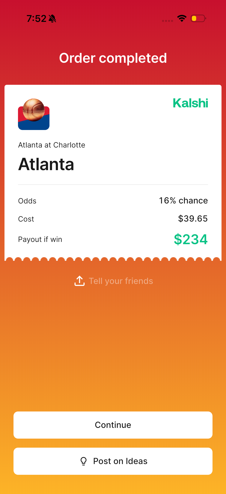

**User goal:**  
- Understand why trade cannot be executed immediately
- Decide whether to place limit order or cancel
- Get notified when counterparty becomes available

**Kalshi flow (steps):**
1. User attempts to place a trade on a market
2. **If no counterparty available:**
   - Modal appears: "There's no one to trade against"
   - Modal explains the situation
   - User can choose to:
     - Click "Done" to cancel
     - Click "Continue with limit order" to place limit order
3. **If user clicks "Continue with limit order":**
   - Trade is added to order book
   - User will be notified if someone takes the other side
   - Trade remains pending until matched

**Observed behavior:**
- **Modal appearance:**
  - White rectangular modal with rounded corners
  - Covers lower two-thirds of screen
  - Subtle gray horizontal line at top (drag handle/swipe indicator)
  - Can be dismissed (swipe down or click outside)
- **Modal content:**
  - **Title:** "There's no one to trade against" (large, bold black text)
  - **Explanation:** "No one wants to take the other side right now. This could be due to recent news or a known outcome."
    - Explains why trade cannot be executed
    - Suggests possible reasons (recent news, known outcome)
  - **Call to action:** "Still want to place your trade? We'll add it to our \"order book\" and notify you if someone takes you up on it."
    - Explains limit order mechanism
    - Mentions notification when matched
- **Action buttons:**
  - **"Done" button (primary):** Green filled button at bottom
    - Dismisses modal
    - Cancels trade attempt
  - **"Continue with limit order" button (secondary):** Outlined white button with green text
    - Places limit order in order book
    - Trade waits for counterparty
    - User will be notified when matched
- **Market context:**
  - Modal appears when attempting to trade on market with low/no liquidity
  - Can occur when:
    - Market is highly skewed (e.g., 99% vs 1%)
    - Recent news makes outcome obvious
    - Market is illiquid
    - No active traders on other side
- **Limit order behavior:**
  - Trade added to order book
  - Waits for counterparty to match
  - User receives notification when matched
  - Trade executes when counterparty accepts

**What I like:**
- **Clear communication:** Explains why trade cannot be executed
- **Educational:** Explains possible reasons (recent news, known outcome)
- **Path forward:** Offers limit order option instead of just blocking trade
- **Notification promise:** Mentions user will be notified when matched
- **User choice:** Allows user to cancel or proceed with limit order

**What I don't like / confusion:**
- **No liquidity indicator:** Doesn't show current market depth or liquidity status
- **No price indication:** Doesn't show what price limit order would be placed at
- **No time estimate:** Doesn't indicate how long limit order might wait
- **No cancellation option:** Once limit order is placed, unclear how to cancel it
- **Notification unclear:** Doesn't specify how user will be notified (in-app, email, push?)
- **No market context:** Doesn't show why this specific market has no counterparty

**Edge cases / bugs:**
- What if user places limit order but market closes before matched?
- What if multiple users place limit orders? How is matching prioritized?
- What if user wants to cancel limit order? How do they do it?
- What if limit order is partially filled? How is it handled?
- What if market odds change significantly while limit order is pending?

**Builder hypothesis (why they did it):**
- **Liquidity management:** Prevents failed trades when no counterparty exists
- **User education:** Explains why trade cannot be executed
- **Order book mechanism:** Encourages limit orders to improve liquidity
- **Market efficiency:** Prevents trades at unfavorable prices when market is skewed
- **User experience:** Better than silent failure or error message
- **Notification system:** Encourages users to place limit orders with promise of notification

**Opinion Kings implications:**
- **Copy:**
  - Modal warning when no counterparty available
  - Clear explanation of why trade cannot be executed
  - Limit order option as alternative
  - Notification promise when matched
- **Avoid:**
  - No liquidity indicator
  - No price indication for limit order
  - No time estimate
  - Unclear notification mechanism
- **Beat:**
  - **Liquidity indicator:** Show current market depth and liquidity status
  - **Price display:** Show what price limit order would be placed at
  - **Time estimate:** Provide estimate of how long limit order might wait (if possible)
  - **Limit order management:** Allow users to view and cancel pending limit orders
  - **Notification preferences:** Let users choose how they want to be notified (in-app, email, push)
  - **Market context:** Show why market has no counterparty (recent news, extreme odds, etc.)
  - **Auto-cancel option:** Allow users to set auto-cancel conditions (e.g., if odds change by X%)
  - **Partial fill handling:** Clearly communicate how partial fills are handled
  - **Limit order history:** Show history of limit orders (placed, matched, cancelled)
- **Implementation notes:**
  - **Modal trigger:**
    - Check for counterparty availability before executing trade
    - Show modal if no counterparty available
    - Allow user to proceed with limit order or cancel
  - **Limit order placement:**
    - Add trade to order book
    - Store limit order details (price, amount, market, user)
    - Monitor for matching counterparty
    - Notify user when matched
  - **Notification system:**
    - In-app notification when limit order is matched
    - Optional email/push notification
    - Show notification in notifications feed
  - **Order book matching:**
    - Match limit orders when counterparty becomes available
    - Handle partial fills
    - Update order status (pending, partially filled, filled, cancelled)
  - **State management:**
    - Track limit orders (pending, matched, cancelled)
    - Update order status in real-time
    - Store order history
- **Metrics:**
  - No counterparty modal view rate
  - Limit order placement rate (how many users choose limit order?)
  - Limit order cancellation rate
  - Limit order match rate (how often are limit orders matched?)
  - Average time to match limit orders
  - Notification click-through rate (do users act on limit order notifications?)

### Portfolio Main Page

**Feature category:** Portfolio / Account / Trading

**Screenshots:**  
- 096: `096-portfolio-page-main.png` - Main Portfolio page showing portfolio value, recent change, cash balance, interest eligibility, and tabs (Position, Resting, History)

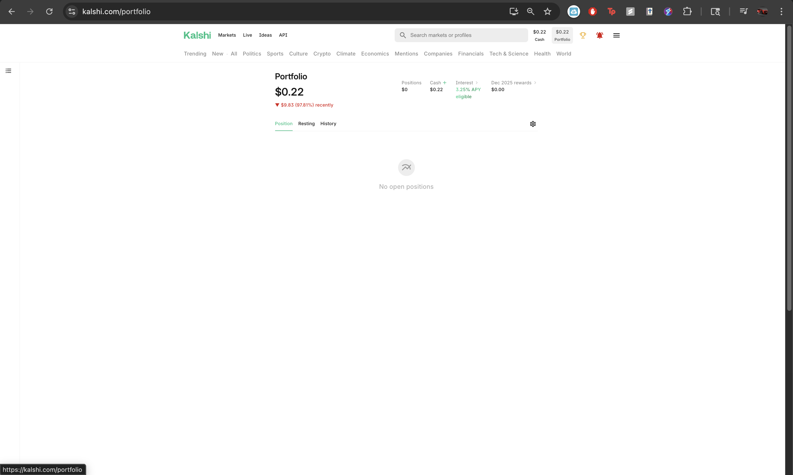

**User goal:**  
- View portfolio value and performance
- Check cash balance and available funds
- View open positions
- Access portfolio history and resting orders
- Understand interest eligibility and rewards

**Kalshi flow (steps):**
1. User clicks "Portfolio" in top navigation or navigates to portfolio page
2. **URL routing:** `kalshi.com/portfolio`
3. **Page displays:**
   - Portfolio header with value and recent change
   - Portfolio sub-details (Positions, Cash, Interest, Rewards)
   - Navigation tabs (Position, Resting, History)
   - Main content area (positions list or empty state)
4. **Portfolio header:**
   - **Page title:** "Portfolio" (large bold text)
   - **Current value:** "$0.22" (large font, primary display)
   - **Recent change:** "▼$9.83 (97.81%) recently" (red text, indicates decrease)
5. **Portfolio sub-details:**
   - "Positions": "$0" (current position value)
   - "Cash +": "$0.22" (available cash balance)
   - "Interest >": "3.25% APY eligible" (green text, clickable, shows interest eligibility)
   - "Dec 2025 rewards >": "$0.00" (clickable, shows monthly rewards)
6. **Navigation tabs:**
   - "Position" tab (selected, highlighted with green underline)
   - "Resting" tab
   - "History" tab
   - Settings gear icon (far right of tabs)
7. **Main content:**
   - Shows positions list (if user has positions)
   - Shows empty state (if no positions): "No open positions" with icon
8. User can click tabs to switch views
9. User can click interest/rewards for more details

**Observed behavior:**
- **URL Structure:**
  - `kalshi.com/portfolio` (main portfolio page)
  - Tabs likely use query parameters or state (not separate URLs)
- **Portfolio header:**
  - **Page title:** "Portfolio" in large, bold text
  - **Current value:** "$0.22" displayed prominently (large font)
  - **Recent change:** "▼$9.83 (97.81%) recently" in red
    - Red indicates negative change (decrease)
    - Shows dollar amount and percentage
    - "recently" indicates time period (unclear what "recently" means)
- **Portfolio sub-details (right side of header):**
  - **Positions:** "$0" (current value of all open positions)
  - **Cash +:** "$0.22" (available cash balance, "+" suggests can add more)
  - **Interest >:** "3.25% APY eligible" (green text, clickable arrow ">")
    - Shows interest rate eligibility
    - Green indicates positive/available feature
    - Clickable to view interest details
  - **Dec 2025 rewards >:** "$0.00" (monthly rewards, clickable arrow ">")
    - Shows current month's rewards
    - Clickable to view rewards details
- **Navigation tabs:**
  - **Position tab:** Selected (green underline), shows open positions
  - **Resting tab:** Shows resting/pending orders
  - **History tab:** Shows trading history
  - **Settings gear icon:** Far right, likely for portfolio settings
  - Tabs switch content view (not separate pages)
- **Main content (Position tab):**
  - **Empty state:** When no open positions
    - Abstract icon (broken line graph or "no data" symbol)
    - Text: "No open positions"
    - Clean, centered layout
  - **Positions list:** When user has positions (not shown in screenshot)
    - Likely shows list of markets with positions
    - Each position shows: market name, position value, return, etc.
- **Top navigation:**
  - Kalshi logo, Markets, Live, Ideas, API links
  - Search bar: "Search markets or profiles"
  - Account summary: "$0.22 Cash" and "$0.22 Portfolio"
  - Notification bell, trophy (rewards/leaderboard), menu icons
- **Left sidebar:**
  - Hamburger menu icon (three horizontal lines)
  - Likely toggles navigation sidebar

**What I like:**
- **Clear portfolio value:** Large, prominent display of current value
- **Recent change visibility:** Shows recent performance (dollar and percentage)
- **Sub-details:** Quick access to positions, cash, interest, rewards
- **Tab navigation:** Easy switching between Position, Resting, History
- **Empty state:** Clear message when no positions
- **Interest eligibility:** Shows interest rate upfront (3.25% APY)
- **Rewards visibility:** Shows monthly rewards amount
- **Visual indicators:** Red for negative change, green for positive features

**What I don't like / confusion:**
- **"Recently" ambiguity:** What does "recently" mean? (last hour? last day? last week?)
- **No time period selector:** Can't change "recently" to see different time periods
- **No portfolio chart:** No visual representation of portfolio performance over time
- **No breakdown:** Can't see breakdown of positions (by category, by return, etc.)
- **Interest details:** "3.25% APY eligible" - but what's the actual interest earned? Not shown
- **Rewards details:** "$0.00" - but what are rewards? How to earn them? Not clear
- **No export:** Can't export portfolio data
- **No comparison:** Can't compare portfolio performance to benchmarks
- **Empty state:** No call-to-action (e.g., "Start trading" or "Browse markets")

**Edge cases / bugs:**
- What if portfolio value is negative? How is it displayed?
- What if user has many positions? Is there pagination or infinite scroll?
- What if "recently" period changes? Does it auto-update?
- What if interest eligibility changes? How is user notified?
- What if rewards are pending? How is it shown?

**Builder hypothesis (why they did it):**
- **Portfolio overview:** Main page provides quick overview of portfolio status
- **Performance visibility:** Recent change shows immediate performance feedback
- **Quick access:** Sub-details provide quick access to key information (cash, interest, rewards)
- **Tab navigation:** Separates different views (positions, resting orders, history) for clarity
- **Empty state:** Clear message when no positions (reduces confusion)
- **Interest promotion:** Shows interest eligibility to encourage cash deposits
- **Rewards promotion:** Shows monthly rewards to encourage engagement
- **Visual feedback:** Color coding (red/green) provides quick visual feedback

**Opinion Kings implications:**
- **Copy:**
  - Portfolio page with value and recent change
  - Sub-details (Positions, Cash, Interest, Rewards)
  - Tab navigation (Position, Resting, History)
  - Empty state with clear message
  - Interest eligibility display
  - Rewards display
- **Avoid:**
  - Ambiguous time periods ("recently")
  - No portfolio chart
  - No breakdown options
  - No call-to-action in empty state
- **Beat:**
  - **Time period selector:** Allow users to select time period (1 hour, 1 day, 1 week, 1 month, all time)
  - **Portfolio chart:** Add visual chart showing portfolio performance over time
  - **Portfolio breakdown:** Show breakdown by category, by return, by position size
  - **Interest details:** Show actual interest earned (not just eligibility)
  - **Rewards details:** Show rewards breakdown, how to earn, pending rewards
  - **Call-to-action in empty state:** "Start trading" or "Browse markets" button
  - **Export functionality:** Allow users to export portfolio data (CSV, PDF)
  - **Performance comparison:** Compare portfolio to benchmarks or market average
  - **Portfolio analytics:** Show win rate, average return, best/worst trades
  - **Goal setting:** Allow users to set portfolio goals and track progress
  - **Notifications:** Notify users of significant portfolio changes
  - **Portfolio sharing:** Allow users to share portfolio performance (anonymized)
- **Implementation notes:**
  - **URL routing:**
    - Base URL: `kalshi.com/portfolio`
    - Tabs: Use query parameters (`?tab=position`, `?tab=resting`, `?tab=history`) or state
  - **Portfolio header:**
    - Fetch portfolio value from API
    - Calculate recent change (dollar and percentage)
    - Display with color coding (red for negative, green for positive)
    - Show time period selector (if implemented)
  - **Portfolio sub-details:**
    - **Positions:** Sum of all open position values
    - **Cash:** Available cash balance (from account)
    - **Interest:** Fetch interest eligibility and earned interest
    - **Rewards:** Fetch monthly rewards amount
    - Make clickable items open detail modals/pages
  - **Navigation tabs:**
    - Position tab: Show open positions list
    - Resting tab: Show resting/pending orders
    - History tab: Show trading history
    - Settings gear: Open portfolio settings
    - Highlight selected tab (green underline)
  - **Main content:**
    - **Empty state:** Show when no positions
      - Icon (broken line graph or "no data")
      - Text: "No open positions"
      - Call-to-action button (if implemented)
    - **Positions list:** Show when user has positions
      - List of markets with positions
      - Each item: market name, position value, return, etc.
      - Clickable to navigate to market page
  - **State management:**
    - Store portfolio value and recent change
    - Store selected tab
    - Store positions list
    - Update when trades are made or positions change
  - **Performance:**
    - Optimize for large number of positions
    - Lazy load positions if many
    - Cache portfolio value
- **Metrics:**
  - Portfolio page view rate
  - Tab usage (which tabs are used most?)
  - Interest eligibility click rate
  - Rewards click rate
  - Empty state rate (how many users have no positions?)
  - Portfolio value distribution (what's the average portfolio value?)
  - Recent change impact (does showing recent change affect trading behavior?)
  - Time spent on portfolio page
  - Position click-through rate (do users click positions to view markets?)

### Portfolio Empty State

**Feature category:** Portfolio

**Screenshots:**  
- 020: `020-portfolio-empty-state.png` - Portfolio tab showing empty state when user has no open positions

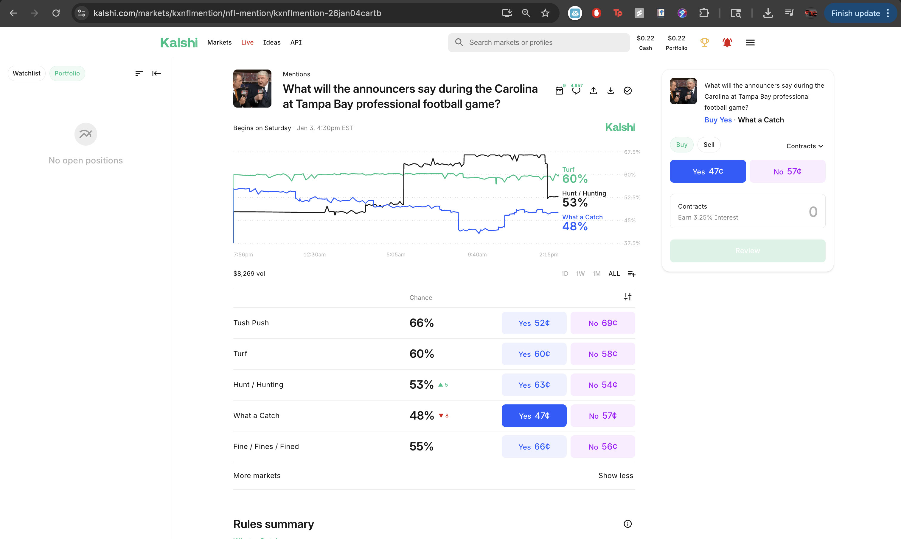

**User goal:**  
- View open positions and portfolio value
- Understand portfolio status
- Navigate to markets where user has positions

**Kalshi flow (steps):**
1. User clicks "Portfolio" tab in left sidebar
2. Portfolio tab becomes highlighted (green)
3. If user has no open positions:
   - Shows "No open positions" message
   - Displays crossed-out dollar sign icon
   - Watchlist tab still accessible
4. If user has open positions:
   - Portfolio tab shows list of markets with positions
   - Each item is clickable and navigates to that market's detailed page
5. User can click on portfolio items to view market details and manage positions

**Observed behavior:**
- **Portfolio Tab:**
  - "Portfolio" tab highlighted in green (active state)
  - "Watchlist" tab available but not highlighted
- **Empty State:**
  - Message: "No open positions"
  - Icon: Crossed-out dollar sign (visual indicator of empty state)
  - Clean, minimal design
  - No call-to-action or suggestions
- **Sidebar Context:**
  - Part of left sidebar alongside Watchlist
  - Same sidebar used across discovery and market pages
  - Persistent navigation element

**What I like:**
- **Clear empty state:** User immediately understands they have no positions
- **Visual indicator:** Icon reinforces the message
- **Clean design:** Not cluttered, easy to understand
- **Consistent sidebar:** Portfolio accessible from multiple pages

**What I don't like / confusion:**
- **No guidance:** Doesn't suggest what to do next (fund account, explore markets, etc.)
- **No portfolio value display:** Even with $0 positions, could show total portfolio value
- **No historical positions:** Doesn't show closed positions or trading history
- **No call-to-action:** Could suggest "Explore markets" or "Add funds"

**Edge cases / bugs:**
- None observed (only log bugs when explicitly identified)

**Builder hypothesis (why they did it):**
- **Minimal empty state:** Reduces cognitive load, doesn't overwhelm new users
- **No suggestions:** Avoids being pushy or salesy
- **Simple design:** Focuses on clarity over features
- **Consistent with watchlist:** Same sidebar pattern for both tabs

**Opinion Kings implications:**
- **Copy:**
  - Clear empty state message
  - Visual icon indicator
  - Consistent sidebar pattern
- **Avoid:**
  - No guidance for next steps
  - No portfolio value display
- **Beat:**
  - Add helpful suggestions: "Explore trending markets" or "Fund your account to start trading"
  - Show portfolio value even when $0 (e.g., "Portfolio: $0.00")
  - Add link to funding page
  - Show recent closed positions or trading history
  - Add "Learn how to trade" link for new users
- **Implementation notes:**
  - **Portfolio data:**
    - Query user's open positions from database
    - Calculate total portfolio value (cash + position values)
    - Real-time updates for position values
  - **Empty state:**
    - Conditional rendering: `{positions.length === 0 ? <EmptyState /> : <PositionsList />}`
    - Consider showing portfolio value even when empty
  - **Navigation:**
    - Click handler on portfolio items: navigate to `/markets/{market-id}`
    - Store market IDs for quick lookup
  - **Real-time updates:**
    - WebSocket updates for position values
    - Recalculate portfolio value on price changes
- **Metrics:**
  - Portfolio tab click rate
  - Empty state view rate
  - Time to first position (from signup to first trade)
  - Portfolio value growth over time
  - Click-through rate from portfolio items to market pages

---

---

## Notifications

### Notifications Page

**Feature category:** Notifications / User Engagement / Real-Time Updates

**Screenshots:**  
- 098: `098-notifications-page.png` - Notifications page showing chronological list of alerts (market updates, settlements, price movements)

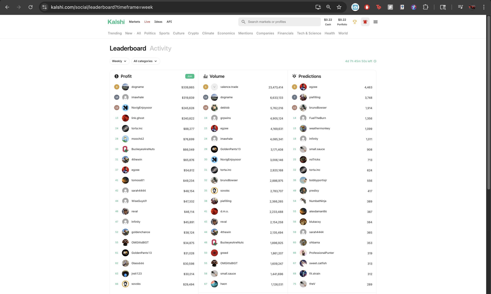

**User goal:**  
- View all notifications in one place
- Stay updated on market activities
- Track market settlements and price movements
- Monitor event updates and predictions

**Kalshi flow (steps):**
1. User clicks notification bell icon in top navigation bar
2. **URL routing:** Likely `kalshi.com/notifications` or similar
3. **Page displays:**
   - Header: "Notifications" title (bold black text, top left)
   - Chronological list of notification cards
   - Each notification card shows:
     - Icon (left side, color-coded by type)
     - Header text (notification type)
     - Timestamp (top right)
     - Content (market details, outcomes, price changes)
4. User can scroll through notifications
5. User can click on notifications to navigate to relevant markets
6. **Notification icon behavior:**
   - **User feedback:** "Notification icon is not red while showing this and says not red after"
   - Icon does not change color when viewing notifications page
   - Icon does not indicate unread status visually

**Observed behavior:**
- **Page layout:**
  - Clean white background
  - "Notifications" title at top left (bold black text)
  - Chronological list (newest first, presumably)
  - Notification cards separated by thin gray lines
- **Notification types and examples:**
  1. **Event Updates (Basketball):**
     - **Icon:** Black bell icon
     - **Header:** "Basketball (Tue - Sat)" with basketball emoji
     - **Timestamp:** "10:56pm" (top right)
     - **Content:** Aggregated information about multiple basketball games:
       - "NOW: Sacramento (22%) at LAC (77%)" - Current game with probabilities
       - "WED: Portland (10%) at OKC (89%)" with target emoji - Wednesday's game
       - "THU: BOS (70%) at Sacramento (27%)" - Thursday's game
       - "NOW: SAC wins by > 2.5 pts? (19%)" - Specific prop bet/spread prediction
     - **Purpose:** Quick overview of relevant sports market predictions
  2. **Market Settled:**
     - **Icon:** Purple shield with white checkmark
     - **Header:** "Market settled"
     - **Timestamp:** "Dec 30" (top right)
     - **Content:**
       - "Los Angeles R at Atlanta : yes Kyle Pitts Sr., yes Blake Corum"
       - "Result is No" - Final outcome
     - **Purpose:** Communicates market resolution with conditions and result
  3. **Price Movement (Down):**
     - **Icon:** Red downward-pointing arrow overlaid on small line graph
     - **Header:** "Price movement"
     - **Timestamp:** "Dec 29" (top right)
     - **Content:**
       - "Los Angeles R at Atlanta : Los Angeles R"
       - "Yes price is down 77% to 12¢ in the past hour."
     - **Purpose:** Alerts to significant negative price change (red for down)
  4. **Price Movement (Up):**
     - **Icon:** Purple upward-pointing arrow overlaid on small line graph
     - **Header:** "Price movement"
     - **Timestamp:** "Dec 29" (top right)
     - **Content:**
       - "Los Angeles R at Atlanta : Los Angeles R"
       - "Yes price is up 940% to 52¢ in the past hour."
     - **Purpose:** Alerts to significant positive price change (purple for up)
     - **Note:** Extreme percentage change (940%) highlights market volatility
  5. **Market Settled (Combo - partially visible):**
     - **Icon:** Purple shield with white checkmark
     - **Header:** "Market settled"
     - **Timestamp:** "Dec 29" (top right)
     - **Content (truncated):**
       - "Combo : yes Shai Gilgeous-Alexander: 25+ yes LaMelo Ball: 20+ yes Anthony"
     - **Purpose:** Market settlement for combo bet with multiple player performance conditions
- **Visual design:**
  - **Color coding:**
    - Red icons for negative/down movements
    - Purple icons for positive/up movements and settlements
    - Black icons for event updates
  - **Icons:**
    - Bell for event updates
    - Shield with checkmark for settlements
    - Arrow on graph for price movements
  - **Information density:** Concise yet informative summaries
  - **Timestamps:** Show time ("10:56pm") or date ("Dec 29", "Dec 30")
  - **Aggregation:** Multiple related events grouped into single notification (e.g., basketball games)
- **Notification icon behavior:**
  - **User feedback:** "Notification icon is not red while showing this and says not red after"
  - Icon does not change color when viewing notifications page
  - Icon does not visually indicate unread status
  - **Issue:** No visual feedback that notifications exist or have been read

**What I like:**
- **Clear categorization:** Different notification types with distinct icons
- **Color coding:** Red for down, purple for up/settlements - quick visual cues
- **Information density:** Concise summaries with key data (probabilities, percentages, prices)
- **Aggregation:** Multiple related events grouped (reduces notification fatigue)
- **Timestamps:** Clear time/date information
- **Combo bet support:** Notifications for combo bet settlements
- **Real-time updates:** "in the past hour" emphasizes real-time nature

**What I don't like / confusion:**
- **Notification icon behavior:**
  - **User feedback:** "Notification icon is not red while showing this and says not red after"
  - Icon does not change color when viewing notifications
  - No visual indication of unread notifications
  - No badge/count on icon
  - **Issue:** Users can't tell if there are new notifications without opening page
- **No filtering:** Can't filter by notification type (settlements, price movements, events)
- **No search:** Can't search within notifications
- **No mark as read:** Can't mark individual notifications as read
- **No clear all:** No way to clear all notifications
- **No grouping:** Notifications not grouped by date or type
- **No pagination:** Appears to be infinite scroll (may be slow with many notifications)

**Edge cases / bugs:**
- **Notification icon bug:** Icon doesn't change color when viewing notifications (user feedback)
- What if user has hundreds of notifications? Performance issues?
- What if notification is for a market that closed? Does it still show?
- What if price movement is very small? Is there a threshold?
- What if user wants to disable certain notification types?

**Builder hypothesis (why they did it):**
- **User engagement:** Notifications keep users engaged and informed
- **Real-time updates:** Price movements and settlements are time-sensitive
- **Event aggregation:** Grouping related events reduces notification fatigue
- **Visual cues:** Color coding helps users quickly identify notification types
- **Social proof:** Market settlements and price movements show platform activity
- **Retention:** Notifications bring users back to platform

**Opinion Kings implications:**
- **Copy:**
  - Notification types (event updates, market settlements, price movements)
  - Color-coded icons (red for down, purple for up/settlements)
  - Aggregated event notifications
  - Timestamps and concise summaries
  - Combo bet support
- **Avoid:**
  - Notification icon not changing color (user feedback issue)
  - No visual indication of unread notifications
  - No filtering or search
- **Beat:**
  - **Notification icon behavior:** FIX - Icon should change color when unread notifications exist
    - Red badge/count on icon when unread notifications
    - Icon changes color or shows badge
    - Badge disappears when all notifications read
  - **Unread indicator:** Show unread count on icon
  - **Mark as read:** Allow marking individual notifications as read
  - **Mark all as read:** Button to mark all notifications as read
  - **Filtering:** Filter by notification type (settlements, price movements, events)
  - **Search:** Search within notifications
  - **Grouping:** Group notifications by date or type
  - **Notification settings:** Allow users to customize which notifications they receive
  - **Push notifications:** Browser push notifications for important alerts
  - **Email notifications:** Optional email digests
  - **Notification preferences:** Granular control over notification types
  - **Read/unread status:** Clear visual distinction between read and unread
  - **Notification actions:** Quick actions from notifications (e.g., "View market", "Trade now")
- **Implementation notes:**
  - **Notification types:**
    - Event updates (aggregated sports/event predictions)
    - Market settled (with conditions and results)
    - Price movement (up/down with percentage and price)
    - Combo bet settlements
  - **Visual design:**
    - Color-coded icons (red for down, purple for up/settlements, black for events)
    - Icons: Bell, shield with checkmark, arrow on graph
    - Timestamps (time or date)
    - Concise summaries with key data
  - **Notification icon:**
    - **CRITICAL FIX:** Show unread indicator (red badge/count)
    - Change icon color when unread notifications exist
    - Update in real-time when notifications arrive
    - Clear indicator when all notifications read
  - **Notification list:**
    - Chronological order (newest first)
    - Infinite scroll or pagination
    - Clickable to navigate to relevant markets
  - **State management:**
    - Track read/unread status
    - Update unread count
    - Store notification preferences
  - **Performance:**
    - Optimize for large number of notifications
    - Lazy load notifications
    - Cache notification data
- **Metrics:**
  - Notification page view rate
  - Notification click-through rate (do users click to view markets?)
  - Notification type engagement (which types are most clicked?)
  - Unread notification rate (how many users have unread notifications?)
  - Notification icon click rate
  - Time to read notifications (how long users spend on page?)
  - Notification preferences usage (which types do users enable/disable?)
  - Notification impact on trading (do notifications lead to trades?)

---

## Social Layer

### Leaderboard Activity Page

**Feature category:** Social / Gamification / Competition

**Screenshots:**  
- 097: `097-social-leaderboard-page.png` - Leaderboard Activity page showing top users across Profit, Volume, and Predictions metrics

**User goal:**  
- View top-performing users
- Compare performance across different metrics
- See rankings for Profit, Volume, and Predictions
- Understand leaderboard timeframes and categories
- Participate in leaderboard competition

**Kalshi flow (steps):**
1. User clicks trophy/cup icon in top navigation bar (next to notifications)
2. Page routes to Leaderboard Activity page
3. **URL routing:** `kalshi.com/social/leaderboard?timeframe=week`
4. **Page displays:**
   - Header: "Leaderboard Activity" (with "Activity" in lighter gray)
   - Filters: "Weekly" dropdown and "All categories" dropdown
   - Countdown timer: "4d 7h 45m 50s left" (remaining time for current period)
   - Three columns: "Profit", "Volume", "Predictions"
5. **Each column shows:**
   - Column header with icon and metric name
   - Ranked list of users (numbered, with avatars, usernames, and metric values)
   - Scrollable list (if many users)
6. User can change timeframe filter (Weekly, Daily, Monthly, All-time)
7. User can change category filter (All categories, Politics, Sports, etc.)
8. User can click on users to view their profiles
9. **"Join" button** visible in Profit column (suggests participation feature)

**Observed behavior:**
- **URL Structure:**
  - `kalshi.com/social/leaderboard?timeframe=week`
  - Uses query parameter for timeframe
  - Likely supports other timeframes: `?timeframe=daily`, `?timeframe=monthly`, `?timeframe=alltime`
- **Page header:**
  - "Leaderboard Activity" title
  - "Activity" in lighter gray (suggests sub-section or toggle)
  - Standard Kalshi header with logo, navigation, search, account info
- **Filters:**
  - **"Weekly" dropdown:** Currently selected, allows changing timeframe
    - Likely options: Daily, Weekly, Monthly, All-time
  - **"All categories" dropdown:** Currently selected, allows filtering by category
    - Likely options: All categories, Politics, Sports, Culture, Crypto, etc.
- **Countdown timer:**
  - "4d 7h 45m 50s left" displayed on right
  - Indicates remaining time for current leaderboard period
  - Updates in real-time (presumably)
- **Three-column layout:**
  - **Profit column (left):**
    - Header: "Profit" with dollar sign icon ($)
    - **"Join" button** visible above list (suggests participation feature)
    - Ranked list with green circles for rank numbers
    - Top entries:
      - 9. dogname: $339,865
      - 10. imawhale: $319,839
      - 12. NovigEnjoyooor: $245,628
      - ...continues to rank 66 (sovoks: $29,494)
  - **Volume column (middle):**
    - Header: "Volume" with bar chart icon
    - Ranked list with gray circles for rank numbers
    - Top entries:
      - 5. valence.trade: 23,473,414
      - 12. dogname: 6,633,133
      - 16. deblob: 5,762,016
      - ...continues to rank 67 (haon: 1,126,031)
  - **Predictions column (right):**
    - Header: "Predictions" with thought bubble icon
    - Ranked list with red circles for rank numbers
    - Top entries:
      - 5. egzee: 4,463
      - 7. piefilling: 3,748
      - 12. brunoBowser: 1,914
      - ...continues to rank 75 (theV: 289)
- **User entries:**
  - **Rank:** Number in colored circle (green for Profit, gray for Volume, red for Predictions)
  - **Avatar:** Small circular user image (custom images or generic gray silhouettes)
  - **Username:** Display name (e.g., "dogname", "imawhale", "valence.trade")
  - **Metric value:** Specific value for that metric
    - Profit: Dollar amounts (e.g., "$339,865")
    - Volume: Large numbers (e.g., "23,473,414")
    - Predictions: Count (e.g., "4,463")
- **Visual design:**
  - Clean, minimalist design with white background
  - Clear separation between columns
  - Color-coded rank circles (green, gray, red)
  - Scrollable lists (scrollbar visible on Predictions column)
  - Responsive three-column layout
- **User overlap:**
  - Same users appear in multiple columns (e.g., "dogname" appears in Profit rank 9 and Volume rank 12)
  - Shows users can excel in different metrics

**What I like:**
- **Multiple metrics:** Three different leaderboards (Profit, Volume, Predictions) show different aspects of performance
- **Clear rankings:** Numbered ranks with color-coded circles
- **User avatars:** Visual identification of users
- **Time-bound competition:** Countdown timer creates urgency
- **Filtering:** Timeframe and category filters for flexibility
- **Clean layout:** Three-column layout is easy to scan
- **User overlap visibility:** Shows users can excel in multiple metrics
- **"Join" button:** Suggests participation/engagement feature

**What I don't like / confusion:**
- **"Join" button:** What does it do? (unclear functionality)
- **No user search:** Can't search for specific users on leaderboard
- **No "My rank" indicator:** Can't see where current user ranks
- **No pagination:** Appears to be scrollable list (may be slow with many users)
- **No profile links:** Can't easily click to view user profiles (or unclear if clickable)
- **Rank gaps:** Ranks jump (e.g., 9, 10, 12 - where is rank 11?)
- **No explanation:** What do the metrics mean? (Profit = total profit? net profit? realized?)
- **No time period clarity:** "Weekly" - is it last 7 days? current week? rolling week?
- **Category filter impact:** How does "All categories" filter work? Does it aggregate across categories?

**Edge cases / bugs:**
- What if user has negative profit? Do they appear on leaderboard?
- What if two users have same metric value? How is tie broken?
- What if user changes username? Does rank update?
- What if leaderboard period ends? Does it reset or archive?
- What if user wants to see historical leaderboards?

**Builder hypothesis (why they did it):**
- **Gamification:** Leaderboards create competition and engagement
- **Social proof:** Top performers encourage others to trade more
- **Multiple metrics:** Different leaderboards appeal to different user types (traders vs volume traders vs active users)
- **Time-bound competition:** Weekly/monthly periods create urgency and repeat engagement
- **Community building:** Leaderboards foster community and recognition
- **Retention:** Users return to check rankings
- **Transparency:** Public rankings build trust and credibility

**Opinion Kings implications:**
- **Copy:**
  - Multiple leaderboard metrics (Profit, Volume, Predictions)
  - Three-column layout
  - Timeframe and category filters
  - Countdown timer for time-bound competition
  - Color-coded rank circles
  - User avatars and usernames
- **Avoid:**
  - Unclear "Join" button functionality
  - No "My rank" indicator
  - Rank gaps without explanation
  - No user search
- **Beat:**
  - **"My rank" indicator:** Show current user's rank in each column (highlighted)
  - **User search:** Add search to find specific users
  - **Profile links:** Make usernames/avatars clickable to view profiles
  - **Rank explanation:** Show what metrics mean (tooltip or help icon)
  - **Tie-breaking:** Explain how ties are broken (alphabetical? registration date?)
  - **Historical leaderboards:** Allow viewing past period leaderboards
  - **Rewards:** Show rewards/prizes for top performers
  - **Categories breakdown:** Show user's rank per category (not just "All categories")
  - **Progress indicator:** Show how far user is from next rank
  - **Share rankings:** Allow users to share their rank
  - **Leaderboard badges:** Badges for top performers (e.g., "Top 10", "Top 100")
  - **Filter by friends:** Show rankings of users you follow
  - **Pagination:** Add pagination for better performance with many users
- **Implementation notes:**
  - **URL routing:**
    - Base URL: `kalshi.com/social/leaderboard`
    - Query parameters: `?timeframe=week&category=all`
    - Support: daily, weekly, monthly, alltime timeframes
  - **Leaderboard columns:**
    - **Profit:** Calculate total profit (realized + unrealized? net profit?)
    - **Volume:** Calculate total trading volume
    - **Predictions:** Count total number of predictions/trades
  - **Ranking algorithm:**
    - Sort by metric value (descending)
    - Handle ties (alphabetical? registration date?)
    - Update in real-time or periodically
  - **Countdown timer:**
    - Calculate time remaining for current period
    - Update in real-time
    - Reset when period ends
  - **Filters:**
    - Timeframe dropdown (Daily, Weekly, Monthly, All-time)
    - Category dropdown (All categories, Politics, Sports, etc.)
    - Update leaderboard when filters change
  - **User entries:**
    - Fetch user data (avatar, username, metric values)
    - Display in ranked list
    - Make clickable to view profiles
  - **"Join" button:**
    - Clarify functionality (join competition? opt-in to leaderboard?)
    - Handle click action
  - **State management:**
    - Store selected timeframe and category
    - Store leaderboard data
    - Update when filters change
  - **Performance:**
    - Optimize for large number of users
    - Lazy load user entries
    - Cache leaderboard data
    - Update periodically (not real-time for all users)
- **Metrics:**
  - Leaderboard page view rate
  - Filter usage (which timeframes/categories are most viewed?)
  - User profile click-through rate (from leaderboard)
  - "Join" button click rate
  - Time spent on leaderboard page
  - Leaderboard impact on trading (do users trade more to improve rank?)
  - User retention (do users return to check rankings?)
  - Top performer engagement (do top users engage more?)

### Ideas Feed Page (Main Social Platform)

**Feature category:** Social / Community / Discovery

**Screenshots:**  
- 082: `082-social-ideas-feed-page.png` - Main Ideas feed page showing social platform with left sidebar, feed tabs, post input, and user posts
- 083: `083-social-live-trades-tab.png` - Live trades tab showing real-time trading activity feed
- 084: `084-social-market-builder-tab.png` - Market builder tab showing market proposal submission and status tracking
- 086: `086-social-ideas-feed-combo-card.png` - Ideas feed showing combo bet card with multiple predictions and engagement features
- 093: `093-social-post-trade-requirement-modal.png` - Modal requiring user to make a trade before posting
- 094: `094-social-returns-page.png` - Returns page showing closed trades with returns (wins/losses) that can be posted about

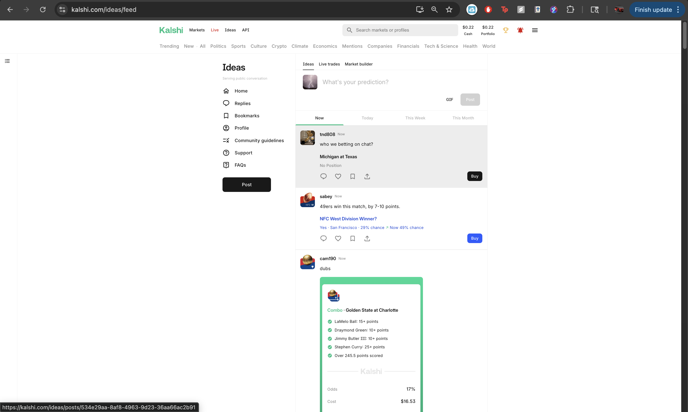

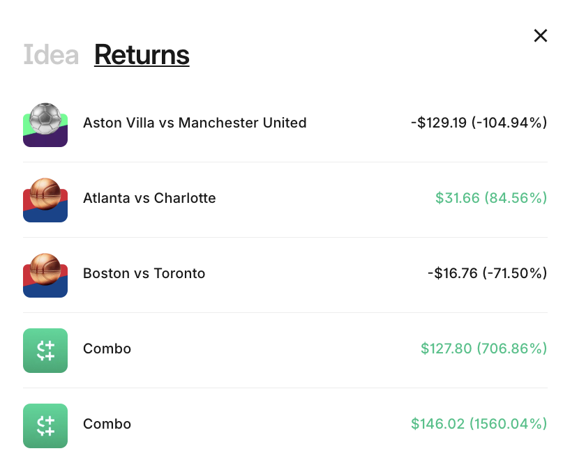

**User goal:**  
- Access main social/community platform
- View and engage with user-generated predictions and ideas
- Post predictions and market insights
- Discover markets through social feed
- Navigate social features (Home, Replies, Bookmarks, Profile)

**Kalshi flow (steps):**
1. User clicks "Ideas" in top navigation bar
2. Page routes to Ideas feed page
3. **URL routing:** `kalshi.com/ideas/feed` (default) or `kalshi.com/ideas/`
4. Page displays main social platform interface:
   - **Left sidebar:** Navigation and "Post" button
   - **Main content:** Feed with tabs (Ideas, Live trades, Market builder)
   - **Post input:** At top of feed
5. **Left Sidebar Navigation:**
   - "Ideas" heading with subtitle "Serving public conversation"
   - Navigation links:
     - "Home" (house icon)
     - "Replies" (speech bubble icon)
     - "Bookmarks" (ribbon icon)
     - "Profile" (person icon)
     - "Community guidelines"
     - "Support"
     - "FAQs"
   - "Post" button at bottom (black button)
6. **Main Content Tabs:**
   - "Ideas" tab (selected) - User-generated predictions and ideas (feed updates live)
   - "Live trades" tab - Live trading activity that updates live and rapidly
   - "Market builder" tab - Submit proposals to Kalshi team for new markets, view status of recent requests from everyone
7. **Post Input (Ideas tab):**
   - Input field with placeholder "What's your prediction?"
   - User avatar on left
   - "GIF" button
   - "Post" button (grayed out until content entered)
8. **Time Filters:**
   - "Now" (selected), "Today", "This Week", "This Month"
   - Filters feed by time period
9. **Feed Posts:**
   - User posts with avatars, usernames, timestamps
   - Post content (predictions, opinions, questions)
   - Associated markets (embedded market cards or market references)
   - User positions ("No Position" or position details)
   - Engagement icons: Comment, Heart (like), Bookmark, Share
   - "Buy" buttons on posts (for trading on referenced markets)
10. User can click posts to view full post page
11. User can interact with posts (like, comment, bookmark, share)

**Observed behavior:**
- **URL Structure:**
  - `kalshi.com/ideas/feed` (default Ideas feed)
  - Individual posts: `kalshi.com/ideas/posts/[post-id]`
  - Uses `/ideas/` path for all social features
- **Top Navigation:**
  - "Ideas" is highlighted in top navigation (when on this page)
  - Other navigation links still accessible (Markets, Live, API)
- **Left Sidebar:**
  - **Heading:** "Ideas" with subtitle "Serving public conversation"
  - **Navigation links:**
    - "Home" - Main feed (house icon)
    - "Replies" - User's replies to posts (speech bubble icon)
    - "Bookmarks" - Saved posts (ribbon icon)
    - "Profile" - User profile (person icon)
    - "Community guidelines" - Platform rules
    - "Support" - Help and support
    - "FAQs" - Frequently asked questions
  - **"Post" button:** Black button at bottom for creating new post
- **Main Content Tabs:**
  - **"Ideas" tab (selected):** User-generated predictions and ideas
    - Feed updates live (real-time updates)
    - Post input with "Your market title" placeholder
    - Posts show "Status Pending review" with clock icon for market proposals
    - Time filters: "Now", "Today", "This Week", "This Month"
    - "Minimum amount" dropdown filter on right
  - **"Live trades" tab:** Live trading activity feed
    - Updates live and rapidly (real-time trading activity)
    - Shows recent trades: "Bought Yes/No [outcome]", contract count, price per contract
    - All posts marked "Now" (very recent activity)
    - Market icons for different categories (football, brain/AI, profile pictures)
    - Examples: "Bought No Texas, 112 contracts (40¢)", "Bought Yes Fordham, 93 contracts (5¢)"
  - **"Market builder" tab:** Market proposal submission system
    - Submit proposals to Kalshi team for new markets
    - View status of most recent requests from everyone
    - Ability to ask for markets
    - Shows market proposal status (e.g., "Status Pending review")
  - Tabs switch content view
- **Post Input:**
  - Large input field at top of feed
  - Placeholder: "What's your prediction?"
  - User avatar on left
  - "GIF" button for adding GIFs
  - "Post" button (grayed out/disabled until content entered)
  - Character limit likely (similar to inline post input: 800 characters)
  - **Posting restrictions:**
    - User must have an active position in a market to post about it
    - If user clicks "Post" without a position, modal appears: "Make a trade to post"
    - Modal shows bear icon (pixelated black-and-white bear head on green background)
    - Modal has "Idea" title (light gray) and "Returns" subtitle (bold black)
    - Close button (X) in top right
    - Message: "Make a trade to post" (centered below bear icon)
    - **User must make a trade and have a position before posting**
- **Time Filters:**
  - "Now" (selected) - Most recent posts
  - "Today" - Posts from today
  - "This Week" - Posts from this week
  - "This Month" - Posts from this month
  - Filters feed by time period
- **Feed Posts:**
  - **User information:**
    - User avatar
    - Username (e.g., "tnd808", "sabey", "cam190")
    - Timestamp (e.g., "Now")
  - **Post content:**
    - Text content (e.g., "who we betting on chat?", "49ers win this match, by 7-10 points.", "dubs")
    - Associated markets (e.g., "Michigan at Texas", "NFC West Division Winner?")
    - User position (e.g., "No Position")
  - **Market details:**
    - Market cards embedded in posts
    - Market information (e.g., "Yes · San Francisco · 29% chance ? Now 49% chance")
    - Combo bet cards with multiple conditions
    - Odds and cost information
  - **Engagement features:**
    - Comment icon
    - Heart icon (like)
    - Bookmark icon
    - Share icon
  - **Trading actions:**
    - "Buy" button on posts (for trading on referenced markets)
    - Allows quick trading from feed
- **Combo Bet Cards:**
  - Embedded in posts (e.g., "Combo · Golden State at Charlotte")
  - List of conditions with checkmarks:
    - "LaMelo Ball: 15+ points"
    - "Draymond Green: 10+ points"
    - "Jimmy Butler III: 10+ points"
    - "Stephen Curry: 25+ points"
    - "Over 245.5 points scored"
  - Odds: "17%"
  - Cost: "$16.53"
  - "Kalshi" branding

**What I like:**
- **Dedicated social platform:** Centralized place for all social features
- **Clear navigation:** Left sidebar makes it easy to navigate social features
- **Post input prominent:** Easy to create new posts
- **Time filters:** Help users find recent or historical content
- **Multiple tabs:** Ideas, Live trades, Market builder provide different views
- **Embedded markets:** Markets seamlessly integrated into posts
- **Quick trading:** "Buy" buttons allow trading directly from feed
- **Combo bet cards:** Visual representation of complex bets
- **Engagement features:** Like, comment, bookmark, share all available

**What I don't like / confusion:**
- **UI complexity and routing confusion:** Left sidebar navigation items don't correlate well with middle tabs - no clear order or routing relationship
  - Left sidebar: Home, Replies, Bookmarks, Profile, Community guidelines, Support, FAQs
  - Middle tabs: Ideas, Live trades, Market builder
  - **User feedback:** "Feels like too many buttons to look through, should be simpler UI"
  - **User feedback:** "Can be misleading" - unclear which buttons do what
  - **User feedback:** "No in order way or routing" - navigation feels disconnected
- **Post button placement:** "Post" button in sidebar AND in post input - which one to use?
- **Time filter "Now":** What does "Now" mean? (last hour? last few minutes?)
- **No search within Ideas:** Must use top search bar
- **No category filters:** Can't filter by market category (Sports, Politics, etc.)
- **Combo bet clarity:** Combo bet cards may be confusing for new users
- **Market proposal status:** "Status Pending review" - unclear how long review takes or what happens next
- **Live trades filter:** "Minimum amount" dropdown - what does this filter? (minimum trade size? minimum contract value?)

**Edge cases / bugs:**
- What if user posts without associated market? Is market required?
- What if post references a market that closes? Does post update?
- What if user wants to edit/delete their post?
- What if market proposal is rejected? How is user notified?
- What if live trades feed updates too rapidly? Can users keep up?
- What if user submits duplicate market proposal?

**Builder hypothesis (why they did it):**
- **Community building:** Social platform increases engagement and retention
- **Market discovery:** Users discover markets through social feed
- **User-generated content:** Reduces content creation burden on platform
- **Viral growth:** Shareable content drives new user acquisition
- **Trading integration:** "Buy" buttons reduce friction to trade
- **Multiple content types:** Ideas, Live trades, Market builder serve different user needs
- **Real-time updates:** Live feed and live trades create sense of activity and urgency
- **Market proposal system:** Allows users to request markets, increasing engagement and market variety
- **Transparency:** Showing all market proposals (not just user's own) builds community and trust
- **Time filters:** Help users find relevant content (recent vs historical)
- **Navigation sidebar:** Provides access to all social features in one place

**Opinion Kings implications:**
- **Copy:**
  - Dedicated Ideas feed page with `/ideas/feed` URL
  - Left sidebar navigation (Home, Replies, Bookmarks, Profile, etc.)
  - Main content tabs (Ideas, Live trades, Market builder)
  - Post input at top of feed
  - Time filters (Now, Today, This Week, This Month)
  - Embedded market cards in posts
  - "Buy" buttons on posts for quick trading
  - Combo bet cards for complex bets
  - Engagement features (like, comment, bookmark, share)
- **Avoid:**
  - Unclear tab functionality
  - Duplicate "Post" buttons (sidebar and input)
  - Unclear time filter definitions
  - No search within Ideas
- **Beat:**
  - **Clear tab descriptions:** Add tooltips or descriptions for each tab
  - **Unified post button:** Use one "Post" button (in input, not sidebar)
  - **Search within Ideas:** Add search bar specific to Ideas feed
  - **Category filters:** Allow filtering by market category
  - **Post editing:** Allow users to edit/delete their posts
  - **Market proposal status updates:** Notify users when proposals are approved/rejected
- **Live trades filtering:** Clarify what "Minimum amount" filter does
  - **Time filter clarity:** Show what "Now" means (e.g., "Last hour", "Last 15 minutes")
  - **Trending posts:** Show trending or popular posts
  - **Following feed:** Show posts from users you follow
  - **Post types:** Allow different post types (prediction, question, analysis, etc.)
  - **Rich media:** Support images, videos in posts (beyond GIFs)
  - **Hashtags:** Allow hashtags for better discovery
  - **Post scheduling:** Allow scheduling posts for future
  - **Draft posts:** Save drafts before posting
- **Implementation notes:**
  - **URL routing:**
    - Base URL: `kalshi.com/ideas/feed` (default)
    - Individual posts: `kalshi.com/ideas/posts/[post-id]`
    - Other routes: `/ideas/replies`, `/ideas/bookmarks`, `/ideas/profile`
    - Support browser back/forward navigation
  - **Left sidebar:**
    - "Ideas" heading with subtitle
    - Navigation links with icons
    - "Post" button at bottom
    - Highlight active navigation item
    - Store navigation state
  - **Main content tabs:**
    - "Ideas" tab: User-generated predictions and ideas
    - "Live trades" tab: Live trading activity feed
    - "Market builder" tab: Market creation/curation (if applicable)
    - Tab switching updates content
    - Store selected tab in state
  - **Post input:**
    - Large input field with placeholder
    - User avatar display
    - "GIF" button for GIF selection
    - "Post" button (enable/disable based on content)
    - Character limit (e.g., 800 characters)
    - Support markdown or rich text (if applicable)
  - **Time filters:**
    - "Now": Last hour or last 15 minutes
    - "Today": Posts from today
    - "This Week": Posts from this week
    - "This Month": Posts from this month
    - Filter posts by time period
    - Update feed when filter changes
  - **Feed posts:**
    - Fetch posts from API
    - Display user information (avatar, username, timestamp)
    - Display post content
    - Display associated markets (embedded cards or references)
    - Display user positions
    - Display engagement metrics (likes, comments, bookmarks, shares)
    - "Buy" button for trading on markets
    - Click handler to navigate to full post page
  - **Market cards:**
    - Embedded market cards in posts
    - Show market question, prediction, odds, cost
    - Clickable to navigate to full market page
    - Update when market resolves
  - **Combo bet cards:**
    - Display combo bet conditions
    - Show checkmarks for conditions
    - Display odds and cost
    - Visual representation of complex bets
  - **Engagement features:**
    - Like/unlike functionality
    - Comment functionality
    - Bookmark functionality
    - Share functionality
    - Update counts in real-time
  - **State management:**
    - Store selected tab
    - Store selected time filter
    - Store post input content
    - Store feed posts
    - Update feed when filters change
  - **Real-time updates:**
    - WebSocket or polling for new posts
    - Update engagement counts
    - Update market information in posts
  - **Performance:**
    - Infinite scroll for feed
    - Lazy load posts
    - Optimize image loading
    - Cache feed data
- **Metrics:**
  - Ideas page view rate
  - Tab usage (Ideas vs Live trades vs Market builder)
  - Post creation rate
  - Time filter usage (which filters are most used?)
  - Post engagement rate (likes, comments, bookmarks, shares)
  - "Buy" button click-through rate from feed
  - Market discovery rate (do users discover markets through feed?)
  - User retention (do users return to Ideas feed?)
  - Post quality metrics (which posts get most engagement?)
  - Combo bet card interaction rate
  - Navigation sidebar usage (which links are most clicked?)
  - Post completion rate (how many users start vs finish posts?)

### Live Trades Tab (Real-Time Trading Activity)

**Feature category:** Social / Trading Activity / Real-Time Updates

**Screenshots:**  
- 083: `083-social-live-trades-tab.png` - Live trades tab showing real-time trading activity feed with recent trades

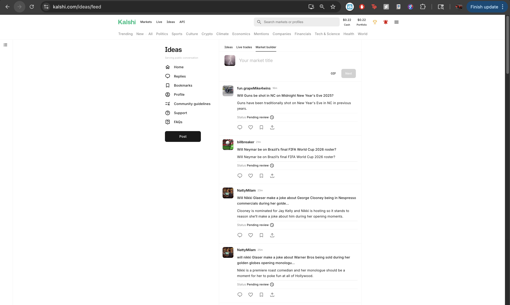

**User goal:**  
- View real-time trading activity across all markets
- See what other users are trading right now
- Discover active markets through trading activity
- Track live market momentum

**Kalshi flow (steps):**
1. User navigates to Ideas feed page (`kalshi.com/ideas/feed`)
2. User clicks "Live trades" tab
3. Tab displays real-time trading activity feed
4. **Feed updates live and rapidly** - new trades appear in real-time
5. Feed shows recent trades with:
   - Market icon (category indicator)
   - Market name/description
   - User action: "Bought Yes [outcome]" or "Bought No [outcome]"
   - Contract details: number of contracts and price per contract
   - Timestamp: "Now" (all trades are very recent)
6. User can scroll to see more trades
7. Feed continuously updates as new trades occur

**Observed behavior:**
- **Tab selection:** "Live trades" tab is selected (underlined when active)
- **Real-time updates:** Feed updates live and rapidly - new trades appear automatically
- **Feed entries:**
  - Each entry shows a market icon (football for sports, brain for AI, profile picture for political figures)
  - Market name/description (e.g., "Michigan at Texas", "Fordham at Dayton", "Best AI next month?")
  - User action: "Bought Yes [outcome]" or "Bought No [outcome]"
    - "Yes" highlighted in green
    - "No" highlighted in red
  - Contract details: "[number] contracts ([price]¢)"
    - Examples: "112 contracts (40¢)", "93 contracts (5¢)", "61 contracts (22¢)"
  - Timestamp: All entries show "Now" (indicating very recent activity)
- **Filter dropdown:** "Minimum amount" dropdown on right (functionality unclear)
- **Scrollable feed:** Vertical scrollbar indicates more trades below
- **Market variety:** Shows trades across different categories:
  - Sports (college football, basketball)
  - AI/Technology ("Best AI next month?")
  - Politics ("What will Zohran Mamdani say during his inauguration?")
- **Examples observed:**
  - "Michigan at Texas: Bought No Texas, 112 contracts (40¢)"
  - "Fordham at Dayton: Bought Yes Fordham, 93 contracts (5¢)"
  - "Nebraska at Utah: Bought Yes Nebraska, 61 contracts (22¢)"
  - "Minnesota at Atlanta: Total Points: Bought Yes Over 240.5 points scored, 7 contracts (50¢)"
  - "New Orleans at Chicago: Spread: Bought Yes New Orleans wins by over 16.5 Points, 125 contracts (9¢)"
  - "Best AI next month?: Bought Yes Gemini, 11 contracts (88¢)"
  - "What will Zohran Mamdani say during his inauguration?: Bought Yes Rat, 2 contracts (14¢)"

**What I like:**
- **Real-time updates:** Creates sense of activity and urgency
- **Live momentum:** See what markets are hot right now
- **Market discovery:** Discover active markets through trading activity
- **Transparency:** See what other users are trading (builds trust)
- **Visual indicators:** Color coding (green/red) makes it easy to scan
- **Market icons:** Visual category indicators help identify market types quickly

**What I don't like / confusion:**
- **"Minimum amount" filter:** Unclear what this filters (minimum trade size? minimum contract value?)
- **No market links:** Can't click on trades to go to market page
- **No user links:** Can't click on trades to see user profile
- **Rapid updates:** May be overwhelming if updates too fast
- **No time context:** All trades show "Now" - no sense of timing
- **No category filters:** Can't filter by market category
- **No search:** Can't search for specific markets or users

**Edge cases / bugs:**
- What if feed updates too rapidly? Can users keep up?
- What if no trades occur? Does it show empty state?
- What if trade references a market that closes? Does it update?
- What if "Minimum amount" filter is applied? What happens?

**Builder hypothesis (why they did it):**
- **Social proof:** Seeing others trade creates FOMO and encourages trading
- **Market discovery:** Users discover active markets through trading activity
- **Real-time engagement:** Live updates keep users engaged
- **Transparency:** Showing all trades builds trust in platform
- **Momentum indicators:** Helps users identify trending markets
- **Community building:** Creates sense of active community

**Opinion Kings implications:**
- **Copy:**
  - Live trades tab with real-time updates
  - Feed showing recent trades with market, action, contracts, price
  - Color coding for Yes/No actions
  - Market icons for category identification
  - "Now" timestamp for recent trades
- **Avoid:**
  - Unclear filter functionality
  - No clickable elements (markets, users)
  - Overwhelming rapid updates
- **Beat:**
  - **Clickable trades:** Make trades clickable to navigate to market or user profile
  - **Filter clarity:** Make "Minimum amount" filter clear (what does it filter?)
  - **Category filters:** Add filters for market categories
  - **Time context:** Show actual timestamps or relative time (e.g., "2m ago", "5m ago")
  - **Search:** Add search for markets or users
  - **Trade details:** Show more trade details on hover (user profile, market details)
  - **Market links:** Click on market name to go to market page
  - **User links:** Click on trade to see user's trading history
  - **Pause updates:** Allow users to pause real-time updates if too fast
  - **Trade grouping:** Group trades by market (show multiple trades for same market together)
  - **Trade volume:** Show total volume traded per market
  - **Trending markets:** Highlight markets with high trading activity
- **Implementation notes:**
  - **Real-time updates:**
    - WebSocket connection for live trades
    - Push new trades to feed in real-time
    - Update feed without page reload
    - Handle rapid updates gracefully (throttle if needed)
  - **Feed entries:**
    - Fetch trades from API
    - Display market icon (based on category)
    - Display market name/description
    - Display user action (Bought Yes/No with outcome)
    - Display contract details (count and price)
    - Display timestamp ("Now" for recent trades)
    - Color code Yes (green) and No (red)
  - **Filtering:**
    - "Minimum amount" dropdown (clarify functionality)
    - Filter trades by minimum trade size or contract value
    - Update feed when filter changes
  - **State management:**
    - Store live trades feed
    - Store selected filter
    - Update feed when new trades arrive
    - Handle rapid updates (throttle/debounce if needed)
  - **Performance:**
    - Optimize for rapid updates
    - Virtual scrolling for large feed
    - Lazy load trades
    - Cache market icons
  - **Navigation:**
    - Make trades clickable (navigate to market or user profile)
    - Support browser back/forward
- **Metrics:**
  - Live trades tab view rate
  - Time spent on Live trades tab
  - Trade click-through rate (to market or user profile)
  - Filter usage (which filters are most used?)
  - Real-time update effectiveness (do users notice new trades?)
  - Market discovery rate (do users discover markets through live trades?)
  - Trading activity correlation (does viewing live trades lead to more trades?)

### Market Builder Tab (Market Proposal System)

**Feature category:** Social / Market Creation / Community Engagement

**Screenshots:**  
- 084: `084-social-market-builder-tab.png` - Market builder tab showing market proposal submission and status tracking
- 085: `085-social-market-builder-step-1.png` - Step 1 of 3 guidance for market builder showing instructions and guidelines

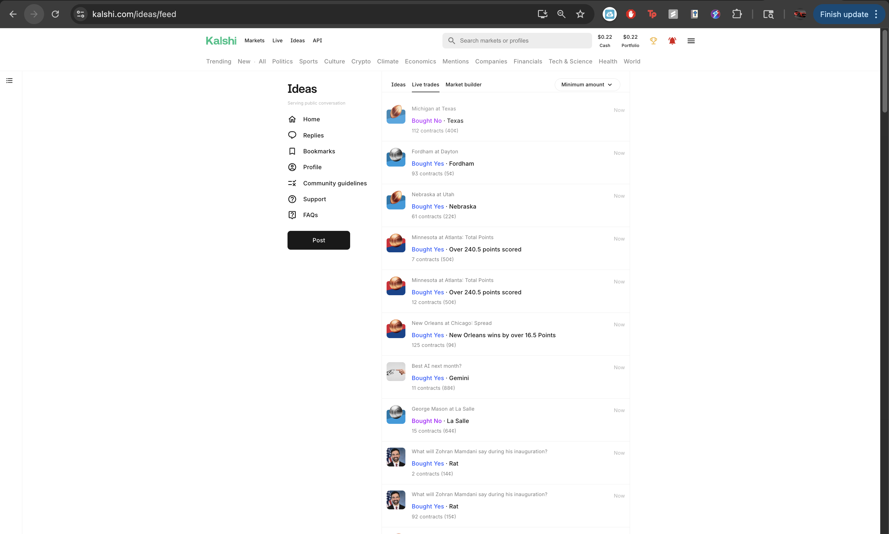

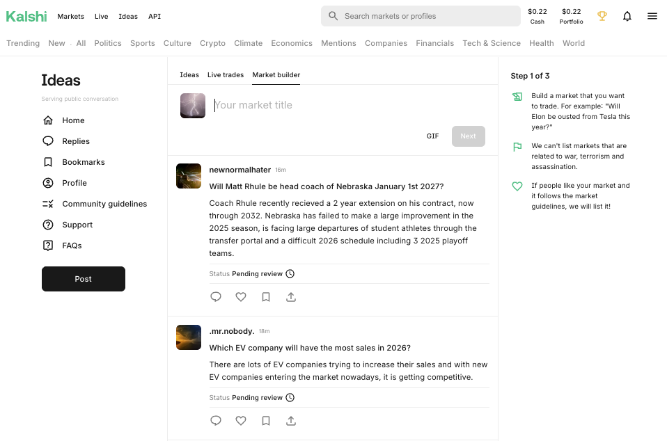

**User goal:**  
- Submit proposals to Kalshi team for new markets
- View status of most recent market requests from everyone
- Request specific markets to be created
- Track proposal status and see what markets others are requesting

**Kalshi flow (steps):**
1. User navigates to Ideas feed page (`kalshi.com/ideas/feed`)
2. User clicks "Market builder" tab
3. Tab displays market proposal interface
4. **Step-by-step guidance (Step 1 of 3):**
   - User sees guidance card titled "Step 1 of 3"
   - **Guidance points:**
     1. **Build a market you want to trade:**
        - Icon: Green/teal building/structure icon
        - Text: "Build a market that you want to trade. For example: 'Will Elon be ousted from Tesla this year?'"
        - Provides example of valid market question
     2. **Market restrictions:**
        - Icon: Green/teal flag icon
        - Text: "We can't list markets that are related to war, terrorism and assassination."
        - Clearly states prohibited topics
     3. **Approval process:**
        - Icon: Green/teal heart outline icon
        - Text: "If people like your market and it follows the market guidelines, we will list it!"
        - Describes approval process (community likes + guidelines compliance)
   - Guidance appears as white card with clean typography and simple icons
5. **View recent requests:**
   - See most recent market proposals from all users
   - View proposal status (e.g., "Status Pending review")
   - See proposal details (market title, description, user, timestamp)
6. **Submit new proposal:**
   - User can submit proposal for new market
   - Enter market title/description
   - Submit to Kalshi team for review
7. **Proposal status:**
   - Proposals show "Status Pending review" with clock icon
   - User can track status of their proposals
   - User can see status of all proposals (not just their own)
8. **Post input:**
   - Input field with "Your market title" placeholder
   - User avatar on left
   - "GIF" and "Next" buttons
   - Similar to Ideas tab post input

**Observed behavior:**
- **Tab selection:** "Market builder" tab is selected (underlined when active)
- **Step-by-step guidance:**
  - **Step 1 of 3 guidance card:**
    - White rectangular card with "Step 1 of 3" heading (bold, black text)
    - Three guidance points, each with:
      - Green/teal icon (building, flag, heart)
      - Clear text explanation
    - **Point 1 - Build a market:**
      - Icon: Green/teal building/structure icon (roof with flag on top)
      - Text: "Build a market that you want to trade. For example: 'Will Elon be ousted from Tesla this year?'"
      - Provides concrete example of valid market question
    - **Point 2 - Restrictions:**
      - Icon: Green/teal flag icon
      - Text: "We can't list markets that are related to war, terrorism and assassination."
      - Clearly states prohibited topics (war, terrorism, assassination)
    - **Point 3 - Approval process:**
      - Icon: Green/teal heart outline icon
      - Text: "If people like your market and it follows the market guidelines, we will list it!"
      - Describes two-part approval: community likes + guidelines compliance
  - Clean, minimalist design with clear typography
  - Icons use consistent green/teal color scheme
  - Indicates multi-step process (Step 1 of 3 suggests Steps 2 and 3 exist)
- **Post input:**
  - Input field with placeholder "Your market title"
  - User avatar on left (purple cloud-like icon)
  - "GIF" button
  - "Next" button (instead of "Post") - likely leads to Step 2
- **Proposal feed:**
  - Shows market proposals from all users
  - Each proposal includes:
    - User information (username, avatar)
    - Timestamp (e.g., "16m", "21m", "23m", "25m")
    - Market question/title (e.g., "Will Guns be shot in NC on Midnight New Year's Eve 2025?")
    - Description/context (additional details about the market)
    - Status: "Status Pending review" with clock icon
  - Engagement icons: Comment, Heart (like), Bookmark, Share
- **Proposal examples observed:**
  - "Will Guns be shot in NC on Midnight New Year's Eve 2025?" (from `fun.grapeMike4wins`, 16m ago)
  - "Will Golden Globes jokes be funny?" (from `billbreaker`, 21m ago)
  - "Will Neymar be in FIFA World Cup?" (from `NattyMilam`, 23m ago)
  - "Will Neymar be in FIFA World Cup?" (from `NattyMilam`, 25m ago - duplicate?)
- **Status tracking:**
  - All visible proposals show "Status Pending review"
  - Clock icon indicates waiting for review
  - No indication of review timeline or next steps

**What I like:**
- **Step-by-step guidance:** Clear instructions help users understand the process
- **Example provided:** Concrete example ("Will Elon be ousted from Tesla this year?") helps users understand format
- **Clear restrictions:** Explicitly states what's not allowed (war, terrorism, assassination)
- **Approval transparency:** Explains approval criteria (community likes + guidelines compliance)
- **Visual design:** Clean, minimalist card with helpful icons
- **Community-driven markets:** Users can request markets they want
- **Transparency:** See all proposals (not just your own) - builds community
- **Status tracking:** Clear status indicator ("Pending review")
- **Easy submission:** Simple interface for submitting proposals
- **Engagement:** Can like, comment, bookmark, share proposals

**What I don't like / confusion:**
- **Steps 2 and 3 not visible:** Only Step 1 shown - what are Steps 2 and 3?
- **"Market guidelines" reference:** Mentions "market guidelines" but doesn't show them (where are they?)
- **"People like your market" unclear:** How many likes needed? What's the threshold?
- **Unclear review process:** How long does review take? What are the criteria?
- **No status updates:** Only shows "Pending review" - no other statuses visible
- **No notification system:** How are users notified when proposals are approved/rejected?
- **Duplicate proposals:** Same user can submit duplicate proposals (e.g., "Will Neymar be in FIFA World Cup?" twice)
- **No proposal editing:** Can't edit proposals after submission
- **No proposal deletion:** Can't delete proposals
- **No filtering:** Can't filter by status, category, or user
- **No search:** Can't search for specific proposals

**Edge cases / bugs:**
- What if user doesn't see Steps 2 and 3? Are they required?
- What if user submits proposal that violates restrictions? Is it rejected immediately?
- What if proposal gets likes but doesn't follow guidelines? What happens?
- What if proposal follows guidelines but gets no likes? Is it still considered?
- What if proposal is rejected? How is user notified?
- What if proposal is approved? How is user notified? Does it become a market?
- What if user submits duplicate proposal? Is it allowed?
- What if proposal violates guidelines? What happens?
- What if user wants to edit proposal? Can they?
- What if proposal is pending for a long time? Is there a timeout?

**Builder hypothesis (why they did it):**
- **Market variety:** User requests increase market variety and relevance
- **Community engagement:** Users feel invested when their markets are created
- **Market validation:** See what markets users want before creating them
- **Transparency:** Showing all proposals builds trust and community
- **Content creation:** Reduces burden on Kalshi team to come up with all markets
- **User retention:** Users return to check status of their proposals

**Opinion Kings implications:**
- **Copy:**
  - Market builder tab for proposal submission
  - Step-by-step guidance (Step 1 of 3) with clear instructions
  - Example market question to guide users
  - Clear restrictions (war, terrorism, assassination)
  - Approval process explanation (community likes + guidelines compliance)
  - View all proposals (not just user's own)
  - Status tracking ("Pending review" with clock icon)
  - Post input with "Your market title" placeholder
  - Engagement features (like, comment, bookmark, share)
- **Avoid:**
  - Unclear review process
  - No status updates beyond "Pending review"
  - No notification system
  - Duplicate proposals allowed
- **Beat:**
  - **Show all steps:** Display Steps 2 and 3 (not just Step 1)
  - **Link to guidelines:** Provide direct link to full market guidelines
  - **Like threshold clarity:** Show how many likes are needed or what the threshold is
  - **Guidelines inline:** Show market guidelines directly in the flow (not just reference them)
  - **Status updates:** Show multiple statuses (Pending, Under Review, Approved, Rejected, Live)
  - **Notification system:** Notify users when proposals are approved/rejected
  - **Review timeline:** Show estimated review time or average review time
  - **Proposal editing:** Allow users to edit proposals before review
  - **Proposal deletion:** Allow users to delete their proposals
  - **Duplicate prevention:** Prevent or flag duplicate proposals
  - **Category tagging:** Allow users to tag proposals by category
  - **Voting system:** Allow users to vote on proposals (most requested markets)
  - **Proposal details:** Show more details about proposal (rationale, sources, etc.)
  - **Filtering:** Add filters for status, category, user, date
  - **Search:** Add search for proposals
  - **Proposal history:** Show history of proposal status changes
  - **Approved markets link:** Link approved proposals to created markets
  - **Rejection reasons:** Show reasons for rejection (if applicable)
  - **Proposal analytics:** Show how many proposals are approved vs rejected
  - **Progress indicator:** Show progress through all steps (1 of 3, 2 of 3, 3 of 3)
- **Implementation notes:**
  - **Step-by-step guidance:**
    - Display "Step 1 of 3" guidance card
    - Three key points with icons:
      1. Build a market (with example)
      2. Restrictions (war, terrorism, assassination)
      3. Approval process (community likes + guidelines)
    - Clean, minimalist design with green/teal icons
    - Store step state (current step: 1, 2, or 3)
    - Navigate between steps (likely via "Next" button)
  - **Proposal submission:**
    - Post input with "Your market title" placeholder
    - User avatar display
    - "GIF" button for adding GIFs
    - "Next" button (leads to Step 2 of 3)
    - Submit proposal to backend
    - Store proposal in database
    - Validate against restrictions (war, terrorism, assassination)
  - **Proposal feed:**
    - Fetch proposals from API
    - Display user information (avatar, username, timestamp)
    - Display market title/question
    - Display description/context
    - Display status ("Pending review" with clock icon)
    - Display engagement metrics (likes, comments, bookmarks, shares)
  - **Status tracking:**
    - Store proposal status (Pending, Under Review, Approved, Rejected, Live)
    - Update status when reviewed
    - Display status with appropriate icon
    - Show status history (if applicable)
  - **Notification system:**
    - Notify users when proposals are approved/rejected
    - Email or in-app notification
    - Link to approved market (if applicable)
  - **State management:**
    - Store proposals feed
    - Store user's proposals
    - Store proposal status
    - Update when status changes
  - **Duplicate prevention:**
    - Check for duplicate proposals before submission
    - Flag or prevent duplicates
    - Show existing proposals if duplicate detected
  - **Filtering and search:**
    - Filter by status, category, user, date
    - Search for specific proposals
    - Update feed when filters change
  - **Performance:**
    - Optimize for large number of proposals
    - Infinite scroll for feed
    - Lazy load proposals
    - Cache proposal data
- **Metrics:**
  - Market builder tab view rate
  - Proposal submission rate
  - Proposal approval rate
  - Average review time
  - Proposal engagement rate (likes, comments, shares)
  - Duplicate proposal rate
  - User retention (do users return to check proposal status?)
  - Approved market creation rate (how many proposals become markets?)
  - Proposal quality metrics (which proposals get approved most?)

### Returns Page (Posting on Closed Trades)

**Feature category:** Social / Trading / Post Creation

**Screenshots:**  
- 093: `093-social-post-trade-requirement-modal.png` - Modal requiring user to make a trade before posting
- 094: `094-social-returns-page.png` - Returns page showing closed trades with returns (wins/losses) that can be posted about

**User goal:**  
- View closed trades with returns (wins/losses)
- Post about closed trades that had returns
- Share trading results and outcomes
- Post about live positions (combo slips or one-off predictions)
- Post about wins/losses with different card displays
- Post about cashouts taken before final settlement

**Kalshi flow (steps):**

**Posting from Live Positions:**
1. User navigates to Portfolio or position view
2. User clicks on a live position (combo slip or one-off prediction)
3. User can post about the live position
4. **Post creation:**
   - Position details are included (combo slip or single prediction)
   - User can add comments
   - Post shows as live position card in feed

**Posting from Returns Page (Closed Trades):**
1. User clicks "Post" button (in sidebar or post input)
2. **If user has no active position:**
   - Modal appears: "Make a trade to post"
   - Modal shows bear icon (pixelated black-and-white bear head on green background)
   - Title: "Idea" (light gray) and "Returns" (bold black)
   - Message: "Make a trade to post" (centered)
   - Close button (X) in top right
   - User must make a trade and have a position before posting
3. **If user has closed trades with returns:**
   - User can access "Returns" page
   - **Returns page displays:**
     - Header: "Idea" (light gray) and "Returns" (bold black, underlined)
     - Close button (X) in top right
     - List of closed trades with returns:
       - Each item shows:
         - **Icon:** Market icon (soccer ball, basketball, combo icon) on colored background
         - **Text:** Market name (e.g., "Aston Villa vs Manchester United", "Atlanta vs Charlotte", "Combo")
         - **Value:** Return amount and percentage
           - Negative returns: Black text (e.g., "-$129.19 (-104.94%)")
           - Positive returns: Green text (e.g., "$31.66 (84.56%)", "$127.80 (706.86%)")
     - Items separated by thin horizontal lines
4. **Returns include:**
   - **Cashed out returns:** Trades that were cashed out early (for win or loss)
   - **Determined returns:** Trades that reached market resolution (for win or loss)
5. User can click on a return to post about it
6. **Posting win/loss:**
   - User can post about a win or loss
   - User can toggle comments on/off
   - **If market is settled:**
     - Post shows as the market card (standard market display)
   - **If market is not settled or showing result:**
     - Post shows a different card with payout display
     - **Win:** Shows payout amount (e.g., "$234")
     - **Loss:** Shows payout of "$0"
7. **Posting cashouts:**
   - User can post about cashouts taken before final settlement
   - Shows cashout amount and timing
   - Indicates position was cashed out early
8. Posting about a return allows user to share their trading result

**Observed behavior:**
- **Posting restriction:**
  - **User must have an active position to post about a market**
  - If no position, modal appears: "Make a trade to post"
  - Modal prevents posting without a trade
  - **Purpose:** Ensures users only post about markets they have traded
- **Returns page:**
  - **Header:**
    - "Idea" in light gray (left side)
    - "Returns" in bold black, underlined (indicates active tab/view)
    - Close button (X) in top right
  - **Returns list:**
    - Vertical list of closed trades
    - Each item shows:
      - **Left:** Market icon on colored background
        - Soccer ball icon (silver) on green/purple diagonal split background
        - Basketball icon (brown vintage style) on red/blue horizontal split background
        - Combo icon (white arrows with dollar signs) on light green square background
      - **Middle:** Market name text
        - Individual markets: "Aston Villa vs Manchester United", "Atlanta vs Charlotte", "Boston vs Toronto"
        - Combo bets: "Combo"
      - **Right:** Return value and percentage
        - **Negative returns:** Black text
          - Example: "-$129.19 (-104.94%)" (Aston Villa vs Manchester United)
          - Example: "-$16.76 (-71.50%)" (Boston vs Toronto)
        - **Positive returns:** Green text
          - Example: "$31.66 (84.56%)" (Atlanta vs Charlotte)
          - Example: "$127.80 (706.86%)" (Combo)
          - Example: "$146.02 (1560.04%)" (Combo)
    - Items separated by thin horizontal lines
    - List is scrollable (if more returns exist)
- **Return types:**
  - **Cashed out returns:** Trades that were cashed out early (before market resolution)
    - Can be wins or losses
    - User chose to exit position early
  - **Determined returns:** Trades that reached market resolution
    - Can be wins or losses
    - Market closed and determined outcome
- **Posting from live positions:**
  - User can post about active positions (combo slips or one-off predictions)
  - User can add comments to the post
  - Post shows position details in feed
  - Position is still live (not yet settled)
- **Posting from returns:**
  - User can post about any closed trade with a return
  - Allows sharing trading results and outcomes
  - Enables users to discuss their trading performance
- **Posting win/loss:**
  - User can post about wins or losses
  - **Comments toggle:** User can turn comments on/off
  - **Settled markets:**
    - If market is settled, post shows as standard market card
    - Market card displays normally in feed
  - **Unsettled or result display:**
    - Post shows different card with payout display
    - **Win:** Shows payout amount (e.g., "$234", "$127.80")
    - **Loss:** Shows payout of "$0"
    - Card format differs from standard market card
- **Posting cashouts:**
  - User can post about cashouts taken before final settlement
  - Shows cashout amount
  - Indicates position was exited early (not settled)
  - Different from posting about settled wins/losses
  - Allows users to share early exit decisions

**What I like:**
- **Posting restriction:** Ensures users only post about markets they have traded (prevents spam, ensures authenticity)
- **Returns visibility:** Clear display of trading results (wins and losses)
- **Visual distinction:** Green for wins, black for losses - easy to scan
- **Combo support:** Shows returns for combo bets
- **Posting flexibility:** Can post about cashed out or determined trades
- **Live position posting:** Can post about active positions, not just closed trades
- **Comments control:** Can toggle comments on/off for win/loss posts
- **Different card displays:** Settled vs unsettled posts show different cards (market card vs payout card)
- **Cashout posting:** Can share early exit decisions and cashout results

**What I don't like / confusion:**
- **Modal clarity:** "Make a trade to post" - doesn't explain why or what to do next
- **No active position indicator:** Doesn't show which markets user has active positions in
- **Returns page access:** How do users access Returns page? (not clear from modal)
- **No return details:** Returns page doesn't show trade details (entry price, exit price, etc.)
- **No filtering:** Can't filter returns by win/loss, date, market category, etc.
- **No sorting:** Can't sort returns by amount, percentage, date, etc.
- **Card display inconsistency:** Not clear when post shows as market card vs payout card
- **Comments toggle unclear:** Where is comments toggle? When can it be used?
- **Cashout vs settled distinction:** Not clear how cashout posts differ from settled posts in feed
- **Live position posting access:** How do users access posting from live positions? (not clear)

**Edge cases / bugs:**
- What if user has active position but wants to post about a closed trade? Can they?
- What if user cashed out at break-even? Does it show in Returns?
- What if user has many returns? Is there pagination?
- What if user wants to post about a market they traded but lost all money? Is it in Returns?
- What if user posts about live position, then position settles? Does post update?
- What if user posts win/loss with comments off, then wants to enable comments later?
- What if user posts cashout, then market settles? Does post show both cashout and settlement?
- What if user has both live position and closed trade for same market? Which can they post?

**Builder hypothesis (why they did it):**
- **Authenticity:** Requiring a position ensures users only post about markets they've actually traded
- **Spam prevention:** Prevents users from posting about markets they haven't engaged with
- **Community quality:** Ensures posts are from users with skin in the game
- **Returns visibility:** Shows users their trading history and results
- **Posting flexibility:** Allows posting about both active positions and closed trades
- **Engagement:** Encourages users to trade to be able to post

**Opinion Kings implications:**
- **Copy:**
  - Posting restriction (require active position or closed trade)
  - "Make a trade to post" modal
  - Returns page showing closed trades with returns
  - Visual distinction (green for wins, black for losses)
  - Combo bet support in returns
- **Avoid:**
  - Unclear modal messaging
  - No way to see active positions
  - No return details
- **Beat:**
  - **Clearer modal:** Explain why posting requires a trade, show next steps
  - **Active positions view:** Show which markets user has active positions in
  - **Return details:** Show trade details (entry price, exit price, date, etc.)
  - **Filtering:** Filter returns by win/loss, date, market category, amount
  - **Sorting:** Sort returns by amount, percentage, date, market name
  - **Return analytics:** Show total returns, win rate, average return, etc.
  - **Posting from active positions:** Allow posting about active positions (not just closed trades) - **ALREADY SUPPORTED**
  - **Return sharing:** Make it easier to share returns (pre-filled post with return details)
  - **Return history:** Show full trading history, not just returns
  - **Post type clarity:** Clearly indicate post type (live position, settled win/loss, cashout)
  - **Card display explanation:** Explain when post shows as market card vs payout card
  - **Comments toggle visibility:** Make comments toggle more visible and clear
  - **Post updates:** Update posts when live positions settle (show transition from live to settled)
  - **Post editing:** Allow editing posts (e.g., enable/disable comments, update content)
  - **Post deletion:** Allow deleting posts if user changes mind
  - **Post analytics:** Show post engagement (views, likes, comments) for trading posts
- **Implementation notes:**
  - **Posting restriction:**
    - Check if user has active position in market before allowing post
    - Show modal if no position: "Make a trade to post"
    - Modal should have clear messaging and next steps
    - Allow closing modal and navigating to market to trade
  - **Returns page:**
    - Fetch closed trades with returns (cashed out or determined)
    - Display in list format with icons, market names, and return values
    - Color code: Green for positive returns, black for negative returns
    - Support combo bets (show "Combo" text and combo icon)
    - Make items clickable to post about return
  - **Return calculation:**
    - **Cashed out returns:** Calculate based on exit price vs entry price
    - **Determined returns:** Calculate based on market resolution (100% or 0%)
    - Show both dollar amount and percentage
  - **Posting from live positions:**
    - Allow posting from Portfolio position view
    - Include position details (combo slip or single prediction)
    - Allow comments to be added
    - Show post as live position card in feed
    - Update post when position settles (optional)
  - **Posting from returns:**
    - When user clicks return, open post creation with market pre-selected
    - Pre-fill post with return details (optional)
    - Allow user to add their own commentary
  - **Posting win/loss:**
    - **Comments toggle:** Allow user to enable/disable comments
    - **Card display logic:**
      - If market is settled: Show as standard market card
      - If market is not settled or showing result: Show payout card
        - Win: Display payout amount (e.g., "$234")
        - Loss: Display "$0"
    - **Payout card design:**
      - Different from standard market card
      - Prominently displays payout amount
      - Shows win/loss status
  - **Posting cashouts:**
    - Allow posting about cashouts taken before final settlement
    - Show cashout amount
    - Indicate early exit (not settled)
    - Different card format from settled posts
    - Show timing of cashout (before settlement)
  - **State management:**
    - Track active positions (for posting restriction)
    - Track closed trades with returns (for Returns page)
    - Update when trades are made or closed
- **Metrics:**
  - Posting restriction modal view rate
  - Posting restriction modal dismissal rate
  - Returns page view rate
  - Returns page click-through rate (clicking on return to post)
  - Posts created from returns
  - Average returns per user
  - Win rate (positive returns vs negative returns)

### User Profile Page with Tabs

**Feature category:** Social / User Profile / Privacy

**Screenshots:**  
- 087: `087-social-profile-replies-tab.png` - Profile page with Replies tab selected (empty state)
- 088: `088-social-profile-bookmarks-tab.png` - Profile page with Bookmarks tab selected (empty state)
- 089: `089-social-profile-posts-tab.png` - Profile page with Posts tab selected (showing user posts)

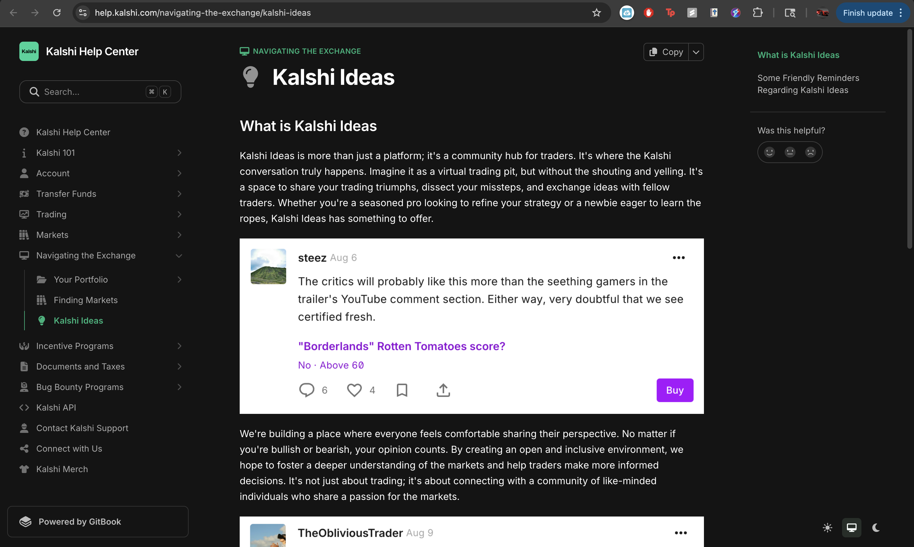

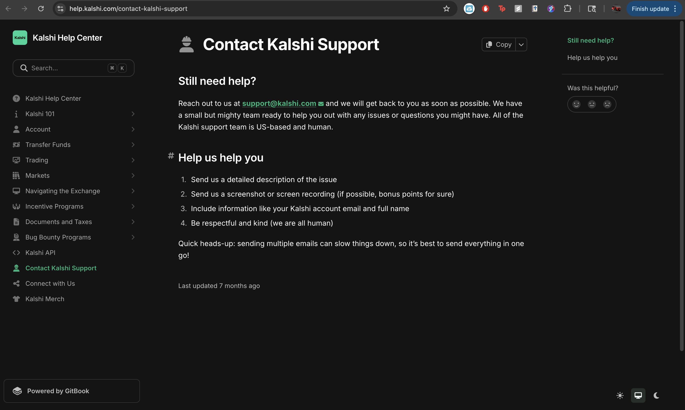

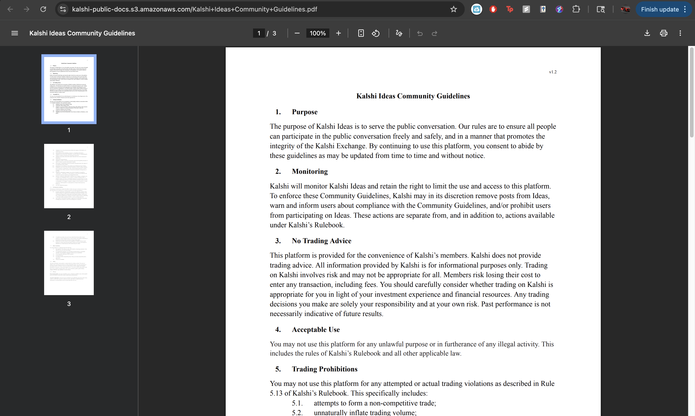

**User goal:**  
- View user profile and activity
- Navigate between different profile sections (Posts, Replies, Bookmarks, etc.)
- Control privacy settings for profile visibility
- See user stats and trading performance

**Kalshi flow (steps):**
1. User clicks "Profile" in left sidebar of Ideas feed page
2. Page routes to user profile page
3. **URL routing:** `kalshi.com/ideas/profile`
4. **Profile header displays:**
   - Back arrow icon (navigate back)
   - User avatar (e.g., purple lightning bolt icon)
   - Username (e.g., "sgeddam")
   - Kalshi logo with gear icon (settings) and upload icon
5. **User stats row:**
   - "Potential payout": "$0.00" (money bag icon)
   - "Loss": "-$837.67" (dollar sign icon)
   - "Volume": "20.49K" (bar chart icon)
   - "Predictions": "51" (diamond icon)
6. **Privacy options:**
   - "Hide my positions" link
   - "Hide my Trades" link
   - Allows users to control what others see on their profile
7. **Profile sub-navigation tabs:**
   - "Posts" - User's posts
   - "Market builder" - User's market proposals
   - "Replies" - User's replies to posts
   - "Likes" - Posts user has liked
   - "Bookmarks" - Posts user has bookmarked
   - "Trades" - User's trading activity
   - "Top Categories" - User's top trading categories
   - "Positions" - User's current positions
8. User clicks different tabs to view different content
9. **Empty states:**
   - "Replies" tab: Shows "No replies" with megaphone icon
   - "Bookmarks" tab: Shows "No bookmarks" with head icon
10. **Posts tab content:**
    - Shows user's posts in chronological order (most recent first)
    - Each post shows: username, date, post content, embedded market cards
    - Example: "Dec 29" post with "nice" comment and combo bet card
    - Example: "Dec 21" post with "holy bang" comment

**Observed behavior:**
- **URL Structure:**
  - `kalshi.com/ideas/profile` (user's own profile)
  - Profile page accessible from left sidebar "Profile" link
- **Profile header:**
  - Back arrow for navigation
  - User avatar (customizable icon, e.g., purple lightning bolt)
  - Username display
  - Settings gear icon and upload icon (for profile customization?)
- **User stats:**
  - **Potential payout:** Shows potential earnings (money bag icon)
  - **Loss:** Shows total losses (dollar sign icon, negative value)
  - **Volume:** Shows trading volume (bar chart icon, e.g., "20.49K")
  - **Predictions:** Shows number of predictions made (diamond icon, e.g., "51")
  - Stats are visible to other users (unless hidden via privacy options)
- **Privacy options:**
  - **"Hide my positions" link:** Allows user to hide their positions from other users
  - **"Hide my Trades" link:** Allows user to hide their trades from other users
  - Good privacy controls for user discretion
  - **User feedback:** "Good privacy options" - users appreciate ability to control visibility
- **Profile sub-navigation tabs:**
  - Horizontal row of tabs below profile header
  - Tabs: "Posts", "Market builder", "Replies", "Likes", "Bookmarks", "Trades", "Top Categories", "Positions"
  - Selected tab is highlighted with green underline
  - Tabs switch content view
  - **User feedback:** "No in order way or routing" - tabs don't correlate with left sidebar navigation
  - **User feedback:** "Feels like too many buttons to look through, should be simpler UI"
  - **User feedback:** "Can be misleading" - unclear which buttons do what
- **Posts tab:**
  - Shows user's posts in reverse chronological order
  - Each post includes: username, date, post content, embedded market cards
  - Posts can include combo bet cards with multiple predictions
  - Engagement icons (like, comment, bookmark, share) below posts
  - Example posts:
    - "Dec 29" - "nice" with combo bet card (San Francisco to win, Caleb Williams: 200+ passing yards, etc.)
    - "Dec 21" - "holy bang" with another market card
- **Replies tab:**
  - Empty state: Large green/white megaphone icon
  - Text: "No replies"
  - Shows when user has no replies to posts
- **Bookmarks tab:**
  - Empty state: Large head icon with green/teal background
  - Text: "No bookmarks"
  - Shows when user has no bookmarked posts

**What I like:**
- **Privacy options:** Ability to hide positions and trades - good privacy controls
- **User stats:** Clear display of trading performance (potential payout, loss, volume, predictions)
- **Multiple tabs:** Organized way to view different aspects of user activity
- **Empty states:** Clear empty states with helpful icons
- **Chronological posts:** Posts shown in reverse chronological order (most recent first)
- **Profile customization:** Avatar and username display

**What I don't like / confusion:**
- **UI complexity and routing confusion:** 
  - **User feedback:** "No in order way or routing" - left sidebar items (Home, Replies, Bookmarks, Profile) don't correlate well with middle tabs (Posts, Market builder, Replies, Likes, Bookmarks, Trades, Top Categories, Positions)
  - **User feedback:** "Feels like too many buttons to look through, should be simpler UI"
  - **User feedback:** "Can be misleading" - unclear which buttons do what
  - Left sidebar navigation and profile tabs feel disconnected
  - Too many navigation options create confusion
  - No clear hierarchy or relationship between navigation elements
- **Tab organization:** 8 tabs may be overwhelming
- **No search:** Can't search within profile content
- **No filtering:** Can't filter posts by date, market category, etc.

**Edge cases / bugs:**
- What if user has no posts? Does Posts tab show empty state?
- What if user hides positions but others can still see stats?
- What if user wants to hide stats but not positions?
- What if profile is viewed by another user? Do privacy settings apply?

**Builder hypothesis (why they did it):**
- **Privacy controls:** Allow users to control what others see (builds trust)
- **Comprehensive profile:** Multiple tabs show different aspects of user activity
- **Social engagement:** Profile encourages users to share and engage
- **Trading transparency:** Stats visible to build credibility (unless hidden)
- **Navigation flexibility:** Multiple ways to access content (left sidebar + tabs)

**Opinion Kings implications:**
- **Copy:**
  - User profile page with stats (potential payout, loss, volume, predictions)
  - Privacy options (hide positions, hide trades)
  - Profile tabs (Posts, Replies, Bookmarks, etc.)
  - Empty states for tabs with no content
  - Profile header with avatar and username
- **Avoid:**
  - UI complexity with disconnected navigation (left sidebar + tabs)
  - Too many navigation options
  - Unclear routing relationships
- **Beat:**
  - **Simplified navigation:** Reduce number of navigation options, make relationships clear
  - **Unified navigation:** Align left sidebar with profile tabs (or remove redundancy)
  - **Clear hierarchy:** Establish clear navigation hierarchy
  - **Progressive disclosure:** Hide less-used tabs or group them
  - **Search within profile:** Add search for posts, trades, etc.
  - **Filtering:** Add filters for posts (by date, category, etc.)
  - **Privacy granularity:** More privacy options (hide stats, hide specific tabs, etc.)
  - **Profile customization:** More avatar options, profile bio, etc.
  - **Activity timeline:** Show activity timeline across all tabs
- **Implementation notes:**
  - **URL routing:**
    - Base URL: `kalshi.com/ideas/profile`
    - Support tab routing: `/ideas/profile?tab=posts`, `/ideas/profile?tab=replies`, etc.
    - Browser back/forward navigation
  - **Profile header:**
    - Back arrow navigation
    - User avatar (customizable)
    - Username display
    - Settings gear icon (profile settings)
    - Upload icon (avatar upload?)
  - **User stats:**
    - Fetch stats from API (potential payout, loss, volume, predictions)
    - Display with icons
    - Update in real-time
    - Respect privacy settings
  - **Privacy options:**
    - "Hide my positions" toggle
    - "Hide my Trades" toggle
    - Store privacy preferences
    - Apply to profile visibility
  - **Profile tabs:**
    - Horizontal tab navigation
    - Tabs: Posts, Market builder, Replies, Likes, Bookmarks, Trades, Top Categories, Positions
    - Selected tab highlighted (green underline)
    - Switch content view when tab clicked
    - Store selected tab in state
  - **Posts tab:**
    - Fetch user's posts from API
    - Display in reverse chronological order
    - Show embedded market cards
    - Display engagement metrics
  - **Empty states:**
    - Replies tab: "No replies" with megaphone icon
    - Bookmarks tab: "No bookmarks" with head icon
    - Other tabs likely have similar empty states
  - **State management:**
    - Store selected tab
    - Store user stats
    - Store privacy settings
    - Update when settings change
- **Metrics:**
  - Profile page view rate
  - Tab usage (which tabs are most viewed?)
  - Privacy option usage (how many users hide positions/trades?)
  - Profile engagement rate (do users view other profiles?)
  - Empty state rate (how many users have empty tabs?)
  - Profile customization rate (do users customize avatars?)

### Community Guidelines

**Feature category:** Social / Compliance / Legal

**Screenshots:**  
- 090: `090-social-community-guidelines-pdf.png` - Community Guidelines PDF document (page 1 of 3)

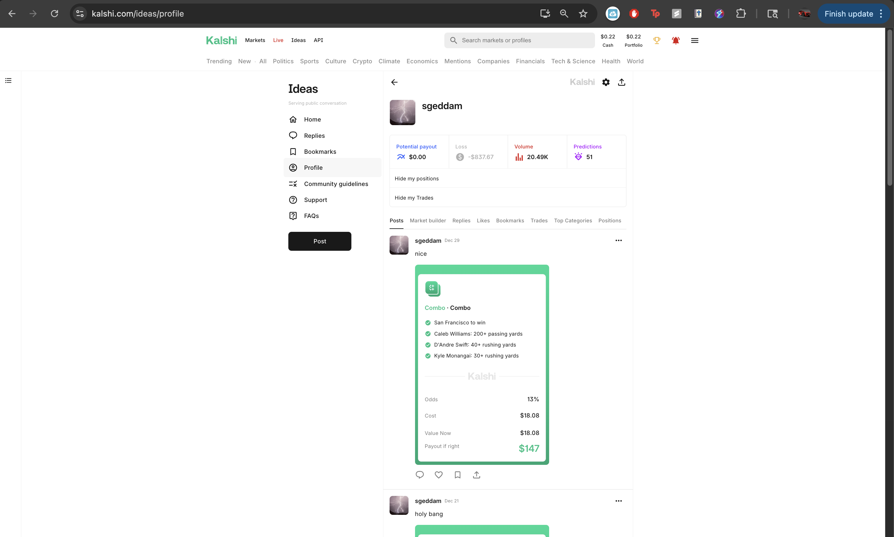

**User goal:**  
- Read platform rules and community guidelines
- Understand acceptable use policies
- Learn about trading restrictions and prohibitions

**Kalshi flow (steps):**
1. User clicks "Community guidelines" in left sidebar of Ideas feed page
2. PDF document opens in browser
3. **URL routing:** `kalshi-public-docs.s3.amazonaws.com/Kalshi+Ideas+Community+Guidelines.pdf`
4. PDF viewer displays document (3 pages total)
5. User can navigate pages, zoom, download, print
6. **Document content (Page 1):**
   - Title: "Kalshi Ideas Community Guidelines" (version v1.2)
   - **1. Purpose:** Platform goal to serve public conversation, ensure safe participation, promote integrity
   - **2. Monitoring:** Kalshi monitors platform, can limit use, remove posts, warn users, prohibit participation
   - **3. No Trading Advice:** Platform for convenience, no trading advice, informational only, trading involves risk
   - **4. Acceptable Use:** Cannot be used for unlawful or illegal activity
   - **5. Trading Prohibitions:** Lists specific violations (partially visible):
     - 5.1. attempts to form a non-competitive trade
     - 5.2. unnaturally inflate trading volume

**Observed behavior:**
- **PDF document:** Opens in browser PDF viewer
- **Document structure:**
  - 3 pages total
  - Version number: v1.2 (top right)
  - Title: "Kalshi Ideas Community Guidelines"
- **PDF viewer controls:**
  - Page navigation: "1 / 3" (current page / total pages)
  - Zoom controls: "100%", "+" button
  - Download, print, rotate options
  - Sidebar with page thumbnails (1, 2, 3)
- **Content sections (Page 1):**
  - **1. Purpose:** Describes platform goals (serve public conversation, ensure safe participation, promote integrity)
  - **2. Monitoring:** Explains Kalshi's monitoring and enforcement rights
  - **3. No Trading Advice:** Disclaimers about trading risk and informational purposes
  - **4. Acceptable Use:** Prohibits unlawful or illegal activity
  - **5. Trading Prohibitions:** Lists specific trading violations (partially visible on page 1)
- **Access:** Via "Community guidelines" link in left sidebar

**What I like:**
- **Comprehensive guidelines:** Clear rules and policies
- **PDF format:** Easy to read and reference
- **Version tracking:** Version number (v1.2) shows document is maintained
- **Easy access:** Accessible from left sidebar

**What I don't like / confusion:**
- **PDF format:** Requires PDF viewer, not inline HTML
- **No search:** Can't search within PDF
- **No table of contents:** No quick navigation to sections
- **Static document:** Not interactive or searchable

**Edge cases / bugs:**
- What if PDF doesn't load? Is there fallback?
- What if guidelines are updated? How are users notified?
- What if user wants to reference specific section? No anchor links

**Builder hypothesis (why they did it):**
- **Legal compliance:** PDF format ensures document integrity
- **Version control:** Version numbers track document updates
- **Comprehensive coverage:** Detailed guidelines cover all aspects
- **Easy distribution:** PDF can be downloaded and shared

**Opinion Kings implications:**
- **Copy:**
  - Community guidelines document
  - Accessible from left sidebar
  - Version tracking
- **Avoid:**
  - PDF format (use HTML for better UX)
  - Static document (make it interactive)
- **Beat:**
  - **HTML format:** Inline HTML page instead of PDF
  - **Searchable:** Add search within guidelines
  - **Table of contents:** Quick navigation to sections
  - **Anchor links:** Direct links to specific sections
  - **Update notifications:** Notify users when guidelines are updated
  - **Interactive elements:** Expandable sections, examples, etc.
- **Implementation notes:**
  - **Document format:** Use HTML instead of PDF
  - **Navigation:** Add table of contents with anchor links
  - **Search:** Add search functionality within document
  - **Version tracking:** Display version number and last updated date
  - **Update notifications:** Notify users of updates (banner, email, etc.)
- **Metrics:**
  - Guidelines view rate
  - Time spent reading guidelines
  - Section click-through rate
  - Download rate (if PDF option available)

### Contact Kalshi Support

**Feature category:** Support / Help / Customer Service

**Screenshots:**  
- 091: `091-support-contact-kalshi-support.png` - Contact Kalshi Support page from Help Center

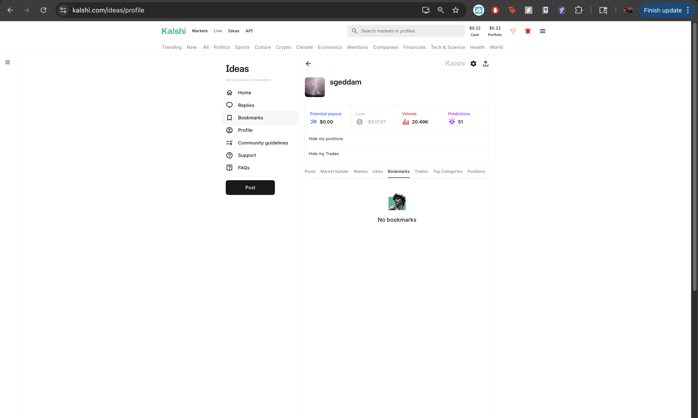

**User goal:**  
- Contact Kalshi support team
- Get help with issues or questions
- Submit support requests

**Kalshi flow (steps):**
1. User clicks "Support" in left sidebar of Ideas feed page OR navigates to Help Center
2. Page routes to Contact Kalshi Support page
3. **URL routing:** `help.kalshi.com/contact-kalshi-support`
4. **Help Center interface:**
   - Left sidebar with navigation categories
   - Main content area with support information
   - Right sidebar with "Still need help?" and "Was this helpful?" sections
5. **Support information:**
   - Email: `support@kalshi.com` (hyperlinked with envelope icon)
   - Instructions: "Reach out to us at support@kalshi.com and we will get back to you as soon as possible"
   - Team description: "We have a small but mighty team ready to help you out with any issues or questions you might have. All of the Kalshi support team is US-based and human."
6. **"Help us help you" section:**
   - Numbered list of instructions:
     1. "Send us a detailed description of the issue"
     2. "Send us a screenshot or screen recording (if possible, bonus points for sure)"
     3. "Include information like your Kalshi account email and full name"
     4. "Be respectful and kind (we are all human)"
   - Note: "sending multiple emails can slow things down, so it's best to send everything in one go!"
7. User can click email link to open email client
8. User can provide feedback via "Was this helpful?" emoji buttons

**Observed behavior:**
- **URL Structure:**
  - `help.kalshi.com/contact-kalshi-support`
  - Part of Kalshi Help Center (GitBook-powered)
- **Help Center interface:**
  - **Left sidebar navigation:**
    - Search bar with "Search..." placeholder and "⌘K" shortcut
    - Categories: Kalshi Help Center, Kalshi 101, Account, Transfer Funds, Trading, Markets, Navigating the Exchange, Incentive Programs, Documents and Taxes, Bug Bounty Programs, Kalshi API, **Contact Kalshi Support** (highlighted), Connect with Us, Kalshi Merch
    - Each item has right-pointing arrow icon
    - "Powered by GitBook" at bottom
  - **Top header:**
    - Kalshi logo (green square with "Kalshi" in white)
    - "Kalshi Help Center" text
    - "Contact Kalshi Support" title with construction worker hard hat icon
    - "Copy" button with dropdown arrow
    - "Finish update" button and three-dot menu
  - **Main content:**
    - "Still need help?" section with email contact information
    - "# Help us help you" section with numbered instructions
    - "Quick heads-up:" note about sending multiple emails
    - "Last updated 7 months ago" at bottom
  - **Right sidebar:**
    - "Still need help?" heading (repeated)
    - "Help us help you" heading (repeated)
    - "Was this helpful?" section with three emoji buttons (smiley, neutral, frowny face)
- **Support contact:**
  - Email: `support@kalshi.com` (hyperlinked with envelope icon)
  - Opens email client when clicked
  - Clear instructions on what to include
- **Help Center structure:**
  - Comprehensive navigation with many categories
  - Search functionality
  - GitBook-powered (third-party help center platform)

**What I like:**
- **Clear contact method:** Email address prominently displayed
- **Helpful instructions:** Clear guidance on what to include in support request
- **Human support:** Emphasizes "US-based and human" support team
- **Screenshot encouragement:** Asks for screenshots/screen recordings
- **Respectful tone:** "Be respectful and kind (we are all human)"
- **Search functionality:** Help Center has search bar

**What I don't like / confusion:**
- **Email-only support:** No live chat or ticket system
- **No response time estimate:** "as soon as possible" is vague
- **No support hours:** Not clear when support is available
- **Help Center complexity:** Many categories may be overwhelming
- **"Last updated 7 months ago":** May be outdated information

**Edge cases / bugs:**
- What if email doesn't work? Is there alternative contact method?
- What if support request is urgent? No priority system
- What if user doesn't have email client? No web form

**Builder hypothesis (why they did it):**
- **Cost-effective:** Email support is cheaper than live chat
- **Scalable:** Email can handle many requests
- **Documentation:** Help Center provides self-service options
- **Human touch:** Emphasizes human support (not bots)

**Opinion Kings implications:**
- **Copy:**
  - Contact support page with email
  - Clear instructions on what to include
  - Help Center with search and categories
- **Avoid:**
  - Email-only support (add live chat or ticket system)
  - Vague response times
- **Beat:**
  - **Multiple contact methods:** Email, live chat, ticket system
  - **Response time estimates:** Show average response time
  - **Support hours:** Display support availability
  - **Priority system:** Allow users to mark urgent requests
  - **Web form:** Support request form (not just email)
  - **Ticket tracking:** Allow users to track support requests
  - **Knowledge base:** Expand Help Center with more articles
- **Implementation notes:**
  - **Contact methods:**
    - Email: `support@kalshi.com`
    - Live chat widget (if implemented)
    - Support ticket system (if implemented)
  - **Help Center:**
    - GitBook or similar platform
    - Search functionality
    - Category navigation
    - Article pages
  - **Support instructions:**
    - Display clear guidelines
    - Encourage screenshots/screen recordings
    - Request account information
  - **Response tracking:**
    - Track response times
    - Display average response time
    - Notify users of responses
- **Metrics:**
  - Support page view rate
  - Email click-through rate
  - Support request volume
  - Average response time
  - User satisfaction (via "Was this helpful?" feedback)
  - Help Center search usage

### Kalshi Ideas Help Center Page

**Feature category:** Support / Help / Documentation

**Screenshots:**  
- 092: `092-support-kalshi-ideas-help.png` - Kalshi Ideas help center page explaining the platform

**User goal:**  
- Learn about Kalshi Ideas platform
- Understand what Kalshi Ideas is and how to use it
- Get help with Ideas features

**Kalshi flow (steps):**
1. User navigates to Help Center (via "Support" link or directly)
2. User navigates to "Kalshi Ideas" page
3. **URL routing:** `help.kalshi.com/navigating-the-exchange/kalshi-ideas`
4. **Help Center page displays:**
   - Left sidebar with navigation
   - Main content area with explanation
   - Right sidebar with "On this page" navigation
5. **Page content:**
   - Breadcrumb: "NAVIGATING THE EXCHANGE" (green text)
   - Heading: "Kalshi Ideas" with lightbulb icon
   - Sub-heading: "What is Kalshi Ideas"
   - Description: "a community hub for traders" and "a virtual trading pit" for sharing "trading triumphs, dissect your missteps, and exchange ideas"
   - Embedded example post from "steez Aug 6"
   - Additional description about platform goals
6. User can navigate to other Help Center pages
7. User can provide feedback via "Was this helpful?" emoji buttons

**Observed behavior:**
- **URL Structure:**
  - `help.kalshi.com/navigating-the-exchange/kalshi-ideas`
  - Part of Help Center navigation structure
- **Help Center interface:**
  - **Left sidebar:**
    - "Kalshi Help Center" heading
    - Search bar with "Search..." placeholder and "⌘K" shortcut
    - "Navigating the Exchange" category expanded
    - **"Kalshi Ideas" highlighted in green** with lightbulb icon (current page)
    - Other categories: Kalshi 101, Account, Transfer Funds, Trading, Markets, Your Portfolio, Finding Markets, Incentive Programs, Documents and Taxes, Bug Bounty Programs, Kalshi API, Contact Kalshi Support, Connect with Us, Kalshi Merch
    - "Powered by GitBook" at bottom
  - **Main content:**
    - Breadcrumb: "NAVIGATING THE EXCHANGE" (green text)
    - Heading: "Kalshi Ideas" with lightbulb icon
    - **"What is Kalshi Ideas" section:**
      - Description: "a community hub for traders" and "a virtual trading pit" for sharing "trading triumphs, dissect your missteps, and exchange ideas"
      - Embedded example post from "steez Aug 6":
        - Post text: "The critics will probably like this more than the seething gamers in the trailer's YouTube comment section. Either way, very doubtful that we see certified fresh."
        - Market question: ""Borderlands" Rotten Tomatoes score?"
        - Answer option: "No Above 60" (selected, purple)
        - Engagement: 6 comments, 4 likes (heart icon), bookmark icon, share icon
        - Purple "Buy" button
      - Additional description: "We're building a place where everyone feels comfortable sharing their perspective... It's not just about trading; it's about connecting with a community of like-minded individuals who share a passion for the markets."
      - Partial view of another post by "TheObliviousTrader Aug 9"
    - **"Some Friendly Reminders Regarding Kalshi Ideas" section** (mentioned in right sidebar)
  - **Right sidebar:**
    - "On this page" navigation:
      - "What is Kalshi Ideas" (highlighted in green)
      - "Some Friendly Reminders Regarding Kalshi Ideas"
    - "Was this helpful?" section with three emoji buttons (smiley, neutral, frowny face)
  - **Footer:**
    - Moon icon (dark/light mode toggle)
    - Monitor icon

**What I like:**
- **Clear explanation:** Describes what Kalshi Ideas is
- **Example embedded:** Shows real example post to illustrate platform
- **Helpful navigation:** "On this page" sidebar for quick navigation
- **Search functionality:** Help Center has search
- **Community focus:** Emphasizes community and connection

**What I don't like / confusion:**
- **Help Center complexity:** Many categories may be overwhelming
- **No video tutorial:** Text-only explanation
- **Example may be outdated:** Example post from "Aug 6" may not reflect current platform

**Edge cases / bugs:**
- What if user wants more examples? Only one example shown
- What if user wants video tutorial? Not available

**Builder hypothesis (why they did it):**
- **Documentation:** Help Center provides self-service support
- **Platform explanation:** Helps new users understand Ideas platform
- **Example-driven:** Embedded example shows real usage
- **Community building:** Emphasizes community aspect

**Opinion Kings implications:**
- **Copy:**
  - Help Center page explaining platform
  - Embedded example posts
  - "On this page" navigation
  - Search functionality
- **Avoid:**
  - Text-only explanations (add videos)
  - Outdated examples
- **Beat:**
  - **Video tutorials:** Add video explanations
  - **Multiple examples:** Show more examples of different post types
  - **Interactive guide:** Step-by-step interactive tutorial
  - **Updated examples:** Keep examples current
  - **FAQ section:** Add frequently asked questions
- **Implementation notes:**
  - **Help Center:**
    - GitBook or similar platform
    - Search functionality
    - Category navigation
    - Article pages with embedded examples
  - **Content:**
    - Platform explanation
    - Embedded example posts
    - Step-by-step guides
    - FAQ section
  - **Examples:**
    - Keep examples updated
    - Show variety of post types
    - Include engagement metrics
- **Metrics:**
  - Help page view rate
  - Time spent on help page
  - "Was this helpful?" feedback
  - Search usage
  - Help Center navigation patterns

### Ideas/Activity Feed for Markets

**Feature category:** Social / Discovery / Market Engagement

**Screenshots:**  
- 032: `032-social-ideas-activity-feed-1.png` - Activity feed showing user comments and embedded market cards
- 033: `033-social-ideas-activity-feed-2.png` - Ideas tab with post input and user post with embedded market card
- 034: `034-social-post-input-inline.png` - Inline post input that appears in the chat log
- 035: `035-social-activity-feed-detailed.png` - Detailed activity feed with user profiles and market cards
- 036: `036-social-comment-thread.png` - Comment thread showing nested replies and user badges
- 037: `037-social-ideas-page.png` - Dedicated Ideas page with navigation and post details

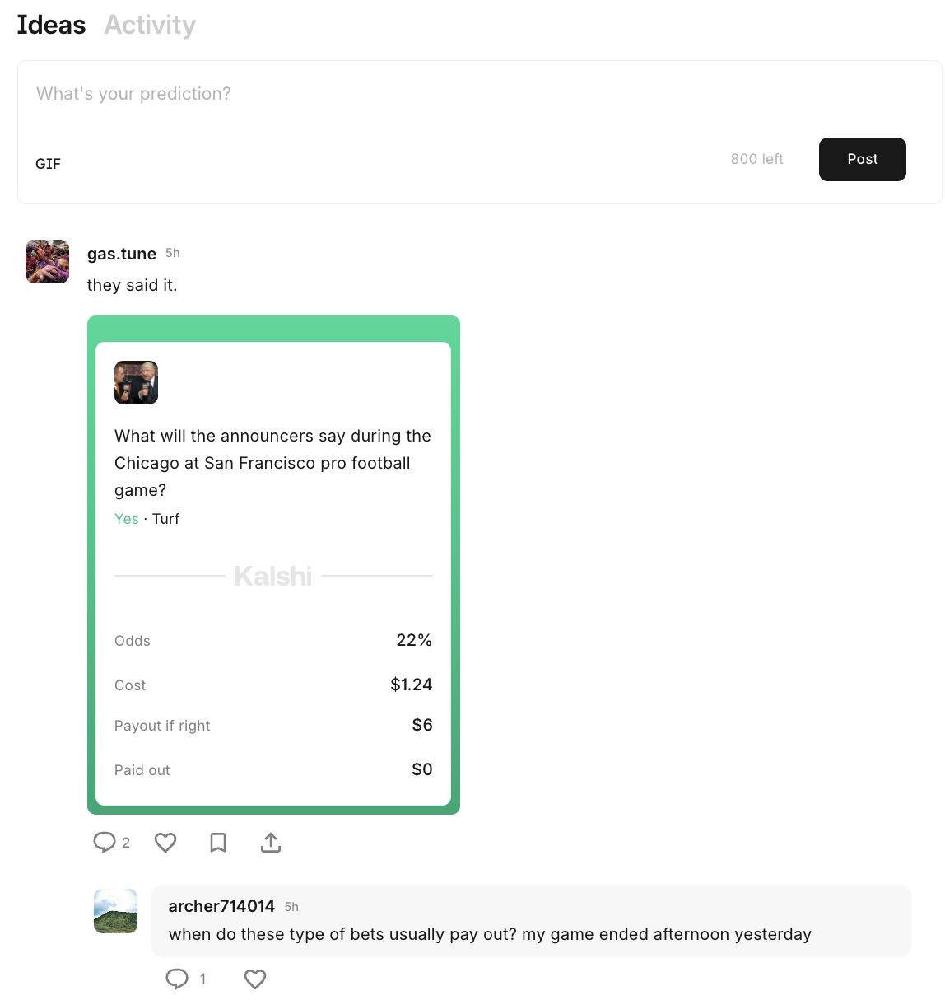

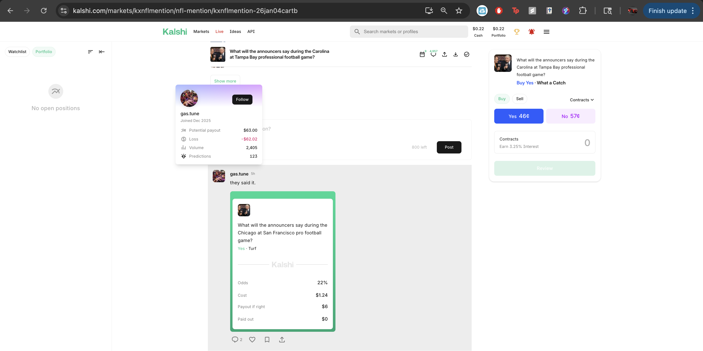

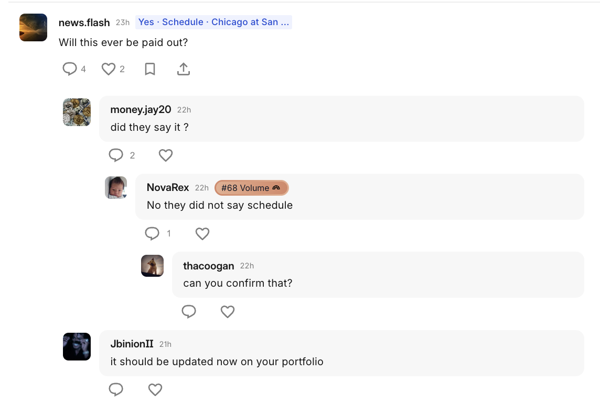

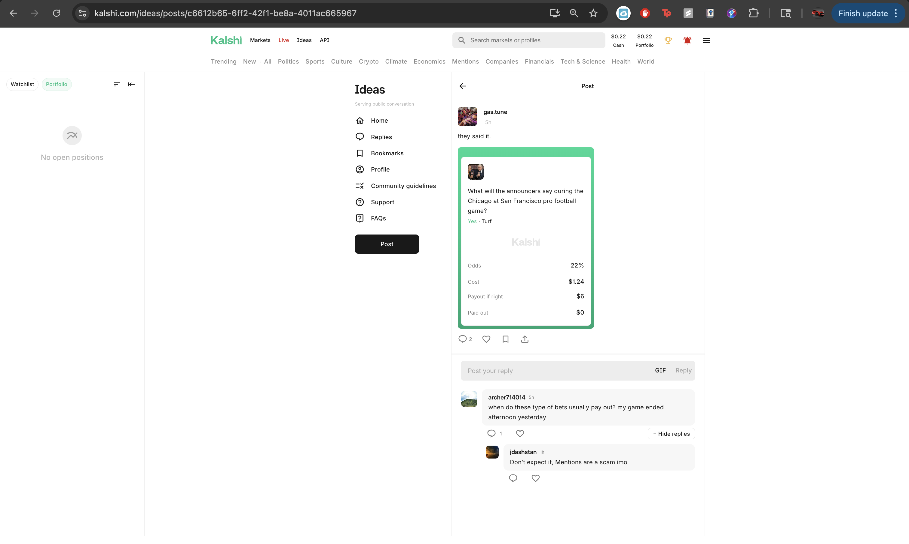

**User goal:**  
- View and engage with social content related to markets
- Share predictions and market insights
- Comment on and discuss markets with other users
- Discover markets through social feed
- Track activity and conversations around markets

**Kalshi flow (steps):**
1. User navigates to a market page (e.g., mentions market for NFL games) or Ideas page (`kalshi.com/ideas/posts/...`)
2. User sees "Ideas" and "Activity" tabs in the main content area
3. **Inline Post Creation:**
   - Post input field appears inline in the chat log/feed
   - User can create a post that will show up in the chat log
   - Two types of posts:
     - **Post your slip:** Share trading slip/position
     - **Post an opinion:** Share opinion tied to a market (market is tagged in the post)
   - Input field shows "What's your prediction?" placeholder
   - Character counter shows "800 left"
   - GIF option available
   - "Post" button to submit
4. **Activity Tab:**
   - Shows chronological feed of user-generated content
   - Feed includes both user comments and embedded market cards
   - Organized by last sent to oldest sent (reverse chronological)
   - Same chat/feed includes markets from both open orders and history
   - **Important:** Markets that people are sharing are all past/determined markets
   - **Infinite Scroll / Auto-Load:**
     - Scrolling down to bottom automatically loads more chats
     - No pagination - continuous loading as user scrolls
     - Can accumulate 4500+ messages in feed
     - Very bottom contains oldest messages
     - Help center copyright/footer content at very bottom
     - **Performance issues:** Auto-reload of new chats causes lag/delay
     - **Scale concerns:** 4500+ messages raises questions about:
       - How far back do messages go? (time limit unclear)
       - Does it make sense to load chats that far back?
       - Should there be a limit on how many messages are loaded?
   - **No event filtering:** Cannot filter chats per event within mentions markets
5. **User Engagement:**
   - Users can comment on posts (comment under a post)
   - Users can like comments
   - Users can bookmark posts
   - Users can share posts
   - Users can reply to comments (nested comments)
6. **User Profiles & Stats:**
   - Click on anyone's profile in the chat to quickly see their stats
   - Profile shows: Potential payout, Loss, Volume, Predictions count
   - "Follow" button available
   - "Joined [date]" information
7. **Volume/Leaderboard Tags:**
   - Certain players have volume/leaderboard tags (e.g., "#68 Volume" with rocket icon)
   - Adds credibility to their comments and ideas
   - Visual badge indicator (orange pill-shaped badge)
8. **Embedded Market Cards:**
   - Market cards appear embedded in the feed with green border
   - Show market question, prediction option, odds, cost, payout info
   - **Determined Markets:** Since markets shared are all past/determined, they show:
     - Price value now: Price of contracts if prediction was right
     - 0 if prediction was incorrect
   - Include engagement icons (likes, comments, bookmark, share)
   - Clickable to navigate to full market page
9. **Clickable Ideas:**
   - Click on any idea/post to go to hyperlinked page
   - Dedicated idea page with full details
   - Navigation includes: Home, Replies, Bookmarks, Profile, Community guidelines, Support, FAQs
   - "Post" button in sidebar for quick post creation

**Observed behavior:**
- **Tab Navigation:**
  - "Ideas" tab (selected, dark grey) and "Activity" tab (unselected, light grey)
  - Switching between tabs changes content view
- **Inline Post Input:**
  - Post input field appears inline in the chat log/feed
  - Large white text area with "What's your prediction?" placeholder
  - "GIF" option at bottom left
  - Character counter "800 left" at bottom right
  - "Post" button (dark grey, white text) on far right
  - Input field is prominent and encourages posting
  - Two post types:
    - Post your slip (share trading position)
    - Post an opinion (tied to a market, market is tagged)
- **Dedicated Ideas Page:**
  - Full page view at `kalshi.com/ideas/posts/...`
  - Left sidebar navigation:
    - Home (house icon)
    - Replies (speech bubble icon)
    - Bookmarks (ribbon icon)
    - Profile (person icon)
    - Community guidelines
    - Support
    - FAQs
  - Prominent "Post" button in sidebar
  - Header: "Ideas" title with "Serving public conversation" subtitle
- **Activity Feed:**
  - Chronological feed (newest to oldest)
  - Mix of user comments and embedded market cards
  - Text chains organized like normal messaging app
  - Includes markets from both:
    - Open orders (active markets)
    - History (determined/past markets)
  - All mentions markets grouped together in same feed
  - **Infinite Scroll / Auto-Load Behavior:**
    - Scrolling down to bottom automatically loads more chats
    - No pagination - continuous loading as user scrolls
    - Can accumulate 4500+ messages in feed
    - Very bottom contains oldest messages
    - Help center copyright/footer content at very bottom
    - **Performance issues:** Auto-reload of new chats causes lag/delay
    - **Scale concerns:** 4500+ messages raises questions:
      - How far back do messages go? (time limit unclear)
      - Does it make sense to load chats that far back?
      - Should there be a limit on how many messages are loaded?
  - **No event filtering:** Cannot filter chats per event within mentions markets
- **User Posts:**
  - User profile with circular avatar
  - Username displayed
  - Timestamp (e.g., "5h" for 5 hours ago)
  - Post text/content
  - Embedded market cards (if market-related post)
- **Embedded Market Cards:**
  - Green border/background (light green with darker green border)
  - Small image at top (e.g., announcers image)
  - Market question prominently displayed
  - Prediction option shown (e.g., "Yes · Turf")
  - "Kalshi" branding in light grey
  - **Determined Market Details (all shared markets are past/determined):**
    - Since markets are determined, they show actual outcome:
    - Price value now: Shows price of contracts if prediction was right
    - Shows 0 if prediction was incorrect
    - Historical betting details:
      - Odds (e.g., "22%")
      - Cost (e.g., "$1.24")
      - Payout if right (e.g., "$6")
      - Paid out (e.g., "$0" or actual payout amount)
  - Engagement icons below card:
    - Heart icon with count (likes)
    - Speech bubble icon (comments)
    - Bookmark icon (save)
    - Share icon
  - Clickable to navigate to full market page
- **User Profiles:**
  - Click on any user's profile in the chat to see their stats
  - Profile shows:
    - User avatar and username
    - "Joined [date]" (e.g., "Joined Dec 2025")
    - Potential payout (e.g., "$63.00")
    - Loss (e.g., "-$62.02")
    - Volume (e.g., "2,405")
    - Predictions count (e.g., "123")
    - "Follow" button
- **Volume/Leaderboard Tags:**
  - Certain players have volume/leaderboard tags
  - Visual badge: Orange pill-shaped badge (e.g., "#68 Volume" with rocket icon)
  - Adds credibility to their comments and ideas
  - Indicates high-activity or high-performing users
- **Comments:**
  - Users can comment on posts
  - Comments show user avatar, username, timestamp
  - Comments can be replied to (nested comments)
  - Comments show engagement icons (likes, replies)
  - Nested replies can be hidden/shown ("Hide replies" link)
  - Example comments observed:
    - Questions about payout times
    - Discussions about market outcomes
    - Frustrations about market resolution
    - Replies to other comments
    - Confirmation requests ("can you confirm that?")
    - Status updates ("it should be updated now on your portfolio")
- **Engagement Features:**
  - **Like:** Heart icon with count
  - **Comment:** Speech bubble icon, can comment under posts or replies
  - **Bookmark:** Save icon for bookmarking posts
  - **Share:** Share icon for sharing posts
  - All engagement actions appear below posts/comments
- **Clickable Ideas:**
  - Click on any idea/post to navigate to dedicated hyperlinked page
  - Full idea page shows complete post details
  - Reply input field: "Post your reply" with "GIF" and "Reply" buttons
  - All nested comments and replies visible
  - Full engagement metrics displayed

**What I like:**
- **Social integration:** Combines market discovery with social engagement
- **Chronological organization:** Reverse chronological feed (newest first) is intuitive
- **Embedded market cards:** Seamless integration of markets into social feed
- **Rich engagement:** Multiple ways to interact (like, comment, bookmark, share)
- **Unified feed:** Open and history markets in same feed - good for context
- **Clear visual hierarchy:** Green market cards stand out in feed
- **User-generated content:** Encourages community discussion around markets
- **Market discovery:** Users can discover markets through social feed
- **Nested comments:** Allows for threaded discussions
- **Volume/leaderboard tags:** Adds credibility to high-performing users' comments - excellent feature
- **Inline post creation:** Post input appears in feed, making it easy to contribute
- **Profile stats:** Quick access to user stats by clicking profile - helpful for credibility assessment
- **Determined market value display:** Shows actual outcome (price if right, 0 if wrong) - transparent
- **Clickable ideas:** Easy navigation to dedicated idea pages for full context
- **Post types:** Ability to post slips or opinions with market tags - flexible content creation

**What I don't like / confusion:**
- **Payout confusion:** User comments show confusion about payout times (e.g., "when do these type of bets usually pay out? my game ended afternoon yesterday")
- **Market resolution transparency:** Users express frustration about market resolution (e.g., "I ratchet the entire game and they never said watch a catch ??? Why did I not get paid or?")
- **No clear payout timeline:** Feed doesn't show estimated payout times or resolution status
- **Mixed content:** Open and history markets mixed together might be confusing
- **No filtering:** Can't filter feed by market type, open vs determined, etc.
- **Character limit unclear:** "800 left" suggests 800 character limit, but not clear what total limit is
- **No search:** Can't search within feed for specific markets or discussions
- **Infinite scroll performance issues:**
  - Auto-load of new chats causes lag/delay
  - Scrolling becomes slow with 4500+ messages loaded
  - Performance degrades as more messages are loaded
- **Scale concerns:**
  - 4500+ messages in feed - unclear how far back they go
  - No clear time limit on message history
  - Questionable value of loading chats that far back
  - Should there be a limit on message history?
- **No event filtering:**
  - Cannot filter chats per event within mentions markets
  - All mentions markets mixed together in same feed
  - Hard to find discussions about specific events
- **Bottom of page issues:**
  - Very bottom is hard to reach with 4500+ messages
  - Oldest messages at bottom may not be relevant
  - Help center copyright/footer content at very bottom (may never be seen)

**Edge cases / bugs:**
- None observed (only log bugs when explicitly identified)
- User confusion about payout times suggests potential UX issue (but not explicitly identified as bug)
- What if user posts market card for a market that closes while post is in feed?
- How are embedded market cards updated when market resolves?
- What if user comments on a determined market - is it clear market is closed?

**Builder hypothesis (why they did it):**
- **Social engagement:** Increases time on platform and user retention
- **Market discovery:** Social feed helps users discover markets they might not find otherwise
- **Community building:** Creates sense of community around markets
- **User-generated content:** Reduces content creation burden on platform
- **Viral growth:** Shareable content can drive new user acquisition
- **Unified experience:** Combining open and history markets in same feed provides context
- **Engagement metrics:** Social features increase platform stickiness
- **Market liquidity:** Social discussion can drive trading activity
- **User education:** Comments and discussions can help users understand markets

**Opinion Kings implications:**
- **Copy:**
  - Ideas/Activity feed with tabs
  - Embedded market cards in social feed
  - Chronological organization (newest first)
  - Engagement features (like, comment, bookmark, share)
  - Nested comments for threaded discussions
  - User profiles with avatars
  - Post input with character counter
  - Unified feed including both open and history markets
  - **Volume/leaderboard tags:** Excellent credibility feature - adds trust to high-performing users
  - Inline post creation in feed
  - Clickable user profiles with stats
  - Post types (slip vs opinion with market tags)
  - Clickable ideas to dedicated pages
  - Determined market value display (price if right, 0 if wrong)
- **Avoid:**
  - Payout time confusion (add clear timelines)
  - Market resolution transparency issues (show clear resolution status)
  - Mixed content without filtering options
- **Beat:**
  - **Clear payout timelines:** Show estimated payout time or resolution status on market cards
  - **Market status indicators:** Clearly show if market is open, live, or determined on embedded cards
  - **Filtering options:** Allow users to filter feed by market type, open vs determined, etc.
  - **Event filtering:** Add ability to filter chats per event within mentions markets
  - **Search functionality:** Add search within feed for markets or discussions
  - **Real-time updates:** Update market cards in feed when markets resolve
  - **Notification system:** Notify users when markets they've commented on resolve
  - **Resolution transparency:** Show clear explanation of how markets are resolved
  - **Payout status:** Show payout status on market cards (pending, processing, paid)
  - **Better character limit display:** Show "X of Y characters" instead of just "800 left"
  - **Market tags:** Add tags to posts for better categorization
  - **Trending discussions:** Highlight popular discussions or markets
  - **Enhanced volume badges:** More granular badges (top 10, top 100, etc.) or multiple badge types
  - **User verification:** Add verified badges for trusted users
  - **Open market sharing:** Allow sharing of open markets (not just determined) with live odds
  - **Better profile stats:** Add win rate, ROI, or other performance metrics
  - **Infinite scroll optimization:**
    - Implement message limit (e.g., last 30 days, last 1000 messages)
    - Add virtual scrolling or windowing for performance
    - Show loading indicator during auto-load
    - Optimize rendering for large message lists
    - Consider pagination as alternative to infinite scroll
  - **Message history limits:**
    - Set clear time limit (e.g., last 30 days, last 90 days)
    - Or set message count limit (e.g., last 1000 messages)
    - Show "Load older messages" button instead of auto-load
    - Add "Jump to top" button for easy navigation
  - **Better bottom navigation:**
    - "Jump to top" button
    - "Load older messages" button instead of auto-load
    - Clear indication of message count/time range
    - Separate footer from message feed
- **Implementation notes:**
  - **Feed architecture:**
    - Reverse chronological feed (newest first)
    - Include both open and history markets
    - Real-time updates via WebSocket or polling
    - **Infinite scroll implementation:**
      - Auto-load more messages when scrolling to bottom
      - Implement message limit (e.g., last 30 days, last 1000 messages)
      - Use virtual scrolling or windowing for performance
      - Show loading indicator during auto-load
      - Optimize rendering for large message lists
      - Consider pagination as alternative
    - **Event filtering:**
      - Add filter dropdown to filter by event
      - Store event metadata with each message
      - Filter messages by event ID
      - Show event name in filter dropdown
  - **Post creation:**
    - **Inline post input:** Appears in chat log/feed
    - **Post types:**
      - Post your slip (share trading position)
      - Post an opinion (tied to a market, market is tagged)
    - Character limit: 800 characters (or configurable)
    - Rich text support (GIFs, mentions, links)
    - Market card embedding (select market to embed)
    - Market tagging for opinion posts
    - Validation and moderation
  - **Embedded market cards:**
    - **Determined markets only:** All shared markets are past/determined
    - Fetch market data (question, options, odds, cost, payout)
    - **Show actual outcome:**
      - Price value now: Price of contracts if prediction was right
      - 0 if prediction was incorrect
    - Show market status (determined)
    - Historical betting details (original odds, cost, payout)
    - Click handler: navigate to full market page
    - Update cards when markets resolve (though all are already determined)
  - **Comments system:**
    - Nested comments (reply to comments)
    - Real-time comment updates
    - Moderation and spam filtering
    - Notification system for replies
  - **Engagement features:**
    - Like/unlike posts and comments
    - Bookmark posts
    - Share posts (copy link, social media)
    - Track engagement metrics
  - **User profiles:**
    - Avatar upload/selection
    - Username display
    - Timestamp formatting (relative time)
    - **Clickable profiles:** Click on any user in chat to see stats
    - **Profile stats display:**
      - Potential payout
      - Loss
      - Volume
      - Predictions count
      - Join date
      - Follow button
  - **Volume/leaderboard tags:**
    - Calculate user volume/performance metrics
    - Assign badges to high-performing users (e.g., "#68 Volume")
    - Visual badge indicator (orange pill-shaped badge with icon)
    - Display badge next to username in comments
    - Adds credibility to user's comments and ideas
  - **Feed filtering:**
    - Filter by market type
    - Filter by open vs determined
    - Filter by user
    - **Filter by event:** Filter chats per event within mentions markets
    - Sort options (newest, most liked, most commented)
  - **Search:**
    - Search posts by text
    - Search markets by question
    - Search users by username
  - **Clickable ideas:**
    - Each idea/post is clickable
    - Navigate to dedicated idea page (`/ideas/posts/{post-id}`)
    - Full post details with all comments and replies
    - Reply input field on idea page
    - Navigation sidebar (Home, Replies, Bookmarks, Profile, etc.)
  - **Market resolution integration:**
    - Update embedded cards when markets resolve
    - Show resolution status on cards
    - Notify users when markets they've engaged with resolve
    - Clear payout timeline communication
- **Metrics:**
  - Feed view rate
  - Post creation rate
  - Comment rate (comments per post)
  - Like rate (likes per post)
  - Share rate
  - Bookmark rate
  - Market card click-through rate (from feed to market page)
  - Time spent in feed
  - User retention (users who engage with feed vs those who don't)
  - Market discovery rate (markets discovered through feed)
  - Engagement rate (users who like/comment/share)
  - Payout confusion rate (users asking about payout times)
  - Market resolution satisfaction rate
  - Feed scroll depth
  - Post engagement rate (likes + comments + shares)
  - Comment thread depth (average replies per comment)
  - User-generated content rate (posts per user)
  - Profile click rate (how often users click on profiles)
  - Follow rate (profile views to follows)
  - Volume badge impact (engagement on posts by badge holders vs non-badge holders)
  - Post type distribution (slips vs opinions)
  - Idea page view rate (clicks on ideas to dedicated pages)
  - Determined market share rate (how often users share determined markets)
  - Market tag usage rate (how often opinions are tagged to markets)
  - Infinite scroll performance (time to load, lag measurements)
  - Message count per feed (average, max)
  - Time range of messages in feed (how far back do messages go?)
  - Event filter usage rate (if implemented)
  - Bottom of page reach rate (how often users scroll to bottom)
  - Auto-load success rate (how often auto-load works vs fails)
  - Message history limit effectiveness (if implemented)

---

## Support & Settlement

### Market Rules Documentation System

**Feature category:** Support / Compliance / Market Page / Settlement

**Screenshots:**  
- 040: `040-market-page-full-rules-pdf.png` - Full rules PDF document (SPORTSMENTION.pdf) accessed via "View full rules"
- 041: `041-support-help-center-rules.png` - Help center page for market rules accessed via "Help center" link
- 042: `042-market-page-rules-summaries-popup.png` - Rules summaries popup accessed via info icon

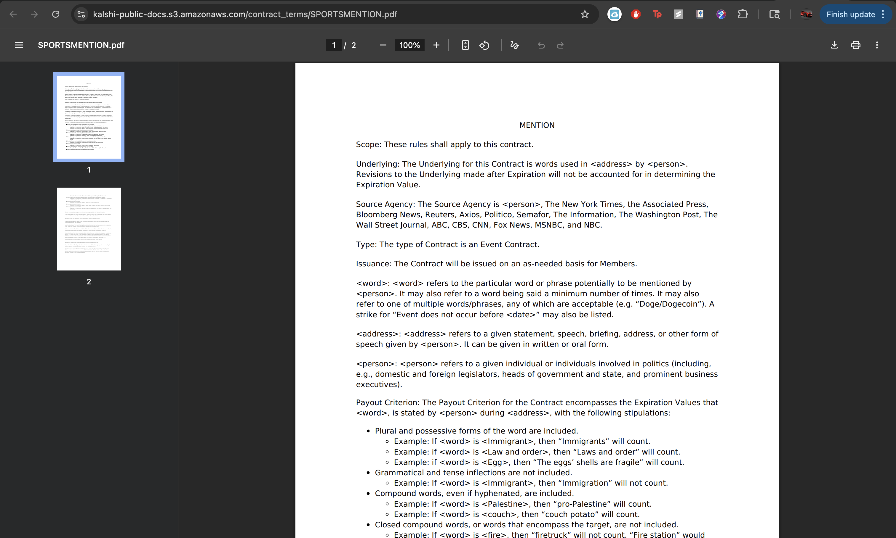

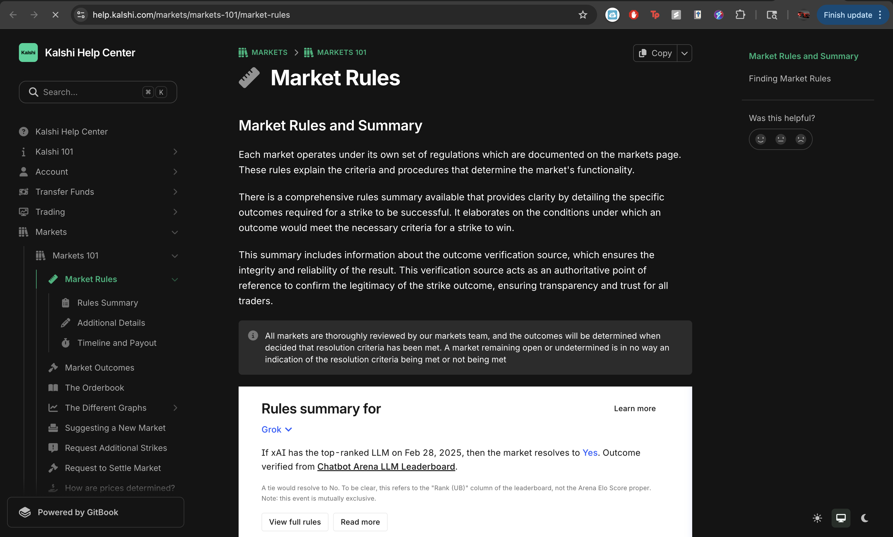

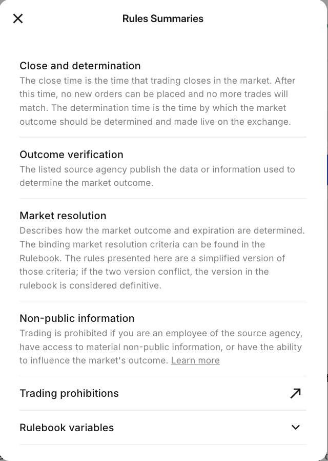

**User goal:**  
- Understand detailed market rules and resolution criteria
- Access comprehensive contract terms
- Get help understanding how markets work
- View simplified rules summaries
- Understand outcome verification sources

**Kalshi flow (steps):**
1. User is on a market page (e.g., mentions market)
2. User sees rules section with:
   - Rules summary text
   - "View full rules" link
   - "Help center" link
   - Info icon (circle with "i") next to "Rules summary"
3. **View Full Rules:**
   - User clicks "View full rules" link
   - Opens PDF document in browser
   - PDF URL: `kalshi-public-docs.s3.amazonaws.com/contract_terms/SPORTSMENTION.pdf`
   - PDF shows comprehensive contract terms for market type (e.g., SPORTSMENTION for mentions markets)
   - PDF includes:
     - Scope, Underlying, Source Agency definitions
     - Type, Issuance details
     - Word/phrase definitions and rules
     - Address and person definitions
     - Payout criterion with detailed stipulations
     - Plural/possessive forms, grammatical inflections, compound words rules
4. **Help Center:**
   - User clicks "Help center" link
   - Navigates to `help.kalshi.com/markets/markets-101/market-rules`
   - Help center page shows:
     - Market Rules and Summary explanation
     - Information about rules summary and outcome verification
     - Example rules summary for specific market (e.g., "Grok")
     - "View full rules" and "Read more" buttons
     - Navigation sidebar with help topics
     - Feedback section ("Was this helpful?")
5. **Rules Summaries Popup:**
   - User clicks info icon (circle with "i") next to "Rules summary"
   - Popup/modal appears titled "Rules Summaries"
   - Popup shows definitions:
     - **Close and determination:** Explains close time vs determination time
     - **Outcome verification:** Lists source agencies that publish data
     - **Market resolution:** Describes how market outcome is determined
     - **Non-public information:** Trading prohibitions for employees/insiders
     - **Trading prohibitions:** Clickable item (arrow icon)
     - **Rulebook variables:** Expandable/collapsible section (chevron icon)
   - User can close popup with X icon in top-left

**Observed behavior:**
- **View Full Rules (PDF):**
  - Opens in browser PDF viewer
  - PDF document specific to market type (e.g., SPORTSMENTION.pdf for mentions)
  - Comprehensive legal/contract terms
  - Detailed definitions and stipulations
  - Examples of what counts/doesn't count for payout
  - Source agency list (The New York Times, Associated Press, Bloomberg, Reuters, etc.)
  - Technical contract language
- **Help Center Page:**
  - Dark mode theme
  - Left sidebar navigation with help topics
  - Main content area with rules explanation
  - Information box with grey background explaining market review process
  - Example rules summary for specific market (e.g., "Grok")
  - Right sidebar with on-page navigation and feedback
  - Search functionality (⌘K shortcut)
  - "Powered by GitBook" at bottom
- **Rules Summaries Popup:**
  - Modal/popup overlay
  - Light grey background
  - X icon in top-left for closing
  - Bold headings for each section
  - Descriptive text for each definition
  - Clickable/expandable sections (Trading prohibitions, Rulebook variables)
  - "Learn more" hyperlink for non-public information

**What I like:**
- **Multiple access points:** Three ways to access rules (PDF, help center, popup)
- **Comprehensive documentation:** Full contract terms available via PDF
- **Simplified summaries:** Popup provides quick definitions
- **Help center integration:** Centralized help documentation
- **Example-based:** Help center shows concrete examples (e.g., Grok market)
- **Transparency:** Clear explanation of outcome verification sources
- **Accessibility:** Rules accessible from market page

**What I don't like / confusion:**
- **PDF in browser:** Some users may prefer downloadable PDF
- **Multiple sources:** Three different places for rules could be confusing
- **Technical language:** PDF uses legal/contract terminology that may be hard to understand
- **No search in PDF:** Can't search within PDF document
- **Popup expandable sections:** Not clear what "Trading prohibitions" and "Rulebook variables" contain without clicking
- **Help center navigation:** Could be easier to find specific information

**Edge cases / bugs:**
- None observed (only log bugs when explicitly identified)
- What if PDF link is broken or unavailable?
- What if help center page doesn't load?
- What if popup doesn't close properly?

**Builder hypothesis (why they did it):**
- **Compliance:** Required to provide full contract terms for legal/compliance reasons
- **Transparency:** Multiple access points ensure users can find rules information
- **User education:** Help center educates users about how markets work
- **Quick reference:** Popup provides quick definitions without leaving page
- **Trust building:** Comprehensive documentation builds user trust
- **Different user needs:** PDF for detailed, help center for learning, popup for quick reference
- **Legal protection:** Full contract terms protect platform legally

**Opinion Kings implications:**
- **Copy:**
  - Multiple access points for rules (PDF, help center, popup)
  - Comprehensive contract terms documentation
  - Simplified rules summaries popup
  - Help center integration
  - Example-based documentation
  - Clear outcome verification sources
- **Avoid:**
  - PDF only in browser (allow download)
  - Too many access points causing confusion
  - Overly technical language
- **Beat:**
  - **Downloadable PDF:** Allow users to download full rules PDF
  - **Searchable PDF:** Make PDF searchable or provide search functionality
  - **Unified rules page:** Single page with all rules information (not three separate places)
  - **Simplified language:** Rewrite contract terms in plain language
  - **Interactive examples:** Show interactive examples of what counts/doesn't count
  - **Video explanations:** Add video explanations for complex rules
  - **FAQ integration:** Add frequently asked questions about rules
  - **Rules versioning:** Show rules version and update history
  - **Mobile optimization:** Ensure PDF and help center work on mobile
- **Implementation notes:**
  - **PDF generation:**
    - Generate PDF documents for each market type
    - Store in S3 or similar (e.g., `kalshi-public-docs.s3.amazonaws.com/contract_terms/`)
    - Include comprehensive contract terms
    - Make PDF searchable
    - Allow download option
  - **Help center:**
    - Use help center platform (e.g., GitBook, Intercom, custom)
    - Organize by topic (Markets 101, Account, Trading, etc.)
    - Include search functionality
    - Add example rules summaries
    - Include feedback mechanism
  - **Rules summaries popup:**
    - Modal/popup component
    - Quick definitions for key terms
    - Expandable/collapsible sections
    - Close button (X icon)
    - Lightweight, fast-loading
  - **Market page integration:**
    - "View full rules" link → PDF
    - "Help center" link → Help center page
    - Info icon → Rules summaries popup
    - All accessible from rules section
  - **Content management:**
    - Version control for rules
    - Update mechanism for PDFs and help center
    - Notification system for rules changes
- **Metrics:**
  - "View full rules" click rate
  - "Help center" click rate
  - Rules summaries popup open rate
  - PDF view rate
  - Help center page views
  - Time spent viewing rules documentation
  - Rules-related support queries
  - User confusion rate (do users understand rules?)
  - Rules version update notifications sent
  - Search usage in help center
  - Feedback on help center content

### Market Page Header Actions

**Feature category:** Market Page / Navigation / User Actions

**Screenshots:**  
- Referenced in Detailed Market Page section (header actions visible in market page screenshots)

**User goal:**  
- Quickly copy market page link to share
- Download price history data for analysis
- Add or remove market from watchlist
- Access common actions without leaving market page

**Kalshi flow (steps):**
1. User is on a market page
2. User sees header with calendar and chat icons
3. After calendar and chat icons, user sees additional action buttons:
   - **Copy link:** Small icon button
   - **Download price history:** Small icon button
   - **Add/remove from watchlist:** Small icon button
4. User clicks desired action
5. Action executes immediately (no navigation away from page)

**Observed behavior:**
- **Header Actions Location:**
  - Positioned after calendar and chat icons in market page header
  - Small icon buttons (compact design)
  - Quick access without cluttering header
- **Copy Link:**
  - Copies market page URL to clipboard
  - No visual feedback observed (but likely shows toast notification)
  - URL format: `kalshi.com/markets/{category}/{subcategory}/{market-id}`
- **Download Price History:**
  - Downloads price history data
  - Likely CSV or JSON format
  - Contains historical price data for market
- **Watchlist Toggle:**
  - Small icon button
  - Adds market to watchlist if not already added
  - Removes market from watchlist if already added
  - Visual state change (icon changes to indicate watchlist status)

**What I like:**
- **Quick access:** All actions accessible from header without navigation
- **Compact design:** Small icon buttons don't clutter header
- **Common actions:** Copy link, download data, watchlist are frequently used
- **No page reload:** Actions execute without leaving page
- **Logical grouping:** Actions grouped together after calendar/chat icons

**What I don't like / confusion:**
- **No tooltips:** Icon buttons may not be clear without tooltips
- **No visual feedback:** Copy link may not show confirmation
- **Download format unclear:** Not clear what format price history downloads in
- **Watchlist state:** May not be immediately clear if market is in watchlist

**Edge cases / bugs:**
- None observed (only log bugs when explicitly identified)
- What if clipboard access is denied?
- What if download fails?
- What if watchlist toggle fails?

**Builder hypothesis (why they did it):**
- **User convenience:** Common actions easily accessible
- **Sharing:** Copy link enables easy sharing
- **Data export:** Download price history for analysis
- **Watchlist management:** Quick toggle for watchlist
- **Header efficiency:** Keeps header clean while providing functionality
- **Power users:** Advanced users can quickly access data/actions

**Opinion Kings implications:**
- **Copy:**
  - Header action buttons (copy link, download, watchlist)
  - Small icon buttons
  - Quick access without navigation
  - Logical grouping after calendar/chat icons
- **Avoid:**
  - No tooltips on icon buttons
  - No visual feedback for actions
- **Beat:**
  - **Tooltips:** Add tooltips to icon buttons for clarity
  - **Visual feedback:** Show toast notifications for copy/download actions
  - **Download options:** Allow users to choose format (CSV, JSON, Excel)
  - **Watchlist indicator:** Show clear visual state (filled icon if in watchlist)
  - **More actions:** Add share to social media, export chart image
  - **Keyboard shortcuts:** Add keyboard shortcuts for common actions
  - **Action menu:** Consider dropdown menu if more actions are added
- **Implementation notes:**
  - **Header component:**
    - Calendar icon
    - Chat icon
    - Copy link icon button
    - Download price history icon button
    - Watchlist toggle icon button
    - Tooltips on hover
  - **Copy link:**
    - Use Clipboard API
    - Copy market page URL
    - Show toast notification on success
    - Handle clipboard access errors
  - **Download price history:**
    - Fetch price history data from API
    - Format as CSV or JSON
    - Trigger download via browser download API
    - Show loading state during download
    - Handle download errors
  - **Watchlist toggle:**
    - Check current watchlist status
    - Toggle add/remove via API
    - Update icon state (filled/outline)
    - Show toast notification
    - Handle API errors
  - **Visual feedback:**
    - Toast notifications for all actions
    - Loading states for async actions
    - Error handling and user feedback
- **Metrics:**
  - Copy link usage rate
  - Download price history usage rate
  - Watchlist toggle usage rate
  - Header action button click rate
  - Tooltip view rate (if added)
  - Action success rate
  - Action error rate
  - Time saved by quick actions (vs navigating to separate pages)

### Footer and Legal Disclosure

**Feature category:** Support / Compliance / Legal / Site Navigation

**Screenshots:**  
- 056: `056-misc-footer-legal-disclosure.png` - Footer section with company links, social links, product links, and comprehensive risk disclosure

**User goal:**  
- Access company information and resources
- Find social media links
- Access product support and regulatory information
- Understand legal terms and risk disclosures
- Navigate to help center, API, FAQ, and other resources

**Kalshi flow (steps):**
1. User scrolls to bottom of any page (e.g., landing page, trending page)
2. Footer appears with three main columns:
   - **Company column:** Company info, Blog, Careers, Privacy Policy, Data Terms of Service, Brand Kit
   - **Social column:** Links to X (Twitter), LinkedIn, Discord, Instagram, Reddit, TikTok
   - **Product column:** Help Center, API, FAQ, FAQ for Finance Professionals, Regulatory, Trading Hours, Fee Schedule, Trading Prohibitions, Incentive Program, Research
3. Below columns, copyright notice: "© 2025 Kalshi Inc."
4. Below copyright, comprehensive risk disclosure statement
5. User can click any link to navigate to respective page/resource

**Observed behavior:**
- **Footer Layout:**
  - Three-column structure on light gray background
  - Dark gray text for good contrast
  - Clean, organized layout
  - Links organized by category
- **Company Column:**
  - "Company" (general link)
  - "Blog"
  - "Careers"
  - "Privacy Policy"
  - "Data Terms of Service"
  - "Company" (appears twice - may be redundancy or different aspect)
  - "Brand Kit"
- **Social Column:**
  - "Social" heading
  - "X" (Twitter)
  - "LinkedIn"
  - "Discord"
  - "Instagram"
  - "Reddit"
  - "TikTok"
- **Product Column:**
  - "Product" heading
  - "Help Center"
  - "API"
  - "FAQ"
  - "FAQ for Finance Professionals"
  - "Regulatory"
  - "Trading Hours"
  - "Fee Schedule"
  - "Trading Prohibitions"
  - "Incentive Program"
  - "Research"
- **Copyright:**
  - "© 2025 Kalshi Inc."
  - Horizontal line separator above
- **Risk Disclosure Statement:**
  - Comprehensive paragraph warning about trading risks
  - Key points:
    - Trading involves risk and may not be appropriate for all
    - Members risk losing their cost to enter any transaction, including fees
    - Users should carefully consider their investment experience and financial resources
    - Trading decisions are solely the user's responsibility and at their own risk
    - Information is provided "AS IS" for convenience only
    - Past performance is not indicative of future results
    - Kalshi is subject to U.S. regulatory oversight by the CFTC
  - Legal/compliance language
  - Required regulatory disclosure

**What I like:**
- **Comprehensive links:** All important resources accessible from footer
- **Organized structure:** Three-column layout makes it easy to find information
- **Social media presence:** Multiple social platforms linked
- **Regulatory transparency:** Clear risk disclosure statement
- **Compliance:** Required legal disclosures present
- **Professional appearance:** Clean, organized footer design
- **Multiple access points:** Help Center, FAQ, Regulatory info all accessible

**What I don't like / confusion:**
- **"Company" appears twice:** Redundancy in Company column - unclear why
- **Risk disclosure placement:** At very bottom - users may never see it
- **No visual hierarchy:** All links appear equal - no highlighting of important links
- **No search in footer:** Could add search functionality
- **Risk disclosure length:** Long paragraph may be skipped by users
- **No mobile optimization visible:** Footer may not be optimized for mobile

**Edge cases / bugs:**
- What if footer links are broken?
- What if risk disclosure is not visible on mobile?
- What if user never scrolls to bottom to see footer?
- What if social media links change (e.g., Twitter → X)?

**Builder hypothesis (why they did it):**
- **Compliance:** Required to provide risk disclosure and legal information
- **User support:** Footer provides easy access to help and resources
- **SEO:** Footer links help with search engine optimization
- **Trust building:** Comprehensive footer shows professionalism and transparency
- **Regulatory compliance:** Risk disclosure required by CFTC regulations
- **Social presence:** Social media links help with brand building and community
- **Resource access:** Multiple links provide various ways to access information
- **Legal protection:** Risk disclosure protects platform legally

**Opinion Kings implications:**
- **Copy:**
  - Three-column footer structure
  - Company, Social, Product organization
  - Comprehensive risk disclosure statement
  - Copyright notice
  - Links to help center, FAQ, regulatory info
  - Social media links
- **Avoid:**
  - Redundant links (e.g., "Company" appearing twice)
  - Risk disclosure at very bottom (users may never see it)
  - Overly long risk disclosure that users skip
- **Beat:**
  - **Prominent risk disclosure:** Make risk disclosure more visible (e.g., banner, modal on first visit)
  - **Visual hierarchy:** Highlight important links (Help Center, FAQ, Regulatory)
  - **Search functionality:** Add search in footer
  - **Mobile optimization:** Ensure footer is well-organized on mobile
  - **Risk disclosure summary:** Add short summary with "Read more" expandable section
  - **Interactive elements:** Add tooltips or descriptions for links
  - **Footer analytics:** Track which footer links are most clicked
  - **Sticky footer:** Consider sticky footer for always-visible risk disclosure
  - **Risk disclosure acknowledgment:** Require users to acknowledge risk disclosure (checkbox or button)
  - **Version control:** Show risk disclosure version/update date
  - **Accessibility:** Ensure footer is accessible (keyboard navigation, screen readers)
- **Implementation notes:**
  - **Footer structure:**
    - Three-column layout (Company, Social, Product)
    - Responsive design (stacks on mobile)
    - Dark gray text on light gray background
    - Horizontal line separator before copyright
  - **Links:**
    - External links (social media) open in new tab
    - Internal links (Help Center, FAQ) navigate within site
    - Track link clicks for analytics
  - **Risk disclosure:**
    - Store in database or CMS for easy updates
    - Version control for changes
    - Required by CFTC regulations
    - Consider making more prominent (banner, modal, or sticky)
  - **Copyright:**
    - Update year automatically
    - Include company name
  - **Social media:**
    - Store social media URLs in database
    - Update when platforms change (e.g., Twitter → X)
    - Open in new tab
  - **SEO:**
    - Footer links help with internal linking
    - Use descriptive anchor text
    - Ensure all links are crawlable
- **Metrics:**
  - Footer visibility rate (how many users scroll to footer?)
  - Footer link click-through rates (which links are most clicked?)
  - Risk disclosure view rate (do users read it?)
  - Social media link clicks
  - Help Center clicks from footer
  - FAQ clicks from footer
  - Regulatory page views from footer
  - Mobile vs desktop footer engagement
  - Time spent viewing footer
  - Risk disclosure acknowledgment rate (if implemented)

---

## Integrity & Safety

_Add feature writeups here as screenshots are added..._

---

## Settings

### Settings Page (Market Display Customization)

**Feature category:** Settings / User Preferences / Customization

**Screenshots:**  
- 106: `106-account-settings-page.png` - Settings page showing market display customization and email notification preferences

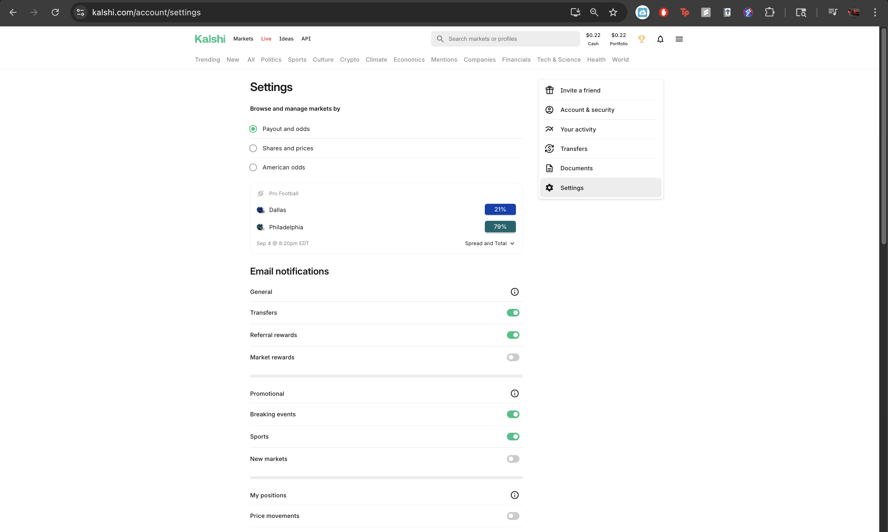

**User goal:**  
- Customize how markets are displayed (payout/odds vs shares/prices vs American odds)
- Manage email notification preferences
- Personalize platform experience
- Control what information is shown

**Kalshi flow (steps):**
1. User clicks "Settings" in hamburger menu or right sidebar
2. Page routes to Settings page
3. **URL routing:** `kalshi.com/account/settings`
4. **Page displays:**
   - Left section: Settings options
   - Right sidebar: Account navigation menu
5. **Market display customization:**
   - User selects preferred market display format
   - Options: "Payout and odds", "Shares and prices", "American odds"
   - Live preview shows how market looks with selected format
6. **Email notifications:**
   - User toggles email notification preferences
   - Multiple notification types available
   - Toggle switches (on/off) for each type
7. Settings save automatically (presumably)

**Observed behavior:**
- **URL Structure:**
  - `kalshi.com/account/settings`
  - Part of account section (`/account/`)
- **Page layout:**
  - Left section: Settings options
  - Right sidebar: Account navigation menu
- **Market display customization section:**
  - **Title:** "Browse and manage markets by"
  - **Radio button options:**
    1. "Payout and odds" (selected - green filled circle)
    2. "Shares and prices" (unselected)
    3. "American odds" (unselected)
  - **Live preview:** Shows example market display
    - Market: "Pro Football"
    - "Dallas" with blue bar showing "21%"
    - "Philadelphia" with green bar showing "79%"
    - Timestamp: "Sep 4 @ 8:20pm EDT"
    - Dropdown: "Spread and Total" with downward arrow
  - **Purpose:** Allows users to view markets in their preferred format
- **Email notifications section:**
  - **Title:** "Email notifications"
  - **Toggle switches for each notification type:**
    1. "General" - Toggle OFF (gray), has info icon (i)
    2. "Transfers" - Toggle ON (green)
    3. "Referral rewards" - Toggle ON (green)
    4. "Market rewards" - Toggle OFF (gray)
    5. "Promotional" - Toggle OFF (gray), has info icon (i)
    6. "Breaking events" - Toggle ON (green)
    7. "Sports" - Toggle ON (green)
    8. "New markets" - Toggle OFF (gray)
    9. "My positions" - Toggle OFF (gray), has info icon (i)
    10. "Price movements" - Toggle OFF (gray)
  - **Visual design:**
    - Toggle switches (green when ON, gray when OFF)
    - Info icons for some types (likely show tooltips/explanations)
    - Clear labels for each notification type
- **Right sidebar navigation:**
  - "Invite a friend" (house icon)
  - "Account & security" (person icon)
  - "Your activity" (line graph icon)
  - "Transfers" (dollar sign icon)
  - "Documents" (document icon)
  - "Settings" (gear icon, highlighted - current page)

**What I like:**
- **Market display customization:** Users can choose their preferred format (important for different user types)
- **Live preview:** Shows how market looks with selected format (excellent UX)
- **Email notification control:** Granular control over notification types
- **Clear toggles:** Visual toggle switches make it easy to see on/off state
- **Info icons:** Helpful tooltips for unclear options
- **User personalization:** Allows users to customize platform experience

**What I don't like / confusion:**
- **No explanation:** What's the difference between "Payout and odds", "Shares and prices", "American odds"?
- **Info icons:** Some have info icons, some don't - inconsistent
- **No notification preview:** Can't see what emails look like
- **No frequency control:** Can't set notification frequency (immediate vs digest)
- **No in-app notification settings:** Only email, no in-app notification preferences
- **No save button:** Settings may auto-save (unclear)

**Edge cases / bugs:**
- What if user changes market display format? Does it apply immediately?
- What if user disables all notifications? Is there a warning?
- What if user wants different notification settings for different markets?
- What if settings don't save? Is there error handling?

**Builder hypothesis (why they did it):**
- **User personalization:** Different users prefer different market formats
- **User control:** Granular notification preferences reduce email fatigue
- **Retention:** Customization increases user satisfaction and retention
- **Compliance:** Email preferences for marketing compliance (CAN-SPAM)
- **User experience:** Live preview helps users understand format differences

**Opinion Kings implications:**
- **Copy:**
  - Market display customization (payout/odds, shares/prices, American odds)
  - Live preview of market display
  - Email notification toggles
  - Info icons for explanations
- **Avoid:**
  - No explanation of format differences
  - Inconsistent info icons
  - No notification frequency control
- **Beat:**
  - **Format explanations:** Add tooltips or descriptions explaining each format
  - **Notification preview:** Show sample email for each notification type
  - **Notification frequency:** Allow users to set frequency (immediate, daily digest, weekly digest)
  - **In-app notifications:** Add in-app notification preferences (separate from email)
  - **Market-specific notifications:** Allow different settings for different market categories
  - **Notification history:** Show recent notifications sent
  - **Save confirmation:** Show confirmation when settings are saved
  - **Default recommendations:** Suggest settings based on user behavior
  - **Export settings:** Allow users to export/import settings
  - **Reset to defaults:** Button to reset all settings to defaults
- **Implementation notes:**
  - **Market display customization:**
    - Radio button selection (single choice)
    - Store preference in user settings
    - Apply format to all market displays
    - Live preview updates when selection changes
    - Format options:
      - "Payout and odds" - Show payout amounts and probability percentages
      - "Shares and prices" - Show share counts and prices per share
      - "American odds" - Show American-style odds (e.g., +150, -200)
  - **Email notifications:**
    - Toggle switches for each notification type
    - Store preferences in user settings
    - Update email subscription status
    - Info icons show tooltips/explanations
    - Notification types:
      - General (platform updates, announcements)
      - Transfers (deposits, withdrawals)
      - Referral rewards (referral bonuses)
      - Market rewards (market-specific rewards)
      - Promotional (marketing emails)
      - Breaking events (major news/events)
      - Sports (sports-related updates)
      - New markets (new market announcements)
      - My positions (position updates)
      - Price movements (significant price changes)
  - **State management:**
    - Store market display preference
    - Store email notification preferences
    - Update when user changes settings
    - Sync with backend
  - **Live preview:**
    - Show example market with selected format
    - Update preview when format changes
    - Use real market data if available
- **Metrics:**
  - Settings page view rate
  - Market display format selection (which format is most popular?)
  - Email notification toggle rate (which types are enabled/disabled most?)
  - Settings change frequency
  - User satisfaction with customization
  - Notification engagement rate (do users with notifications enabled engage more?)

---

## Settings

### Hamburger Menu (Account Navigation)

**Feature category:** Account / Navigation / User Interface

**Screenshots:**  
- 099: `099-account-hamburger-menu.png` - Hamburger menu slide-in panel showing account navigation options

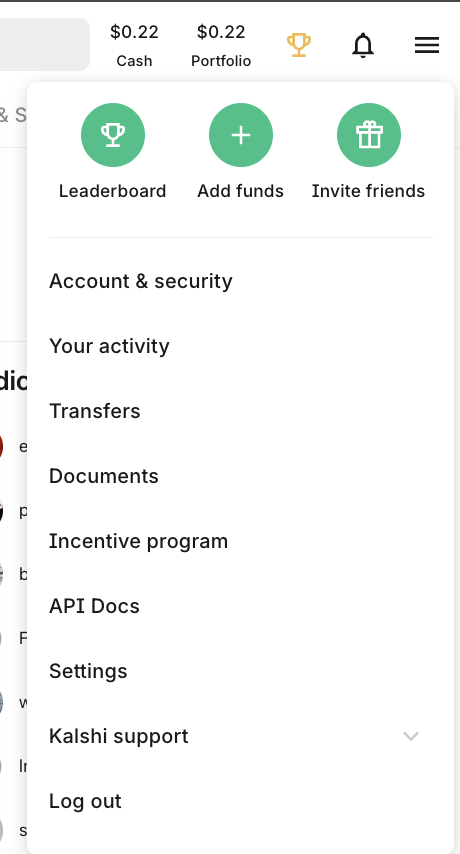

**User goal:**  
- Access account settings and features
- Navigate to different account sections
- Quick access to key actions (Leaderboard, Add funds, Invite friends)
- Log out of account

**Kalshi flow (steps):**
1. User clicks hamburger menu icon (three horizontal lines) in top navigation bar
2. Menu slides in from right side, overlaying main content
3. **Menu displays:**
   - Top section: Three circular action buttons (Leaderboard, Add funds, Invite friends)
   - Middle section: Account navigation links
   - Bottom section: Support and Log out
4. User clicks on any menu item to navigate
5. Menu closes when user clicks outside or navigates to page
6. **Quick actions:**
   - "Leaderboard" button routes to leaderboard page (documented earlier)
   - "Add funds" button opens deposit options popup (documented earlier)
   - "Invite friends" button routes to referrals page

**Observed behavior:**
- **Menu layout:**
  - Slides in from right side (overlay pattern)
  - White background with dark gray text
  - Green icons for action buttons
  - Partially overlays main content (left side still visible)
- **Top section - Quick action buttons:**
  1. **Leaderboard:**
     - Green circle with white trophy icon
     - Label: "Leaderboard"
     - Routes to `kalshi.com/social/leaderboard`
  2. **Add funds:**
     - Green circle with white plus sign icon
     - Label: "Add funds"
     - Opens deposit options popup (same as clicking "Cash" in top nav)
  3. **Invite friends:**
     - Green circle with white gift box icon
     - Label: "Invite friends"
     - Routes to referrals page
- **Middle section - Account navigation:**
  - "Account & security" (routes to account profile/security page)
  - "Your activity" (routes to activity/transaction history page)
  - "Transfers" (routes to banking/transfers page)
  - "Documents" (routes to tax documents page)
  - "Incentive program" (routes to incentives/rewards page)
  - "API Docs" (routes to API documentation)
  - "Settings" (routes to settings page)
  - "Kalshi support" (with downward chevron icon - expandable section)
  - "Log out" (at bottom)
- **Visual design:**
  - Clean, minimalist design
  - Green accent color for action buttons
  - Icons for visual identification
  - Clear hierarchy (quick actions at top, navigation in middle, support/logout at bottom)
- **Menu behavior:**
  - Overlay pattern (doesn't replace main content)
  - Click outside to close (presumably)
  - Navigation closes menu (presumably)

**What I like:**
- **Quick actions:** Easy access to frequently used features (Leaderboard, Add funds, Invite friends)
- **Clear organization:** Logical grouping (quick actions, navigation, support/logout)
- **Visual hierarchy:** Action buttons stand out with green circles
- **Comprehensive navigation:** All account-related pages accessible from one place
- **Overlay pattern:** Doesn't lose context (main content still visible)

**What I don't like / confusion:**
- **"Kalshi support" expandable:** What's inside? (not shown in screenshot)
- **No icons for navigation items:** Only action buttons have icons
- **No active state:** Doesn't show which page user is currently on
- **No search:** Can't search within menu
- **Menu width:** May be too narrow on larger screens

**Edge cases / bugs:**
- What if user clicks outside menu? Does it close?
- What if user navigates to page? Does menu close automatically?
- What if "Kalshi support" is expanded? Does it show sub-items?

**Builder hypothesis (why they did it):**
- **Quick access:** Action buttons provide fast access to key features
- **Centralized navigation:** All account features in one place
- **Mobile-friendly:** Overlay pattern works well on mobile
- **Progressive disclosure:** Support section expandable (hides less-used items)
- **User retention:** Easy access to referrals and incentives

**Opinion Kings implications:**
- **Copy:**
  - Hamburger menu with overlay pattern
  - Quick action buttons (circular, with icons)
  - Account navigation links
  - Support and logout at bottom
- **Avoid:**
  - No active state indicator
  - No icons for navigation items
- **Beat:**
  - **Active state:** Highlight current page in menu
  - **Icons for all items:** Add icons to navigation items for better visual identification
  - **Search:** Add search within menu
  - **Customization:** Allow users to customize quick action buttons
  - **Badges:** Show badges for items with updates (e.g., "New" badge on incentives)
  - **Keyboard shortcuts:** Add keyboard shortcuts for menu items
  - **Menu width:** Responsive width based on screen size
- **Implementation notes:**
  - **Menu trigger:**
    - Hamburger icon in top navigation
    - Click opens menu overlay
  - **Menu overlay:**
    - Slide in from right
    - Overlay main content (backdrop with opacity)
    - Click outside to close
  - **Quick action buttons:**
    - Three circular buttons with icons
    - Green background, white icons
    - Click routes to respective pages
  - **Navigation links:**
    - List of account-related pages
    - Click routes to page
    - Close menu on navigation
  - **State management:**
    - Track menu open/closed state
    - Track current page (for active state)
    - Close menu on navigation
  - **Support section:**
    - Expandable/collapsible
    - Show sub-items when expanded
- **Metrics:**
  - Menu open rate
  - Quick action button click rate (which buttons are used most?)
  - Navigation item click rate (which pages are accessed most?)
  - Menu close rate (how often users close without clicking?)
  - Time spent in menu
  - Support section expansion rate

### Account & Security Page

**Feature category:** Account / Security / Profile

**Screenshots:**  
- 100: `100-account-security-page.png` - Account & security page showing profile information, two-factor authentication, and API keys

**User goal:**  
- View and edit account information
- Manage security settings (two-factor authentication)
- Create and manage API keys
- Deactivate account if needed

**Kalshi flow (steps):**
1. User clicks "Account & security" in hamburger menu or right sidebar
2. Page routes to Account & security page
3. **URL routing:** `kalshi.com/account/profile`
4. **Page displays:**
   - Left section: Account details and security settings
   - Right sidebar: Account navigation menu
5. **Account information section:**
   - Full name, Email, Password, Phone number, Address
   - Each field has pencil icon (edit button)
   - User can click to edit
6. **Two-factor authentication section:**
   - Description: "Help keep your Kalshi account safe..."
   - Radio button options for 2FA delivery method
   - User selects preferred method
7. **API Keys section:**
   - Description: "Unique identifiers that are used to authenticate..."
   - "Create key" button
   - "Learn more" link
8. **Deactivate account:**
   - Red link at bottom: "Deactivate your account"
   - User can click to deactivate

**Observed behavior:**
- **URL Structure:**
  - `kalshi.com/account/profile`
  - Part of account section (`/account/`)
- **Page layout:**
  - Left section: Main content (account details, security settings)
  - Right sidebar: Account navigation menu (consistent across account pages)
- **Account information section:**
  - **Full name:** "Suraj Geddam" (editable via pencil icon)
  - **Email:** "geddamsuraj@gmail.com" (editable via pencil icon)
  - **Password:** "Create your password" (editable via pencil icon)
  - **Phone number:** "+1 678 431 0189" (editable via pencil icon)
  - **Address:** "10020 Campestral Court, Duluth, GA 30097" (editable via pencil icon)
  - **Edit functionality:** Pencil icon on right of each field
  - **Visual design:** Clean, organized layout
- **Two-factor authentication section:**
  - **Title:** "Two-factor Authentication"
  - **Description:** "Help keep your Kalshi account safe. This helps prevent anyone from accessing your account, even if they know your password."
  - **Question:** "How would you like to receive this code?"
  - **Radio button options:**
    1. "Text message (SMS) and email" (selected - green filled circle)
    2. "Text message (SMS) only" (unselected)
    3. "Email only" (unselected)
    4. "Authenticator app" (unselected)
  - **Selection interface:** Radio buttons (single selection)
- **API Keys section:**
  - **Title:** "API Keys"
  - **Description:** "Unique identifiers that are used to authenticate and authorize access to the Kalshi API."
  - **Action button:** "Create key" (black button)
  - **Learn more link:** "Learn more" (clickable)
- **Deactivate account:**
  - **Link:** "Deactivate your account" (red text)
  - **Icon:** Circular icon with minus sign (left side)
  - **Location:** Bottom of account information section
  - **Visual cue:** Red color indicates destructive action
- **Right sidebar navigation:**
  - "Invite a friend" (house icon)
  - "Account & security" (person icon, highlighted - current page)
  - "Your activity" (line graph icon)
  - "Transfers" (dollar sign icon)
  - "Documents" (document icon)
  - "Settings" (gear icon)
  - Consistent across all account pages

**What I like:**
- **Clear organization:** Account info, security, API keys separated
- **Easy editing:** Pencil icons make it clear fields are editable
- **Security options:** Multiple 2FA delivery methods
- **API access:** Clear API key management
- **Destructive action protection:** Red color for deactivate (clear warning)
- **Consistent navigation:** Right sidebar across account pages

**What I don't like / confusion:**
- **Password field:** Shows "Create your password" - unclear if password exists
- **No 2FA status:** Doesn't show if 2FA is currently enabled
- **No API key list:** Doesn't show existing API keys (only "Create key" button)
- **No verification:** No indication of verified email/phone
- **No security history:** No login history or security events

**Edge cases / bugs:**
- What if user edits email? Does it require verification?
- What if user creates multiple API keys? Where are they listed?
- What if 2FA is enabled? Does it show different options?
- What if user deactivates account? Is there confirmation?

**Builder hypothesis (why they did it):**
- **Security:** 2FA options protect user accounts
- **API access:** API keys enable programmatic trading
- **User control:** Easy editing of account information
- **Compliance:** Account deactivation for regulatory compliance
- **User experience:** Centralized account management

**Opinion Kings implications:**
- **Copy:**
  - Account information section with editable fields
  - Two-factor authentication with multiple delivery methods
  - API key management
  - Account deactivation option
  - Right sidebar navigation
- **Avoid:**
  - Unclear password status
  - No API key list
  - No 2FA status indicator
- **Beat:**
  - **Password status:** Show if password exists, last changed date
  - **2FA status:** Show if 2FA is enabled, last used date
  - **API key list:** Show all API keys with creation date, last used, revoke option
  - **Verification status:** Show verified email/phone with verification badges
  - **Security history:** Show login history, security events, active sessions
  - **Email change:** Require email verification before change
  - **Phone change:** Require phone verification before change
  - **Account recovery:** Add account recovery options
  - **Security alerts:** Email/SMS alerts for security events
- **Implementation notes:**
  - **Account information:**
    - Fetch user data from API
    - Display in editable fields
    - Pencil icon triggers edit mode
    - Save changes to API
    - Validate input (email format, phone format, etc.)
  - **Two-factor authentication:**
    - Fetch 2FA status from API
    - Show current delivery method
    - Radio button selection
    - Save preference to API
    - Enable/disable 2FA
  - **API Keys:**
    - Fetch API keys from API
    - Display list of keys (if any)
    - "Create key" button opens creation flow
    - Show key details (name, created date, last used)
    - Revoke key functionality
  - **Account deactivation:**
    - Red link triggers confirmation modal
    - Require password confirmation
    - Deactivate account via API
    - Send confirmation email
  - **State management:**
    - Store account information
    - Store 2FA status
    - Store API keys list
    - Update when changes are made
- **Metrics:**
  - Account page view rate
  - Field edit rate (which fields are edited most?)
  - 2FA enable rate
  - 2FA delivery method selection
  - API key creation rate
  - Account deactivation rate
  - Security event rate

## Growth Loops

### API Documentation Portal

**Feature category:** Developer / API / Documentation

**Screenshots:**  
- 105: `105-account-api-docs-page.png` - API documentation welcome page showing key documentation areas

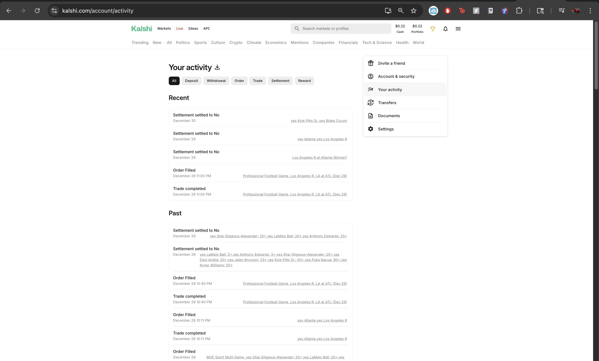

**User goal:**  
- Access API documentation for Kalshi Exchange
- Learn how to integrate with Kalshi API
- Find API reference information
- Get started with API development
- Understand API capabilities and limits

**Kalshi flow (steps):**
1. User clicks "API Docs" in hamburger menu OR clicks "API" in top navigation
2. Page routes to API documentation portal
3. **URL routing:** `docs.kalshi.com/welcome` (separate subdomain)
4. **Page displays:**
   - Header with navigation and search
   - Welcome section with title and description
   - Developer agreement disclaimer
   - Feature cards grid (6 cards) for key documentation areas
5. User clicks on feature cards or navigation links to access specific documentation
6. User can search documentation using search bar (⌘K shortcut)
7. User navigates through documentation sections

**Observed behavior:**
- **URL Structure:**
  - `docs.kalshi.com/welcome` (separate subdomain for documentation)
  - Standalone documentation portal (not under main `kalshi.com` domain)
- **Page layout:**
  - Dark theme (dark grey/black background, white text)
  - Header with logo, search, navigation
  - Main content area with welcome section
  - Feature cards grid at bottom
- **Header:**
  - **Logo:** "Kalshi" (green text) + "API Docs" (white text)
  - **Search bar:** "Search..." with magnifying glass icon and keyboard shortcut "⌘K" displayed
  - **Navigation links:** "Welcome" (active, underlined in green), "Quick Start", "Reference", "API", "Websockets", "SDKs", "FIX", "Changelog"
  - **Dark mode toggle:** Moon icon (far right)
- **Welcome section:**
  - **Title:** "Welcome to Kalshi's API Documentation" (large white text, centered)
  - **Description:** "This documentation covers the Kalshi Exchange API for real-time market data and trade execution"
  - **Developer Agreement disclaimer:** "By continuing to use or access Kalshi's API, you are agreeing to be bound to our Developer Agreement"
    - "Developer Agreement" is clickable link (highlighted in green)
- **Feature cards (6 cards in 2 rows, 3 columns):**
  - **Row 1:**
    1. **"Making Your First Request"** (green rocket icon)
       - Description: "Make your first API call and start trading on Kalshi."
    2. **"API Keys"** (green key icon)
       - Description: "Learn how to generate and manage your API credentials."
    3. **"Demo Environment"** (green gear/network icon)
       - Description: "Test your integration in our safe demo environment." (description cut off in screenshot)
  - **Row 2:**
    4. **"Rate Limits"** (green speedometer/gauge icon)
       - Description: "Understand API rate limits and best practices." (description cut off in screenshot)
    5. **"API Reference"** (green code brackets icon `</>`)
       - Description: "Explore our complete API documentation." (description cut off in screenshot)
    6. **"Changelog"** (green list/document icon)
       - Description: "Stay updated with the latest API changes." (description cut off in screenshot)
  - **Visual design:** Green icons, white text, card layout, clean spacing
- **Navigation structure:**
  - Comprehensive navigation covering all API aspects
  - Quick Start for beginners
  - Reference for detailed API specs
  - WebSockets for real-time data
  - SDKs for different programming languages
  - FIX protocol support
  - Changelog for updates

**What I like:**
- **Separate subdomain:** Clean separation from main site (`docs.kalshi.com`)
- **Dark theme:** Developer-friendly dark theme
- **Clear organization:** Feature cards highlight key areas
- **Search functionality:** Easy to find specific documentation (⌘K shortcut)
- **Comprehensive navigation:** All API aspects covered (REST, WebSockets, SDKs, FIX)
- **Developer agreement:** Clear legal notice upfront
- **Professional appearance:** Well-organized, modern documentation portal

**What I don't like / confusion:**
- **No code examples on welcome:** Welcome page doesn't show code examples
- **No quick start prominence:** "Quick Start" in nav but not featured on welcome
- **No API status:** Doesn't show API status/uptime
- **No SDK downloads:** Doesn't show SDK download links on welcome page
- **Cut-off descriptions:** Some card descriptions are cut off in view

**Edge cases / bugs:**
- None observed (separate feature, documented for reference)

**Builder hypothesis (why they did it):**
- **Developer experience:** Good documentation attracts developers and algorithmic traders
- **API adoption:** Easy access encourages API usage and programmatic trading
- **Professional appearance:** Well-organized documentation builds trust
- **Self-service:** Reduces support burden for API questions
- **Compliance:** Developer agreement for legal protection
- **Separate feature:** API documentation is separate from main platform (may not be core feature for all users)

**Opinion Kings implications:**
- **Note:** This is a separate feature - Opinion Kings may or may not implement API access
- **Documentation purpose:** Documented for reference to understand Kalshi's complete feature set
- **If implementing API:**
  - **Copy:**
    - Separate documentation subdomain (`docs.opinionkings.com`)
    - Dark theme for developer experience
    - Feature cards for key areas
    - Search functionality with keyboard shortcut
    - Comprehensive navigation (REST, WebSockets, SDKs)
    - Developer agreement upfront
  - **Avoid:**
    - No code examples on welcome
    - No quick start prominence
    - No API status indicator
  - **Beat:**
    - **Code examples on welcome:** Show working code examples on welcome page
    - **Quick start prominence:** Feature quick start guide prominently
    - **API status:** Show API status/uptime dashboard
    - **SDK downloads:** Show SDK download links on welcome
    - **Interactive examples:** Try API calls directly in documentation
    - **Video tutorials:** Add video tutorials for common tasks
    - **API playground:** Interactive API testing environment
    - **Rate limit dashboard:** Show current rate limit usage
- **If not implementing API:**
  - **Reference only:** Documented for completeness of Kalshi feature analysis
  - **No implementation needed:** Can skip API documentation if not offering API access
- **Implementation notes (if implementing):**
  - **Documentation platform:**
    - Use documentation platform (GitBook, ReadTheDocs, Docusaurus, etc.)
    - Separate subdomain (`docs.opinionkings.com`)
    - Dark theme support
    - Search functionality with keyboard shortcuts
  - **Content organization:**
    - Welcome page with overview
    - Quick start guide (prominently featured)
    - API reference (complete endpoint documentation)
    - WebSocket documentation (real-time data)
    - SDK documentation (multiple languages)
    - Code examples throughout
    - Changelog for API updates
  - **Developer experience:**
    - Code examples on every page
    - Interactive API playground
    - Try-it-now functionality
    - Video tutorials
    - Community forum/support
  - **API management:**
    - API key generation and management (in account settings)
    - Rate limit documentation and dashboard
    - API status page
    - Error handling documentation
  - **Legal:**
    - Developer agreement
    - Terms of service for API usage
    - Rate limit policies
    - Usage restrictions
- **Metrics (if implementing):**
  - API documentation view rate
  - API key creation rate (from docs)
  - Documentation page views
  - Search usage
  - Time spent in documentation
  - API adoption rate
  - Developer sign-up rate
  - API usage volume

### Documents Page

**Feature category:** Account / Tax / Compliance

**Screenshots:**  
- 103: `103-account-documents-page.png` - Documents page showing tax information, PnL by year, and IRS reporting details

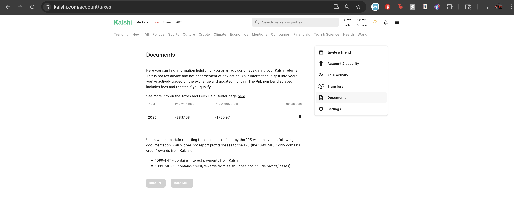

**User goal:**  
- View tax documents and PnL information
- Access IRS reporting details
- Download tax-related documents
- Understand tax implications of trading

**Kalshi flow (steps):**
1. User clicks "Documents" in hamburger menu or account navigation
2. Page routes to Documents page
3. **URL routing:** `kalshi.com/account/documents`
4. **Page displays:**
   - Tax information section
   - PnL by year breakdown
   - IRS reporting details
   - Download options for documents

**Observed behavior:**
- **Tax documents:** Shows tax-related information and documents
- **PnL by year:** Breakdown of profit and loss by year
- **IRS reporting:** Details about IRS reporting requirements
- **Download options:** Ability to download tax documents

**What I like:**
- Centralized tax document access
- Year-by-year PnL breakdown
- Clear IRS reporting information

**What I don't like / confusion:**
- Need to verify actual page content from screenshot

**Edge cases / bugs:**
- None observed

**Builder hypothesis (why they did it):**
- **Tax compliance:** Required for users to access tax documents
- **Transparency:** Clear PnL breakdown helps users understand tax implications
- **User convenience:** Centralized access to all tax-related documents

**Opinion Kings implications:**
- **Copy:**
  - Tax documents page
  - PnL by year breakdown
  - IRS reporting details
  - Download options
- **Avoid:**
  - Unclear tax information
- **Beat:**
  - **Tax calculator:** Help users estimate tax liability
  - **Tax guidance:** Provide tax guidance and resources
  - **Export options:** Multiple export formats (PDF, CSV, Excel)
  - **Tax year selector:** Easy navigation between tax years
  - **Tax summary:** Clear summary of tax implications

### Incentives Page

**Feature category:** Account / Rewards / Growth

**Screenshots:**  
- 104: `104-account-incentives-page.png` - Incentives page showing rewards program, market list, and reward details

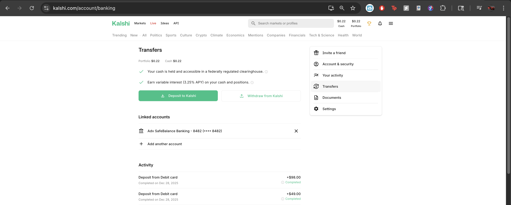

**User goal:**  
- View rewards program details
- See available incentives and markets
- Understand reward structure
- Track reward progress

**Kalshi flow (steps):**
1. User clicks "Incentive program" in hamburger menu or account navigation
2. Page routes to Incentives page
3. **URL routing:** `kalshi.com/account/incentives`
4. **Page displays:**
   - Rewards program information
   - Market list with incentives
   - Reward details and structure
   - Progress tracking

**Observed behavior:**
- **Rewards program:** Shows market rewards program details
- **Market list:** Lists markets with available incentives
- **Reward details:** Explains reward structure and requirements
- **Progress tracking:** Shows user's progress toward rewards

**What I like:**
- Clear rewards program information
- Market-specific incentives
- Progress tracking

**What I don't like / confusion:**
- Need to verify actual page content from screenshot

**Edge cases / bugs:**
- None observed

**Builder hypothesis (why they did it):**
- **User engagement:** Rewards incentivize trading activity
- **Market liquidity:** Incentives drive trading in specific markets
- **Retention:** Rewards program increases user retention
- **Growth:** Incentives encourage new user acquisition

**Opinion Kings implications:**
- **Copy:**
  - Rewards program page
  - Market-specific incentives
  - Progress tracking
  - Reward details
- **Avoid:**
  - Unclear reward structure
- **Beat:**
  - **Reward calculator:** Help users calculate potential rewards
  - **Reward notifications:** Notify users of new rewards and progress
  - **Reward history:** Show history of earned rewards
  - **Tier system:** Multiple reward tiers for different activity levels
  - **Referral rewards:** Enhanced referral program with rewards

### Referrals Page

**Feature category:** Account / Growth / Referrals

**Screenshots:**  
- 107: `107-account-referrals-page.png` - Referrals page showing referral program details and referral link

**User goal:**  
- View referral program details
- Get referral link to share
- Track referral progress
- See referral rewards

**Kalshi flow (steps):**
1. User clicks "Invite friends" in hamburger menu or account navigation
2. Page routes to Referrals page
3. **URL routing:** `kalshi.com/account/referrals`
4. **Page displays:**
   - Referral program information
   - Referral link
   - Referral progress tracking
   - Reward details

**Observed behavior:**
- **Referral program:** Shows referral program details and structure
- **Referral link:** Displays user's unique referral link
- **Progress tracking:** Shows number of referrals and progress
- **Reward details:** Explains referral rewards

**What I like:**
- Clear referral program information
- Easy-to-share referral link
- Progress tracking

**What I don't like / confusion:**
- Need to verify actual page content from screenshot

**Edge cases / bugs:**
- None observed

**Builder hypothesis (why they did it):**
- **Growth:** Referral program drives new user acquisition
- **Viral growth:** Users share referral links with friends
- **User acquisition cost:** Referrals are cost-effective acquisition channel
- **Engagement:** Referral rewards incentivize sharing

**Opinion Kings implications:**
- **Copy:**
  - Referral program page
  - Referral link generation
  - Progress tracking
  - Reward details
- **Avoid:**
  - Unclear referral structure
- **Beat:**
  - **Referral analytics:** Show detailed referral analytics (clicks, signups, conversions)
  - **Social sharing:** Easy social media sharing buttons
  - **Referral tiers:** Multiple reward tiers based on referral count
  - **Referral leaderboard:** Show top referrers
  - **Custom referral links:** Allow users to customize referral links
  - **Referral campaigns:** Time-limited referral campaigns with bonus rewards

---

## Surprising Details

_Add feature writeups here as screenshots are added..._

---

## Summary & Key Takeaways

_To be populated as analysis progresses..._

